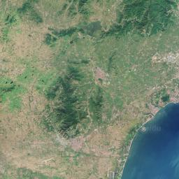
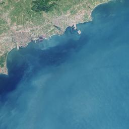
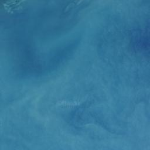
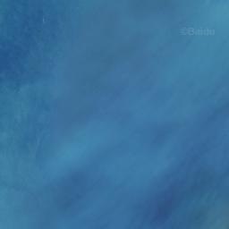
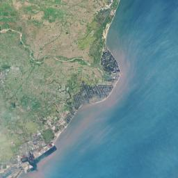
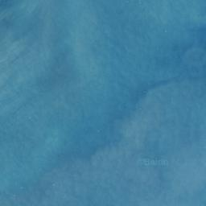
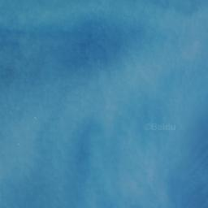
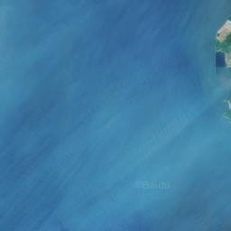

# leaflet

* 官网: <http://leafletjs.com>
* github: <https://github.com/Leaflet/Leaflet>
* 1.0 docs: <http://leafletjs.com/reference-1.0.0.html>

创始人是Mapbox的`Vladimir Agafonkin`

* 移动端友好
* 轻量，gzip压缩以后`30+k`

## Features

### 浏览器支持

Desktop: Chrome, Firefox, Safari 5+, Opera 12+, `IE7+`

Mobile: Safari iOS 7+, Android 2.2+/3.1+/4+, Chrome, Firefox, IE10 Win8

### 支持的Layer

* Tile Layers, WMS
* Markers, Popups
* Vector layers: polylines, polygons, circles, rectangles
* Image overlays
* GeoJSON

### 支持的交互

* Drag panning with inertia
* Scroll wheel zoom
* Pinch-zoom on mobile
* Double click zoom
* Zoom to area (shift-drag)
* Keyboard navigation
* Events: click, mouseover, etc.
* Marker dragging

### 支持的地图控件

* Zoom
* Scale
* Layer switcher
* Attribution

### 自定义

* popup和controls，都支持CSS3样式控制
* 基于`图片`和`HTML`的标注
* 自定义的地图投射(projection)
* 强大的`OOP`机制

## 使用百度地图

### 扩展开发

    @[data-script="javascript"](function(){

        var projection = window.projection;
        var proj = window.proj;
        var datum = window.datum;

        L.Projection.BaiduMercator = {
            project: function (latLng) {
                var a = projection.baiduMercator.forward([latLng.lng, latLng.lat]);
                var leafletPoint = new L.Point(a[0], a[1]);
                return leafletPoint;
            },

            unproject: function (bpoint) {
                var a = projection.baiduMercator.inverse([bpoint.x, bpoint.y]);
                var latLng = new L.LatLng(a[1], a[0]);
                return latLng;
            },

            bounds: (function () {
                // var MAX_X = 20037726.37;
                // var MIN_Y = -11708041.66;
                // var MAX_Y = 12474104.17;
                // var bounds = L.bounds(
                //     [-MAX_X, MIN_Y], //-180, -71.988531
                //     [MAX_X, MAX_Y]  //180, 74.000022
                // );
                var MAX = 33554432;
                var bounds = new L.Bounds(
                        [-MAX, -MAX],
                        [MAX, MAX]
                );
                return bounds;
            })()
        };

        // Coordinate Reference System
        L.CRS.baidu = L.extend({}, L.CRS, {
            code: 'baidu',
            projection: L.Projection.BaiduMercator,
            transformation: (function () {
                var z = -18 - 8;
                var scale = Math.pow(2, z);
                return new L.Transformation(scale, 0.5, -scale, 0.5);
            }())
        });

        L.TileLayer.Baidu = L.TileLayer.extend({
            options: {
                minZoom: 3,
                maxZoom: 19
            },

            initialize: function (type, options) {
                type = type || 'Normal.Map';
                options = options || {};

                var desc = L.TileLayer.Baidu.desc
                    , parts = type.split('.')
                    , mapName = parts[0]
                    , mapType = parts[1]
                    , url = desc[mapName][mapType]
                    ;

                options.subdomains = desc.subdomains;
                options.attribution = L.TileLayer.Baidu.attribution;
                L.TileLayer.prototype.initialize.call(this, url, options);
            },

            getTileUrl: function (coords) {
                if(void 0 == coords.z){
                    coords.z = this._map.getZoom();
                }
                var offset = Math.pow(2, coords.z - 1)
                    , x = coords.x - offset
                    , y = offset - coords.y - 1
                    , baiduCoords = L.point(x, y)
                    ;
                baiduCoords.z = coords.z;
                return L.TileLayer.prototype.getTileUrl.call(this, baiduCoords);
            }
        });

        L.TileLayer.Baidu.desc = {
            Normal: {
                Map: 'http://online{s}.map.bdimg.com/tile/?qt=tile&x={x}&y={y}&z={z}&styles=pl'
            },
            Satellite: {
                Map: 'http://shangetu{s}.map.bdimg.com/it/u=x={x};y={y};z={z};v=009;type=sate&fm=46',
                Road: 'http://online{s}.map.bdimg.com/tile/?qt=tile&x={x}&y={y}&z={z}&styles=sl'
            },
            subdomains: '0123456789'
        };

        // L.TileLayer.Baidu.desc = {
        //     Normal: {
        //         Map: 'http://192.168.1.102:6788/roadmap/?qt=tile&x={x}&y={y}&styles=pl&scaler=1&z={z}',
        //     },
        //     Satellite: {
        //         Map: 'http://192.168.1.102:6788/satellite/?qt=tile&x={x}&y={y}&styles=pl&scaler=1&z={z}',
        //         Road: 'http://192.168.1.102:6789/overlay/?qt=tile&x={x}&y={y}&styles=pl&scaler=1&z={z}'
        //     },
        //     subdomains: '0123456789'
        // };

        L.tileLayer.baidu = function (type, options) {
            return new L.TileLayer.Baidu(type, options);
        };

    })();

### 用例

    @[data-script="javascript"](function(){

        var s = fly.createShow('#test_50');

        // -----DEFINE- wgs84--
        var point = [40.0455321506, 116.3452903556].reverse(); // 西小口地铁站
        var point = [40.0455555555, 116.3497222222].reverse(); // 东升科技园B-6
        var point = [39.9975,116.3044444444].reverse(); // 地铁四号线圆明园站附近 
        var point = [23.5,116.3044444444].reverse(); // 北回归线上与圆明园同经度的地方
        var point = [30.17444,120.17555].reverse(); // 杭州市滨江区江南大道附近
        var zoom = 13;
        var center = window.datum.bd09.fromWGS84(point).reverse();
        var myMap = L.map(
                'test_50_map'
                , {
                    maxZoom: 18
                    , minZoom: 5
                    , fullscreenControl: true
                    , crs: L.CRS.baidu
                }
            )
            .setView(center, zoom)
            ;

        L.tileLayer.baidu('Satellite.Map').addTo(myMap);
        L.tileLayer.baidu('Satellite.Road').addTo(myMap);
        // L.tileLayer.baidu('Normal.Map').addTo(myMap);

    })();

### 百度瓦片

#### 简写说明

`x202_y73_z10.png`: <http://172.22.1.104:6789/satellite/?qt=tile&x=202&y=73&styles=pl&scaler=1&z=10>

#### 瓦片坐标对应

百度tile xyz的y轴是`自下而上`，而leaflet xyz是`自上而下`。

    百度tile xyz    leaflet xyz
    ------------------------------------
    x202_y73_z10    x714_y438_z10 
    x203_y73_z10    x715_y438_z10 
    x204_y73_z10    x716_y438_z10 
    x205_y73_z10    x717_y438_z10 
    x202_y72_z10    x714_y439_z10 
    x203_y72_z10    x715_y439_z10 
    x204_y72_z10    x716_y439_z10 
    x205_y72_z10    x717_y439_z10 

#### 瓦片网格

以下展示渤海区域的卫星图瓦片网格。

    @[data-script="html"]

        

            

            

            

            

        

        

            

            

            

            

        

    

下方代码用于渲染瓦片网格对应关系：

    @[data-script="javascript"]( function() {
        $('.tls-tile-grid img').each( function( index, item ) {
            var container = item.parentNode
                , src = item.src
                , tag = document.createElement( 'span' )
                ;
            src = src
                .replace( /^.+\/([^\/]+)$/, '$1' )
                .replace( /\.png$/, '' )
                ;
            tag.innerHTML = src;
            container.appendChild( tag );
        } );
    } )();

## Layers

包含两种类型的层：`base layers`, `overlays`

* `base layers`: 基础层，比如瓦片层。多个基础层之间`互斥`存在。
* `overlays`: 覆盖层。

## Image Snapshot

### leaflet-image插件

* github: <https://github.com/mapbox/leaflet-image>
* my fork: <https://github.com/MichaelHu/leaflet-image>

### 像素坐标的两个API

* `map.getPixelBounds()`，当前可视区域bounds的像素平面坐标，随map的移动而变，
    提供`左上`、`右下`两个坐标。
    Returns the bounds of the current map view in projected pixel coordinates (sometimes useful in layer and overlay implementations).
* `map.getPixelOrigin()`，当前map显示中心点时的左上角像素平面坐标，不随map的移动而变。
    Returns the projected pixel coordinates of the top left point of the map layer (useful in custom layer and overlay implementations).

### 修复的问题

1. Baidu地图瓦片层所提供的`getTileUrl()`，在生成图片时出现`z`未定义，以下是修复后的实现： 

        getTileUrl: function (coords) {
            if(void 0 == coords.z){
                coords.z = this._map.getZoom();
            }
            var offset = Math.pow(2, coords.z - 1)
                , x = coords.x - offset
                , y = offset - coords.y - 1
                , baiduCoords = L.point(x, y)
                ;
            baiduCoords.z = coords.z;
            return L.TileLayer.prototype.getTileUrl.call(this, baiduCoords);
        }

2. 获取瓦片层时，未进行缩放操作时可正常获取截图；但是进行`缩放`后，截图存在`偏移`。原因为：

        ...
        // `layer._getTilePos()` internally uses `layer._level.origin`,
        // but `map.getPixelOrigin()` is not always equal to 
        // `layer._level.origin` when map is being zoomed.
        // by <https://github.com/MichaelHu>
        var tilePos = originalTilePoint
                .scaleBy(new L.Point(tileSize, tileSize))
                .subtract(bounds.min)
                ;
        ...

### 使用例子

<a class="btn-to-image" style="color:#31a354;">&ndash;&gt;&nbsp;Click to create image output</a>

    @[data-script="javascript editable"](function(){

        var wrapperId = 'test_to_image';
        var $wrapper = $('#' + wrapperId);
        var instance = $wrapper.data('map');
        var s = fly.createShow('#' + wrapperId);
        var $img = $wrapper.find('img.snapshot');

        // -----DEFINE- wgs84--
        var point = [40.0455321506, 116.3452903556].reverse(); // 西小口地铁站
        var point = [40.0455555555, 116.3497222222].reverse(); // 东升科技园B-6
        var point = [39.9975,116.3044444444].reverse(); // 地铁四号线圆明园站附近 
        var point = [23.5,116.3044444444].reverse(); // 北回归线上与圆明园同经度的地方
        var zoom = 13;
        var center = window.datum.bd09.fromWGS84(point).reverse();
        if(instance){
            instance.remove();
            $img.hide();
            $wrapper.data('map', null);
        }
        var myMap = L.map(
                'test_to_image_map'
                , {
                    maxZoom: 18
                    , minZoom: 5
                    , fullscreenControl: true
                    , crs: L.CRS.baidu
                }
            )
            .setView(center, zoom)
            ;

        $wrapper.data('map', myMap);

        L.tileLayer.baidu('Satellite.Map').addTo(myMap);
        L.tileLayer.baidu('Satellite.Road').addTo(myMap);
        // L.tileLayer.baidu('Normal.Map').addTo(myMap);
        L.marker(center, {
            icon: new L.Icon.Default()
        }).addTo(myMap);

        myMap.on('moveend zoomend', function(e){
            showMapInfo();
        });

        function showMapInfo(){
            var bounds = myMap.getPixelBounds()
                , origin = myMap.getPixelOrigin()
                , zoom = myMap.getZoom()
                ;
            s.show('zoom', zoom);
            s.append_show('pixel bounds', bounds);
            s.append_show('pixel origin', origin);
        }

        $wrapper.find('a.btn-to-image').on('click', function(){
            s.show('to image ...');
            $img.hide();
            leafletImage(myMap, function(err, canvas){
                var dimensions = myMap.getSize();
                s.append_show(err);
                s.append_show(
                    dimensions
                );
                $img.attr('src', canvas.toDataURL())
                    .show()
                    ;
            });
        });

        showMapInfo();

    })();

## 瓦片白线问题

    scale = 1.002

可能的`临时`解决方案：

    $.each(
        $('.leaflet-tile')
        , function(key, item){
            $(item).css('transform', $(item).css('transform') + ' scale(1.002)'); 
        }
    )

## L.Icon与L.icon 

## L.LatLng与L.latLng

先纬度后经度

## L.Util与L.DomUtil

## 使用WMS和TMS

wms比较专业的GIS

tms针对web做了优化
0.7: `tms: true` 与 1.0: `-y`

## GeoJSON Layer

### options

Point默认绘制成marker，不同于Polyline和Polygon。
使用`pointToLayer`

`style`字段，可以是样式对象，也可以是函数

feature添加之前：`onEachFeature()`

过滤器：`filter`

    L.geoJson(myLines, {
        style: myStyle
        , pointToLayer: function (feature, latlng) {
            return L.circleMarker(latlng, geojsonMarkerOptions);
        }
        , onEachFeature: onEachFeature
        , filter: myFilter
    }).addTo(map);

## 特征检测

L.Browser

    L.Browser.ie
    L.Browser.opera

## 自适应居中

    function zoomToFeature(e) {
        map.fitBounds(e.target.getBounds());
    }

## 控件L.control

### 自定义控件

`onAdd`方法

    var legend = L.control({position: 'bottomright'});

    legend.onAdd = function(map){
        var div = L.DomUtil.create('div', 'info legend')
            , grades = [0, 10, 20, 50, 100, 200, 500, 1000]
            , labels = []
            ;

        for(var i=0; i<grades.length; i++){
            div.innerHTML +=
                '<i style="background:' + getColor(grades[i] + 1) + '"></i> '
                + grades[i] + (
                    grades[i + 1] ? '&ndash;' + grades[i + 1] + ' ' : '+'
                )
                ;
        }
        return div;
    };

    legend.addTo(map);

    

### 层切换控件

    var baseMaps = {
            Grayscale: grayscale
            , Streets: streets
        }
        , overlayMaps = {
            Cities: cities
        }
        ;

    L.control.layers(baseMaps, overlayMaps).addTo(map);

## Map Panes

将layers形成一个组，统一设置`z-index`属性，以下layer由低到高：

* TileLayers and GridLayers
* Paths, like lines, polylines, circles, or GeoJSON layers.
* Marker shadows
* Marker icons
* Popups

`1.0`引入了`自定义pane`，以下代码展示自定义pane的使用：

    var map = L.map('map');
    map.createPane('labels');
    map.getPane('labels').style.zIndex = 650;
    map.getPane('labels').style.pointerEvents = 'none';

    var positron = L.tileLayer(
            'http://{s}.basemaps.cartocdn.com/light_nolabels/{z}/{x}/{y}.png'
            , {
                attribution: '©OpenStreetMap, ©CartoDB'
            }
        ).addTo(map);
    var geojson = L.geoJson(GeoJsonData, geoJsonOptions).addTo(map);

    geojson.eachLayer(function(layer){
        layer.bindPopup(layer.feature.properties.name);
    });

    map.fitBounds(geojson.getBounds());

