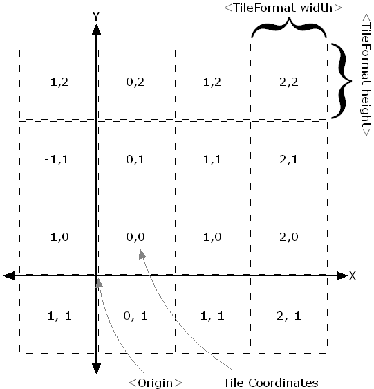
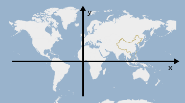

# map summary

## 相关名词

* `lat` latitude 纬度，胖(`fat`)纬度
* `lng` longitude 经度，长(`long`)经度
    
* `gps` Global Positioning System 全球定位系统。GPS起始于`1958年`美国军方的一个项目，1964年投入使用。20世纪70年代，美国陆海空三军联合研制了新一代卫星定位系统GPS 

* `lbs` Location Based Service 基于位置的服务

* `gis` Geographic Information System 或者 Geo-Information System， 地理信息系统

* `webgis` 使用Internet技术的gis

* `tms` Tiled Map Service，切片地图服务
    
    tms瓦片标准：

* `ogc` Open GIS Consortium，开放地理空间信息联盟，它定义了三种地理信息参考模型，分别是`wms`, `wfs`, `wcs`

* `gml` Geography Markup Language，地理标记语言，由OGC于1999年提出，并得到许多公司的大力支持，包括Oracle、Galdos、MapInfo、CubeWerx等，它能表示地理空间对象的空间数据和非空间属性数据。

* `wms` Web Map Service，Web地图服务，返回`图层级`的地图影像

* `wfs` Web Feature Service，Web要素服务，返回`要素级`的GML编码，并提供对要素的
    增加、修改、删除等事务操作，是对`wms`的进一步深入

* `wcs` Web Coverage Service，Web地理覆盖服务，包含地理位置信息或属性的空间栅格图层。

* `wmts` OpenGIS Web Map Tile Service，切片地图Web服务。`wmts`标准定义了一些操作
    ，这些操作允许用户访问切片地图。wmts可能是ogc首个支持`RESTFUL`访问的服务标准。

* `crs` Coordinate Reference System，坐标参考系统。

* `geojson` 用于编码各类`地理数据结构`的JSON格式。现由IETF(The Internet Engineering Task Force)和原作者一起组成的`Geographic JSON WG`在推进其标准化工作。官网：<http://geojson.org>

* `kml` Keyhole Markup Language，最初由`Keyhole`公司开发，是一种基于XML语法与格
    式，用于描述和保存地理信息（如点、线、图像、多边形等）的编码规范，可以被Google
    Earth和Google Maps识别并显示。kml作为一种文件格式，可以认为Google Earth和
    Google Map是kml文件浏览器。2008年4月微软的OOXML成为国际标准后，Google公司宣布
    放弃对KML的控制权，由OGC接管KML语言，并将Google Earth和Google Maps中使用的KML
    语言变成为一个国际标准。

* `profiles`：瓦片系统描述（来自OSGEO）。
    * global-geodetic 大地测量学，SRS = EPSG:4326
    * global-mercator 墨卡托，SRS = OSGEO:41001
    * local

> `坐标系统`：百度地图API详解之地图坐标系统: <http://www.jiazhengblog.com/blog/2011/07/02/289/>

* `经纬度`，一般`GPS设备`获取的经纬度属于`WGS84`坐标系，这是一个比较通用的坐标体系。由于某些原因国内不能直接使用`WGS84坐标`，因此百度地图API的经纬度是经过`加密偏移`的。

* `平面坐标`，经纬度是`球面`坐标，通过`投影`转换成`平面坐标`。以百度为例，它默认使用`墨卡托投影`(Mercator Projection)。平面坐标系的`原点`与经纬度的原点`一致`，即赤道与`0度经线`相交的位置。
    
    

    百度地图的`平面坐标`以最大级别`18级`为基准，也就是说在18级的时候，平面坐标的`1个单位`就代表了屏幕上的`1个像素`。平面坐标与地图所展示的级别`没有关系`，也就是说在1级和18级，天安门位置的平面坐标都是一致的。

* `像素坐标`，以百度为例，18级下，直接将平面坐标向下取整就得到了像素坐标。其他级
    别可以通过公式换算：
    
        像素坐标 = Math.floor(平面坐标 * 2^(zoom - 18))

* `瓦片坐标`，百度地图的瓦片坐标`原点`与平面坐标一致，从原点向`右上方`开始编号为0,0，瓦片坐标计算：
    
        瓦片坐标 = Math.floor(像素坐标 / 256)

    百度瓦片坐标： 

* `可视区域坐标`：地图DOM容器的坐标
* `覆盖物坐标`

* `GIS`，全名是Geographic Information System

> WebGIS三种数据：

WebGIS的数据大致可以分为三种，一种是地图、影像数据，一种是空间属性数据、一种是业务数据。地图、影像数据一般是一些png或者其他格式的数据组成。

* `影像金字塔`：在GIS中有个很重要的概念，即影像金字塔。这个概念主要是为了加速地图在前端的显示。而我们准备地图、影像数据时，也一般会首先对这些数据进行切图。

* `空间属性数据`，是通过一些工具将已经整理好的数据进行入库。对于AGS，只有连接的是入库数据的mxd，才能发布成FeatureServer服务，以供数据的编辑。当然，空间数据入库后还可以支持业务逻辑的使用。

* 第三种数据，`业务逻辑数据`，是每个Web项目必须有的，它根据不同的业务需求将业务所需的数据进行采集和入库。

影像金字塔

1像素代表实际距离是多少？

    假设dpi为96
    1英寸 = 2.54厘米
    1英寸 = 96像素

英寸转厘米： 2.5399998

当用AGS所切之图时，此参数变成了：2.54000508001016

## Tips

* 地图`zoom`级别，是`指数级`的概念，zoom级别越大，视野越小，细节越多
* 经线也叫`子午线`，`零度经线`也叫本初子午线、格林威治子午线、格林尼治子午线
* 经线总共`360度`，分东经、西经；纬线总共`180度`，分南纬、北纬
* 三类经纬度：`天文`经纬度、`大地`经纬度、`地心`经纬度

## 经纬度

 

* `纬线`：地球仪上，顺着东西方向，环绕地球仪一周的圆圈，叫做纬线。赤道是最长的纬线，长约`4万`公里。

* `零度纬线`：即`赤道`。赤道以北为`北纬`，用N作代号；以南叫`南纬`，用S作代号。
    北纬、南纬各`90度`，北极和南极分别`90度N`和`90度S`。

* `地轴`：穿过北极、南极的直线，`自转`轴。

* `极圈`：地球仪上，南北纬`66.5度`的两条纬线分别称为南极圈和北极圈。

* `回归线`：地球仪上，南北纬`23.5度`的两条纬线分别叫做南回归线和北回归线。

* `经线`：地球仪上，连接南北两极并同纬线垂直相交的线叫经线，也叫`子午线`。

* `零度经线`：也叫`本初子午线`、`格林威治子午线`、`格林尼治子午线`，从本初子午线向东、向西，各分作`180度`。地理上位于英国格林尼治天文台旧址的一条经线。以东的180度属于东经，用E作代号，以西的180度属于西经，用W作代号。

    

    `本初子午线`不是东西半球的自然划分，它是通过长期争论`人为`定下的，于`1884`年华盛顿召开的`国际经度学术会议`正式确定。

* `180度经线`：从本初子午线向东和向西，度数相同的经线各有一条，比如，`20度E`和`20
    度W`。只有东经180度和西经180度相互重合为一条经线，即180度经线，可称为`180度E`或`180度W`

    @[data-script="javascript editable"](function(){

        var s = fly.createShow('#test_50');
        var points = [
                // 东升科技园B6
                {
                    lat: { degree: 40 , minute: 2 , second: 44 }
                    , lng: { degree: 116 , minute: 20 , second: 59 }
                }
                , {
                    lat: { degree: 39 , minute: 59 , second: 51 }
                    , lng: { degree: 116 , minute: 18 , second: 16 }
                }
            ]
            ;

        function transform(val){
            return ( 
                    val.degree
                    + val.minute / 60
                    + val.second / 3600
                ).toFixed(10) - 0;
                ;
        }

        s.show('show [lat, lng]s: \n');

        points.forEach(function(p){
            s.append_show(
                [
                    transform(p.lat)
                    , transform(p.lng)
                ]
            );
        });

    })();

## 经纬度类型

三类经纬度：`天文`经纬度、`大地`经纬度、`地心`经纬度

## 坐标类型

GIS系统中，三种需要了解的坐标类型：`投影坐标`、`地理坐标`以及`垂直坐标`。

参考：<http://baike.baidu.com/link?url=X9PiT8evOi2xVkZ_YV8wA1Dhadd8-k__nCMzPmuJBW8ccy52Nh3uZd2l6A1d7oJ3pRh3KfjvjQsUJg7x5eR8X8KkjkIjJceHStQccwnuyJalZwns3m1-_mAeoN1swdoOFrGmMCGXqF4dNylIc2s02_>

## 坐标系统

`WGS-84`, `Web墨卡托`, `火星坐标`, `百度坐标`。还有不常见的`北京54坐标`，`西安80坐标`。

### Resources

* 高德，百度，Google地图定位偏移以及坐标系转换 <https://blog.csdn.net/a13570320979/article/details/51366355>
* WGS84与BJ54坐标系投影转换工具JS实现 <http://www.imrookie.cn/article/c273b6dcc1194a829785b566da4ed655>
* `proj4js` - 常用坐标转换 <https://github.com/proj4js/proj4js> <iframe src="http://258i.com/gbtn.html?user=proj4js&repo=proj4js&type=star&count=true" frameborder="0" scrolling="0" width="105px" height="20px"></iframe>

### 地球坐标系

> WGS-84

`WGS-84`坐标系是`美国国防部`研制确定的`大地坐标系`，是一种协议地球坐标系。

WGS-84坐标系的定义是：`原点`是地球的`质心`，空间直角坐标系的Z轴指向`BIH（1984.0）`定义的地极（CTP）方向，即国际协议原点CIO，它由IAU和IUGG共同推荐。X轴指向BIH定义的零度子午面和CTP赤道的交点，Y轴和Z，X轴构成右手坐标系。WGS-84椭球采用国际大地测量与地球物理联合会第17届大会测量常数推荐值，采用的两个常用基本几何参数：  

    长半轴  a = 6378137m
    扁率  f = 1:298.257223563

### 火星坐标系

> GCJ-02

火星坐标系统简介：<http://blog.csdn.net/giswens/article/details/8775121>

火星坐标系百科参考：<http://baike.baidu.com/link?url=FMaVjWjAFmRZY-NxSeJKaCF1bmsm4KJkI-gRXHvbGfCciveUddhqnWi0eR3OXQMTRcFbZoAJaWhDn5UBguiP-xLeAvlTeDBCQ4j7jGuTVLEMyIPWoAJJJDmiEXKKsmMWyphfiy0DUMGFbElwRuG8Sq>

是一种`国家保密`插件，也叫做`加密插件`或者`加偏`或者`SM模组`，其实就是对真实坐标系统进行人为的加偏处理，按照特殊的算法，将真实的坐标加密成虚假的坐标，而这个加偏`并不是线性的加偏`，所以各地的偏移情况都会有所不同。而加密后的坐标也常被人称为火星坐标系统。

`所有的电子地图、导航设备，都需要加入国家保密插件`。

* 第一步，地图公司测绘地图，测绘完成后，送到国家测绘局，将真实坐标的电子地图，加密成“火星坐标”，这样的地图才是可以出版和发布的，然后才可以让GPS公司处理。
* 第二步，所有的GPS公司，只要需要汽车导航的，需要用到导航电子地图的，都需要在软件中加入国家保密算法，将COM口读出来的真实的坐标信号，加密转换成国家要求的保密的坐标。这样，GPS导航仪和导航电子地图就可以完全匹配，GPS也就可以正常工作了。

### 百度坐标系

> `BD-09`，二次加密

国际经纬度坐标标准为`WGS-84`，国内必须至少使用`国测局`制定的`GCJ-02`，对地理位置进行`首次加密`。

百度坐标在此基础上，进行了BD-09`二次加密`措施，更加保护了个人隐私。百度对外接口的坐标系并不是GPS采集的真实经纬度，需要通过坐标转换接口进行转换。

    真实经纬度  <---   转换  --->   百度坐标

### 墨卡托坐标系

Google Maps、Virtual Earth等网络地理所使用的`地图投影`，常被称作`Web Mercator`或`Spherical Mercator`，它与常规墨卡托投影的主要区别就是把地球`模拟为球体`而非椭球体。

#### 墨卡托投影

墨卡托( Mercator )投影，又名`“等角正轴圆柱投影”`，`荷兰地图学家`墨卡托（Mercator）在`1569年`拟定，假设地球被围在一个中空的圆柱里，其赤道与圆柱相接触，然后再假想地球中心有一盏灯，把球面上的图形投影到圆柱体上，再把圆柱体展开，这就是一幅标准纬线为零度（即赤道）的“墨卡托投影”绘制出的世界地图。

通过墨卡托投影，将`球面坐标`转换成了`平面坐标（墨卡托坐标）`。

> 墨卡托投影的`“等角”`特性

墨卡托投影的“等角”特性，保证了对象的形状`不变形`，`正方形`的物体投影后不会变为`长方形`。“等角”也保证了方向和相互位置的正确性

> 墨卡托投影的`“圆柱”`特性

墨卡托投影的“圆柱”特性，保证了南北（纬线）和东西（经线）都是`平行直线`，并且`相互垂直`。而且经线间隔是相同的，纬线间隔从标准纬线（此处是赤道，也可能是其他纬线）向两级逐渐增大。

> 墨卡托投影的`“面积变化”`问题

“等角”不可避免的带来的`面积的巨大变形`，特别是`两极地区`，明显的如`格陵兰岛`比实际面积扩大了N倍。不过要是去两极地区探险或科考的同志们，一般有更详细的资料，不会来查看网络地图的，这个不要紧。

## EPSG坐标系统

### Resources

> EPSG ( European Petroleum Survey Group )，`欧洲石油调查组织`

* `EPSG`成立于1986年，2005年并入`IOGP`( International Association of Oil & Gas Producers )，国际油气生产者协会
* EPSG对世界的每一个地方都制定了地图，但用了不同的坐标系
* EPSG site: <https://epsg.io>
* `EPSG:4326` - WGS84 ( World Geodetic System 1984, used in GPS ) <https://epsg.io/4326>
* `EPSG:4214` - Beijing 1954 <https://epsg.io/4214>
* `EPSG:4610` - Xian 1980 <https://epsg.io/4610>
* `EPSG:3587` - <https://epsg.io/3587>
* EPSG是什么？ <https://www.zhihu.com/question/52220968>

### EPSG坐标系

    Code    Name                                Accuracy    Area
    ===================================================================================================
    4326    WGS 84                              m           World.    
    3857    WGS 84 / Pseudo-Mercator            m           World between 85.06°S and 85.06°N.
    >27700  OSGB 1936 / British National Grid   2m          United Kingdom (UK) - offshore to boundary 
                                                            of UKCS within 49°46'N to 61°01'N and 
                                                            7°33'W to 3°33'E; onshore Great Britain 
                                                            (England, Wales and Scotland). 
                                                            Isle of Man onshore.
    >2154    RGF93 / Lambert-93                 1m          France - onshore and offshore, 
                                                            mainland and Corsica.
    >27200    NZGD49 / New Zealand Map Grid     m           New Zealand - North Island, South Island
                                                            , Stewart Island - onshore.
    >31370    Belge 1972 / Belgian Lambert 72   m           Belgium - onshore.    
    >28992    Amersfoort / RD New               m           Netherlands - onshore, including Waddenzee
                                                            , Dutch Wadden Islands and 12-mile 
                                                            offshore coastal zone.    
    >3067    ETRS89 / TM35FIN(E,N)              1m          Finland - onshore and offshore.
    >5514    S-JTSK / Krovak East North         6m          Czech Republic; Slovakia.
    >21781    CH1903 / LV03                     1.5m        Liechtenstein; Switzerland.

### EPSG:4326

对应前文所提到的`WGS84`坐标系

### EPSG:3857

> WGS84 / Pseudo-Mercator

* Pseudo-Mercator，`伪墨卡托`投影坐标，将地球作为球体而非椭球体进行墨卡托投影，与常规墨卡托投影存在一些区别
* 一种通过墨卡托投影，由球面地理坐标投影成的平面坐标系
* 使用Spherical Mercator（球面墨卡托坐标）的地图应用： Google Maps, OpenStreetMap, Bing, ArcGIS, ESRI 
* 还有其他别名：`900913`, `3587`, `54004`, `41001`, `102113`, `102100`, `3785`

## GeoJSON

`GeoJSON` 用于编码各类地理数据结构的JSON格式。现由`IETF`(The Internet Engineering Task Force)和原作者一起组成的`Geographic JSON WG`在推进其标准化工作。

### Resources

* 官网：<http://geojson.org>
* `2015`年，IETF（ Internet Engineering Task Force )组织与规范的原作者联合创立了GeoJSON工作组，并于2016年8月发布了RFC 7946，对GeoJSON格式进行了标准化，取代了2008年的GeoJSON规范
* 标准草案 - 2016 `RFC 7946`：<https://datatracker.ietf.org/doc/draft-ietf-geojson/>
* 规范 - 2008旧版规范：<http://geojson.org/geojson-spec.html>
* china-geojson: <https://github.com/yezongyang/china-geojson>
* google geojson drag and drop: <https://developers.google.com/maps/documentation/javascript/examples/layer-data-dragndrop>

### Tips

* GeoJSON的坐标是一个`二维坐标`，使用一个包含两个项的`一维数组`来表示
* `coordinates`在表示`6种`type的geometry时，外围数组的`层数`如下： 

        type                levels      example
        =======================================================================================
        Point               0           [ x, y ]
        LineString          1           [ [ x1, y1 ], [ x2, y2 ], ... ]
        Polygon             2           [ [ [ x1, y1 ], [ x2, y2 ], ... ], ... ]
        MultiPoint          1           [ [ x1, y1 ], [ x2, y2 ], ... ]
        MultiLineString     2           [ [ [ x1, y1 ], [ x2, y2 ], ... ], ... ]
        MultiPolygon        3           [ [ [ [ x1, y1 ], [ x2, y2 ], ... ], ... ], ... ]

* `Point`最简；`LineString`与`MultiPoint`格式相同；`Polygon`与`MultiLineString`格式相同；`MultiPolygon`最复杂

### Examples

    {
        "type": "Feature",
        "geometry": {
            "type": "Point",
            "coordinates": [125.6, 10.1]
        },
        "properties": {
            "name": "Dinagat Islands"
        }
    } 

* GeoJSON对象可以表示`几何(geometry)`、`特征(feature)`或者`特征集合(feature collection)`。
* GeoJSON支持的几何图形类型有：`Point`, `LineString`, `Polygon`, `MultiPoint`, `MultiLineString`以及`MultiPolygon`

#### FeatureCollection

    {
       "type": "FeatureCollection",
       "features": [{
           "type": "Feature",
           "geometry": {
               "type": "Point",
               "coordinates": [102.0, 0.5]
           },
           "properties": {
               "prop0": "value0"
           }
       }, {
           "type": "Feature",
           "geometry": {
               "type": "LineString",
               "coordinates": [
                   [102.0, 0.0],
                   [103.0, 1.0],
                   [104.0, 0.0],
                   [105.0, 1.0]
               ]
           },
           "properties": {
               "prop0": "value0",
               "prop1": 0.0
           }
       }, {
           "type": "Feature",
           "geometry": {
               "type": "Polygon",
               "coordinates": [
                   [
                       [100.0, 0.0],
                       [101.0, 0.0],
                       [101.0, 1.0],
                       [100.0, 1.0],
                       [100.0, 0.0]
                   ]
               ]
           },
           "properties": {
               "prop0": "value0",
               "prop1": {
                   "this": "that"
               }
           }
       }]
   }

#### Polygon与MultiPolygon

* `Polygon`是一组闭合的多边形；`MultiPolygon`是多组闭合的多边形
* `Polygon`在进行区域填充时，其包含的一组闭合多边形中，若只有一个Polygon，其内部会被填充上色；若包含多个Polygon，则会存在空洞( with holes )，第一个Polygon作为外圈( exterior ring )，后续的Polygon作为内圈（或者holes）。如下图所示：

        

* `MultiPolygon`是多组Polygon坐标形成的数组，比Polygon多一个数组层级
* `Polygon`的coordinates表达形式：

        "geometry": {
            "type": "Polygon",
            "coordinates": [
                // exterior ring
                [
                    [100.0, 0.0],
                    [101.0, 0.0],
                    [101.0, 1.0],
                    [100.0, 1.0],
                    [100.0, 0.0]
                ],
                // inner ring
                [
                    [100.8, 0.8],
                    [100.8, 0.2],
                    [100.2, 0.2],
                    [100.2, 0.8],
                    [100.8, 0.8]
                ]
            ]
        }
    
* `MultiPolygon`的coordinates表达形式：

        "geometry": {
            "type": "Polygon",
            "coordinates": [
                [
                    // exterior ring
                    [
                        [100.0, 0.0],
                        [101.0, 0.0],
                        [101.0, 1.0],
                        [100.0, 1.0],
                        [100.0, 0.0]
                    ],
                    // inner ring
                    [
                        [100.8, 0.8],
                        [100.8, 0.2],
                        [100.2, 0.2],
                        [100.2, 0.8],
                        [100.8, 0.8]
                    ]
                ]
                , ...
            ]
        }

### RFC 7946解析

> <https://datatracker.ietf.org/doc/rfc7946/?include_text=1>

    GeoJSON Text
    GeoJSON Object
        GeoJSON Object
            Position
            Point
            MultiPoint
            LineString
            MultiLineString
            Polygon
            MultiPolygon
            GeometryCollection
            Antimeridian Cutting
            Uncertainty and Precision
        Feature Object
        FeatureCollection Object
    Coordinate Reference System
    Bounding Box
    Extending GeoJSON

## 地图颜色酿造师

<http://colorbrewer2.org>

## 常用Web地图引擎或框架

* leaflet <ref://./leaflet.md.html>
* mapbox <ref://./mapbox.md.html>
* openlayer <ref://./openlayer.md.html>
* mapv <ref://./mapv.md.html>
* openstreet <ref://./openlayer.md.html>
* supermap <ref://./supermap.md.html>
* censium <ref://./cesium.md.html>

## 常用开放地图API

参考 <ref://./map-api.md.html>

## 参考资料

* WebGIS学习：<http://www.thinkgis.cn/user/lzxue/topics?page=2>
* WGS84、Web墨卡托、火星坐标、百度坐标互转：<http://blog.csdn.net/wildboy2001/article/details/12031351>
* 地理坐标系：<http://baike.baidu.com/link?url=9zrqgPWYuUWwAuvBY73QosnOe4ac8MH3RCchIqhQZbS4ctSIaRLv4gyI-iOiSUXRBSnqUS1CxGMladHteMGMfz93_db6Z_-vWKJRwiiUYh8cz-WgKGHNjnYXNpRFmfuMbuAg9QD7cEhskkbcHIOUX_>
* WGS84经纬度坐标：<http://wenku.baidu.com/link?url=IuHisq6Xz82nkMPYosSuGXa2kyn9uTk28gxABcg55AqgZaZiF0uIppfCTagHGFGGCUvyVJgLSY2I7sMfyMMn9ZNe0A6TMtYMU7y46jikZ_u>
* 火星坐标系：<http://baike.baidu.com/link?url=FMaVjWjAFmRZY-NxSeJKaCF1bmsm4KJkI-gRXHvbGfCciveUddhqnWi0eR3OXQMTRcFbZoAJaWhDn5UBguiP-xLeAvlTeDBCQ4j7jGuTVLEMyIPWoAJJJDmiEXKKsmMWyphfiy0DUMGFbElwRuG8Sq>

