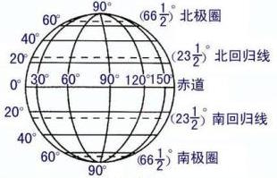

# map summary

<http://www.thinkgis.cn/user/lzxue/topics?page=2>

## 相关名词

* `lat` latitude 纬度，胖(fat)纬度
* `lng` longitude 经度，长(long)经度
    
* `gps` Global Positioning System 全球定位系统。
    GPS起始于1958年美国军方的一个项目，1964年投入使用。20世纪70年代，美国陆海空三军
    联合研制了新一代卫星定位系统GPS 

* `lbs` Location Based Service 基于位置的服务

* `gis`
    Geographic Information System 或者 Geo-Information System， 地理信息系统

* `webgis` 使用Internet技术的gis

* `tms` Tile Map Service，切片地图服务
    
    tms瓦片标准：

* `ogc` Open GIS Consortium，开放地理空间信息联盟，它定义了三种地理信息参考模型，分别是`wms`, `wfs`, `wcs`

* `gml` Geography Markup Language，地理标记语言，由OGC于1999年提出，并得到许多公
    司的大力支持，包括Oracle、Galdos、MapInfo、CubeWerx等，它能表示地理空间对象的
    空间数据和非空间属性数据。

* `wms` Web Map Service，Web地图服务，返回`图层级`的地图影像

* `wfs` Web Feature Service，Web要素服务，返回`要素级`的GML编码，并提供对要素的
    增加、修改、删除等事物操作，是对`wms`的进一步深入

* `wcs` Web Coverage Service，Web地理覆盖服务，包含地理位置信息或属性的空间栅格图层。

* `wmts` OpenGIS Web Map Tile Service，切片地图Web服务。`wmts`标准定义了一些操作
    ，这些操作允许用户访问切片地图。wmts可能是ogc首个支持`RESTFUL`访问的服务标准。

* `crs` Coordinate Reference System，坐标参考系统。

* `geojson` 用于编码各类地理数据结构的JSON格式。现由IETF(The Internet
    Engineering Task Force)和原作者一起组成的`Geographic JSON WG`在推进其标准化工作
    。官网：<http://geojson.org>

* `kml` Keyhole Markup Language，最初由`Keyhole`公司开发，是一种基于XML语法与格
    式，用于描述和保存地理信息（如点、线、图像、多边形等）的编码规范，可以被Google
    Earth和Google Maps识别并显示。kml作为一种文件格式，可以认为Google Earth和
    Google Map是kml文件浏览器。2008年4月微软的OOXML成为国际标准后，Google公司宣布
    放弃对KML的控制权，由OGC接管KML语言，并将Google Earth和Google Maps中使用的KML
    语言变成为一个国际标准。

* `profiles`：瓦片系统描述（来自OSGEO）。
    * global-geodetic 大地测量学，SRS = EPSG:4326
    * global-mercator 墨卡托，SRS = OSGEO:41001
    * local

* `平面坐标`，经纬度是球面坐标，通过投影转换成平面坐标。以百度为例，它默认使用
    墨卡托投影(Mercator Projection)。平面坐标系的`原点`与经纬度的原点`一致`，即
    赤道与`0度经线`相交的位置。百度地图的平面坐标以最大级别18级为基准，也就是说
    在18级下，平面坐标的一个单位就代表了屏幕上的1个像素。平面坐标与地图所展示的
    级别`没有关系`，也就是说在1级和18级下，天安门位置的平面坐标都是一致的。
* `像素坐标`，以百度为例，18级下，直接将平面坐标向下取整就得到了像素坐标。其他级
    别可以通过公式换算：`像素坐标 = Math.floor(平面坐标 * 2^(zoom - 18))`
* `瓦片坐标`，百度地图的瓦片坐标`原点`与平面坐标一致，从原点向`右上方`开始编号为0,0，
    瓦片坐标计算：`瓦片坐标 = Math.floor(像素坐标 / 256)`

    百度瓦片坐标： 

* `可视区域坐标`：地图DOM容器的坐标
* `覆盖物坐标`

GIS的全名是Geographic Information System

WebGIS的数据大致可以分为三种，一种是地图、影像数据，一种是空间属性数据、一种是业务数据。地图、影像数据一般是一些png或者其他格式的数据组成。
在GIS中有个很重要的概念，即影像金字塔。这个概念主要是为了加速地图在前端的显示。而我们准备地图、影像数据时，也一般会首先对这些数据进行切图。
空间属性数据，是通过一些工具将已经整理好的数据进行入库。对于AGS，只有连接的是入库数据的mxd，才能发布成FeatureServer服务，以供数据的编辑。当然，空间数据入库后还可以支持业务逻辑的使用。

第三种数据，业务逻辑数据，是每个Web项目必须有的，它根据不同的业务需求将业务所需的数据进行采集和入库。

影像金字塔

1像素代表实际距离是多少？

假设dpi为96
1英寸 = 2.54厘米
1英寸 = 96像素

英寸转厘米： 2.5399998
当用AGS所切之图时，此参数变成了：2.54000508001016

## 经纬度

 

* `纬线`：地球仪上，顺着东西方向，环绕地球仪一周的圆圈，叫做纬线。赤道是最长的纬线，长约`4万`公里。

* `零度纬线`：即`赤道`。赤道以北为`北纬`，用N作代号；以南叫`南纬`，用S作代号。
    北纬、南纬各`90度`，北极和南极分别`90度N`和`90度S`。

* `地轴`：穿过北极、南极的直线，`自转`轴。

* `极圈`：地球仪上，南北纬`66.5度`的两条纬线分别称为南极圈和北极圈。

* `回归线`：地球仪上，南北纬`23.5度`的两条纬线分别叫做南回归线和北回归线。

* `经线`：地球仪上，连接南北两极并同纬线垂直相交的线叫经线，也叫`子午线`。

* `零度经线`：也叫`本初子午线`，从本初子午线向东、向西，各分作`180度`。以东的180度
    属于东经，用E作代号，以西的180度属于西经，用W作代号。

* `180度经线`：从本初子午线向东和向西，度数相同的经线各有一条，比如，`20度E`和`20
    度W`。只有东经180度和西经180度相互重合为一条经线，即180度经线

* `20度W`和`160度E`是同一经线。

## GeoJSON

* 官网：<http://geojson.org>
* 规范：<http://geojson.org/geojson-spec.html>
* 标准草案：<https://datatracker.ietf.org/doc/draft-ietf-geojson/>

`geojson` 用于编码各类地理数据结构的JSON格式。现由IETF(The Internet Engineering
Task Force)和原作者一起组成的`Geographic JSON WG`在推进其标准化工作。

    {
      "type": "Feature",
      "geometry": {
        "type": "Point",
        "coordinates": [125.6, 10.1]
      },
      "properties": {
        "name": "Dinagat Islands"
      }
    } 

GeoJSON对象可以表示`几何(geometry)`、`特征(feature)`或者`特征集合(feature collection)`。
GeoJSON支持的几何图形类型有：`Point`, `LineString`, `Polygon`, `MultiPoint`, `MultiLineString`以及`MultiPolygon`

