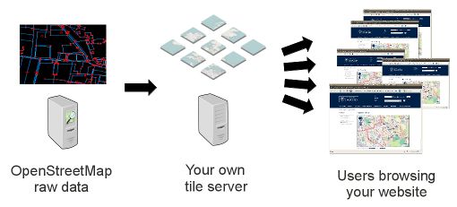

# openstreet

> OSM

* site: <http://www.openstreetmap.org>
* <https://switch2osm.org/>
* OSM data download: <http://planet.openstreetmap.org>
* OSM基金会： <http://wiki.osmfoundation.org/wiki/Main_Page>

## Features

* 自由且可编辑的世界地图
* 可以由使用者绘制地图
* `新手演练`功能非常有用，智子可以参考
* `wikepedia`的感觉

## 使用数据

### OSM有哪些数据

* Roads, railways, waterways, etc...
* Restaurants, shops, stations, ATMs and more.
* Walking and cycling paths.
* Buildings, campuses, etc...

### 关于OSM瓦片数据

使用瓦片： <https://switch2osm.org/using-tiles/>，没有直接下载可用的瓦片数据，需要根据OSM的数据自己生成瓦片。

提供瓦片服务： <https://switch2osm.org/serving-tiles/>，貌似瓦片数据是可以在服务端生成的。需要自行搭建服务器。

 

