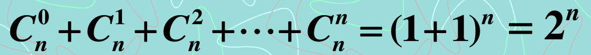

# 数学知识备忘

## 三角函数

贴图如下：

## 排列与组合

### 排列与组合

从n个不同的元素中，取r个不重复的元素，`按次序排列`，称为从n个中去r个的无重`排列`。公式如下：

从n个不同的元素中，取r个不重复的元素组成一个子集，而`不考虑元素的顺序`，称为从n个中取r个的无重`组合`。公式如下：

### 二项式定理

二项式定理可以用以下公式表示：

其中，又有等记法，称为`二项式系数`，
即取的组合数目。此系数亦可表示为`杨辉三角形`。它们之间是互通的关系。

展开以后，如下：

特殊情况：

当`x=1`时：

### 杨辉三角

以下为杨辉三角：

    　                         1
                             1   1   
                           1   2   1   
                         1   3   3   1   
                       1   4   6   4   1   
                     1   5   10  10  5   1   
                   1   6   15  20  15  6   1   
                 1   7   21  35  35  21  7   1   
               1   8   28  56  70  56  28  8   1   
             1   9   36  84  126 126 84  36  9   1   
           1   10  45  120 210 252 210 120 45  10  1   
         1   11  55  165 330 462 462 330 165 55  11  1    
       1   12  66  220 495 792 924 792 495 220 66  12  1
    ...

## 数列

### 等差数列

> Arithmetic Progress(Sequence)

`通项`公式：

`求和`公式：

### 等比数列

> Geometric Progress(Sequence)

`通项`公式：

`求和`公式：

