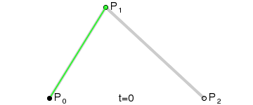

# bezier curve

## History 

* 贝塞尔曲线的`数学基础`是`1912`年就广为人知的`伯恩斯坦多项式` <https://en.wikipedia.org/wiki/Bernstein_polynomial>
* `1959`年，就职于`雪铁龙`的法国数学家`Paulde Casteljau`开始应用，提出了一种数值稳定的`de Casteljau算法`
* `1962`年，就职于`雷诺`的法国工程师`Pierre Bezier`广泛宣传，用于辅助汽车车体的工业设计

## Resources

* `de Casteljau`绘制法演示：<https://myst729.github.io/bezier-curve/>

    

* 贝塞尔曲线扫盲：<https://myst729.github.io/#/blog/articles/2013/bezier-curve-literacy/>
* `canvas`绘制贝塞尔曲线：<ref://../graphics/canvas.md.html>
* `svg`绘制贝塞尔曲线：<ref://../graphics/svg.md.html>

## Features

* 开始于`P0`并结束于`Pn`，即所谓的`端点插值法`属性
* 贝塞尔曲线是`直线`的充要条件是`控制点共线`
* 曲线的起始点（结束点）相切于贝塞尔多边形的第一节（最后一节）
* 一条曲线可以在`任意点`切割成`两条或任意多条`子曲线，每一条子曲线仍是`贝塞尔曲线`
* 一些看似简单的曲线（如圆）无法以贝塞尔曲线精确描述

## Formulas

### 理解贝塞尔公式

* `Pn`可以是`1维、2维、3维或n维向量`，针对Pn，以下公式可将Pn分解到坐标轴方向上的`分向量`，再分别应用，最终再组成`合向量`。
* 当`n=3`，得到的就是`贝塞尔曲面`。
* 贝塞尔曲线的`阶数不等同于向量的维数`，切记不要搞混

### 线性贝塞尔曲线

### 二阶贝塞尔曲线

### 三阶贝塞尔曲线

### n阶贝塞尔曲线

关于二项式系数，可参考<ref://./binomial-coefficient.md.html>

## 贝塞尔曲线切割

> 如上文所述，贝塞尔曲线可在`任意点切割`成两段，切割后的两段仍然是贝塞尔曲线。

 

贝塞尔切割可用于`曲线动画`。

<ref://../graphics/zrender.md.html>

## 贝塞尔曲面

> 如上文贝塞尔公式的理解可知，针对`3维向量`运用贝塞尔公式，就能获得三维空间上的`贝塞尔曲面`。

todo

