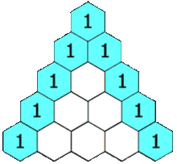

# binomial coefficient
> 二项式系数

## Resources

* Binomial coefficient: <https://en.wikipedia.org/wiki/Binomial_coefficient>
* Pascal's triangle: <https://en.wikipedia.org/wiki/Pascal%27s_triangle>

## 二项式

## 二项式系数

## 杨辉三角
> 也称为`Pascal Triangle`

 

              1
            1   1
          1   2   1
        1   3   3   1
      1   4    6   4  1
    1   5   10  10  5   1

