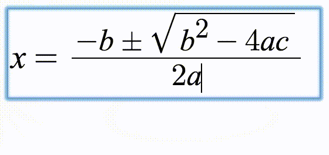

# math display engine

## Overview

* 数学符号标准或语言： `LaTex`, `MathML`, `AsciiMath`等，各种展现引擎支持其中的一种或多种输入
* 实现以上标准或支持以上语言的展现引擎：MathJax
* 展现和编辑引擎：mathquill, KityFormula, eWebEditor等等

### Tex 与 LaTex

* `Tex`是`1970年代末`出现的数学标记命令，先进仍大量使用，它成为了数学输入的工业标准
* `LaTex`是Tex目前的变种中`最主流`的一种标准
* <http://docs.mathjax.org/en/latest/tex.html> 

## LaTex

> A document preparation system

LaTeX is a high-quality typesetting system; it includes features designed for the production of technical and scientific documentation. LaTeX is the de facto `standard for the communication and publication of scientific documents`. LaTeX is available as `free software`.

* 科学文档排版的`标准`；基于该标准有一系列的免费软件。
* `AMS-LaTex`就是基于该标准的一个扩展包，提供了数学排版的标准
* site: <http://www.latex-project.org>，LaTex项目，提供排版系统标准。
* 基于TEX的排版系统，使用TEX作为格式化引擎
* 百科：<http://baike.baidu.com/link?url=HASCY6yvUXWoeue0ylDgcTRJA53tsuvaaMmE78C3Ltbyu4EcK0MRs1rfYG9oJdJ5M76ah_E-AsQSCa95Y6xU7K>
* Tex目前的`主流`变种

> LaTeX is based on the idea that it is better to leave document design to document designers, and to let authors get on with writing documents. 

So, in LaTeX you would input this document as: 

	\documentclass{article}
	\title{Cartesian closed categories and the price of eggs}
	\author{Jane Doe}
	\date{September 1994}
	\begin{document}
	   \maketitle
	   Hello world!
	\end{document}

### AMS-LaTex

> LaTex with AMS extensions

* `AMS`: 美国数学学会，American Mathmatical Society
* `AMS-LaTex`提供的LaTex数学扩展包，该扩展包被常用于数学公式编辑器的文档语法
* `Short Math Guide for LaTex`: <ftp://ftp.ams.org/pub/tex/doc/amsmath/short-math-guide.pdf>
    ，或者：<a href="./pdf/short-math-guide.pdf">本地下载版</a>。该文档提供了各类数学公式编辑器
    遵循的`LaTex`语法标准。

## MathML

## AsciiMath

## MathJax

详见<ref://./eathjax.md> [ todo ]

* 安装文档：<https://github.com/mathjax/MathJax-docs/blob/master/installation.rst>
* AMS为其`Managing Partner`，`stackoverflow`是其`partner`
* site: <http://www.mathjax.org>
* github: <https://github.com/mathjax/MathJax>

## mathquill

> Easily type math in your webapp

 

* github: <https://github.com/mathquill/mathquill>
* site: <http://mathquill.com>
* 支持`LaTex`
* 使用方式：

        var htmlElement = document.getElementById('some_id');
        var config = {
          handlers: { edit: function(){ ... } },
          restrictMismatchedBrackets: true
        };
        var mathField = MQ.MathField(htmlElement, config);

        mathField.latex('2^{\\frac{3}{2}}'); // Renders the given LaTeX in the MathQuill field
        mathField.latex(); // => '2^{\\frac{3}{2}}'

## MathType

一款专业的数学公式编辑工具，由Design Science出品。

## JMEditor

<http://www.jmeditor.com>

* 国人制作，站点比较一般
* 基于CKEditor、jQury、`mathquill`

## KityFormula

> SVG-based visualization Equation Editor

* github: <https://github.com/fex-team/kityformula-editor>
* 100+ stars
* 支持`LaTex`语法
* `fex`出品，但是不是明星产品，文档不全。14年初最后提交，此后再无更新
* 文章：<http://www.open-open.com/lib/view/open1406461299412.html>

## eWebEditor

> 支持`MathFlow`公式编辑，以及`WrodEQ`公式编辑

* Design Science出品，其是知名公式编辑器`MathType`的厂商，与eWebSoft合作，提供web版本的`MathType`编辑器。
* 在线演示：<http://www.ewebeditor.net/math/>
* 局限：只能在Windows下操作

