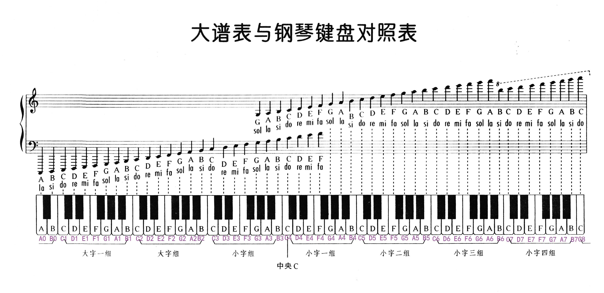
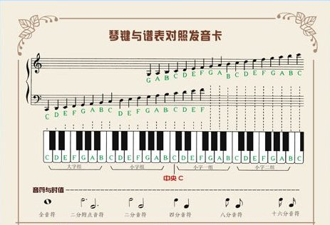

# stave

> 五线谱

## 基本元素

* 五条平行横线
* 连谱号，起线和括线，括线粉花括线和直括线两种

## 音符和休止符

    全音符等于两个二分音符
    一个二分音符等于两个四分音符
    全休止符等于两个二分休止符
    音的位置愈高，音也越高

## 拍号
    二拍子系统，强-弱
        2/4 代表一个小节有2拍，用4分音符当一拍
        4/4 代表一个小节有4拍，用4分音符当一拍
    三拍子系统，强-弱-弱
        3/4 代表一个小节有3拍，用4分音符当一拍
        3/8 代表一个小节有3拍，用8分音符当一拍
        9/8 代表一个小节有9拍，用8分音符当一拍
    后拍子系统，前两者的综合运用，常见的有5拍和7拍

## 谱号

    在五线谱上要确定音的高低，必须用谱号来标明。
    记在五线谱的某一条线上，使这条线具有了固定的音级名称和高度，同时也就确定了其他线的音级和高度
    三种谱号
        G谱号，记在第二线，高音谱号；也有记在第一线的，叫古法国式高音谱号
        F谱号，记在第四线，低音谱号；也有记在第五线的，叫倍低音谱号
        C谱号，可记在任何一条线上
            C三线谱号（中音谱号），中音提琴所用，有时也为长号所用
            C四线谱号（次中音谱号），大提琴、长管和长号所用
    使用各种谱号的目的是为了避免过多的加线，使写谱和读谱更加方便

## 符点
    符点是记在音符符头右边的小圆点，用以增长音符的时值
    一个符点，表示增加1/2
    两个符点，表示增加3/4
    同样适用于休止符

## 延长记号

    半圆形中间加一个圆点

## 延音线
    向上或向下弯曲的弧线
    将两个或两个以上具有相同音高的音符相连，演唱或演奏时作为一个音符，它的长度等于所有这些音符的综合

## 单声部音乐和多声部音乐

## 变音记号

有五种

    升记号（#）
    降记号（b）
    重升记号（）
    重降记号（bb）
    还原记号（）

## 钢琴五线谱与键盘的对应关系

