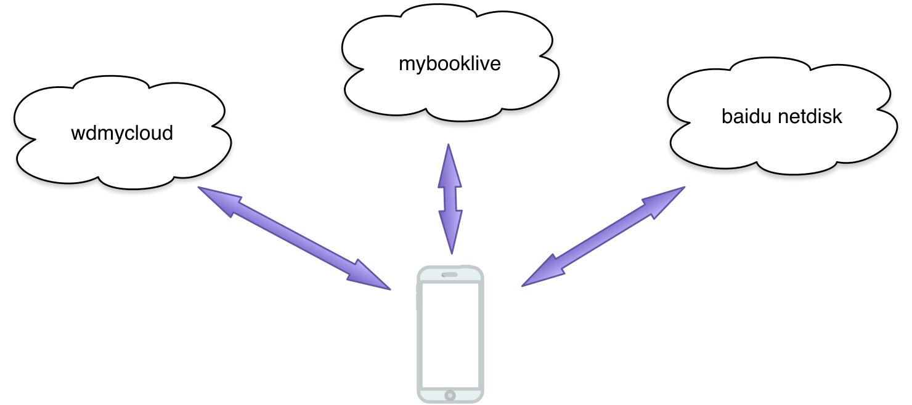

# mycloud

2017-02
, 2015-05

## 个人云备份方案

* `3个`云盘同时`自动备份`，包括`2个`私有云，`1个`公共云
* 手机安装`mycloud`移动应用，可以方便的将手机的图片和视频资料自动备份到两个私有云
* 手机安装`百度网盘`移动应用，将图片和视频资料自动备份到百度网盘，某些功能需要付费

 

服务器间进行同步，存在不少问题，比如如何增量备份、文件名带空格等特殊字符。这有一款精心编写的
自动同步脚本工具：`wd-cloud-sync` <https://github.com/MichaelHu/wd-cloud-sync>

    sh sync.sh <sync-dir>

## 镜像个人云

`两台`个人云服务器，存储容量分别为`3T`，以下为`家庭内网`访问地址。

1. `mybooklive`: <http://mybooklive.local>
2. `wdmycloud`: <http://wdmycloud.local>

没有购买磁盘阵列，购买两个主要为了backup，以防某台服务器挂了，数据也不至于全部丢失。

开始尝试使用`safe points`做安全点备份，但是解决不了硬件损坏时的麻烦（都坏了，怎么安全点恢复？）

实际上，`核心诉求`是有两处不同的拷贝，要解决这个问题，就是两个服务器的镜像关系。

## 服务器详情

### mybooklive

    MyBookLive:~# cat /etc/issue
    Debian GNU/Linux 5.0 \n \l

系统版本是`Debian GNU/Linux 5.0`

### wdmycloud

    WDMyCloud:~# cat /etc/issue
    Debian GNU/Linux 7 \n \l

系统版本是`Debian GNU/Linux 7`

## 制作镜像

### 方式一 电脑中转

第一种方式，是通过电脑作为中转控制，在资源浏览器中分别打开两台服务器，通过文件复制方式进行镜像。这种方式对于少许文件操作尚可，但是对于大批量文件操作，在操作繁琐和速度上会大打折扣。

### 方式二 服务器直接对拷

第二种方式，可以考虑服务器之间的对拷。因为都是`Linux Server`，通过`scp`命令，直接进行文件复制

1. 开启`ssh`访问，`wdmycloud`直接有菜单选择开启，`mybooklive`需要输入`指定url`(<http://mybooklive.local/UI/ssh>)才能进入ssh开启界面

2. 登录主服务器：

        ssh root@mybooklive.local

3. 拷贝文件，假设从服务器的ip为192.168.1.5：

        cd /DataVolume/path
        scp -p test.jpg root@192.168.1.5:/DataVolume/path

    注意：`-p`选项用于保持文件属性；带空格的目录名，需要用反斜线转义空格，并包含在双引号中， 如：

        scp -rp NOKIA root@192.168.1.101:"/DataVolume/shares/Public/Shared\ Pictures"

    而不是：

        scp -rp NOKIA root@192.168.1.101:/DataVolume/shares/Public/Shared\ Pictures

## 拷贝文件的技巧

### 中文乱码问题

在这两台Linux Server上，shell命令没有manual可调，同时显示效果不好，使用Mac Pro`自带的Terminal`直连ssh，如果目录名称带有中文，则显示乱码。查看`LANG`环境变量，没什么问题，和Terminal的设置也一致。

    echo $LANG
    zh_CN.UTF-8

目录显示乱码：

    MyBookLive:/DataVolume/shares/Public/Shared Pictures/IXUS851S# ls
    2008??????  2009??????  2010??????  2011??????  2012??????  2013??????

但是，敲命令的时候，如果使用tab键进行提示，中文却能正常显示。

另，Server上的VIM也很基本，中文输入照样支持不好，先将命令保存成文件的方案也比较麻烦，但是如果对复杂拷贝，还是有用的。

### 临时解决中文乱码

使用纯命令行的方式，能解决挺大一部分的问题，如下：

    MyBookLive:/DataVolume/shares/Public/Shared Pictures/IXUS851S# for i in `ls | head -2 | tail -1`; do scp -rp $i "root@192.168.1.105:/DataVolume/shares/Public/Shared\ Pictures/IXUS851S"; done

以上命令，将第二个目录复制到另一个server，由于使用了高速路由，复制速度比较快，达到`15M/s`

### 终极解决中文乱码

#### 铺垫

网上有不少ssh连接linux server出现乱码的解决方案，比如：

`linux 中 ssh客户端显示中文乱码修改解决办法`: <http://blog.csdn.net/oraclest/article/details/8163191>，这篇文章讲解还比较详细，但里面提到的方案都解决不了目前的问题。

我感觉可能和云服务器上Linux版本的`定制化`有关，比如上面就没有`/etc/sysconfig/i18N`文件。至于是定制导致还是Debian本身就没有，我就没有深究了。

#### 解决方案

最终解决是由于发现了一个不太明白的环境变量`LC_ALL`。

    echo $LC_ALL
    C

是一个`C`值，它是什么含义呢，和locale有关系么？

一番搜索，相关博客文章可参考`庖丁解牛`带来的文章：`「Linux下LC_ALL=C的含义」` <http://blog.csdn.net/ict2014/article/details/23946471>

文章是这么讲解的：

* 它是一个宏，如果该值设置了，则该值会覆盖所有`LC_*`的设置值。注意，`LANG`的值`不受`该宏影响。
* "C"是系统`默认的locale`，`"POSIX"`是"C"的`别名`。所以当我们新安装完一个系统时，默认的locale就是C或POSIX。 

> 所以，究其原因，还是系统的`locale设置的问题`，默认情况下环境变量`LC_ALL`是`空值`

实际上，在`~/.bashrc`中发现了专门对`LC_ALL`的设置：

    # speed up grep
    export LC_ALL=C

从注释来看，显式设置`LC_ALL`能提升`grep`的速度。

解决方案就是：

    export LC_ALL=zh_CN.UTF-8

因为涉及自动固件升级，所以就尽量不要修改配置文件了，直接用`export`已经基本满足要求。

