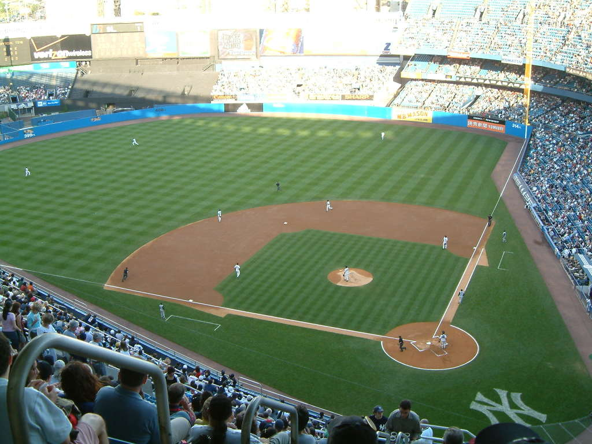
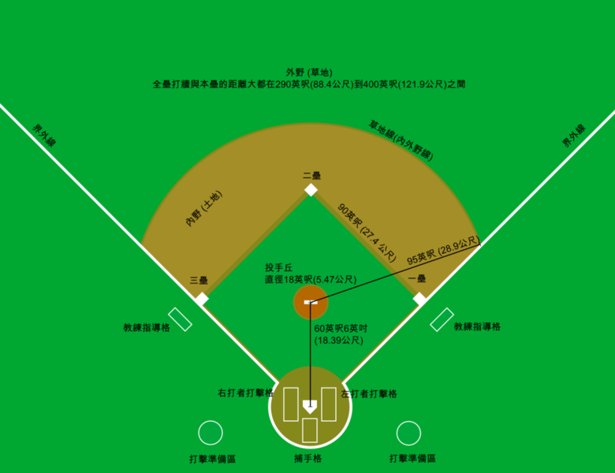
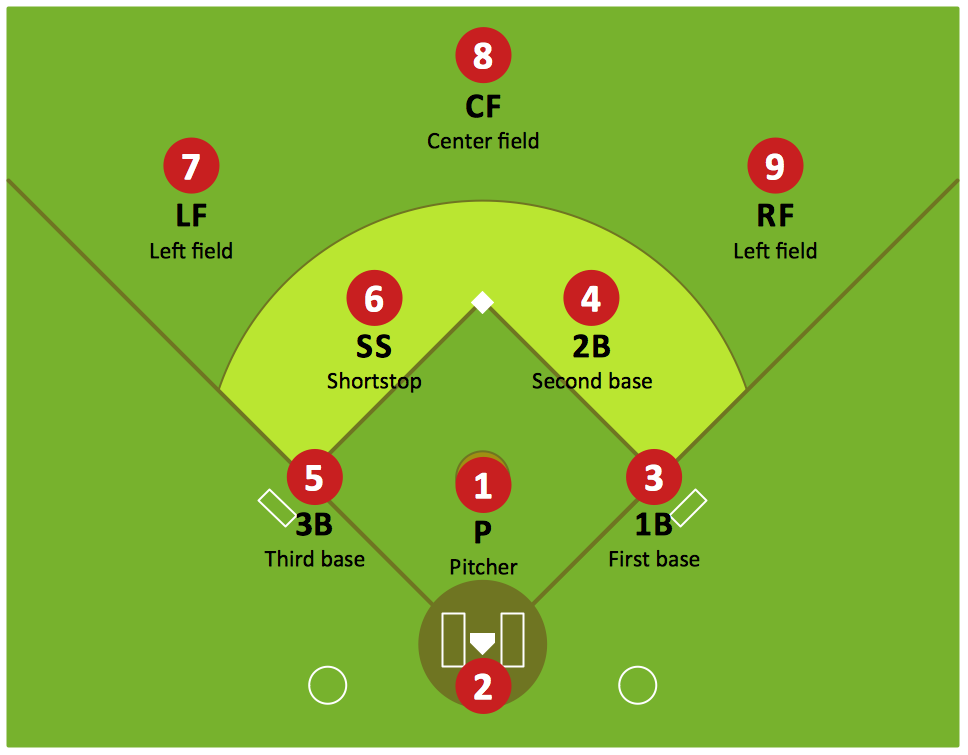
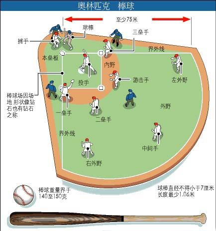

# baseball

## 棒球简介

棒球运动是一种以棒打球为主要特点，`集体性、对抗性`很强的球类运动项目。它在国际上开展较为广泛，影响较大。

在`美国、日本`尤为盛行，被称为“国球”。其也是一种团体球类运动，法定比赛人数最少为9人，其近似的运动项目为`垒球`。棒球球员分为攻、守两方，利用球棒和手套，在一个扇形的棒球场里进行比赛。

## Features

* 男子棒球，女子垒球
* 团队合作性很强
* 要有明确的分工
* 美国和日本等国家很流行

## Resources

* 棒球规则总览 - 中国棒球协会官网 <http://baseball.sport.org.cn/jsgz/guize/>
* 术语定义 - 中国棒球协会官网 <http://baseball.sport.org.cn/jsgz/guize/2004-03-10/48414.html>
* 击球员 - 中国棒球协会官网 <http://baseball.sport.org.cn/jsgz/guize/2004-03-10/48410.html>
* 跑垒员 - 中国棒球协会官网 <http://baseball.sport.org.cn/jsgz/guize/2004-03-10/48409.html>

## 示意图

### 实际棒球场地

 

### 棒球场地示意图

 

### 棒球场地示意图 - 英文

 

### 防守队员布局 - 奥林匹克

 

## 棒球规则简单描述

棒球运动规则并非人们想象的那么复杂，简单地说，就是投球，击球，接球。棒球比赛在两队之间进行，轮流进攻与防守。在9局比赛中，得分最多的队获胜。一队的三名投手都出局后，两队交换进攻与防守。如果两队在9局比赛中打平，还有加一局比赛，一直到分出胜负。

攻方队员击球后跑垒,依次踏触一、二、三垒，最后安全踏触本垒的进攻得一分。棒球比赛中的得分大部分都是击球手先到一垒、然后依次跑垒到本垒得分的，但也有非常令人激动的本垒打情况。所谓本垒打就是击球员将球击出后(通常击出外野护栏)，击球员安全回到本垒叫本垒打。 击球员无失误安全上垒的击球叫安打，击球员在投手投出四个坏球后可自动上垒。

### 主要棒球术语

#### 场地相关

* 界内地区：从本垒经一、三边线及其延长线直到挡墙或围网(包括垂直的空间)以内的区域叫“界内地区”。
* 界外地区：从本垒经一、三垒边线及其延长线直到挡墙或围网(包括垂直的空间)以外的区域叫“界外地区”。
* 内场：连结四个垒位所形成的正方形的界内场区为内场。
* 外场：内场以外的界内地区，即内场以外至连接两条边线末端的弧线所形成的扇形地区为外场。
* 边线：本垒至一垒及其延长线和本垒至三垒及其延长线叫边线。 垒线：连接垒间的线叫垒线。
* 垒位：跑垒员为得分而必须按顺序踏触内场四角的四个位置叫“垒位”。
* 投手区；直径为5.49米，高出地面0.25米，四周成斜坡，供投手投球的土墩为投手区。土墩正中稍后为一平台，中置投手板(图7)
* 击球员区：击球员击球时端立的区域叫“击球员区”。
* 接手区：接手准备接投手投球时必须站立的区域叫“接手区”。
* 跑垒指导员区：设在一、三垒外，供跑垒指导员指导本队队员跑垒和击球的地域叫“跑垒指导员区”。
* 队员席：为场上队员和不上场的替补队员及其他穿着运动服装的本队成员准备的座位叫“队员席”。
* 野传球线：画在边线以外18.29米，至少与边线的本垒至一垒、本垒至三垒部分平行，用以区别比赛有效地区与无效地区的线叫“野传球线”。

#### 队员相关

* 守队、守队队员：在场上进行防守活动的队员“守队”；进行防守活动的任一队员叫“攻队队员”。
* 主队或先守队：某队在本队球场或本地球场进行地，该队即为“主队”。按惯例先守，又叫“先守队”。
* 守场员；进行防守的任一队员都叫“守场员”。
* 内场手；在内场各位置进行防守的队员都叫“内场手”。
* 外场手：在外场进行防守的队员叫“外场手”。
* 投手：向击球员投球的守队队员叫“投手”。
* 击球员：在击球员区内击球的攻队队员叫“击球员”。
* 击跑员：击球后向一垒跑进的攻队队员叫“击跑员”。
* 跑垒员：安全到达一垒后继续进行进垒、偷垒、得分等进攻行为的攻队队员叫“跑垒员”。
* 跑垒指导员：站在跑垒指导员区指导击球员击球和跑垒员跑垒的同队队员或教练员叫“跑垒指导员”。
* 替补队员：未列在上场队员名单内、替换场上队员参加比赛的非开局队员叫“替补队员”。
* 投球
* 投球：投手投给击球员的球叫“投球”。 正面投球；投手以身体正面对着击球员进行投球的姿势叫“正面投球”。
* 侧面投球：投手用身体一侧对着击球员进行投球的姿势叫“侧面投球”。
* 投手的轴心脚；投手踏触投手板投球时作轴的脚叫“投手的轴心脚”。
* 投手的自由脚：投手投球时不作轴而做伸踏的脚叫“投手的自由脚”。“自由脚”也叫“伸踏脚”。
* 不合法投球：违反规则的投球叫“不合法投球”。下列投球均判“不合法投球”：
    * 投手的轴心脚没有踏触投手板而向击球员投球时；
    * 突然向没有准备好的击球员投球时；
    * 违反有关正面投球和侧面投球的规定投球时。 
* 投球无效：不判好球或坏球，攻守也无效的投手投球叫“投球无效”。
* 投手犯规则：垒上有跑垒员时投手牵制跑垒员或投球的不合法行为叫“投手犯规”。这时，判各跑垒员安全进一个垒，但不判击球员“一球”。
* 好球区：在本垒板的垂直上空，高度在击球员击球时自然站立姿势的膝盖上沿至腋部之间的立体空间，这个区域叫“好球区”。
* 坏球：投手合法投出的球没有进入“好球区”或在进入“好球区”前已落地，而击球员又未击的投球叫“坏球”。
* 暴投：偏离本垒板致接手无法接住的投球叫“暴投”。 注：球滚出野传球线或后挡网以外时判跑垒员安全进一个垒。
* 漏接：接手失接经过正常努力可以接住的投手投球，致使跑垒员多进一个垒的行为叫“漏接”。
* 突然急投：击球员尚未作好击球准备，投手突然急速向其投球的行为叫“突然急投”。这是不合法投球。
* 责任失分：由投手负责的失分叫“责任失分”。

#### 攻守活动

* “比赛开始”或“继续比赛”：裁判员宣布开始进行比赛或遇死球局面时宣布恢复比赛的命令。
* 局：比赛双方各因三个出局而互换攻守条一次为“一局”。只有一方三人出局而未交换攻守时为“半局”。 安全：裁判员对跑垒员合法取得欲占垒位的判定叫“安全”。
* 得分：攻队队员击球后跑垒并依次踏触一、二、三垒，最后安全踏触本垒的进攻行为叫“得分”。
* 出局：攻队队员被取消击球、跑垒或得分的权利叫“出局”。
* 击球：击球员站在击球员区用球棒击投手投球的进攻行为叫“击球”。
* 不合法击球：击球员采取下列任一行为击出的球为“不合法击球”：
* (1)一脚或双脚全部落在击球员区外的地面上或一脚全部或一部分踏触本垒板挥击而将球击中时；
* (2)用不合规则规定的球棒将球击出时。
* 击：击球员击球未中、好球未击、两击前击成界外球、触击成界外球、击球末中而球触及身体、好主身体或击成“擦棒球”时都判为一“击”。 球：击球员坏球未击或投手不合法投球时判为一“球”。
* 界内球：合法击出的球如遇下列任一情况时均判“界内球”。：
    * (1)停止在本垒至一垒之间或本垒至三垒之间的界内地区时；
    * (2)地滚球越过一、三垒垒位从垒位后面的界内地区滚向外场或滚出界外时；
    * (3)触及一垒、二垒或三垒垒包时；
    * (4)先落在一、三垒垒位后界内地区时；
    * (5)在界内触及裁判员、比赛队队员身体时；
    * (6)从界内地区上空直接越出本垒打线时。
    * 注：在边线上接球时，应按守场员手套触球时与地面的垂直线来判定，而不应以守场员触球时是站在界内或界外地区来判定。腾空球落在第一、三垒上或落在一、三垒后面的外场界内地区，然后弹出界外地区时仍为“界内球”。
* 界外球；合法击出的球如遇下列任一情况时判“界外球”：
    * (1)停止在本垒到一垒之间或本垒到三垒之间的界外地区时；
    * (2)内场地滚球经过一、三垒垒位，从垒位后界外地区滚人外场或继续滚出界外时；
    * (3)落在一、三垒位后的界外地区时；
    * (4)在界外触及裁判员或比赛队队员的身体或其他障碍物时。 注：击出的球直接击中投手板，从本垒到一垒之间或本垒到三垒之间反弹出界外地区时判“界外球”。
* 腾空球：击向空中的高飞球叫“腾空球”。
* 地滚球：在地面滚动或弹跳的击球叫“地滚球”。
* 平直球：异常快速，既不着地又不上升而直接飞向守场员的击球叫“平直球”。
* 擦棒球：碰触球棒后迅猛而直接地到达接手手中并被接住的击球叫“擦棒球”。
* 触击球：有意等球碰棒或用棒轻触来球，使球缓慢地滚入内场的击球叫“触击球”。
* 抢分触击；在二出局前，三垒有跑垒员抢进本垒得分的进攻战术叫“抢分触击”。 牺牲打：击球员牺牲自己安全上垒的权利而使跑垒员进垒得分的击球叫“牺牲打”。“牺牲打”根据击球方法不同又分为“腾空球牺牲打”和“触击球牺牲打”。
* 内场腾空球；二出局前，一、二垒或一、二、三垒都有跑垒员时，击球员合法击出的落在内场或内场附近，而守场员9包括外场手)又能轻易接住的界内腾空球(平直球和用触击法击出的腾空球除外)叫“内场腾空球”，判击球员出局，继续比赛。
* 安打：凡守场员并无失误而安全上垒的击球叫“安打”。“安打”按安全到垒的多少分“一垒安打”、“二垒安打”、“三垒安打”、“本垒安打”(简称“一垒打”、“二垒打”、“三垒打”、“本垒打”)。
* 四球上垒：击球员击球时得了四“球”而安全进到一垒的判定叫“四球上垒”。
* 滑垒：跑垒员身体贴地滑动的占垒动作叫“滑垒”。
* 滑出垒位：攻队队员除从本垒进入一垒外，凡因滑垒过头而离开垒位的行为叫“滑出垒位”。
* 再踏垒：跑垒员按规定合法返回并踏触原占垒位的行为叫“再踏垒”。
* 离垒过早：跑垒员在守场员接触腾空球前离垒的跑垒行为，叫“离垒过早”。
* 被迫进垒：跑垒员由于击跑员上垒被迫放弃原占垒位而向下一垒位前进的跑垒行为叫“被迫进垒”。 偷垒；跑垒员在投入起动投球时迅速抢进下一垒位并获得成功的跑垒行为叫“偷垒”。
* 捷杀：守场员把击球员击出的腾空球或平直球在落地前合法接住，或接本队守场员的传球而使击跑员或跑垒员出局的防守行为叫“接杀”。
* 接住：守场员没有用帽子、护具或运动服装的任一部分来接球，而是在球落地前牢固地把球握在手套或手中的防守行为叫“接住”。
* 投杀：击球员被判三“击”而取消其继续击球的权利的投球行为叫“投杀”。
* 触杀：守场员用手套或手牢固地将球握住，同时以所持的球或持球的手或手套碰触跑垒员的身体使其出局的防守行为叫“触杀”。 传杀：守场员传球以协助本队其他守场员完成接杀击跑员或跑垒员的任务的防守行为叫“传杀”，也叫“助杀”。
* 封杀：守场员对击跑员进行传杀或对由于击跑员击球上垒而被迫进垒的跑垒员进行传杀的防守行为叫“封杀”。这种攻守局面叫“封杀局面”。
* 守场员选杀：守场员在处理界内地滚球时，不传杀击跑员而传杀前位跑垒员出局的防守行为叫“守场员选杀”。
* 牵制传杀：投手踏触投手板对跑垒员进行牵制和传杀的行为叫“牵制传杀”。
* 夹杀：守场员对跑在两个垒位之间的跑垒员进行传杀的防守行为叫“夹杀”。 
* 双杀：守场员防守出色而使攻队两名队员连续出局的防守行为叫“双杀”。双杀有：
    * (1)双封杀：封杀造成的双杀。
    * (2)封触双杀：铣用封杀再用触杀造成的双杀。
* 三杀：守场员防守无失误而使攻队三名队员连续出局的防守行为叫“三杀”。
* 身体：指攻守队员或裁判员的身体、衣服及其用具的任何部分。
* 接触：接触场上队员或裁判员的身体、衣服及其用具的任何部分叫“接触”。
* 失误：凡守场员经过正常努力可以接好或传好的球，但没能接住或传好致使攻队队员安全上垒或得分的防守行为叫“失误”。 野传球：守场员传、接球失误致使球滚出野传球线或滚出前碰触障碍物或滚入看台、队员席等而成“死球”的传球叫“野传球”。
* 妨碍：凡影响比赛队员进行正常攻守的行为叫“妨碍”。
* 阻挡：守场员没有持球，也不是在接球而阻挡跑垒员进行垒的行为叫“阻挡”。
* 沃球：继续比赛，攻守有效的击球、传球、接球或投球叫“活球”。
* 死球：暂停比赛的击球、传球、接球或投球叫“死球”。这种暂停比赛的局面叫“死球局面”。
* 暂停：裁判员为暂时中断比赛所宣布的口令。此时场上成死球局面。 申诉：守队队员对攻队队员的犯规行为要求裁判员判以出局的行为叫“申诉”。
* 提出抗议；比赛队对裁判员执行规则上的错误向裁判员提出改判要求的行为叫“提出抗议”。
* 裁判与记录
* 判定：裁判员做出的判断叫“判定”。
* 合法；与规则的规定相符合叫“合法”。
* 不合法：与规则的规定相违背叫“不合法”。
* 中止比赛：由于某种原因由主裁判员宣布结束的比赛叫“中止比赛”。
* 平局比赛：主裁判员宣布的两队得分相等的有效比赛叫“平局比赛”。
* 弃权比赛：因一方违反规则由主裁判员宣布另一方以9:0获胜而结束的比赛叫“弃权比赛”。
* 改期续赛：主裁判员因故宣布提前中止并定期继续将其赛完的比赛叫“改期续赛”。
* 连赛两场：在一日内连续参加两场比赛叫“连赛两场”。
* 罚则：根据规则裁判员对比赛队队员和教练员的犯规则行为进行处理的规定叫“罚则”。
* 正式记录员：由比赛主办单位指派担任比赛记录和技术统计工作的人员叫“正式记录员”。

### 其他部分棒球术语

    棒球文化
        进场礼仪 - 击掌加油
        退场礼仪 - 拥抱祝贺
    棒球装备
    男棒女垒
    投手
    击球手
    捕手
    接杀
    双杀
    双封杀
    安全
    本垒
    一垒
    二垒
    三垒
    游击区
    安全区
    投球区
    内野
    外野
    击球
    跑垒
    盗垒 - 目前还没用过
    全垒打 - 击球者可环绕内场，按一垒、二垒、三垒、本垒的顺序才上所有垒包的安达

### 比赛场地

比赛场地是一个直角扇形区域，直角两边是区分界内地区和界外地区的边线。两边线以内为界内地区，两边线以外为界外地区。界内和界外(野传球线以内)地区都是比赛的有效地区。界内地区又分为内场和外场。内场呈正方形，四角各设置一个垒位。在尖角处的垒位是本垒，其余依逆时针方向分别为一垒、二垒和三垒。内场以外的界内地区为外场。比赛场地必须平整，不得有任何障碍物

注：如果在规定的比赛有效场地内有观众和障碍物，或比赛有效场地不足规定的距离时，应曲裁判组根本情况定出临场规定并通知比赛双方。

内场各个垒位之间有距离为27.43米。投手板的前沿中心和本垒尖角间的距离为18.44米。在本垒后面和两边线以外不少于18.29米处画野传球线，在此范围内为界外的比赛有效地区。两边线至少长76.20米。两边线顶端连结线的任何一点距本垒尖角都应不少于76.20米(图1)

### 球

棒球是用圆形软木、橡胶或相似的物质作球心，绕以麻线，再用两块白色马皮或牛皮包紧平线密缝而成。球面应平滑。重量为141.70克至148.80克。圆周为22.90厘米至23.50厘米。弹性为：自4.12米高处自由在厚6厘米的大理石板上能反弹起1.43米至1.50米的高度。

### 球棒

球棒可用整块金属或硬木或几条木片胶合制作，呈酒瓶形。棒面必须平滑无截面接头。金属棒的两端必须密封。几条木片必须按直线纹路合而成。棒长不得超过1.07米，最粗处直径不得超过7厘米。为便于握棒，从握棒的一端起至45.70厘米的长度内可用布条、胶布带或橡胶包缠。注：用几条竹片胶合而成的球棒，只要符合以上规定，安全耐用，也可视作合法球棒。

### 服装

比赛时，同队队员应穿着式样和颜色整齐一致的比赛服装(包括内衫的外露部分、球帽和球袜等)。服装上面不得有闪光纽扣或附饰物，上衣背面应有长度不小于15.20厘米的明显的号码。上衣和裤子的号码要一致。如队员穿着与同队队员不一样的服装，就不得参加比赛。每队应有深浅不同的两套服装。每场比赛的先攻队穿浅色，后攻队穿深色。

队员可穿有平扁铁钉或橡胶头的棒球鞋，但不得是圆锥形的金属钉。平扁铁钉长不得超过1.50厘米。注：教练员、跑垒指导员均应穿着与本队队员同样的运动服装。

## Tips

* 击球手将球击出后，立即往一垒跑
* 一人最多得一分
* 必须按序通过
* 最后一棒，击球以后，所有垒上的成员只有一个目标，就是按序跑回本垒

