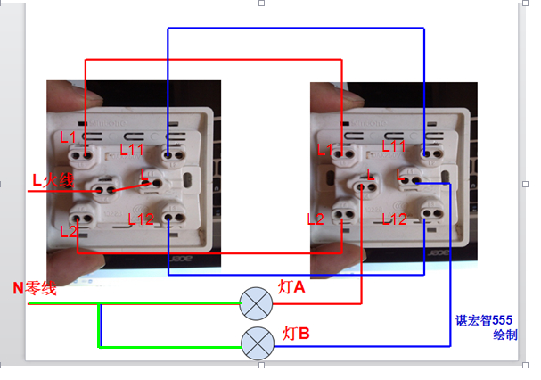
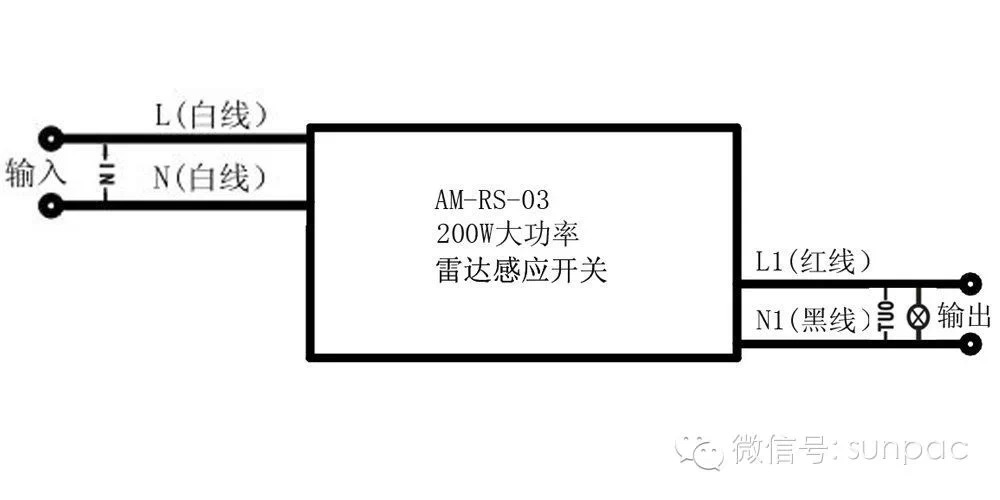
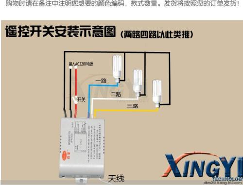

# home lights

## 开、联和控

* `开`，含义同`联`，表示一个面板上共有几个子开关
* `控`，表示控制一个灯，需要几个不同的开关（面板），比如门边开关与床边开关，形成对卧室灯的双控

## 常用标示

* `L`，火线，Live Wire，也有`Phase Wire`的称呼
* `N`，零线，Neutral Wire
    * `Neutral` - 中立的；（化学中）中性的；暗淡的；不带电的；汽车空档也是N
    * `Neural` - 神经的。neural network，神经网络
* `G`，地线，Grounding Wire，或者Earth Wire

## Resources

* <https://tieba.baidu.com/p/3476578889>

## 单开双掷开关

 

## 单开双控
 
> 也叫`单联双控`

 

 

## 双开双控

> 也叫`双联双控`

 

## 其他

### 某吊灯的分段器

 

### 其他

 

 

 

 

 

 

 
