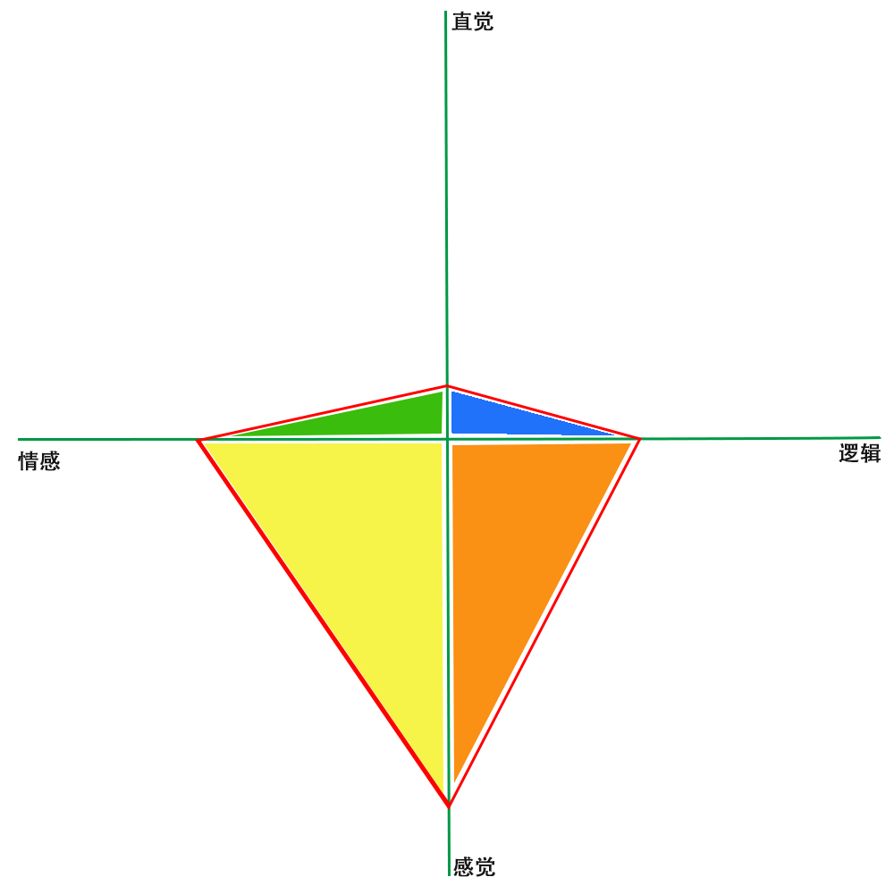

# 偏好测试

> 偏好没有好与坏，对与错。是你的天性使然。

做以下测试前，请你放松，从内心出发，发出最原始、最忠于自己的声音。

不要思考太多，追求完美，用你的第一印象选出你偏好A还是B。

## 1 决策偏好

* A：和谐本身很重要？ B：和谐是达到目的的手段？
* A：因为“感觉对”而采取行动？ B：因为“合乎逻辑”而采取行动？
* A：优先考虑人？ B：优先考虑事？
* A：以保持和谐关系为重？ B：以遵守正确路线为重？
* A：通过达成共识决策？ B：根据自己的想法决策？
* A：首先相信自己的感觉？ B：首先相信自己的理智？
* A：无法忍受冲突对立？ B：能够忍受冲突对立？

## 2 获取信息偏好

* A：依靠个人内在觉知？ B：依靠个人观察？
* A：更多地考虑“可能会是什么”？B：更多地考虑“是什么”？
* A：偏好创造？ B：偏好常识？
* A：依据灵感采取行动？ B：依据谨慎分析采取行动？
* A：喜欢研究概念？ B：喜欢研究事实和数据？
* A: 注重全局观点？ B：注重细节？
* A：喜欢有价值的想法？B：喜欢既定事实？

## 3 测试结果

### 3.1 橙色－执行

* 李建：   1-3A4B 2-2A5B
* 张芳旭： 1-3A4B 2-2A5B

* 牟广峰： 1-2A5B 2-2A5B
* 曲亚童： 1-2A5B 2-2A5B
* 张楠：   1-2A5B 2-2A5B
* 高振泽： 1-2A5B 2-2A5B

### 3.2 黄色－包融

* 贾轩：   1-5A2B 2-2A5B
* 胡大民： 1-4A3B 2-1A6B

### 3.3 绿色－分享

* 翟东方： 1-4A3B 2-4A3B

## 4 一些思考

1. 对角线的蓝色，团队里面没有。是不是因为对角线互斥的原因，管理者不太喜欢招募对角线颜色的同学进入团队？
2. 需要破局的话，需要引入蓝色的力量？
3. 团队中橙色成员的大多数，表明中坚力量还是充足的。

## 5 针对测试结果的个人发展计划

### 5.1 我的颜色标签分布

### 5.2 个人发展计划

修圆的计划

比较缺蓝色和绿色的方面

先发展蓝色方面，再发展绿色方面

创新、创意、蓝图、有远见、果敢、有梦想、有格局、目标
价值观、分享

拥抱变化

1. 制定团队中长期规划，一个月内
2. 拥抱创新，拓展视野，通过学习和交流，持续进行

