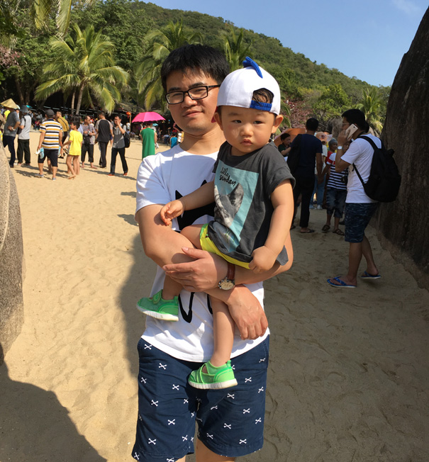

# 胡大民的简历

## 基本信息

> \
**简单，靠谱，相信技术改变生活的力量！**

* **姓名**：胡大民
* **学历**：浙江大学计算机应用硕士
* **手机**：13661172802
* **邮箱**：hdm0571@163.com
* **主页**：<http://258i.com>
* **GITHUB**：<https://github.com/MichaelHu>

## 能力描述

> 1. 具备全栈能力的资深前端研发工程师
> 2. 三年前端技术团队组建和发展经验

* 精通WEB前端开发相关技术：JAVASCRIPT/HTML(5)/CSS(3)
* 对前端产品技术架构有深入研究，在WebApp应用框架方面有丰富的经验
* 对HybridApp开发模式有深入理解和实践，有Bridge JSSDK设计和编写的丰富经验
* 对前端工程化开发过程有较深入研究，参与早期FIS的设计和开发工作，关注FIS等前端工程化集成开发环境的动态
* 熟练掌握PHP、Linux Shell等偏后端技术。有开发和搭建大型WEB Server的经验 
* 有在Linux、OS X平台上进行C、C++开发的经验，对lex/yacc有一些研究
* 接触过iOS开发、短暂接触过javaui的开发和维护

## 工作经历

* 2019.6至今，`绿湾网络科技有限公司`。担任运营中心研发总监。
* 2016.5-2019.5，`小草数语（北京）科技有限公司`。担任前端架构师及前端团队Leader。
* 2015.5-2016.5，`北京嘀嘀无限科技发展有限公司`。担任顺风车事业部前端架构师及前端团队Leader。组建前端团队（11人)，支撑滴滴顺风车所有前端业务，包括WebApp、客户端、运营、拉新、MIS等。关注开发效率和产品质量，带领团队积极进行技术建设，落地多项有影响力的工具平台，包括FIS-DIDI、H5-IDE、CSS动画工具、WebFont动画工具、性能监控平台等。
* 2008.7-2015.5，`百度在线网络技术（北京）有限公司`。担任过百度新闻、hao123、百度图片、百度视频的前端开发工作。近两年回归百度新闻。2012年10月晋升T6（资深研发工程师）

## 主要项目经历和业绩

### 2016.5至今

* 带领团队完成公司核心产品的技术攻坚、研发以及持续迭代，主要包含：
    * 基于关系的大数据可视化系统
    * 基于时空的大数据可视化系统

`主要业绩`：

1. 2016年，带领团队完成公司核心产品智子的技术攻坚、研发及上线，所带领的团队获得`总裁特别奖` - `年度最佳团队`
2. 2017年，带领团队完成多次核心产品智子的功能迭代和新功能研发，获得公司`年度最佳Leader奖`
3. 2018年，带领团队在智慧城市、大规模数据治理等新业务领域进行探索和研究，打造基于时空的大数据可视化系统研究、技术攻坚，再次获得公司`年度最佳Leader奖`
4. 2019年，组建运营中心研发部

### 2015.5-2016.5

* `beat-fis`：基于FIS2开发的满足DIDI顺风车前端的工程化开发集成环境。
* `滴滴出行客户端H5`：设计和开发`JsBridge`，`Monitor`等基础模块。
* `H5-IDE`：带领团队3个月时间完成了满足顺风车快速运营需求的H5快速设计、制作和上线的工具平台。大大节约了工程师人力、显著提升了运营效率。

`主要业绩`：

1. 2015年6月至10月，带领团队完成多次成功的`运营`项目，包括`顺风侠`、`中秋大电影`、`三行诗`等，为顺风车`拉新`提供了坚实的技术保障。
2. 2015年12月上线的`H5编辑器`，从立项到上线历时`4个月`。H5编辑器在主要面向的非技术角色同事中形成`良好口碑`，已经成为部门`明星产品`，多次获得上级`表扬`和其他部门的`关注`。
3. 2015年11月开始带领团队进行顺风车`WebApp`的攻关开发，包括`微信`版本和`支付宝`版本，于12月正式上线。该项目顶住各方面压力，`如期`上线，并且为顺风车带来`非常可观`的日新用户。多次获得部门领导`表扬`和`嘉奖`。团队核心成员荣获2015年度`技术大拿`奖。
4. 2016年3月，`春节跨城`顺风车项目中的出色表现，荣获2016年`一季度``最佳团队奖`。

### 2012-2015.5 

* `无线WebApp产品`：2012-2015.5，搭建百度新闻、百度视频无线WebApp产品基础技术架构。
    开发前端WebApp应用框架Rocket，并持续迭代。Rocket框架对移动WebApp的SPA特性进行了
    抽象和通用业务提取，对WebApp开发流程进行了规范，结合前端工程化开发方法，最终
    形成一套较为完善的移动WebApp开发解决方案。方案在团队协作方面解决了SPA程序的多人
    开发问题，代码架构上提出了MVC分解方法论，形成控制器树，达到复杂逻辑的分而治之、化繁为简，
    部署与性能上使用了代码分拆与缓存技术等。百度新闻WebApp产品JS代码3w+，
    Rocket架构支持该产品多人并行开发，每周多次迭代上线。 
    可以智能手机设备访问<http://m.baidu.com/news>。

* `iPad版百度新闻`：2013年-2015.5。百度新闻iPad版是我作为研发人员，参与交互设计最多的一个产品。该产品大胆采用独具特色的报刊浏览方式，使用各类动画特效，提供给平板用户全新的资讯浏览体验。底层仍使用Rocket框架，JS代码1w+。可以使用iPad设备访问<http://m.baidu.com/news>。

* `百度新闻客户端`：迭代百度新闻客户端正文页，设计和落地第三方正文页接入标准。

### 2012前 

* `百度图片、百度新闻无线架构重构升级`：剖析原javaui架构，设计、开发全新phpui架构，对接无线统一接入wiaui上游，在ui层抽象整合了路由和传参、A/BTest、终端适配、模板选择和缓存、长路径等等功能。

* `百度新闻Reader`：使用百度新闻提供的数据API接口，研发的新闻Reader工具，提供订阅、检索、浏览功能，效果类似Google Reader。

* `Hao123天气预报`：独立设计、开发Hao123天气预报模块。独立负责服务器部署、IP转换模块、天气数据抓取和解析、前端展示和功能模块。

## 个人作品

* Notes2，团队文档平台，自动构建*.md、*.slides文件，提供团队blog功能，全文检索等功能
* Rocket，无线WebApp快速开发框架
* MyNotes，个人笔记管理器，提供批量建库、检索、类VIM操作界面
* PhpUI，简易PHP开发框架
* 基于lex/yacc的markdown C解析器
* fast-slides，使markdown文件生成HTML5幻灯片
* Simple Web Server，运行于Linux和OS X平台的简易Web服务器

