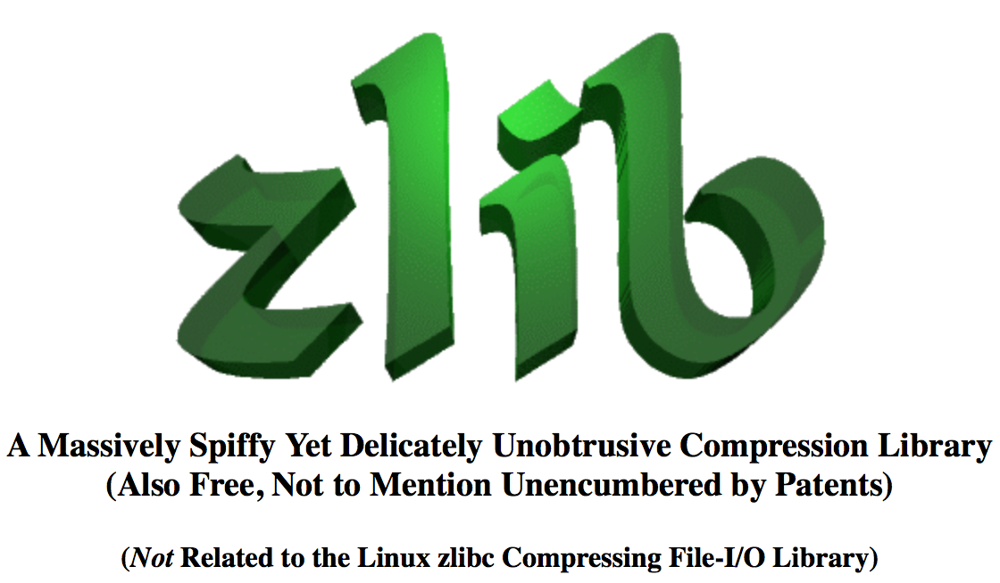

# php的常用基础依赖库

> php源码编译安装时，系统需要提前安装的基础依赖库。实际上这些库还会被很多其他软件使用。通常有：
> zlib, libxml, mcrypt等等

## 关于gnu的anonymous ftp

1. 浏览器访问，地址栏输入<http://ftp.gnu.org>即可访问。里面包含各类由GNU维护的开源软件源代码。

2. 命令行ftp

        ftp -a ftp.gnu.org
        > ls
        > cd gnu

    使用`a`选项开启anonymous模式。

3. 哪些常用开源软件

        autoconf
        autogen
        automake
        bash
        bc
        bison
        emacs
        flex
        gawk
        gcc
        gcl
        gdb
        gdbm
        gengen
        gengetopt
        gettext
        grep
        gzip
        less
        libiconv
        libtool
        m4
        make
        readline
        sed
        tar
        time
        wget
        which

## GNU: libiconv

`官网：`<https://savannah.gnu.org/projects/libiconv/>

持续更新项目地址：

    $ git clone git://git.savannah.gnu.org/libiconv.git

stable release：

    http://ftp.gnu.org/gnu/libiconv/

安装：

    mkdir -p $HOME/softwares/libiconv
    ./configure --prefix=$HOME/softwares/libiconv
    make && make install

参考链接：
* https://github.com/winlibs/libiconv
* https://savannah.gnu.org/projects/libiconv/

## libcurl

`官网：`<http://curl.haxx.se>

安装：

    mkdir -p $HOME/softwares/curl
    ./configure --prefix=$HOME/softwares/curl
    make && make install

## zlib

> This module enables you to read and write `gzip (.gz)` compressed files.

`官网：`<http://www.zlib.net>

如图片所示，zlib不同于linux的zlibc。

截止2015年4月23日，最新版为2013年4月28日的`zlib 1.2.8`

安装：

    mkdir -p $HOME/softwares/zlib
    ./configure --prefix=$HOME/softwares/zlib 2>&1 \
        | tee configure.log
    make && make install

## libxml 

