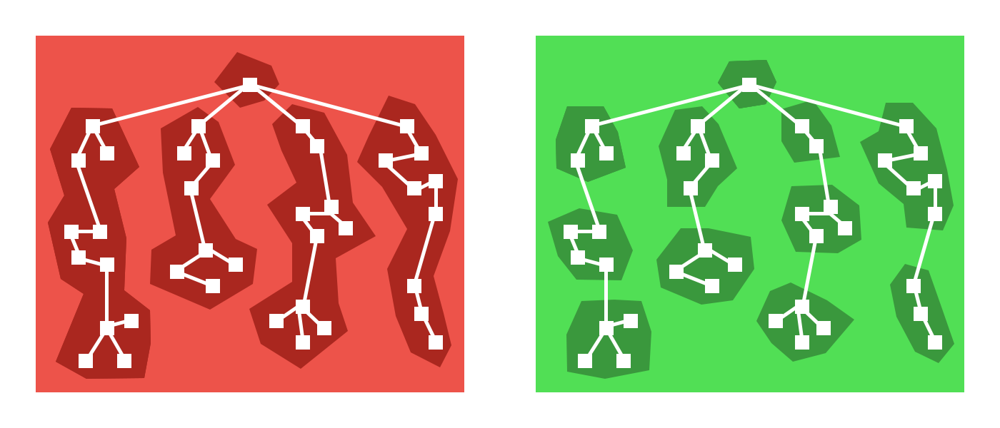

# react-loadable

> A higher order component for loading components with promises.

## Resources

* github: <https://github.com/thejameskyle/react-loadable> <iframe src="http://258i.com/gbtn.html?user=thejameskyle&repo=react-loader&type=star&count=true" frameborder="0" scrolling="0" width="105px" height="20px"></iframe> 
* React Code Splitting: <https://reactjs.org/docs/code-splitting.html>
* React Router Code Splitting: <https://reacttraining.com/react-router/web/guides/code-splitting>
* `bundle-loader`: <https://github.com/webpack-contrib/bundle-loader>，从webpack的`loader角度`解决问题，当然也可以封装成组件，React Router就提供了组件封装方式

## Features

* 使用ES新特性( Stage-3 ): `import( ... ).then( ... )`，`webpack 2+`会针对`import()`语法自动进行代码拆分
* 一种写法，同时支持`客户端渲染`和`服务端渲染`
* 能自动处理`动态加载`的状态，可通过传递options来`自定义`扩展
* 通过`loader`选项，提供`动态加载`方法
* 通过`loading`选项，提供自定义的Loading组件，该组件的`props`能接收到`加载状态`: error, pastDelay, timeOut等
* 能通过设定`delay`选项，避免Loading组件带来的闪烁
* 通过`render`选项，自定义渲染
* 支持`多个动态加载`组件
* 支持`预加载`，使用`preload()`方法

## Installation

    $ npm install --save react-loadable
    $ yarn add react-loadable

## Guide

> Code Splitting

 

> Code Splitting Based-on Components

 

## Usage

支持Loading自定义：

    import Loadable from "react-loadable";
    function Loading(props) {
        if (props.error) {
            return 
Error!
;
        } else if (props.timedOut) {
            return 
Taking a long time...
;
        } else if (props.pastDelay) {
            return 
Loading...
;
        } else {
            return null;
        }
    }

    const LoadableComponent = Loadable({
        loader: () => import("./components/Bar"),
        loading: Loading,
        delay: 300,
        timeout: 10000 // 10 seconds
    });

    export default class App extends React.Component {
        render() {
            return <LoadableComponent />;
        }
    }

`多个动态加载`组件，使用`Loadable.Map()`：

    Loadable.Map({
        loader: {
            Bar: () => import("./Bar"),
            i18n: () => fetch("./i18n/bar.json").then(res => res.json())
        },
        render(loaded, props) {
            let Bar = loaded.Bar.default;
            let i18n = loaded.i18n;
            return <Bar {...props} i18n={i18n} />;
        }
    });

