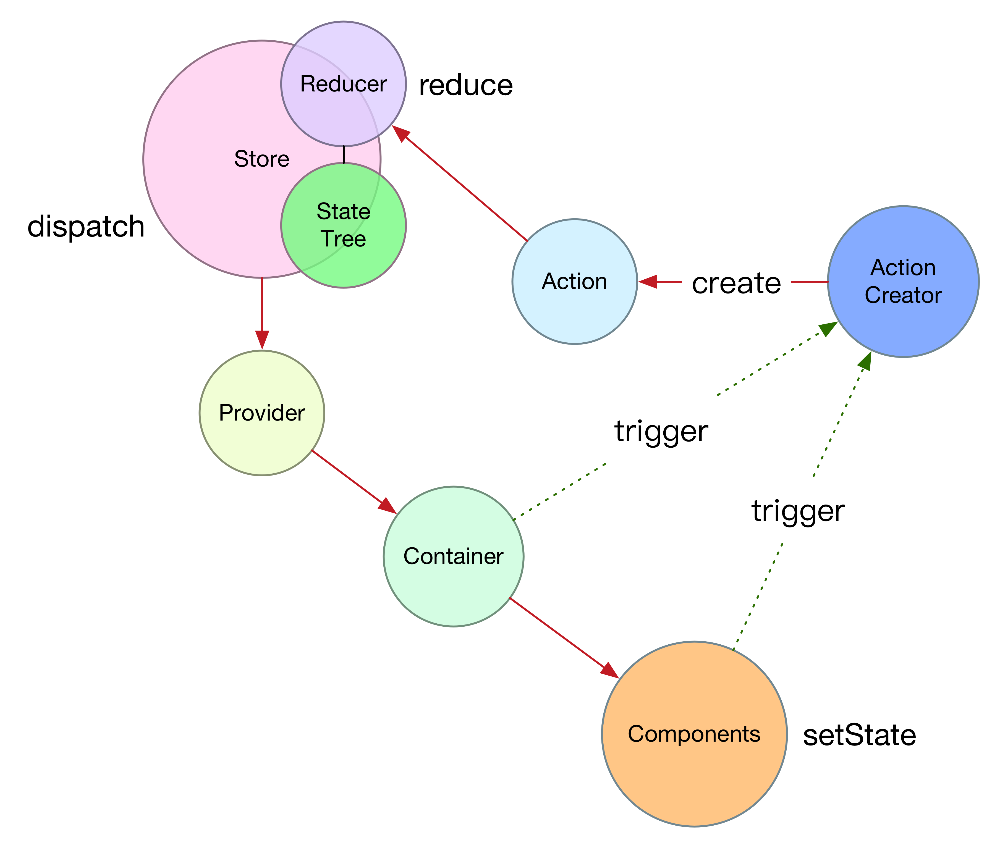

# Redux

> Redux is a predictable state container for JavaScript apps.

2016-12-14
, 2016-05

 
<http://redux.js.org/index.html>

* 可预测的`状态容器`，非常适用于js `SPA`的构建
* 一种设计思想的`彻底、坚定`的实现者
* 大量使用`ES6`的新特性
* 推荐使用`webpack`作为打包工具

## 安装

使用`npm`包管理器，如果不想用，可以从<https://npmcdn.com/redux/>直接下载代码文件。

    npm install --save redux

如果是和`react`配合使用，则还需要安装`react-redux`

    npm install --save react-redux
    

## 三条原则(The Gist)

1. 整个应用`只有`一棵状态树（Store）
2. 状态是`只读（getState()）`的，`唯一`修改`方法`是`派发(dispatch)`actions
3. 改变总是通过`函数`（reducer）来完成，它们接收之前的状态和一个action，计算并返回新的状态

## Actions

> Action需要从`全局`视角来看待

`Actions`：是信息载体，Store的唯一消息来源，通过`store.dispatch()`来发送。它表示某个事件的发生。
Action是一个纯JS对象，`必须`有`type`字段，该字段通常被定义为字符串常量，app的规模较大的情况下，需要将常量放到单独的模块维护，以下从模块中引入常量：
    
    import { ADD_TODO, REMOVE_TODO } from '../actionTypes'

其他字段完全取决于你了。

`Action Creators`:

1. `必须`是`函数`，只返回新的Action
2. 函数中`必须不`直接进行`dispatch`，这不同于Flux

        function addTodo(text) {
          return {
            type: ADD_TODO,
            text
          }
        }
        // 函数外部进行dispatch
        dispatch(addTodo(text));

    Flux是这样的：

        function addTodo(text) {
          const action = {
            type: ADD_TODO,
            text
          };
          dispatch(action);
        }

    作为替代的，可以创建一个绑定的action creator：

        const boundAddTodo = (text) => dispatch(addTodo(text))

    这样，就可以直接调用了：

        boundAddTodo(text);

## Reducers

`Actions`描述了某个事件的发生，但是没有指出应用的`状态`该如何变化。这就是Reducer的工作了。
`Reducer`需要操作应用的状态，开始之前，最好好好思考一下`表示应用`状态`的最小集合是什么`？

`Reducer`处理action的过程为：

    (previousState, action) => newState

之所以叫做reducer，原因是它同

    Array.prototype.reduce(reducer, ?initialValue)

的reducer是同一类型的函数。

确保reducer只做`纯粹的`状态迁移工作，以下事情`不要`在reducer中做：

* 改变其参数
* 处理带副作用的操作，比如API调用，以及路由转化
* [`存疑???`]调用非纯粹函数，比如`Date.now()`或者`Math.random()`

`reducer的分拆与组合`是很重要的构建模式和思想，它通过`分治`的思想达到数据处理逻辑的`模块化分解`。

`状态`表示： 

    {
      visibilityFilter: 'SHOW_ALL',
      todos: [
        {
          text: 'Consider using Redux',
          completed: true,
        },
        {
          text: 'Keep all state in a single tree',
          completed: false
        }
      ]
    }

`未分拆`的情况如下，这个reducer会变得很大，很`冗长`： 

    function todoApp(state = initialState, action) {
      switch (action.type) {
        case SET_VISIBILITY_FILTER:
          return Object.assign({}, state, {
            visibilityFilter: action.filter
          })
        case ADD_TODO:
          return Object.assign({}, state, {
            todos: [
              ...state.todos,
              {
                text: action.text,
                completed: false
              }
            ]
          })
        case COMPLETE_TODO:
          return Object.assign({}, state, {
            todos: state.todos.map((todo, index) => {
              if(index === action.index) {
                return Object.assign({}, todo, {
                  completed: true
                })
              }
              return todo
            })
          })
        default:
          return state
      }
    }

`分拆后`的情况如下，按state的`字段`（分别为visibilityFilter与todos）进行分解，每个字段由单独一个reducer来处理：

    function todos(state = [], action) {
      switch (action.type) {
        case ADD_TODO:
          return [
            ...state,
            {
              text: action.text,
              completed: false
            }
          ]
        case COMPLETE_TODO:
          return state.map((todo, index) => {
            if (index === action.index) {
              return Object.assign({}, todo, {
                completed: true
              })
            }
            return todo
          })
        default:
          return state
      }
    }

    function visibilityFilter(state = SHOW_ALL, action) {
      switch (action.type) {
        case SET_VISIBILITY_FILTER:
          return action.filter
        default:
          return state
      }
    }

    function todoApp(state = {}, action) {
      return {
        visibilityFilter: visibilityFilter(state.visibilityFilter, action),
        todos: todos(state.todos, action)
      }
    }

这样，不同字段的reducer就可以`独立模块`来处理，各个模块分而治之。但是对state的处理还是一个`完整`的过程，需要有一个`合并`逻辑，对于以上例子来说，就是以下这步：

    function todoApp(state = {}, action) {
      return {
        visibilityFilter: visibilityFilter(state.visibilityFilter, action),
        todos: todos(state.todos, action)
      }
    }

Redux提供了一个`combineReducers`的方法，以上步骤可以写成：

    const todoApp = combineReducers({
        visibilityFilter,
        todos
    });

可将所有`一级reducer`分拆到`./reducers`目录下的单独模块（文件）中，然后通过以下代码进行合并：

    import { combineReducers } from 'redux';
    import * as reducers from './reducers';

    const todoApp = combineReducers(reducers);

这样就形成了`顶级reducer`。顶级reducer返回`整个`应用的`状态树`。

## Store

目前为止，`Actions`表示发生了什么事情，`Reducers`根据发生的事情更新状态。
那么`Store`就是将Actions与Reducers联合起来的`桥梁`。

`Store`有以下的职责：

* 持有应用的`状态`
* 提供`getState()`获取状态
* 提供`dispatch(action)`更新状态
* 通过`subscribe(listener)`注册监听器
* 通过`subscribe(listener)`的`返回值`用于解绑监听器

有了`顶级Reducer`以后，创建Store就很简单了：

    import { createStore } from 'redux';
    import todoApp from './reducers';
    let store = createStore(todoApp);

`createStore`的第二个参数可选接收初始状态。比如：

    let store = createStore(todoApp, window.STATE_FROM_SERVER);

创建完Store以后，就可以在没有任何UI逻辑的情况下，联调应用逻辑更新了：

    import { createStore } from 'redux';
    import todoApp from './reducers';
    import { addTodo, completeTodo, setVisibilityFilter, VisibilityFilters } from './actions'

    let store = createStore(todoApp);

    // Log the initial state
    console.log(store.getState())

    // Every time the state changes, log it
    // Note that subscribe() returns a function for unregistering the listener
    let unsubscribe = store.subscribe(() =>
      console.log(store.getState())
    )

    // Dispatch some actions
    store.dispatch(addTodo('Learn about actions'))
    store.dispatch(addTodo('Learn about reducers'))
    store.dispatch(addTodo('Learn about store'))
    store.dispatch(completeTodo(0))
    store.dispatch(completeTodo(1))
    store.dispatch(setVisibilityFilter(VisibilityFilters.SHOW_COMPLETED))

    // Stop listening to state updates
    unsubscribe()

## Data Flow

> `Strict Unidirectional Data Flow`，严格的`单向`数据流

1. 发生一个action
2. `store.dispatch(action)`
3. `store`调用`reducer`执行，从`顶级reducer`开始，`逐级`往下调用
4. 最终顶级reducer会将多个下级reducer的结果`整合`成`一棵`状态树
5. store保存新的状态树，这时`监听器`将被执行，监听器可能会调用`store.getState()`获取当前状态，UI也可能更新以匹配新的状态，如果绑定了`React`的`组件`，那么可能会有调用：`component.setState(newState)`

## containers & components

### 两者区别

`container`是Redux与React的`桥梁`，通过`container`将`store`传递给React的`component`。

`container`本身也是一个React Component，你也可以自己实现，但它作为桥梁，有很多`细节上`的`复杂实现`，通常用Redux`自动生成`，使用`connect()`方法来完成。

`container`与`components`的区别：

1. `components`: `表现型`组件，`目的`是处理`长成啥样`（标签、样式等），对Redux`无感知`，从props获取数据；`手工`编写

2. `containers`: `容器型`组件，目的是处理`如何运转`（数据获取、状态更新），对Redux`有感知`，订阅Redux的状态并通过props传给components；Redux`自动`生成

### 创建container

使用`connect()`，需要定义`两个`特殊函数：

* `mapStateToProps()`：提供如何将redux store的状态转化成将要传递给表现型components的props的方式

        const mapStateToProps = (state) => {
            return {
                todos: getVisibleTodos(state.todos, state.visibilityFilter)
            }
        };

* `mapDispatchToProps()`：提供如何将dispatch封装到回调函数中，并通过props注入到表现型components的props中

        const mapDispatchToProps = (dispatch) => {
            return {
                onTodoClick: (id) => {
                    dispatch(toggleTodo(id));
                }
            };
        };

最终使用`react-redux`提供的`connect`函数，完成container的创建：

    import { connect } from 'react-redux'

    const VisibleTodoList = connect(
        mapStateToProps
        , mapDispatchToProps
    )(TodoList)

    export default VisibleTodoList

### Store的传递

前面说过`container`作为`桥梁`将store传递给components，那么container又是`如何自动`获取到store的呢？

`Store`的`传递`：所有的container都需要使用store，这样它们才能订阅它。

这是通过`<Provider>`来完成的，通过为Provider设置`store`属性，可以让所有的container都能使用store。

    import React from 'react'
    import { render } from 'react-dom'
    import { Provider } from 'react-redux'
    import { createStore } from 'redux'
    import todoApp from './reducers'
    import App from './components/App'

    let store = createStore(todoApp)

    render(
      <Provider store={store}>
        <App />
      </Provider>,
      document.getElementById('root')
    )

`底层机制`就是React的`context`机制。<https://facebook.github.io/react/docs/context.html>

## Redux架构思想

* 规则：数据流规则
* 模型：概念化，深度描述清楚
* 分治

另外一个感受是，Redux在`解耦`和`封装`上，做得非常彻底，彻底的程度甚至令人难以理解。从这个角度来说，其理解起来还是有一定难度的。

## APIs

`Redux`提供`5个`主要API：<http://redux.js.org/docs/api/index.html>

`react-redux`提供`2个`主要API：分别是`Provider`和`connect`

### createStore()

    createStore(reducer, [initialState], [enhancer])

创建保存整个APP状态树的存储。只有一个。返回`Store`对象。

enhancer可以是一个函数对象，称为`Store增强器`。可选参数。Redux内建支持的增强器是`applyMiddleware()`

### Store

见前文。

### combineReducers()

    combineReducers(reducers)

将一个包含多个`子reducer`的对象转换成一个可以传给createStore的`reducing`函数。

尽量使用该函数来组装`root reducer`，以使用对子reducer的验证。
任何传递给combineReducers的reducer，都必须满足以下规则：

1. 对`未识别`的action，必须返回作为第一个参数传进去的state对象
2. 不能返回`undefined`。这是比较容易犯的错误。当然使用combineReducers能识别这种类型的错误
3. 若输入的state是`undefined`，必须返回该特定reducer的`初始`状态

### applyMiddleware()

`middleware`是`推荐`的扩展Redux的方式。middleware使你可以`封装`store的`dispatch`，用于有趣或有用的事。

`可组合性`是middleware的`关键`特性。多个middleware可以组合到一起，而任何一个被组合的middleware`不知道`（不关注）其`上游`或者`下游`的middleware的信息。

    applyMiddleware(...middlewares)

> 消化好`js运行在其所定义的上下文`，有助于理解middleware。

middlewares符合以下格式：

    ({ getState, dispatch }) => next => action

最常用的情景是支持`异步action`。`redux-thunk`和`redux-promise`都是常见的例子。

    import { createStore, applyMiddleware } from 'redux'
    import todos from './reducers'

    function logger({ getState }) {
      return (next) => (action) => {
        console.log('will dispatch', action)
        let returnValue = next(action)
        console.log('state after dispatch', getState())
        return returnValue
      }
    }

    let store = createStore(
      todos,
      [ 'Use Redux' ],
      applyMiddleware(logger)
    )

    store.dispatch({
      type: 'ADD_TODO',
      text: 'Understand the middleware'
    })

具体例子可查看：<a href="./redux-workshop.md.preview.html">applyMiddleware</a>

### bindActionCreators()

    bindActionCreators(actionCreators, dispatch)

将`Action Creators`通过`props`下传到对Redux`无感知`的Component中。其工作机制为将一个包含Action Creators的对象，转换成一个新的`key相同`的对象，只不过每个Action Creators被封装到了`dispatch`的调用中，使得它们可以`直接`调用。

举例说明：

`TodoActionCreators.js`

    export function addTodo(text) {
      return {
        type: 'ADD_TODO',
        text
      }
    }

    export function removeTodo(id) {
      return {
        type: 'REMOVE_TODO',
        id
      }
    }
    

`SomeComponent.js`

    import { Component } from 'react'
    import { bindActionCreators } from 'redux'
    import { connect } from 'react-redux'

    import * as TodoActionCreators from './TodoActionCreators'

    class TodoListContainer extends Component {
      componentDidMount() {
        // Injected by react-redux:
        let { dispatch } = this.props

        // Note: this won’t work:
        // TodoActionCreators.addTodo('Use Redux')

        // You’re just calling a function that creates an action.
        // You must dispatch the action, too!

        // This will work:
        // let action = TodoActionCreators.addTodo('Use Redux')
        // dispatch(action)
      }

      render() {
        // Injected by react-redux:
        let { todos, dispatch } = this.props

        // Here’s a good use case for bindActionCreators:
        // You want a child component to be completely unaware of Redux.

        let boundActionCreators = bindActionCreators(TodoActionCreators, dispatch)

        return (
          <TodoList todos={todos}
                    {...boundActionCreators} />
        )

        // An alternative to bindActionCreators is to pass
        // just the dispatch function down, but then your child component
        // needs to import action creators and know about them.

        // return <TodoList todos={todos} dispatch={dispatch} />
      }
    }

    export default connect(
      state => ({ todos: state.todos })
    )(TodoListContainer)
    

### compose()

### connect()

来自`react-redux`：
    
    connect(mapStateToProps, mapDispatchToProps, mergeProps, options = {})

返回值：

    function wrapWithConnect(WrappedComponent)

### Provider

<https://github.com/reactjs/react-redux/blob/master/src/components/Provider.js>

    export default class Provider extends Component {
      getChildContext() {
        return { store: this.store }
      }

      constructor(props, context) {
        super(props, context)
        this.store = props.store
      }

      render() {
        return Children.only(this.props.children)
      }
    }

## 异步action

## middlewares

<http://redux.js.org/docs/advanced/Middleware.html>

Redux的middleware与`Express`或`Koa`的middleware是类似的，只不过解决不同的问题。
它在`派发一个action`和`action到达reducer`两个时间点`之间`为第三方插件提供介入的方式。

> `简单`的说，middleware`扩展`了`dispatch()`的实现，让它可以处理`更多`类型的action。

通常`日志`、`奔溃报告`、`异步API`请求、`路由`等会用middleware来实现。

### 实现思路

先重温一下middleware的`signature`，`next`是一个封装的dispatch：

    ({ getState, dispatch }) => next => action 

以下用`简单`方式展示了Redux的`applyMiddleware`的实现思想：

    // Warning: Naïve implementation!
    // That's *not* Redux API.

    function applyMiddleware(store, middlewares) {
      middlewares = middlewares.slice()
      middlewares.reverse()

      let dispatch = store.dispatch
      middlewares.forEach(middleware =>
        dispatch = middleware(store)(dispatch)
      )

      return Object.assign({}, store, { dispatch })
    }

1. 封装了`store.dispatch()`，最终返回结果包含了被`多次封装`后的`dispatch`
2. 以上实现并不是Redux API的实现，Redux的实现更复杂和谨慎，特别针对`异步action`做了特殊处理。

### 两个简单例子

以下为`两个`标准的redux middleware的实现：

第一个例子`logger`，通过该middleware，扩展了dispatch，能对`action`的`派发`过程进行日志记录。

    /**
     * Logs all actions and states after they are dispatched.
     */
    const logger = store => next => action => {
      console.group(action.type)
      console.info('dispatching', action)
      let result = next(action)
      console.log('next state', store.getState())
      console.groupEnd(action.type)
      return result
    }

第二个例子`crashReporter`，通过该middleware，扩展了dispatch，能对`action`派发过程中的错误进行跟踪。

    /**
     * Sends crash reports as state is updated and listeners are notified.
     */
    const crashReporter = store => next => action => {
      try {
        return next(action)
      } catch (err) {
        console.error('Caught an exception!', err)
        Raven.captureException(err, {
          extra: {
            action,
            state: store.getState()
          }
        })
        throw err
      }
    }

1. `ES6`的`箭头操作符`能大大减少函数嵌套层次，很多情况下只需关注`最里层`函数体的实现
2. 实现最里层函数体就是在`return next(action)`的基础上加上其他特殊处理逻辑
3. middleware是一个`符合`特定接口的`函数`，接收`store`为其`参数`，`返回值`为一个封装后的`dispatch()`
4. `[重要]`实现一个middleware时，`store`和`next`（封装的dispatch）总是`直接`可用，middleware机制会为你准备好

### 延迟执行例子

`timeoutScheduler` middleware，通过中间件`扩展`来支持`延迟`执行`action`。可以处理`{meta:{ delay: xxx }}`形式的action。

`应用`：`dispatch`的调用者`确切`知道返回值是一个函数，该函数可以用于取消延时。
也就是说特定middleware是需要特定`调用者`的`配合`的。

    /**
     * Schedules actions with { meta: { delay: N } } to be delayed by N milliseconds.
     * Makes `dispatch` return a function to cancel the timeout in this case.
     */
    const timeoutScheduler = store => next => action => {
      if (!action.meta || !action.meta.delay) {
        return next(action)
      }

      let timeoutId = setTimeout(
        () => next(action),
        action.meta.delay
      )

      return function cancel() {
        clearTimeout(timeoutId)
      }
    }

### 关键帧执行的例子 

`refScheduler` middleware，通过该middleware`扩展`来支持`关键帧`执行`action`。可以处理`{meta:{ ref: true }}`形式的action。

    /**
     * Schedules actions with { meta: { raf: true } } to be dispatched inside a rAF loop
     * frame.  Makes `dispatch` return a function to remove the action from the queue in
     * this case.
     */
    const rafScheduler = store => next => {
      let queuedActions = []
      let frame = null

      function loop() {
        frame = null
        try {
          if (queuedActions.length) {
            next(queuedActions.shift())
          }
        } finally {
          maybeRaf()
        }
      }

      function maybeRaf() {
        if (queuedActions.length && !frame) {
          frame = requestAnimationFrame(loop)
        }
      }

      return action => {
        if (!action.meta || !action.meta.raf) {
          return next(action)
        }

        queuedActions.push(action)
        maybeRaf()

        return function cancel() {
          queuedActions = queuedActions.filter(a => a !== action)
        }
      }
    }

### Promise action

扩展支持`promise`类型的action。

    /**
     * Lets you dispatch promises in addition to actions.
     * If the promise is resolved, its result will be dispatched as an action.
     * The promise is returned from `dispatch` so the caller may handle rejection.
     */
    const vanillaPromise = store => next => action => {
      if (typeof action.then !== 'function') {
        return next(action)
      }

      return Promise.resolve(action).then(store.dispatch)
    }

### Function action 

扩展支持`function`类型的action。正是`redux-thunk`的实现方式。

    /**
     * Lets you dispatch a function instead of an action.
     * This function will receive `dispatch` and `getState` as arguments.
     *
     * Useful for early exits (conditions over `getState()`), as well
     * as for async control flow (it can `dispatch()` something else).
     *
     * `dispatch` will return the return value of the dispatched function.
     */
    const thunk = store => next => action =>
      typeof action === 'function' ?
        action(store.dispatch, store.getState) :
        next(action)

> `[重要]`实现一个middleware时，`store`和`next`（封装的dispatch）总是`直接`可用，middleware机制会为你准备好

## Test

* Mocha推荐
* Jest

### npm istall:

    npm install --save-dev mocha 
    npm install --save-dev babel-register

### .babelrc:

    {
        "presets": ["es2015"]
    }

### package.json:

    {
      ...
      "scripts": {
        ...
        "test": "mocha --compilers js:babel-register --recursive",
        "test:watch": "npm test -- --watch",
      },
      ...
    }

and `run npm test` to run it once, or `npm run test:watch` to test on every file change.

