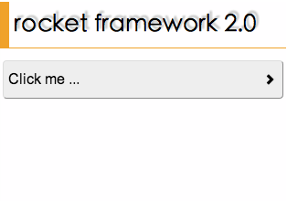
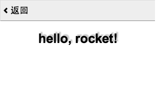

# 创建并开发一个WEBAPP应用－HelloRocket

% 创建并开发一个WEBAPP应用－HelloRocket
% hdm258i@gmail.com
% 2013-05-06
% workshop, webapp框架

本文介绍如何基于rocket框架，全新开发一个webapp。通过本文的学习，你将了解到：

1. 开发webapp是有章可循的，速度也可以很快 
2. 薄实现的公共层，以及框架预置的配置项
3. 简单页面开发，视图控制器树的构建
4. 多人一起开发一个webapp，开发工作完全独立，但最终无缝整合，这就是`规范的力量`

## 准备工作

这一部分为webapp开发提供环境和框架代码。`checkpoint`: 能正常展现hellorocket demo成品

* 1.1 FIS环境：1.3.6+，安装目录记为`FIS_DIR`，开发工作目录记为`DEVELOP_DIR`
@tip: 1.3.9目前存在问题，尚未解决

* 1.2 common模块: 包含rocket框架代码

        cd DEVELOP_DIR
        svn co "http://tc-apptest-img08.vm.baidu.com:8021/svn/repos/projects/rocket_workshop/common"

* 1.3 hellorocket模块，包含简单demo，用于验证环境和框架代码的有效性

        cd DEVELOP_DIR
        svn co "http://tc-apptest-img08.vm.baidu.com:8021/svn/repos/projects/rocket_workshop/hellorocket"

* 1.4 运行fis，查看hellorocket效果

    1. 运行fis

            cd FIS_DIR
            sh start.sh # linux/mac
            start.bat # windows 

    2. 访问http://localhost[:port]，配置rocket_workshop为开发目录，并切换模块到hellorocket
    3. 访问http://localhost[:port]/hellorocket/hellorocket.html

建议使用Chrome浏览器，打开开发工具，左右布局，拖动窗口为手机屏幕大小，效果更佳。验证hellorocket webapp是否正常运转，截图如下:

如果运气稍微差点，没有出来预期效果，还请从1.1到1.4再check一下。完成这一步，我们的准备工作就完成了。下面我们将在这个环境上全新开发一个示例中的webapp：HelloRocket。

## 公共部分开发

框架倡导薄实现公共层，辅以配置项等功能，使公共层尽可能稳定，一次开发，后续基本不需要修改。所以薄公共层提前确定下来，是并行开发的基础。这一步可以多人讨论，一人操作。`checkpoint`: 能展现各个pageview的"`Hello, I am page PAGENAME`"

### 开始之前，先一起讨论以下问题的答案

1. webapp名称？它将被用于fis模块
2. webapp包含几个页面，名称、访问方式分别是什么？它们将被用于路由协议和处理函数编写
3. 这些页面之间如何进行切换？simple, slide, fade or dropdown，按需选择

### 一起讨论确定如下答案 

* 1. webapp名称为hellorocket
* 2. 页面名称、访问方式等如下所示，其中`入口页（entrypage）`名称为index：
        名称            访问方式
        index           # or #index
        sayhello        #sayhello
* 3. 页面间切换方式如下所示
        index->sayhello: slide left
        sayhello->index: slide right

### 完成公共部分编码

完成以上问题的解答之后，我们开始公共部分编码，由`一个同学完成`即可。由于一开始就已经将成品代码放出，而我们的目标是从零开始，所以可以放心的在键盘上敲下:
    cd DEVELOP_DIR
    rm -rf hellorocket

#### 基础代码和入口页原型

* 2.3.1.1 获取webapp脚手架代码，checkout到hellorocket目录，也即hellorocket模块：
        cd DEVELOP_DIR
        svn co "http://tc-apptest-img08.vm.baidu.com:8021/svn/repos/projects/rocket_workshop/scaffold" hellorocket

* 2.3.1.2 验证脚手架代码
        1. FIS模块切换（界面右上角）：切换至hellorocket模块
        2. 访问http://localhost[:port]/hellorocket/WEBAPPNAME.html，展示"`Hello, I am page PAGENAME`"，控制台无报错

* 2.3.1.3 在hellorocket目录下做以下全局替换

    1. 所有文件名（包含目录）中包含的WEBAPPNAME替换为hellorocket

            ./css/WEBAPPNAME.css
            ./data/WEBAPPNAME.json
            ./js/rocket.router.WEBAPPNAME.js
            ./WEBAPPNAME.html

    2. 所有文件中包含的WEBAPPNAME替换为hellorocket，全局替换即可

    3. 所有文件名（包含目录）中包含的PAGENAME替换为index
            ./page/PAGENAME/css/PAGENAME.css
            ./page/PAGENAME/html/PAGENAME.html
            ./page/PAGENAME/js/view/rocket.pageview.PAGENAME.js
            ./page/PAGENAME/tpl/PAGENAME.tpl.html

    4. 所有文件中包含的PAGENAME替换为index（入口页），全局替换即可

以上替换可能有点麻烦，FIS新版本会支持。

* 2.3.1.4 验证入口页
    1. 清空缓存（很有必要）
    2. 访问http://localhost[:port]/hellorocket/hellorocket.html，展示"`Hello, I am page index`"，控制台无报错

至此，已经完成hellorocket webapp的基础代码，外加入口页index的原型代码，接下来，我们生成另外一个页面sayhello的原型代码。

#### sayhello页面原型

* 2.3.2.1 获取webapp page之脚手架代码，checkout到hellorocket/page/下的sayhello目录，也即sayhello页面的目录树
        cd DEVELOP_DIR/hellorocket/page
        svn co "http://tc-apptest-img08.vm.baidu.com:8021/svn/repos/projects/rocket_workshop/scaffold/page/PAGENAME" sayhello

* 2.3.2.2 做两个全局替换

        1. 所有文件名（包含目录）中包含的PAGENAME替换为sayhello
        2. 所有文件中包含的PAGENAME替换为sayhello

这时，访问http://localhost\[:port]/hellorocket/hellorocket.html#sayhello，sayhello页面是不会展现出来的，`原因是没有包含sayhello页面的路由、页面框架和模板、CSS文件等内容`。

* 2.3.2.3 增加sayhello路由、页面框架和模板、CSS文件

`sayhello路由`，在文件DEVELOP_DIR/hellorocket/js/rocket.router.hellorocket.js中的routes、pageOrder、pageTransition、route handlers部分，添加以后，大致如下所示：

    routes: {
        '': 'index'
        ,'index/:title': 'index'
        ,'sayhello': 'sayhello'
    }
    ...
    ,pageOrder: [
        'index'
        , 'sayhello'
    ]  
    ...
    ,pageTransition: {
        'index-sayhello': 'slide' 
    }   
    ...
    ,sayhello: function() {
        this.doAction('sayhello', {});
    }    

`页面框架和模板`，在文件DEVELOP_DIR/hellorocket/hellorocket.html中的<!--page view-->和<!--front template-->位置下方，分别添加页面框架和模板代码，添加以后，大致如下所示：

    <!--page view-->
    /*{fis-inline file="./page/index/html/index.html"}*/ 
    /*{fis-inline file="./page/sayhello/html/sayhello.html"}*/ 

    ...

    <!--front template-->
    /*{fis-inline file="./page/index/tpl/index.tpl.html"}*/ 
    /*{fis-inline file="./page/sayhello/tpl/sayhello.tpl.html"}*/ 

`CSS文件`，在文件DEVELOP_DIR/hellorocket/css/rocket.css中的/*page*/位置下方，添加CSS import代码，添加以后，大致如下图所示：

    /*page*/                       
    @import url("../page/index/css/index.css")
    @import url("../page/sayhello/css/sayhello.css")

* 2.3.2.4 至此，完成sayhello页面的原型代码添加，可以验证sayhello页的正确性了：
    1. 清空缓存（如有必要）
    2. 访问http://localhost[:port]/hellorocket/hellorocket.html#sayhello, 出现`I am page sayhello`"，控制台无报错

此时，直接修改url，将sayhello改成index，将会右滑展现首页。

#### 其他页面原型

如还有其他页面，依葫芦画瓢，按照slide页面的方式进行添加并验证。至此，已经完成公共部分的编码，剩余部分的工作将可由多人并行开发。

### 小结

至此，hellorocket webapp的框框已经搭建起来，我们回顾一下：
1. 使用FIS webapp业务模型，能方便进行代码整合与预览调试
2. common模块是rocket框架的通用代码，每个webapp引入之，但切忌不要随意修改之，特别是核心类。当然配置文件是可以修改的
3. 使用脚手架迅速创建一个webapp的原型，包括薄实现的公共部分与页面部分
4. 通过配置项可以很容易的修改webapp的行为，比如页面切换效果，可以试着将
        ,pageTransition: {
            'index-sayhello': 'slide' 
        }   
改成
        ,pageTransition: {
            'index-sayhello': 'fade' 
        }   
试试，还有dropdown。当然还有今后你按接口来扩展的新的动画效果。

后续的工作集中在页面开发中，我们希望页面的开发是并行的，负责人可以将以上代码提交到svn了。下面进入并行的页面开发：

## 并行部分开发

到这一阶段以后，后续的开发工作就可以多人并行开发、代码提交和自测了，并行开发的每个开发者的开发行为都限制在互相独立的目录中，最重要的是开发同学需要注意规范，循序渐进完成全部页面功能的开发，千万不要提交有报错的代码，以免影响其他同学的开发。`checkpoint`: 完成各自负责的page，展现和功能均正常。

刚开始页面开发，是基于简单页面原型的，按以下步骤进行：
1. 开发和调试页面DOM结构和样式
2. 数据开发，创建对应的model或者collection
3. 前端模板（视图层）开发
4. 控制器与交互功能开发（各类pageview、subview等视图控制器）

DEMO有两个页面，我们可以安排两位同学（A和B）并行开发。继续之前，有必要的话，分别checkout出第二部分的通用代码。

### index页面开发（同学A） 

#### 页面DOM结构和样式

页面DOM结构和样式分别在page/index/html和page/index/css目录下，在这两个文件中修改，并通过浏览器调试效果。如果查看时发现改动并未生效，那是因为没有`清空FIS缓存`。通过不断修改和预览，最终使页面样式效果符合要求。完成后的代码如下所示：

* 页面DOM结构文件：index/html/index.html

        

            
rocket framework 2.0

            

                <a href="javascript:void(0)">Click me ... </a>
            

        

* 页面样式文件：index/css/index.css

        /*页面视图id，与action同名，以_page为后缀*/
        #index_page{
            /*默认不展示*/
            display:none;

            /*绝对定位*/
            position:absolute;

            /*撑满整个父容器*/
            top:0;
            left:0;
            right:0;
            bottom:0;

            /*最低高度，确保即使没内容，loading也可以展示，同时能遮住下方内容*/
            min-height:600px;

            /*阻止文本选中*/
            -webkit-user-select:none;
            -moz-user-select:none;
        }

        #index_page_header{
            border-left:10px solid #F0A22A;
            border-bottom:1px solid #F0A22A;
            padding:5px;
            font:bold 26px/40px normal;
            text-shadow:rgba(64, 64, 64, 0.3) 3px -3px 2px;
        }

        #index_page_content{
            /*作为绝对定位的loading样式的容器，需要使用relative定位*/
            position:relative;
            padding-top:10px;
        }

        #index_page_content a{
            display:block;
            position:relative;
            margin:3px 3px 0;
            padding-left:5px;
            background:#eee;
            border:1px outset #ddd;
            border-radius:4px;
            font:normal 16px/40px Arial;
            color:#000;
            text-decoration:none;
        }

        #index_page_content a span{
            display:inline-block;
            position:absolute;
            right:5px;
            top:50%;
            margin-top:-9px;
            background-image:url("../../../img/icons-36-black.png");
            background-position:-108px 50%;
            background-size:776px 18px;
            width:18px;
            height:18px;
        }

        #index_page_content *{
            -webkit-transform:translateZ(0);
        }

#### 数据开发

简单页面，没有后端数据服务，略。

#### 前端模板（视图层）开发

简单页面，不需前端模版，略。

#### 控制器与交互功能开发

控制器负责将模型和视图关联起来，并处理页面交互功能逻辑。视图控制器树如下设计：

    rocket.pageview.index
        rocket.subview.index_content
        rocket.subview.index_header

对应的页面DOM节点为：

    #index_page
        #index_page_header
        #index_page_content

* pageview.index为页面控制器，对应页面框架#index_page，同时是页面事件中心
* subview.index_content与subview.index_header为子视图控制器，分别负责容器#index_page_content与头部#index_page_header的控制逻辑

pageview相对简单，主要功能是创建一级子视图控制器。只需实现init方法，完成后代码如下所示：

* 代码文件index/js/view/rocket.pageview.index.js ：

        (function($){

        rocket.pageview.index = rocket.pageview.extend({

            el: '#index_page'

            ,init: function(options){
                var me = this;

                me.setup(new rocket.subview.index_header(
                    $.extend({}, options)
                    ,me
                ));

                me.setup(new rocket.subview.index_content(
                    $.extend({}, options)
                    ,me
                ));

            }

        });

        })(Zepto);

subview.index_content，负责内容区渲染以及用户点击事件的响应，对应文件和代码如下：

* 代码文件index/js/view/rocket.subview.index_content.js：

        (function($){

        rocket.subview.index_content = rocket.subview.extend({

            el: '#index_page_content'

            ,events: {
                'click a': 'onclick'
            }

            ,init: function(options){
                var me = this;

                me.showLoading(me.$el);
                me.render();
            }

            // @note: 若不涉及回收，可以不提供unregisterEvents
            ,registerEvents: function(){
                var me = this, ec = me.ec;

                ec.on("pagebeforechange", me.onpagebeforechange, me);
            }

            ,render: function(sections){
                var me = this;
                // todo
                me.hideLoading(-1);
            }

            ,onclick: function(e){
                this.navigate('#sayhello'); 
            }

            ,onpagebeforechange: function(params){
                var me = this, 
                    from = params.from,
                    to = params.to,
                    param = params.params;

                if(to == me.ec) {
                    me.$el.show();
                    // todo
                }
            }

        });

        })(Zepto);

`subview.index_header`负责头部的控制逻辑，代码如下：

* 代码文件index/js/view/rocket.subview.index_header.js：

        (function($){

        rocket.subview.index_header = rocket.subview.extend({

            el: '#index_page_header'

            ,init: function(options){
                var me = this;
                // todo
            }

            // @note: 若不涉及回收，可以不提供unregisterEvents
            ,registerEvents: function(){
                var me = this, ec = me.ec;

                ec.on("pagebeforechange", me.onpagebeforechange, me);
            }

            ,render: function(sections){
                var me = this;
                // todo
            }

            ,onpagebeforechange: function(params){
                var me = this, 
                    from = params.from,
                    to = params.to,
                    param = params.params;

                if(to == me.ec) {
                    me.$el.show();
                    // todo
                }
            }

        });

        })(Zepto);

#### index页面开发小结

至此，index页面已经开发完成，可以输入URL预览一下效果了：

    http://localhost[:port]/hellorocket/hellorocket.html#index
    或直接输入
    http://localhost[:port]/hellorocket/hellorocket.html

幸运的话，能看到和第一部分首页快照相同的页面，否则，得辛苦一下从3.1.1到3.1.4check一遍

符合预期效果的话，index页面就已经开发完了，只要没有代码报错，就可以放心checkin了。

细心的你会发现，subview.index_header貌似是多余的，因为该部分没有实现任何复杂逻辑，实际上也是这样。不过之所以仍然给出，是为方便后续增加新功能提供基础的，都到这一步了，你不想自己试着往里面增加点新内容么。

### sayhello页面开发（同学B）

#### 页面DOM结构和样式

页面DOM结构和样式分别在page/sayhello/html和page/sayhello/css目录下，在这两个文件中修改，并通过浏览器调试效果。如果查看时发现改动并未生效，那是因为没有`清空FIS缓存`。通过不断修改和预览，最终使页面样式效果符合要求。完成后的代码如下所示：

* 页面DOM结构文件：sayhello/html/sayhello.html

        

            

                返回                
            

            

                <h2>hello, rocket!</h2>
            

        

* 页面样式文件：sayhello/css/sayhello.css

        /*页面视图id，与action同名，以_page为后缀*/
        #sayhello_page{
            /*默认不展示*/
            display:none;

            /*绝对定位*/
            position:absolute;

            /*撑满整个父容器*/
            top:0;
            left:0;
            right:0;
            bottom:0;

            /*最低高度，确保即使没内容，loading也可以展示，同时能遮住下方内容*/
            min-height:600px;

            /*阻止文本选中*/
            -webkit-user-select:none;
            -moz-user-select:none;
        }

        #sayhello_page_header{
            height:40px;
            text-align:center;
            background:#eee;
            font:bold 18px/40px normal;
            border:1px outset #ddd;
        }

        .sayhello-page-header-backbtn{
            position:relative;
            float:left;
            display:inline-block;
            padding-left:20px;
        }

        .sayhello-page-header-backbtn span{
            position:absolute;
            display:inline-block;
            left:0;
            top:50%;
            margin-top:-9px;
            background-image:url("../../../img/icons-36-black.png");
            background-position:-142px 50%;
            background-size:776px 18px;
            width:18px;
            height:18px;
        }

        #sayhello_page_content{
            /*作为绝对定位的loading样式的容器，需要使用relative定位*/
            position:relative;
            padding-top:10px;
        }

        #sayhello_page_content a{
            display:block;
            margin:3px 3px 0;
            padding-left:5px;
            background:#eee;
            border:1px outset #ddd;
            border-radius:4px;
            font:normal 16px/40px Arial;
            color:#000;
            text-decoration:none;
        }

        #sayhello_page_content *{
            -webkit-transform:translateZ(0);
        }

        #sayhello_page_content h2{
            text-align:center;
            font:bold 26px/50px Arial;
            text-shadow:rgba(64, 64, 64, 0.3) 3px -3px 2px;
        }

#### 数据开发

简单页面，没有后端数据服务，略。

#### 前端模板（视图层）开发

简单页面，不需前端模版，略。

#### 控制器与交互功能开发

控制器负责将模型和视图关联起来，并处理页面交互功能逻辑。视图控制器树如下设计：

    rocket.pageview.sayhello
        rocket.subview.sayhello_content
        rocket.subview.sayhello_header

对应的页面DOM节点为：

    #sayhello_page
        #sayhello_page_header
        #sayhello_page_content

* pageview.sayhello为页面控制器，对应页面框架#sayhello_page，同时是页面事件中心
* subview.sayhello_content与subview.sayhello_header为子视图控制器，分别负责容器#sayhello_page_content与头部#sayhello_page_header的控制逻辑

pageview相对简单，主要功能是创建一级子视图控制器。只需实现init方法，完成后代码如下所示：

* 代码文件sayhello/js/view/rocket.pageview.sayhello.js ：

        (function($){

        rocket.pageview.sayhello = rocket.pageview.extend({

            el: '#sayhello_page'

            ,init: function(options){
                var me = this;

                me.setup(new rocket.subview.sayhello_header(
                    $.extend({}, options)
                    ,me
                ));

                me.setup(new rocket.subview.sayhello_content(
                    $.extend({}, options)
                    ,me
                ));

            }

        });

        })(Zepto);

subview.sayhello_content，负责内容区渲染以及用户点击事件的响应，对应文件和代码如下：

* 代码文件sayhello/js/view/rocket.subview.sayhello_content.js：

        (function($){

        rocket.subview.sayhello_content = rocket.subview.extend({

            el: '#sayhello_page_content'

            ,init: function(options){
                var me = this;

                me.showLoading(me.$el);
                me.render();
            }

            // @note: 若不涉及回收，可以不提供unregisterEvents
            ,registerEvents: function(){
                var me = this, ec = me.ec;

                ec.on("pagebeforechange", me.onpagebeforechange, me);
            }

            ,render: function(sections){
                var me = this;
                // todo
                me.hideLoading(-1);
            }

            ,onpagebeforechange: function(params){
                var me = this, 
                    from = params.from,
                    to = params.to,
                    param = params.params;

                if(to == me.ec) {
                    me.$el.show();
                    // todo
                }
            }

        });

        })(Zepto);

subview.sayhello_header负责头部的控制逻辑，代码如下：
* 代码文件sayhello/js/view/rocket.subview.sayhello_header.js：

        (function($){

        rocket.subview.sayhello_header = rocket.subview.extend({

            el: '#sayhello_page_header'

            ,events: {
                'click .sayhello-page-header-backbtn': 'onbackbtn'
            }

            ,init: function(options){
                var me = this;

                // todo
            }

            // @note: 若不涉及回收，可以不提供unregisterEvents
            ,registerEvents: function(){
                var me = this, ec = me.ec;

                ec.on("pagebeforechange", me.onpagebeforechange, me);
            }

            ,render: function(sections){
                var me = this;
                // todo
                me.hideLoading(-1);
            }

            ,onpagebeforechange: function(params){
                var me = this, 
                    from = params.from,
                    to = params.to,
                    param = params.params;

                if(to == me.ec) {
                    me.$el.show();
                    // todo
                }
            }

            ,onbackbtn: function(e){
                this.navigate('#');
            }
        });

        })(Zepto);

#### sayhello页面开发小结

至此，index页面已经开发完成，可以输入URL预览一下效果了：

    http://localhost[:port]/hellorocket/hellorocket.html#sayhello

幸运的话，能看到和第一部分详情页快照相同的页面，否则，得辛苦一下从3.2.1到3.2.4check一遍

符合预期效果的话，sayhello页面就已经全部开发完了，只要没有代码报错，就可以放心checkin了。

细心的你会发现，`subview.sayhello_content`貌似是多余的，因为该部分没有实现任何复杂逻辑，实际上也是这样。不过之所以仍然给出，是为方便后续增加新功能提供基础的，都到这一步了，你不想自己试着往里面增加点新内容么。

### 并行开发小结

恭喜你来到这一步，因为到达这一步，A和B同学并行开发的内容已经各自checkin到代码库，A、B同学可以各自update一下working copy，将对方的代码checkout出来，看看是否一个完整功能的hellorocket已经完成了。

并行开发部分，是多人合作完成webapp的阶段，从亲身体验来看，这个阶段有以下以下注意点：
* 看似按部就班，实际上是在`遵守框架规范`做事情，包括文件命名规范、编码规范等
推荐查看：[文件命名规范、编码规范](#howto/编码规范)
* 良好的合作是有底线的，并行开发的同学可以随意修改、调试所负责page目录下的所有代码，但别随意提交，一定确保代码不会报错，实际上做到很简单，只需要你开发的页面是功能正常的就行。
* 扩展一下，很多项目组可以将这种并行开发模式和`持续集成`配合起来，在hudson上建立project，要求项目组成员每天必须提交代码，那么负责项目的同学，可以每天跟踪webapp项目的实际进度，垂搜就是这么来开发webapp的。

## 四、总结

通过本workshop的学习，相信大家对rocket框架提供的内容，特别是`并行开发支持`有了一个大概的了解。但实现的仍然是一个简单的页面，通过新的workshop学习，可以了解框架倡导的`化繁为简的MVC分解模型`在复杂页面开发中的作用。

写在最后：
* rocket针对H5 webapp扩展了MVC，但不仅仅是个MVC框架；
* rocket有一套标准的规范，并行开发向你展示规范的力量；
* rocket包含了化繁为简的方法论，分而治之的MVC分解模型能使代码保持短小精悍，非常容易维护；
* rocket如其名，甘当webapp产品开发3级火箭助推器，rocket哥是一种态度。

@note: 先把成品给大家看一下
@note: MVC分拆说明
@note: 垃圾回收针对子页面
@note: @important: 子页面切换的支持，iPad贴吧，公共部分支持
@todo: 公共部分出一个demo

