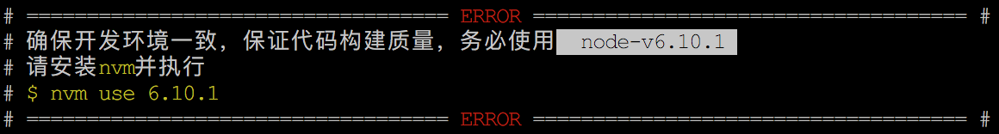
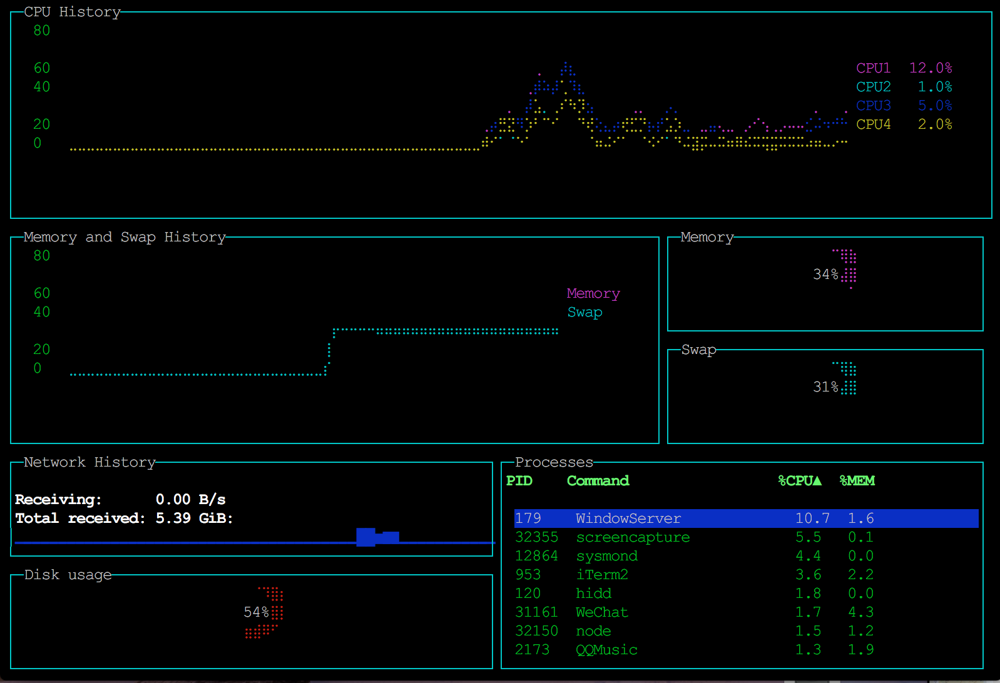
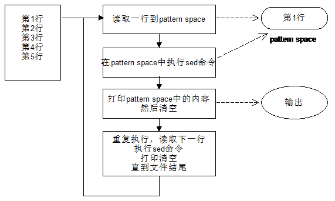

# Linux Shell

> 简单是终极的复杂。 —— 达芬奇

> No programming language is perfect. There is not even a single best language; there are only languages well suited or perhaps poorly suited for particular purposes.   -- Herbert Mayer

2017-12
, 2017-11
, 2017-10
, 2017-5
, 2017-4
, 2017-1
, 2016-11
, 2016 , 2015
, 2014 hudamin

## .bashrc和.bash_profile

* `.bashrc`与`session`相关，每新建一个session都会执行，`su`命令切换，也会执行
* `.bash_profile`与`登录`相关，用户登录后会执行一次`.bash_profile`

## 关于批处理

* `for`循环中的命令序列，能保证上一命令执行完成后再启动下一命令，它支持使用vim`人工批量编辑文件`，比如：

        for i in {1..10}; do vim $i/README.md; done

    以上命令能保证人工编辑好对应README.md且`保存退出`vim后，再启动下一条vim命令。

* 使用bash命令解析器直接解析，就如同命令行中连续输入两条vim命令一样，无法在第一条vim命令编辑完成，并保存退出后再执行第二条vim命令，比如：

        for i in {1..10}; do echo vim $i/README.md; done | sh -x

    以上命令是`无法实现`人工批量编辑文件目的的。

## $相关 

    $0, $1, $2, etc.    # 位置参数
    $#                  # 参数列表的参数个数
    $*                  # 参数列表本身，作为一个字符串看待
    $@                  # 同$*，但每个参数都是一个字符串，作为多个字符串看待，传递过程中不会进行解析和扩展

    ${}                 # 比$parameter兼容性更好的变量替换：${parameter} 
    $()                 # 命令替换，收集命令的执行结果 
    $?                  # exit status，可能是命令、函数或脚本本身的exit status
    $$                  # 当前脚本的pid
    $!                  # 上一后台运行的任务的pid
    $_                  # 上一命令的参数

## -相关

> `'-'`的一些特殊使用场景

* 接收上级`管道`传递的输出信息
        cat file | vim -
        git diff | vim -
        curl <url> | cat file1 - file2 > output
* 结束接收`option`输入 
        git checkout <commit> -- <filename> 
        git stash -- <pathspec>
* 特殊含义
        curl -o- <url>          # 用`-`代替文件名，强行将内容写到stdout

## IO Redirection

### File Descriptor

> 标准文件描述符

    fd          desc
    ==========================
    0           stdin
    1           stdout
    2           stderr
    &           stdout and stderr
    /dev/null   null

> 其他`&n, &-`，todo

### Tips

* `>, >>, <, <<`与文件描述符（`不是文件名`）相连接的时候，注意`不能有空格`！
* 文件描述符若在`右侧`，需要添加`&`前缀。

### Examples

描述符的重设置`作用范围`，使用`exec`是全局的，其他都是临时的。

1. basics

        1> filename
        1>> filename
        2> filename
        2>> filename
        &> filename
        &>> filename
        &> /dev/null

        # stderr 指向 stdout 
        2>&1

        0< filename
        < filename

        grep search-word < filename
        
2. `[j]<>filename` 

    打开文件用于读写，并将该文件赋值给描述符j。如果filename不存在，则创建之。
    如果没有提供描述符j，则默认使用0，即stdin

        echo 1234567890 > File
        exec 3<>File
        read -n 4<&3
        echo -n . >&3
        exec 3>&-
        cat File
    
3. 关闭文件描述符

        # 关闭输入描述符n
        n<&-

        # 关闭stdin
        0<&-
        <&-

        # 关闭输出描述符n
        n>&-

        # 关闭stdout
        1>&-
        >&-

        cat /etc/passwd >&-
        cat: standard output: Bad file descriptor

4. 多个IO重定向可合并

        command < input-file > output-file
        command1 | command2 | command3 > output-file

5. 多路输出流`可重定`向至一个文件

        ls -yz >> command.log 2>&1
            
    以上代码可将错误信息也输出到command.log。但是，以下代码却不可以，`注意区别`：

        ls -yz 2>&1 >> command.log

    如果是`管道`，又是另一种情况了：

        ls -yz | less 2>&1

    以上代码less中不会接收到错误信息，以下代码可以：

        ls -yz 2>&1 | less 

    说白了，就是`重定向`和`管道`的区别。

6. `Child processes inherit open file descriptors. This is why pipes work`. To prevent 
    an fd from being inherited, close it.

    以下代码`只重定向`stderr到pipe：

        exec 3>&1
        ls -l 2>&1 >&3 3>&- | grep bad 3>&-
        exec 3>&-

    暂时还看不懂，todo

7. process substitution

        ( command_list ) >
        < ( command_list )

## 内部变量

> todo

    $BASH
    $BASH_ENV
    $BASH_SUBSHELL
    $BASH_VERSINFO
    $BSSH_VERSION
    ...
    $LC_LOCALE
    $LC_CTYPE
    $LC_ALL
    ...
    $LINENO
    
    $MACHTYPE           # 系统硬件
    $OLDPWD
    $OSTYPE             # OS类型
    $PATH

    $PPID               # 父进程的pid
    
    $PWD                # 当前工作目录

    $SECONDS            # 脚本已经运行的秒数

    $TMOUT              # 提示输入超时时间

    $UID                # uid
    $USER               # 当前登录用户

### 当前登录用户

    $ echo $USER

## 字符串操作

### ${...}格式

    # 获取字符串长度
    ${#string}

    # 获取子串
    ${string:position}
    ${string:position:length}
    ${*:position}
    ${@:position}

    # 首部子串移除，支持通配符*
    # 非贪婪
    ${string#substring}
    # 贪婪
    ${string##substring}

    # 尾部子串移除，支持通配符
    # 非贪婪
    ${string%substring}
    # 贪婪
    ${string%%substring}

    # 字符串替换
    # 只替换首次匹配
    ${string/substring/replacement}
    # 替换全部匹配
    ${string//substring/replacement}
    # 若首部匹配则替换
    ${string/#substring/replacement}
    # 若尾部匹配则替换
    ${string/%substring/replacement}

#### Tips

* 上述命令中，除`string部分`需要用字符串`变量名`之外，其他的既可以用变量名，也可以使用`直接量`
* 首部/尾部字符串移除，支持通配符`*`，例如：
        a=img_xxxxx_yyyy
        a=${a#*_}       # xxxxx_yyyy
        a=${a##*_}      # yyyy
        

### expr命令

> todo

    expr substr $string $position $length
    expr match "$string" '\($substring\)'

## 条件和逻辑表达式

### 常用语法

    if [ expr ]; then
        ...
    fi

    if cmp a b &> /dev/null

    if grep -q Bash file
        then echo "File contains at least one occurrence of Bash."
    fi

    if [ condition-true ]
    then
        command-list
    else
        command-list
    fi

    # &&, ||只在`[[...]]`中支持
    [[ expr1 && expr2 ]]
    [[ expr1 || expr2 ]]

    # -a, -o只在`[...]`中支持
    [ expr1 -a expr2 ]
    [ expr1 -o expr2 ]

    # 支持算术表达式
    (( expr ))

### Tips

* `if/then`结构会判断一系列的命令的`exit status`是否为`0`，如果为0，则`命中then`分支
* `if/then`结构可以嵌套
* `[[..]]`是在Bash 2.02作为`扩展测试命令`开始引入的，它更接近其他编程语言的编写方式
* Bash将`[[ $a -lt $b ]]`作为一个元素，能返回一个`退出状态`(exit status)
* 同样的，对于`((..))`与`let ..`，如果其中的算术表达式得到一个`非零值`，也会返回一个`exit status 0`

        $ if [ 0 ]; then echo 'yes'; fi
        yes

        $ if (( 0 )); then echo 'yes'; fi

        $ let a=4-6; echo $?
        0

        $ let a=4-4; echo $?
        1

* `let`后的表达式，操作符与操作数之间不能有`空白符`
* `[..]`与`[[..]]`，使用后者能避免一些逻辑错误。其中`&&`, `||`只在`[[..]]`中支持
* `逻辑操作符`需遵循`相同类型一起使用`的规则

### 逻辑表达式操作符

#### 文件test操作符

    operator            desc
    ===========================================================================================
    -e                  file exists
    -a                  file exists, deprecated
    -f                  file is a regular file ( not a directory or device file )
    -s                  file is not zero size
    -d                  file is a directory
    -b                  block device ( floppy, cdrom, etc. )
    -c                  character device
    -p                  pipe
    -h                  symbolic link
    -L                  symbolic link
    -S                  socket
    -t                  is associated with a terminal device 
                        This test option may be used to check whether the stdin ([ -t 0 ]) 
                        or stdout ([ -t 1 ]) in a given script is a terminal.
    -r                  has read permission ( for the user runnint the test )
    -w                  has write permission
    -x                  has execute permission
    -g                  todo 
    -u                  todo
    -k                  todo
    -O                  you are owner of file
    -G                  group-id of file same as yours
    -N                  file modified since it was last read
    f1 -nt f2           f1 is newer than f2
    f1 -ot f2           f1 is older than f2
    f1 -ef f2           f1 and f2 are hard links to the same file
    !                   not

例子：

    if [ -e file ]
    if [ -r file ]

#### 整数比较

`[...]`中使用：

    operator    desc                        example
    ==============================================================
    -eq         equal                       if [ "$a" -eq "$b" ]
    -ne         not equal                   if [ "$a" -ne "$b" ]
    -gt         greater than
    -ge         greater than or equal to 
    -lt         less than
    -le         less than or equal to

`((...))`中使用：

    operator    desc                        example
    ============================================================
    <           less than                   (( "$a" < "$b" ))
    <=          less than or equal to       (( "$a" <= "$b" ))
    >           greater than                (( "$a" > "$b" ))
    >=          greater than or equal to    (( "$a" >= "$b" ))

> `数字比较`，与操作数是否用双引号包围无关，即使使用双引号包围，进行的也可以是数字比较

#### 字符串比较

    operator    desc                        example
    =====================================================================================
    =           equal to                    if [ "$a" = "$b" ]         
    ==          equal to                    if [ "$a" == "$b" ]
    !=          not equal to                if [ "$a" != "$b" ]
    <           less than in ASCII          if [ "$a" \< "$b" ] or if [[ "$a" < "$b" ]]
                alphabetical order
    >           greater than in ASCII       if [ "$a" \> "$b" ] or if [[ "$a" > "$b" ]]
                alphabetical order
    -n          string is not null
    -z          string is null ( zero length )
    
#### 逻辑表达式

    operator    desc            example
    =================================================
    -a          logic and       if [ expr1 -a expr2 ]
    -o          logic or        if [ expr1 -o expr2 ]

    &&          logic and       if [[ expr1 && expr2 ]]
    ||          logic or        if [[ expr1 || expr2 ]]

### 基本值的逻辑值

#### TRUE

    desc                        Examples
    ==========================================================
    0                           if [ 0 ]
    1                           if [ 1 ]
    -1                          if [ -1 ]
    non-empty string            if [ "false" ]

#### FALSE

    desc                        Examples
    ==========================================================
    NULL ( empty condition )    if [ ]
    uninitialized variable      if [ $xyz ]
    NULL variable               xyz=; if [ $xyz ]
    empty string                if [ "" ]

### 例子

#### 直接使用命令返回作为条件

    if cd "$dir" 2>/dev/null; then
        echo "Now in $dir."
    else
        echo "Can't change to $dir."
    fi

#### 独立表达式

    var1=3
    var2=4
    [ "$var1" -ne "$var2" ] && echo "$var1 is not equal to $var2"

    home=/home/bozo
    [ -d "$home" ] || echo "$home directory does not exist."

### 字符串比较

### 数字比较

> 使用`(( ))`结构

    if (( 0 )); then 
        echo 'no'
    else
        echo 'yes'
    fi
    yes
    

    (( 0 ))
    echo $?
    1 

* 用在condition处，使用的是计算的`expr的值`，这不同于`[ ]`结构，使用的是`exit status`
* 其`exit status`与`计算值`刚好`相反`，如上所示

### test

以下两个语句`完全等价`：

    if test condition-true
    if [ condition-true ]

其中`[`作为bash的内建命令，会调用内建命令`test`，`]`并不是内建命令，在老版本Bash中并不必须提供，但在新版本的Bash中，要求提供。

`test`和`[`也有二进制版本，但它们作为`sh-utils package`提供：

    /usr/bin/test
    /usr/bin/[

以下调用：

    $ type test
    test is a shell builtin
    $ type [
    [ is a shell builtin
    $ type [[
    [[ is a shell keyword
    $ type ]]
    ]] is a shell keyword
    $ type ]
    -bash: type: ]: not found

       

## for循环

### 语法说明

    $ for (( a=9; a>=1; a-- )); do git stash drop stash@{$a}; done

    $ for i in {1..3}; do echo $i; done
    1
    2
    3

    for i in `cat file.lst`; do
        wc -l $i
    done

    $ for i in abc "b c d"; do echo $i; done
    abc
    b c d

    $ for i in "/path/to/file1
    /path/to/file2
    /path/to/file3
    /path/to/file4"; do echo $i; done
    /path/to/file1 /path/to/file2 /path/to/file3 /path/to/file4

    FILES="/path/to/file1
    /path/to/file2
    /path/to/file3
    /path/to/file4"
    $ for i in $FILES; do echo $i; done
    /path/to/file1
    /path/to/file2
    /path/to/file3
    /path/to/file4

    $ for i in $(
    cat <<EOF
    /path/to/file1
    /path/to/file2
    /path/to/file3
    /path/to/file4
    EOF
    ); do echo $i; done
    /path/to/file1
    /path/to/file2
    /path/to/file3
    /path/to/file4

### 空白字符作为列表分割

> `list`部分总是使用`空白字符`作为分割

文件`a.lst`的内容，是文件列表，路径包含空格：

    ./shared pictures/170101/IMG_339.JPG
    ./shared videos/170101/IMG_45.MOV

以下命令：

    for i in `cat a.lst`; do
        echo $i
    done

不能获得预期效果，因为list的值是4个部分：
    
    ./shared 
    pictures/170101/IMG_339.JPG
    ./shared
    videos/170101/IMG_45.MOV

一种`hack的方式`就是将路径中包含的空白字符先做预处理，处理完后恢复回去。

    for i in `cat a.lst | sed -e 's/ /@__@/g'; do
        echo $i
    done

另一种方式，可以使用`awk`命令：

    awk '{print $0}' a.list
    awk '{printf("-%s-\n", $0)}' a.list
    awk '{printf("echo -%s-\n", $0)}' a.list | sh -x

## case分支

### 语法

    case "$variable" in
        "$condition1" )
        command...
        ;;

        "$condition2" )
        command...
        ;;
    esac

说明：

* Quoting the variables is not mandatory, since word splitting does not take place
* Each `test line` ends with a right paren `)`
* Each condition block ends with a double semicolon `;;`
* The entire case block terminates with an esac (case spelled backwards).

### 判断按键

    read Keypress
    case "$Keypress" in
        [[:lower:]] ) echo "Lowercase letter";;
        [[:upper:]] ) echo "Uppercase letter";;
        [0-9]       ) echo "Digit";;
        *           ) echo "Punctuation, whitespace, or other";;
    esac

### 或表达式

    case "$person" in
        "E" | "e"   ) echo "1";;
        "J" | "j"   ) echo "2";;
        *           ) echo "3";;
    esac

todo

## 嵌入二进制文件

在shell脚本`末尾`嵌入`二进制文件`，执行过程中将二进制文件单独输出成新文件，解压或者执行后，再删除。

### Resources

* 在shell 脚本中嵌入二进制可执行程序 <http://blog.chinaunix.net/uid-15084954-id-3368201.html>
* shell脚本中嵌入二进制文件 <http://blog.chinaunix.net/uid-10540984-id-3262931.html>

一般使用`tail -n +x file > abc`将二进制文件取出。`Anaconda`的安装文件就是一个例子( <ref://../python/anaconda.md.html> )，它是一个500+M的sh文件。

## Here Documents

> 在命令行中使用匿名文档

### Syntax

    <<EndOfMessage
    ...
    ...
    EndOfMessage

* 起始标签与结束标签`可自定义`，但`必须一致`，比如`EOF`, `HEREDOC`
* 起始标签前边需加上`<<`，不需要首列开始，`<<`与标签文本间可以包含0或多个空格
* 结束标签必须`首列开始`，且`单独一行`。也即`前后都不能`有空白字符

### Examples

1. 直接输出，其中`$NAME`会进行`变量替换`。

        cat <<EOF
            Hello, World!
            My name is $NAME
            Yes
            No
        EOF

2. 不带参数替换的Here Document，只需将`起始标志符`用`单引号`包围起来，`$NAME`原样输出。

        cat <<'EOF'
            Hello, World!
            My name is $NAME
            Yes
            No
        EOF

3. 捕获Here文档内容进入`管道`，使用`命令组合`：

        (
        cat <<'EOF'
            Hello, World!
            My name is $NAME
            Yes
            No
        EOF
        ) > output_file

    或者使用`backtick`：

        echo `
        cat <<'EOF'
            Hello, World!
            My name is $NAME
            Yes
            No
        EOF
        ` > output_file

4. 捕获Here文档内容进入`变量`，使用`命令组合`：

        STRING=$(
        cat <<EOF
            Hello, World!
            My name is $NAME
            Yes
            No
        EOF
        )

    或者使用`backtick`：

        STRING=`
        cat <<EOF
            Hello, World!
            My name is $NAME
            Yes
            No
        EOF
        `

5. 使用Here文档，提供`交互指令`

        rm docs.tar.gz
        tar zcvf docs.tar.gz docs
        ftp username@ftp.server.com <<EOF
        cd wwwroot
        ls
        put docs.tar.gz
        EOF

## history

> 列出近期使用的命令

### Syntax

    history [-c] [-d offset] [n]
    history -awrn [filename]
        -c      清空当前历史命令，如果终端存在安全问题，在退出时执行该命令，避免被黑客利用
        -a      将历史命令缓冲区命令写入历史命令文件中，可理解为将当前session新增的history指令
                追加到histfiles中，若没有加histfiles，则预设写入~/.bash_history
        -r      将历史命令文件中的命令读入当前历史命令缓冲区
        -w      将当前历史命令缓冲区命令写入历史命令文件中
    history -ps arg [arg...]

    # 执行序号为N的历史命令
    !N      
    # 重新执行上一命令
    !!
    # 在历史中搜索最先匹配的命令，并执行
    !?pattrn?
    # 编辑序号指定的历史命令，保存后执行
    fc N

### Tips

* `HISTFILE`环境变量，指定命令历史文件，默认为`~/.bash_history`
* `HISTTIMEFORMAT`环境变量，可用于设置历史命令的显示时间，如`export HISTTIMEFORMAT='[%F %T]'`，格式同date命令的format
* `HISTCONTROL`环境变量，可以设置命令历史去重：`export HISTCONTROL=erasedups`

        ignoredups      忽略连续重复的命令
        ignorespace     忽略以空白字符开头的命令
        ignoreboth      同时忽略以上两种
        erasedups       忽略所有历史命令中的重复命令

* `HISTSIZE`环境变量，用于设置最大历史命令数量，特殊用途可以用于`禁用历史`： `export HISTSIZE=0`
* 参考文章：<https://www.cnblogs.com/keithtt/p/7040549.html>

### Examples

    # 逆序列出所有历史命令
    $ history

    # 逆序列出最近的10个历史命令
    $ history 10

    # 执行历史序号为20的命令
    $ !20

    # 清除历史命令
    $ history -c

## diff

### Syntax

    $ diff file-1 file-2

    # c - change, 左边文件的第1,2行变成了右边文件的第1行
    1,2c1
    < ...
    < ...
    ---
    > ...

    # a - append, 左边文件的第347行后，增加了两行，对应右边文件的第326,327行
    347a326,327
    >
    >

### Examples

    file-1:
    32144cffdc4a05d1a361f15c87bcdae9cefb2794
    83af91487527f7bc1817d44c907914b7fcdafdc6
    3e123731b40c4515e7c607d3e4476519dbff8079

    file-2:
    c04ec28af72b0050e2a26e02380a64420834e2ac
    566f77e769a5e1d6f1a1c069261a6173be87af52
    b7512f28c2057c6d64f1ab632c8f924889eb4c01
    32144cffdc4a05d1a361f15c87bcdae9cefb2794
    89b3aa51f46411819f210bd6a1bb426e7c46d0d0
    8c0d42e7845e6e19aa3c019291056de02a99a683
    83af91487527f7bc1817d44c907914b7fcdafdc6
    f8158b05b053083125ae7f98635546aada5ca620

    $ diff file-1 file-2
    0a1,3
    > c04ec28af72b0050e2a26e02380a64420834e2ac
    > 566f77e769a5e1d6f1a1c069261a6173be87af52
    > b7512f28c2057c6d64f1ab632c8f924889eb4c01
    1a5,6
    > 89b3aa51f46411819f210bd6a1bb426e7c46d0d0
    > 8c0d42e7845e6e19aa3c019291056de02a99a683
    3c8
    < 3e123731b40c4515e7c607d3e4476519dbff8079
    ---
    > f8158b05b053083125ae7f98635546aada5ca620

## printf

> todo

    printf [-v var] format [arguments]

    $ printf "protocol=https\nhost=github.com\n"

## say

> 有趣的命令，仅限mac

    say [-v voice] [-r rate] [-o outfile [audio format options] | -n name:port | -a device] [-f file | string ...]

* 能将跟在后面的文本朗读出来
* 支持选择不同声音，使用`-v voice`选项
* 支持管道输入，方便阅读大段文本
* 支持输出成`.tiff`音频文件，使用`-o outfile`，还可以支持其他音频格式，比如`-o outfile.mp4`
* 可以在`长耗时`的命令执行完毕时，发出语音提示

### 参考文章

* Hacker News: <https://news.ycombinator.com/item?id=10143143>
* 让 Mac 命令行说话 <https://segmentfault.com/a/1190000004986696>

### Examples

    $ say u r handsome.
    $ say -o u-r-handsome.mp4 u r handsome.

    # 粤语
    $ say  --voice="Sin-ji" 男演员穿蓝制服女演员穿棉制服蓝制服是棉制服棉制服是蓝制服男演员穿蓝棉制服女演员穿棉蓝制服
    # 普通话绕口令
    $ say -r 400 男演员穿蓝制服女演员穿棉制服蓝制服是棉制服棉制服是蓝制服男演员穿蓝棉制服女演员穿棉蓝制服
    

## echo带颜色文本

> 参考：<http://www.cnblogs.com/lr-ting/archive/2013/02/28/2936792.html>

### 格式说明

    $ echo -e "\033[<background-color>;<font-color>m <string> \033[0m"
    $ echo -e "\033[<font-color>m <string> \033[0m"
    $ echo -e "\033[<font-color>m\033[4m <string> \033[0m"

* `<font-color>`后面带`m`
* `<string>`为字符串，其间的`空格保留`
* 控制字段的格式为：`\033[*m`
    * 同时设置背景色与前景色： `\033[<background-color>;<font-color>m`
    * 只设置前景色： `\033[<font-color>m`
    * 同时设置前景色与下划线：`\033[<font-color>m\033[4m`
* 属性生效范围在`\033[*m`开始到`\033[0m`结束
* `Mac`下，`echo -e`在命令行中正常，但在脚本文件中，不能加`-e`选项，否则直接输出`-e`

例如：

    $ echo -e "\033[47;30m 白底黑字 \033[0m"
    $ echo -e "\033[31m 红字 \033[0m"
    $ echo -e "\033[33m\033[4m 下划线黄字 \033[0m"

### 色值及其他选项

* `前景色`： 30-黑，31-红，32-绿，33-黄，34-蓝，35-紫，36-天蓝，37-白，例如：`\033[31m`，开启红色字属性
* `背景色`： 40-黑，41-红，42-绿，43-黄，44-蓝，45-紫，46-天蓝，47-白
* `其他选项`： 
    * `0` - 关闭所有属性
    * `1` - 设置高亮度
    * `4` - 下划线
    * `5` - 闪烁
    * `7` - 反显
    * `8` - 消隐
    * `nA` 光标上移n行
    * `nB` 光标下移n行
    * `nC` 光标右移n行
    * `nD` 光标左移n行
    * `y;xH` 设置光标位置
    * `2J` 清屏
    * `K` 清除从光标到行尾的内容
    * `s` 保存光标位置
    * `u` 恢复光标位置
    * `?25l` 隐藏光标
    * `?25h` 显示光标

### 颜色文本例子

    echo -e "# =================================== \033[31mERROR\033[0m ==================================== #"
    echo -e "# 确保开发环境一致，保证代码构建质量，务必使用\033[47;30m  node-v6.10.1 \033[0m"
    echo -e "# 请安装\033[33mnvm\033[0m并执行"
    echo -e "# \033[33m$ nvm use 6.10.1\033[0m"
    echo -e "# =================================== \033[31mERROR\033[0m ==================================== #"

输出：

 

## stat命令

> todo

    # linux
    stat <file>

	MyBookLive:~# stat reset-locale.sh 
	  File: `reset-locale.sh'
	  Size: 39            Blocks: 8          IO Block: 4096   regular file
	Device: 900h/2304d    Inode: 102390      Links: 1
	Access: (0666/-rw-rw-rw-)  Uid: (    0/    root)   Gid: (    0/    root)
	Access: 2017-02-07 11:51:41.000000000 +0800
	Modify: 2017-02-07 11:51:41.000000000 +0800
	Change: 2017-02-07 11:51:41.000000000 +0800

    # mac
    stat -x <file>

## scp

* `远程路径`如果带`有空格`，需要使用`反斜线转义`，并将路径用`双引号`包围。比如：

        scp file root@server:"/some\ folder/"
        scp file "root@server:/some\ folder/"

	需要注意的是`scp`的`本地路径`，`不使用`反斜线转义。

* 其他`本地命令`涉及的路径参数`可以不用引号包围`:

        cp file /some\ folder/

    当然，如果使用引号的话，`反斜线`都`可以省掉`，不过要注意`最后的斜线`不能放在引号里面：

        cp file /"some folder"/
        cp file /'some folder'/

* `注意`：以上差异可能因不同系统平台而存在不同

更多参考：<https://github.com/MichaelHu/wd-cloud-sync/blob/master/sync.sh>

## set

    set -e
    set -o option-name

### options

    -e              exit immediately if a pipeline, a subshell command enclosed in
                    parentheses, or one of the commands executed as part of a command list
                    enclosed by braces exits with a non-zero status.
    -o option-name  the option-name can be one of the following:
        pipefail    if set, the return value of a pipeline is the value of the last ( rightmost )
                    command to exit with a non-zero status, or zero if all commands in the 
                    pipeline exit successfully. This option is disabled by default.
        ...
    ...

## env

> set environment and execute command, or print environment

### Syntax

    env [OPTION]... [-] [NAME=VALUE]... [COMMAND [ARG]...]

    # 清除ABC环境变量，再运行命令node index.js
    env -u ABC node index.js

    # 配置PATH环境变量，运行npm命令（npm命令在/home/hudamin/bin目录下）
    env - PATH="$PATH:/home/hudamin/bin" npm run build-deploy

* 设置`环境变量`时，支持`变量扩展`，如上命令对`$PATH`变量的扩展
* 设置环境变量时，必须带`分隔符"-"`

### 命令文件使用

`hello`：

    #! /usr/bin/env node
    console.log( 'Hello' );

以上方式可以将基本环境变量设置好，再运行`node`这个utility，就不会出现查找不到的错误提示。
当然，也可以直接将node的全路径写好，不过node的路径相较env来说，没那么稳定。

执行：

    chmod +x hello
    ./hello

> Probably the most common use of `env` is to `find the correct interpreter for a script`, when the interpreter may be in different directories on different systems.  The following example will find the `perl` interpreter by searching through the directories specified by `PATH`. —— `找到合适的命令解析器`

     #!/usr/bin/env perl

## rm

    # 删除`-`开头的文件
    rm -rf -- -abc.*

    # 相同的，编辑以`-`开头的文件
    vim -- -abc

## alias

    $ alias
    alias cp='cp -i'
    alias rm='rm -i'
    alias mv='mv -i'

> 如何绕过`cp -r src/* dest`不断提示覆盖确认？

    $ which cp
    alias cp='cp -i'
    /user/bin/cp
    $ /usr/bin/cp -r src/* dest
    $ \cp -r src/* dest

### Examples

    # mac下，对剪贴板内容做批量操作，在~/.bash_profile添加以下内容
    alias px="pbpaste | xargs -n 1'

    # 使用方式
    $ px rm
    $ px git rm
    $ px git checkout --

## which vs whereis

1. `whereis`输出系统标准目录中的程序地址
2. `which`输出根据用户目录优先级查找的程序地址，更接近用户视角

比如：

    which vim
    $ which -a vim
    /Users/hudamin/softwares/vim8/bin/vim
    /usr/bin/vim
    $ which vim
    /Users/hudamin/softwares/vim8/bin/vim
    $ whereis vim
    /usr/bin/vim

用户输入`vim`真正使用的是`vim8`，which能真正体现用户视角。

## uname

> print the system information，Mac通用

    uname [amnprsv] 
    -a      Behave as though all of the options -mnrsv were specified.
    -m      print the machine hardware name.
    -n      print the nodename (the nodename may be a name that the system is known by to a communications network).
    -p      print the machine processor architecture name.
    -r      print the operating system release.
    -s      print the operating system name.
    -v      print the operating system version.

不带任何参数，等价于:`uname -s`。`Linux`下提供更多的option。

举例如下：

    $ uname 
    Linux
    $ uname -a
    Linux iZ25o3dvl9aZ 2.6.32-431.23.3.el6.x86_64 #1 SMP Thu Jul 31 17:20:51 UTC 2014 x86_64 x86_64 x86_64 GNU/Linux
    $ uname -m
    x86_64
    $ uname -n
    iZ25o3dvl9aZ
    $ uname -p
    x86_64
    $ uname -r
    2.6.32-431.23.3.el6.x86_64
    $ uname -s
    Linux
    $ uname -v
    #1 SMP Thu Jul 31 17:20:51 UTC 2014

可以用这个命令判断`系统平台`，以适配跨平台脚本。

## 版本号

### 内核版本号

    uname -a
    cat /proc/version

### 系统版本 

    # 普适
    lsb_release -a
    cat /etc/issue
    # 适用于redhat
    cat /etc/redhat-release

## 算术运算

以下几种方式都可以：

    (( z = z + 1 ))
    (( z +=  10 ))
    z=$(( z+1 ))

注意，`((`和`))`内部的变量赋值比较自由，操作符前后可以有空格。

而，普通赋值，比如`z=$((...))`，`z和=之间`就不允许有空格。
    

## env

> set and print environment

    env [-i] [name=value ...] [utility [argument ...]]

`Examples:`

1. 查看环境变量

        $ env
        TERM_PROGRAM=Apple_Terminal
        TERM=xterm-256color
        SHELL=/bin/bash
        ...
        HOME=/Users/hudamin
        SHLVL=1
        LOGNAME=hudamin
        _=/usr/bin/env

2. 设置环境变量

        $ env PHP_CGI=/usr/bin/php-cgi ./webserv.out /Users/hudamin/projects/news/git-webapp/output 8500 debug

3. NodeJs bin文件：

        #!/usr/bin/env node
        var hello = require('hello-node');
        hello.sayHello();

## man ascii

> Linux, Mac

输出`ascii`编码

## ls

    # 长格式输出
    ls -l
    # 长格式输出，忽略group id
    ls -lo

    # 逗号分隔输出文件
    ls -m

    # 输出文件序列号( inode ) 
    ls -i

    # 按文件尺寸由大到小排序
    ls -S
    # 按修改时间由近及远排序
    ls -t
    # 按最后访问时间由近及远排序
    ls -u
    # 按创建时间由近及远排序
    ls -U

    # -r参数将排序逆序
    ls -rS
    ls -rt
    ls -ru
    ls -rU

    # 列出时间详情 - mac
    ls -lT

    # 设置tab的宽度为4 - linux
    ls -l -T 4

## cal

> Linux, Mac

输出日历

    $ cal
         七月 2015
    日 一 二 三 四 五 六
              1  2  3  4
     5  6  7  8  9 10 11
    12 13 14 15 16 17 18
    19 20 21 22 23 24 25
    26 27 28 29 30 31

## date

> Linux, Mac

输出系统时间

    $ date
    2015年 7月30日 星期四 20时22分29秒 CST
    $ export LANG=en_US.UTF-8
    $ date
    Thu Jul 30 20:24:56 CST 2015
    $ date +%Y-%m-%d\ %H:%M:%S
    2015-07-30 20:27:53

## 性能监测命令

> 参考：<http://os.51cto.com/art/201005/200714.htm>，todo

### top
> 提供一个当前运行系统实时动态的视图，也就是正在运行进程

    $ top -d 1
    $ top -U <user>

`gtop`: <https://github.com/aksakalli/gtop>，node实现的终端可视化监控程序

    $ npm install gtop -g
    $ gtop

 
    

### iostat

### free

    $ free

### vmstat
> 显示关于进程、内存、内存分页、堵塞IO、traps及CPU活动的信息 

    $ vmstat -a

### w

> 显示系统当前用户机器运行进程的信息。

    $ w username
     21:06:23 up 18 days,  3:10,  6 users,  load average: 0.00, 0.01, 0.05
    USER     TTY      FROM             LOGIN@   IDLE   JCPU   PCPU WHAT
    fe       pts/0    172.22.128.65    17:14    7.00s  0.13s  0.00s w fe
    fe       pts/1    172.22.128.86    17:46   18:47   2:41   0.17s -bash
    fe       pts/4    172.22.128.65    15:03   10:31   2:03   0.13s -bash
    fe       pts/5    172.22.128.65    19:24   11:59   0.02s  0.02s -bash

### uptime

### ps

### sar

> 搜集、报告和储存系统活动信息

    $ sar -n DEV | more
    $ sar -n DEV -f /var/log/sa/sa24 | more

### mpstat
> 显示所有可用处理器的使用情况，处理器编号从0开始。

    $ mpstat -P ALL

### pmap
> 可以显示进程的内存映射，使用这个命令可以找出造成内存瓶颈的原因

    pmap -d PID

### netstat & ss

### iptraf
> 交互式的IP网络监控工具

### tcpdump
> 一个简单网络流量转储工具，然而要使用好需要对TCP/IP协议非常熟悉

    $ tcpdump -i eth1 'udp port 53'

### strace
> 追踪系统调用和型号，这对于调试Web服务器和其他服务器非常有用

### /proc文件系统
> 该目录下文件提供了很多不同硬件设备和内核的详细信息
    $ cat /proc/cpuinfo
    $ cat /proc/meminfo
    $ cat /proc/zoneinfo
    $ cat /proc/mounts

查看系统`CPU核数`：

    # linux
    $ cat /proc/cpuinfo | awk '/^processor/{print $3}' | tail -1
    # mac
    $ sysctl -n hw.ncpu

## pbcopy & pbpaste

这两个工具可以打通命令行和剪贴板。当然用鼠标操作复制粘贴也可以，但这两个工具的真正威力，发挥在将其用作Unix工具的时候。意思就是说：可以将这两个工具用作管道、IO重定向以及和其他命令的整合。例如：

    $ ls ~ | pbcopy

可以将主目录的文件列表复制到剪贴板。

也可以把任意文件的内容读入剪贴板：

    $ pbcopy < blogpost.txt

做点更疯狂的尝试：获取最新Google纪念徽标（doodle）的URL并复制到剪贴板：

    $ curl http://www.google.com/doodles#oodles/archive \
        | grep -A5 'latest-doodle on' \
        | grep 'img src' \
        | sed s/.*'> tasklist.txt

## uuencode/uudecode

对文件进行编解码，支持`base64`编码，具体参考<ref://../encoding/base64.md.html>

## zip

打包目录：

    $ zip -r dir.zip dir

加密打包目录：

    $ zip -r --encrypt dir.zip dir

解压缩：

    $ unzip dir.zip

例子：

    # 命令行中直接提供密码，可能有安全隐患
    $ zip -q -r -P $password sophonweb_$commitId.zip ./sophonweb_$commitId

## mail

### 发送邮件

todo

    ctrl+D      开启新行

### 阅读邮件

    $ mail

    命令        功能
    ================================================
    +           邮件列表中跳至下一封邮件
    -           邮件列表中跳至上一封邮件
    p           打开邮件
    d           删除邮件
    r           回复邮件
    u [N]       撤销删除
    x           退出邮件

## openssl加密解密

    # des3加密
    openssl des3 -e -in readme.md -out readme.md.des3

    # des3解密 
    openssl des3 -d -in readme.md.des3 -out readme.md

    # 与tar配合
    tar zcvf - readme.md | openssl des3 -e > readme.tar.gz.des3
    cat readme.tar.gz.des3 | openssl des3 -d | tar xvf -

    # 标准命令enc，使用`aes-128-cbc`算法，密码从参数传递
    tar cjf package_$commitId.tar.bz2 ./package_$commitId
    openssl enc -aes-128-cbc -pass pass:$password \
        -in package_$commitId.tar.bz2 \
        -out package_$commitId.tar.bz2.openssl

    # 解密
    openssl enc -d -aes-128-cbc \
        -in <in-file> \
        -out <out-file>

### 密码串传递

密码串传递比较特殊，有以下`五种参数`，比如enc命令的密码通过变量传递为`-pass pass:$password`：

    pass:password 
    env:var
    file:pathname
    fd:number
    stdin

`git log --date=format:"%Y-%m-%d %H:%M:%S"`有类似的option传递，参考<ref://../git/git.md.html>

## tee 与 dd

两者都具有将标准输入拷贝至标准输出的功能，但有一些区别。

    hudamin@local hz1608 $ cat hello.md | tee
    hello, world!
    hudamin@local hz1608 $ cat hello.md | dd
    hello, world!
    0+1 records in
    0+1 records out
    14 bytes transferred in 0.000042 secs (331753 bytes/sec)

`dd`功能更加强大，支持的option较多，比如`if=file` ，`of=file`

    hudamin@local hz1608 $ dd if=hello.md
    hello, world!
    0+1 records in
    0+1 records out
    14 bytes transferred in 0.000043 secs (326224 bytes/sec)

## 网络命令

### dig
    
相比其他工具更全面的DNS信息查询工具。

    $ dig github.com

    ; <<>> DiG 9.8.3-P1 <<>> github.com
    ;; global options: +cmd
    ;; Got answer:
    ;; ->>HEADER<<- opcode: QUERY, status: NOERROR, id: 11179
    ;; flags: qr rd ra; QUERY: 1, ANSWER: 1, AUTHORITY: 4, ADDITIONAL: 4

    ;; QUESTION SECTION:
    ;github.com.            IN  A

    ;; ANSWER SECTION:
    github.com.     17  IN  A   192.30.252.129

    ;; AUTHORITY SECTION:
    github.com.     1214    IN  NS  ns4.p16.dynect.net.
    github.com.     1214    IN  NS  ns2.p16.dynect.net.
    github.com.     1214    IN  NS  ns3.p16.dynect.net.
    github.com.     1214    IN  NS  ns1.p16.dynect.net.

    ;; ADDITIONAL SECTION:
    ns1.p16.dynect.net. 84132   IN  A   208.78.70.16
    ns2.p16.dynect.net. 84132   IN  A   204.13.250.16
    ns3.p16.dynect.net. 84132   IN  A   208.78.71.16
    ns4.p16.dynect.net. 84132   IN  A   204.13.251.16

    ;; Query time: 41 msec
    ;; SERVER: 172.22.1.253#53(172.22.1.253)
    ;; WHEN: Fri Nov 21 12:27:12 2014
    ;; MSG SIZE  rcvd: 194

### nslookup

    $ nslookup github.com
    Server:     172.22.1.253
    Address:    172.22.1.253#53

    Non-authoritative answer:
    Name:   github.com
    Address: 192.30.252.130

### host

    $ host github.com
    github.com has address 192.30.252.131
    github.com mail is handled by 10 ALT4.ASPMX.L.GOOGLE.com.
    github.com mail is handled by 1 ASPMX.L.GOOGLE.com.
    github.com mail is handled by 5 ALT1.ASPMX.L.GOOGLE.com.
    github.com mail is handled by 5 ALT2.ASPMX.L.GOOGLE.com.
    github.com mail is handled by 10 ALT3.ASPMX.L.GOOGLE.com.

### hostname

    mac
        hostname [-fs] [name-of-host]
    linux
        hostname [-v]
        hostname [-v] [-d|-f|-s|-a|-i|-y|-A|-I]
        hostname [-v] {hostname|-F file}

主要在`linux`下使用，比如：

    $ hostname [-i|--ip-address]        # 显示ip地址
    $ hostname [-I|--all-ip-addresses]  # 显示主机的所有ip地址
    $ hostname [-I|--allip-address]     # 显示所有关联的ip地址
    $ hostnam [-f|--fqdn|--long]        # 显示长主机名
    

    

### ping

> send `ICMP ECHO_REQUEST` packets to network hosts

    ping [ -LRUbdfnqrvVaAB]  [ -c count]  [ -i interval]  [ -l preload]  \
        [ -p pattern]  [ -s packetsize]  [ -t ttl]  [ -w deadline]  [ -F flowlabel]  \
        [ -I interface]  [ -M hint]  [ -Q tos]  [ -S sndbuf]  [ -T timestamp option]  \
        [  -W timeout]  [ hop ...]  destination

    $ ping baidu.com

* `ICMP`协议
* 常用于测试目标机器的`连通性`

    
### telnet

> user interface to the `TELNET` protocol

    telnet [-8EFKLacdfrx] [-X authtype] [-b hostalias] [-e escapechar] [-k realm] \
        [-l user] [-n tracefile] [host [port]]

    $ telnet 132.148.22.238 3128

* `telnet`协议，相较ssh协议，其明文传输安全性得不到保障，现已基本被ssh取代
* 常用语测试目标机器的`网络端口`是否打开

## xargs

### Syntax 

    xargs [options] [utility [argument ...]]

    # 未提供utility，默认为echo
    ls -t | xargs echo

    # 每次调用utility，取一个输入参数，使用空白和换行作为分隔符
    ls -t | xargs -n 1 echo
    # 每次调用utility，取三个输入参数，使用空白和换行作为分隔符
    ls -t | xargs -n 3 echo

    # 每次调用utility，取整行作为参数，空白不再作为分隔符
    ls -t | xargs -0 echo

    # 每次调用utility，取整行作为参数，使用%作为替换参数
    ls -t | xargs -I % echo % - %

### Tips

* `-n`与`-0`互斥
* `-I`已经包含`-0`，不能同时使用
* 只能支持一个命令( utility )的执行，不支持使用命令分隔符分隔多个命令，使每个参数同时提供给多个命令。命令分隔符要么通过`backslash`转义作为命令的一部分，要么作为xargs命令和后续命令的分隔符：

        # 转义命令分隔符，后面部分作为前一个echo命令的参数
        $ cat file | xargs -I % echo % \&\& echo 123

        # && 分隔xargs和后一个echo命令，先执行完xargs，再执行echo 123
        $ cat file | xargs -I % echo % && echo 123

* 若确实要通过xargs命令，且一次执行多条命令，可以`组合xargs命令`，先`组装命令文本`，再通过bash执行

        $ cat file | xargs -I % echo echo % \&\& echo 123 | sh -x

    

### Examples

#### 文件批量更换后缀

    ls -t \
        | grep '.sketch' \
        | xargs -I % echo mv \"%\" \"%\" \
        | sed 's/\.sketch"$/.abc"/' \
        | sh -x

其中`mv`部分，使用`双引号`包围，避免文件名包含空白字符的情况。注意使用`反斜线`转义。

#### 多命令执行 

    echo `cat << EOF
    js/graph-layout
    js/graph-data
    EOF
    ` \
        | xargs -n 1 echo \
        | xargs -I % echo pushd "%" \&\& sh build.sh \&\& popd \
        | sh -x

* 使用`HereDoc`，支持在脚本内部按行的方式提供参数列表
* 第一个xargs命令，确保`每次只取一个`参数 
* 第二个xargs命令，进行命令`字符串的拼装`，以支持取一次参数，输送给`多个命令`执行
* 最终通过`pipe`输出到shell执行
* 相比for命令，能精确控制参数的分隔使用`换行符`，不受参数内部包含的空白字符影响

## curl

命令行发起网络请求，支持`HTTP(S)/FTP`等协议。

    # 内容输出到文件，文件名从url中计算
    $ curl -O <url>

    # 内容输出到文件，文件名由<file>指定
    $ curl -o <file> <url>
    # 内容强行输出到stdout
    $ curl -o - <url>
    $ curl -o- <url>

    # 支持重定向
    $ curl -L <url>
    $ curl --location <url>

    # 静默模式，不显示进度信息和错误信息
    $ curl -s <url>
    $ curl --silent <url>

    # 支持在静默模式下，仍然显示错误信息
    $ curl -Ss <url>
    $ curl -s --show-error <url>

    # 支持重定向、静默模式、指定输出文件，同时能显示错误信息 
    $ curl -LSso <file> <url>

    # 同步远程文件时间
    $ curl -R <url>
    $ curl --remote-time <url>

    # 多文档获取
    $ curl -o a http://a.example.com -o b http://b.example.com
    $ curl http://a.example.com http://b.example.com -o a -o b 

    # 多文档获取，文件名支持变量替换
    $ curl "http://www.{baidu,258i}.com" -o "f_#1.txt"
    $ curl "http://{news,video}.baidu.com" -o "f_#1.txt"
    # 多变量替换
    $ curl http://{site,host}.host[1-5].com -o "#1_#2"

## grep

> 文件内容查找

查找文件内包含文本`hello`的行：

    $ grep 'hello' file

输出所有文件中`hello`出现的次数：

    $ grep -c 'hello' file

查找目录树下的所有文件，输出出现`mongodb`的行，并且不区分大小写：

    $ grep -irE 'mongodb' --color=auto . # Mac版本

`跳过二进制`文件的匹配:

    $ grep -I 'hello' file
    $ grep --binary-file=without-match 'hello' file

跳过某些模式的文件名（注意`mac`和`linux`的差异较大）：

    $ grep -r --exclude=GLOB 'hello' .
    $ grep -r --exclude-from=listfile 'hello' .

仅查找特定文件，`--include=...`的`=`不能省略：

    $ grep --include=GLOB 'hello'
    $ grep --include=*.md -r 'cors'

`递归目录树`查找：

    $ grep -r 'hello' .
    $ grep -R 'hello' .
    $ grep --recursive 'hello' .

    

## mail

发送邮件，同`mailx`

    $ mail -s "SUBJECT" abc@example.com < file.txt 

有些时候file.txt内容`没有作为message body发送`，而默认作为附件（名为ATT00001.bin）发送，即使文件内容是纯文本。这时邮件客户端查看不太方便，通常需要保存以后，再用编辑器打开。解决的方法是，将文件作为附件发送：

    $ mail -s "SUBJECT" -a file.txt abc@example.com <<EOF
        Build Successfully!
    EOF

## netstat

    netstat -r
    Kernel IP routing table
    Destination     Gateway         Genmask         Flags   MSS Window  irtt Iface
    default         gateway         0.0.0.0         UG        0 0          0 eth0
    172.18.0.0      0.0.0.0         255.255.0.0     U         0 0          0 docker0
    172.22.2.0      0.0.0.0         255.255.255.0   U         0 0          0 eth0

    netstat -lpn

## lsof

> list open files

todo

    lsof -i TCP:9000

## lsbom

for `MAC`

    lsbom -f -l -s -pf /var/db/receipts/org.nodejs.pkg.bom

删除干净`nodejs`：

    lsbom -f -l -s -pf /var/db/receipts/org.nodejs.pkg.bom \
    | while read i; do
      sudo rm /usr/local/${i}
    done
    sudo rm -rf /usr/local/lib/node \
         /usr/local/lib/node_modules \
         /var/db/receipts/org.nodejs.*

## tail

    # 末尾10行
    tail -n 10 <file>
    # 从正数第10行开始到末尾
    tail -n +10 <file>

    # 末尾10字节
    tail -c 10 <file>
    # 从正数第10字节开始到末尾
    tail -c +10 <file>

    # 末尾10个512字节块
    tail -b 10 <file>
    # 从正数第10个512字节块开始到末尾
    tail -b +10 <file>

    # file的全部内容按行逆序输出
    tail -r <file>
    # file的末尾10行按行逆序输出
    tail -n 10 -r <file>
    # file的末尾10字节按行逆序输出
    tail -c 10 -r <file>
    # file的末尾10个512字节块按行逆序输出
    tail -b 10 -r <file>

支持`管道`，所以对输出内容按行逆序输出，非常方便。vim通过扩展命令`:[range]!command`可以将选中内容通过管道传给tail处理，实现相关功能。

## sed

> sed是一个`流编辑`工具。

### 常用命令

    # 执行编辑命令，输出到标准输出
    sed -e '...' file

    # 执行编辑命令，替换当前文件，用后缀.bak备份当前文件
    sed -i'.bak' -e '...' file

    # 执行编辑命令，替换当前文件，不作备份
    sed -i'' -e '...' file

    # 执行替换编辑命令，输出到标准输出
    sed -e 's/pattern/replacement/g' file

### 理解两个spaces

需要弄清楚`hold space`和`pattern space`的概念。可参考<http://www.lai18.com/content/1404242.html>

`Pattern Space`相当于`车间`，也称为`临时缓存区`，sed把流内容在这里进行处理，而不改变原文件的内容，`Hold Space`相当于`仓库`，加工的`半成品`在这里进行临时存储。

由于各种原因，比如用户希望在某个条件下脚本中的某个命令被执行，或者希望`模式空间`得到保存以便下一次处理，都有可能使得sed在处理文件的时候不按照正常的流程来进行。这个时候，sed设置了一些`高级命令`来满足用户的要求。

 

    g: 将hold space中的内容拷贝到pattern space中，原来pattern space里的内容被覆盖
    G：将hold space中的内容append到pattern space\n后
    h: 将pattern space中的内容拷贝到hold space中，原来hold space里的内容被覆盖
    H: 将pattern space中的内容append到hold space\n后
    =: 输出当前行号后跟换行
    p: 将pattern space中的内容输出到标准输出
    N: 获取下一行输入到当前pattern space，并用换行分隔
    l: 输出不可见字符，用反斜线开头后跟3位8进制数，每行用$结尾
    d: 删除pattern中的所有行，并开始下一行
    D: 删除multiline pattern中的第一行，并开始下一行

各命令之间使用`分号( ; )`分隔。

### 示例

#### 获取filename

举个例子，以下为从path中获取`filename`：

    $ echo http://258i.com/docs/markdown_res/js/scrollspy.js | sed -e 's/^.*\/\([^\/]*\)$/\1/g'
    scrollspy.js

#### 对换行符的处理

`处理过程`为获取一行，`去掉换行符`，放入模式空间，处理完以后再将换行符添加回去，放到标准输出中。

    sed -e 's/\n/a/g' file

所以以上命令不能将文件的换行符改成其他字符。

#### 不可见字符输出

用`表意标记`将不可见字符输出到标准输出：

    sed -e 'l'
    $ echo 123 | sed -e 'l'
    123$
    123

#### N命令 

> 读取下一行输入到当前`Pattern Space`，并用换行符( newline )分隔当前行与读入的下一行。注意`当前行号`会变化。

`文件b`的内容：
    a
    b
    c
    d
    e
    f
    hello
    G

调用以下命令：

    $ cat b | sed -e 'N;N;N;s/\n/|/g'
    a|b|c|d
    e|f|hello|G

#### G命令

为匹配行后面`添加`一个`换行符`：

    $ cat a | sed -e 'G'
    a

    b

#### sed正则

sed的`正则（使用-E( mac )或-r( linux )）`接近`perl`的正则，比如反向引用`&`：

    find ./pdf | sed -Ee 's/^.*$/<&>/g' 
    find ./pdf | sed -re 's/^.*$/<&>/g' 

不启用正则模式，匹配方式接近vim的`magic`方式。

以上代码将输出：

    <./pdf/a.pdf>
    <./pdf/c/d.pdf>

#### 复制每一行

    # 到标准输出
    sed -e 'p' file
    # 直接更新文件
    sed -i'' -e 'p' file
    # vim中调用
    :[addr]!sed -e 'p'

#### 两行用第一行代替

    # 到标准输出
    sed -e 'N;s/\n.*//g' file
    # 直接更新文件
    sed -i'' -e 'N;s/\n.*//g' file
    # vim中调用
    :[addr]!sed -e 'N;s/\n.*//g'

#### 按行逆序输出

将文件`按行逆序`输出，比如原文件为：

    111
    222
    333

输出为：

    333
    222
    111

使用`sed`命令来实现：

    sed '1!G;h;$!d' file

使用`tail -r`命令来实现：

    tail -r file

当然，还有另外的办法，但这两个个办法是`比较简单`的。（`理解`：对于n行文本，`前n-1行`输出为空，`最后一行`输出逆序行）。该命令用于同`vim`的命令行结合，能对选中行按行号逆序排列，参考<ref://../vim/vim.md.html>

#### 将文件所有行合并成一行

    sed -e '1h;1!H;$g;$s/\n//g;$p;d' c

`处理过程`：

    仅在第一行，用pattern space内容覆盖hold space
    除第一行，将pattern space内容append至hold space + 换行
    仅在最后一行:
        1. 用hold space内容覆盖pattern space
        2. 对pattern space内容做替换处理，将换行符删除
        3. 输出pattern space的内容
    每一行最后都将pattern space内容清空

`Tips`：
* `1!H`，隐含第一行不执行H命令，其他行都执行H命令
* `$!d`，隐含除了最后一行，都执行d命令

    

### 其他

sed的`s命令`如何在`replacement`部分添加`换行符`，参考：<ref://../encoding/character-escape.md.html>

更多例子，可以查看后面章节`实用例子`。

## tac, rev

> 按字符操作，todo

## awk

### 常用语法

	# 取特定字段
	$ line_count=`wc -l file | awk '{print $1}'`
	
	# 格式化输出
	$ awk '/pattern/{printf "..%s..%s..", $2, $1}' file
	
    # 为每一行添加行号
    $ awk 'BEGIN{k=1}{printf("%d %s\n",k,$0)}' file

    # 外部变量传入
    $ awk -v var1=value1 '{printf "-%s-", var1}'

### pattern格式

功能较全的`Perl正则`表达式，强于`vim`和`sed`默认情况下的`magic正则`。

### 各类函数

`system`函数，扩展了awk的功能，可以调用各种shell命令来获取其`exit status`。以下摘自`wd-cloud-sync`

	awk "{if(system(sprintf(\"grep -m 1 \\\"%s\\\" $REMOTE_LST_FILE 1>/dev/null\", \$0))) print \$0;}" \
		$LOCAL_DIR_LST_FILE > $SYNC_DIR_LST_FILE 
	awk "{if(system(sprintf(\"c=\`grep \\\"%s\\\" $SYNC_DIR_LST_FILE | wc -l\`; exit \$c\", \$0)) == 1) print \$0;}" \
		$SYNC_DIR_LST_FILE > $TMP_FILE

* `双引号`内部`各层命令`涉及的`特殊字符`的`转义`，在上面两个命令体现非常强烈。
	其中，`$c`的`$`进行了`转义`，使其`延迟`到system命令执行时才做替换，而不是在第一层双引号解析时就进行替换。

### Examples

列出git`远程分支`及其`最新提交时间`，并按`时间逆序`显示。

    for i in $(git branch -r|grep -v 'HEAD'); do \
        git log -1 --date=iso $i \
        | grep 'Date:' \
        | sed -e 's/^Date: *//g' \
        | sed -e 's/+0800//g' \
        | awk -v branch=$i '{printf "%s %s\n", $0, branch}'; \
        done \
    | sort -r

对文本表格的列字段进行简单计算并输出，文本表格如下：

            A       B       C       D       Total
    ==================================================
    a1      1.5     1.2     1.2     1.1     1.37
    a2      1.1     1.1     1.1     1       1.09
    a3      1       0.8     1       1.1     0.97
    a4      0.7     0.9     0.8     0.9     0.77
    a5      1.1     1.2     1       1       1.10
    a6      1       1       1.1     1       1.01
    a7      0.8     1       0.9     0.9     0.86
    a8      0.9     0.9     1       1.1     0.93
    a9      0.9     0.9     0.9     0.9     0.90

其中`Total列`是计算得到的，awk代码如下：

    # 命令行实现
    $ tail +3 file | awk '{printf("\%s \%.2f\n", $0, $2*0.6+$3*0.2+$4*0.1+$5*0.1 )}' 

    # vim下将awk作为外部命令调用
    :'<,'>!awk '{printf("\%s \%.2f\n", $0, $2*0.6+$3*0.2+$4*0.1+$5*0.1 )}' 

注意，在vim中使用外部命令，`%`需要转义。

## find

> 目录、文件查找

    find [-H | -L | -P] [-EXdsx] [-f path] path ... [expression]
    find [-H | -L | -P] [-EXdsx] -f path [path ...] [expression]

* 针对递归遍历的每一个文件，执行`expression`
* 每个`expression`都会返回`布尔值`，使用`运算符`连接，`默认`为`-and`的关系，-and可以省略
* 查找路径的指定`不属于`expression部分
* expression部分由下列`Primaries`和`Operands`组成
* 提及的可能作为命令分隔符的部分`特殊字符`，需要转义，比如`(, ), ;`等，使用`反斜线`或`引号`转义

### Primaries

    option                          description
    ============================================================================================
    -Bmin n
    -Bnewer file
    -Btime n
    -acl
    -amin n
    -anewer file
    -atime n[smhdw]                 最后访问时间为ceil计算后的值，单位可指定，未指定默认为天
    -cmin n                         最后修改时间为ceil计算后的值，单位为分钟
    -cnewer file
    -ctime n[smhdw]                 最后修改时间为ceil计算后的值，单位可指定，未指定默认为天
    -d                              同depth
    -delete                         删除找到的文件或目录，总是返回true
    -depth                          总是返回true
    -depth n                        当文件相对于起始目录的深度为n时，返回true
    -empty                          当前文件或目录为空时返回true
    -exec utility [argument ...] ;
    -exec utility [argument ...] {} +
                                    针对找到的每个文件执行指定命令，必须用;或+结尾，为了和
                                    命令分隔符区分开，使用时需要将;或+转义，用\;, \+或";", "+"
                                    ；使用";"与"+"的区别在于输出内容是按行还是按空格分隔
    -execdir utility [argument ...] ;
    -execdir utility [argument ...] {} +
                                    同-exec，唯一不同在于命令执行目录为找到的文件所在的父目录
    -flags [-|+]flags,notflags
    -fstype type
    -gid gname
    -group gname
    -ignore_readdir_race
    -ilname pattern
    -iname pattern
    -inum n
    -ipath pattern
    -iregex pattern
    -iwholename pattern
    -links n
    -lname pattern
    -ls
    -maxdepth n
    -mindepth n
    -mmin n
    -mnewer file
    -mount
    -mtime n[smhdw]
    -name pattern
    -newer file
    -newerXY file
    -nogroup
    -noignore_readdir_race
    -noleaf
    -nouser
    -ok utility [argument ...];     同-exec，唯一不同在于该命令执行需要用户确认
    -okdir utility [argument ...] ; 同-execdir，唯一不同在于该命令执行需要用户确认
    -path pattern
    -perm [-|+]mode
    -print
    -print0
    -prune
    -regex patten                   路径正则，perl兼容正则，需对整个路径进行匹配
    -samefile name
    -size n[ckMGTP]
    -type f|b|c|d|l|p|s
    -uid uname
    -user uname
    -wholename pattern
    -xattr
    -xattrname name

### Operators

    ( expression )
    ! expression
    -not expression
    -false
    -true
    expression -and expression
    expression expression
    expression -or expression

### Tips

* `(`, `)`需要使用反斜线`转义`
* `-regex pattern`，`-iregex pattern`的pattern匹配的是`整个路径`，而不是部分路径

### Examples

    # 递归查找所有文件
    $ find . -type f

    # 递归查找当前目录下的.swp文件并且删除
    $ find . -type f -name ".*.swp" -exec rm {} \;

    # 递归查找当前目录下inode为35806669的文件并且删除
    $ find . -inum 35806669 -exec rm {} \;

`windows`下的对应命令是`dir /b /s <file>`

    # 找出当前目录下修改时间为24小时之内的文件：
    $ find . -type f -mtime 0

    # 找出当前目录下修改时间大于30天的文件：
    $ for (( d=30; d<1000; d++ )); do find . -type f -mtime $d; done
    $ for d in {30..999}; do find . -type f -mtime $d; done

    # 通过inode值删除文件，适用于无法输入中文的情况：
    $ ls -i                                     # 找到对应文件的inode值
    $ find . -inum xxxxxxx -exec rm {} \;       # 通过inode删除

    # 使用inode之外的方法
    $ find . -maxdepth 1 -mindepth 1 -type f | xargs -I $ echo rm -rf \'%\' > a.lst
    $ vim a.lst                                 # check删除文件列表
    $ sh -x a.lst

    # 递归查找src目录下的深度为2的*.js文件或修改时间为24小时内的.scss文件
    $ find ./src -type f \( -name '*.js' -depth 2 -or -name '*.scss' -mtime 0 \)

## nohup

> invoke a utility immune to hangups

* 调用一个程序而不受挂起影响。即使你退出当前终端，该程序也能继续运行。
* tip: 需要显式键入`exit`，而不是直接关闭ssh终端

正常操作步骤如下：

    $ nohup command &
    appending output to nohup.out
    $ exit

参考<http://www.cnblogs.com/allenblogs/archive/2011/05/19/2051136.html>

## cowsay

> `ASCII`文字版本的小牛图片，类似功能的还有`ponysay`

    # 显示小牛图片，将message嵌在里面输出
    $ cowsay message

    # 列出可选图片列表
    $ cowsay -l

    # 选择turkey图片
    $ cowsay -f turkey message

## 实用例子

### 清空文件

几种快速清空文件内容的方法：

    $ : > filename              # 其中的`:`是一个占位符, 不产生任何输出.
    $ > filename
    $ echo "" > filename
    $ echo /dev/null > filename
    $ echo > filename
    $ cat /dev/null > filename

### 使用inode删除文件

> 对于一些名称包含特殊字符的文件，在命令行里很难敲出来。这时可以使用`inode`的方式来删除。

    $ ls -i
    35806669 ~.@ 包含特殊字符的文件名.docx
    $ rm `find . -inum 35806669`            # 不支持包含空格的文件名
    $ find . -inum 35806669 -exec rm {} \;  # 终极方案，支持文件包含空格

### 批量进行文件改名 

    find . -type f -exec echo "mv {} {}" \; | sed -e "s/ \([^ ]*\)@3x.png$/ ..\/\1.png/g" | sh -x

注意`sed的正则`基本等同`vim正则`。当然也有一些差别，比如：

    $ sed -E -e "s/a/ & /g" file
    $ sed -e "s/a/ & /g" file
    $ sed -E -e "s/(a)/ \1 /g" file
    $ sed -e "s/\(a\)/ \1 /g" file

    vim:

    :s/a/ \0 /g

sed有`perl` style的扩展正则功能，vim只有`magic`方式的`初级正则`。`反向匹配`串引用也存在区别，主要是`整串匹配`，sed使用`&`，vim使用`\0`；同时，magic模式下，sed不支持:

1. "`\+`", "`\s`"
2. `单引号`括住的命令中`不能`带`单引号`，使用"`\'`"也不行
3. `双引号`括住的命令中可以带`双引号`，当然包括`单引号`。也即`反斜线转义`在双引号中有效。
    建议都`使用`双引号

### 过滤图片文件，并保留目录结构复制到指定目录

    for i in `find src -type f -name "*.png"`; do \
        [ ! -e ./tmp/`dirname $i` ] \
        && mkdir -p ./tmp/`dirname $i`; \
        cp $i ./tmp/`dirname $i`; \
    done

### 查询近24小时内修改过的文件

    find . -type f -name "*.md" -mtime -1

注意，`-mtime`后面的数字，`仅当`和`+`和`-`配合才有意义。

### 查看某天顺风车发单量和成交量

    date > orders-1517.log

    total=0
    for i in `cat ../api.lst`
        do  
            # echo $i
            ssh $i 'cd /home/xiaoju/webroot/beatles/log/webapi; grep -P "\/order\/create\?" didi.log | grep "time=2015-11-17 " | grep errno=0 | grep -Po "\x22order_id\x22:\x22[^\x22]+\x22" | sort | uniq | wc -l'
        done \
        > tmp 

    for i in `cat tmp`
        do  
            (( total += $i ))
        done

    echo "Total orders: $total" >> orders-1517.log

    total=0
    for i in `cat ../api.lst`
        do  
            # echo $i
            ssh $i 'cd /home/xiaoju/webroot/beatles/log/webapi; grep -P "\/order\/pay\?" didi.log | grep "time=2015-11-17 " | grep errno=0 | grep -Po "\x22order_id\x22:\x22[^\x22]+\x22" | sort | uniq | wc -l'
        done \
        > tmp 

    for i in `cat tmp`
        do  
            (( total += $i ))
        done

    echo "Total deals: $total" >> orders-1517.log

### 清除git仓库中未添加文件，这些未添加文件都在src目录下 

    git status | awk '/^\t+src/{printf "rm -rf %s\n",$0}' | sh -x

注意：`awk`的正则`不是``magic`方式。

### 移动canvas.md文件引用的图片

    hudamin@local graphics $ awk '/ 代码来自我的两个私有云服务器之间数据的同步

代码需要注意的地方：

* 以下代码认为两台服务器之间已经建立了`ssh`连接的`互信机制`
* `scp`命令的`远程路径`，如果包含`空格`，需要`反斜线`转义，并使用`双引号包围`
	* `仅限远程路径`，本地部分不需要转义
	* 除了`空格`，还有`&`, `(`, `)`等，也需要转义 

* `awk`命令的`深度`使用
    * 通过`system`命令调用shell，极大扩展了其功能，做到`按需同步`
    * 通过将参数用双引号包围，使得变量可以传递进去
    * `双引号`包围后，里面`多层参数`的`转义`规则，比如下文的`三个反斜线`
* `scp`的`-p`选项，保证了文件的属性不变

#### 使用方式

* 设置`DEST`参数
* 运行`sh sync.sh`

#### 具体代码实现

参考：<https://github.com/MichaelHu/wd-cloud-sync/blob/master/sync.sh>

样例如下：

	#!/bin/bash
	
	REMOTE_HOST=192.168.1.101
	
	# no backslashes, can be a relative path
	DEST="$1"
	if [ ! -d "$DEST" -o ! "$DEST" ]; then
	    echo "usage: sh sync.sh <sync_dir>"
	    echo "you must specify a existed directory"
	    exit 0
	fi
	DEST=`cd "$1"; pwd`
	echo "sync with server $REMOTE_HOST: [ $DEST ]"
	echo "note: please make sure [ $DEST ] has existed on remote server"
	
	[ ! -d /root/sync ] && mkdir -p /root/sync
	PREFIX=/root/sync/prefix-$(date +%y%m%d%H%M%S)
	
	LOCAL_LST_FILE=$PREFIX-local.lst
	LOCAL_DIR_LST_FILE=$PREFIX-local-dir.lst
	REMOTE_LST_FILE=$PREFIX-remote.lst
	SYNC_LST_FILE=$PREFIX-sync.lst
	SYNC_DIR_LST_FILE=$PREFIX-sync-dir.lst
	TMP_FILE=$PREFIX-tmp.lst
	
	SCP_DEST=${DEST// /\\ }
	
	echo
	echo "# 1. preparing sync ..."
	
	pushd "$DEST" 2>&1 1>/dev/null
	
	echo "# 1.1 getting local file list ..."
	# `.wdmc` directory is generated by wdmycloud 
	find . -type f -not -regex ".*/\.wdmc/.*" > $LOCAL_LST_FILE 
	echo "# 1.1.1 local file count: `wc -l $LOCAL_LST_FILE | awk '{print $1}'`"
	
	echo
	echo "# 1.2 getting local directory list ..."
	find . -type d -not -regex '.*/\.wdmc/.*' > $LOCAL_DIR_LST_FILE 
	echo "# 1.2.1 local directory count: `wc -l $LOCAL_DIR_LST_FILE | awk '{print $1}'`"
	
	echo
	echo "# 1.3 getting remote file list ..."
	ssh $REMOTE_HOST "[ ! -d '$DEST' ] && mkdir '$DEST'; cd '$DEST' && find . -type f -not -regex '.*/\.wdmc/.*'" > $REMOTE_LST_FILE 
	echo "# 1.3.1 remote file count: `wc -l $REMOTE_LST_FILE | awk '{print $1}'`"
	
	echo
	echo "# 1.4 getting sync file list ..."
	awk "{if(system(sprintf(\"grep -m 1 \\\"%s\\\" $REMOTE_LST_FILE 1>/dev/null\", \$0))) print \$0;}" \
	  $LOCAL_LST_FILE > $SYNC_LST_FILE 
	echo "# 1.4.1 sync file count: `wc -l $SYNC_LST_FILE | awk '{print $1}'`"
	
	echo
	echo "# 1.5 getting sync directory list ..."
	awk "{if(system(sprintf(\"grep -m 1 \\\"%s\\\" $REMOTE_LST_FILE 1>/dev/null\", \$0))) print \$0;}" \
	    $LOCAL_DIR_LST_FILE > $SYNC_DIR_LST_FILE 
	awk "{if(system(sprintf(\"c=\`grep \\\"%s\\\" $SYNC_DIR_LST_FILE | wc -l\`; exit \$c\", \$0)) == 1) print \$0;}" \
	    $SYNC_DIR_LST_FILE > $TMP_FILE
	mv $TMP_FILE $SYNC_DIR_LST_FILE
	count_sync_dir=`wc -l $SYNC_DIR_LST_FILE | awk '{print $1}'`
	echo "# 1.5.1 sync directory count: $count_sync_dir"
	
	
	echo
	echo "# 2. sync ..."
	echo "# 2.1 creating remote sync directories ..."
	count=0
	for i in `sed 's/ /@__@/g' $SYNC_DIR_LST_FILE`; do
	    (( count = count + 1 ))
	    file_name=${i//@__@/ }
	    echo "# creating remote directory [ $count / $count_sync_dir ] '$DEST/$file_name'"
	    ssh $REMOTE_HOST "cd '$DEST' && mkdir -p '$file_name' 2>/dev/null"
	done
	
	MAX_COUNT=50000
	echo
	echo "# 2.2 set max send count: $MAX_COUNT"
	
	count_sync_files=`wc -l $SYNC_LST_FILE | awk '{print $1}'`
	
	echo
	echo "# 2.3 start coping $count_sync_files files to remote server ..."
	count=0
	for i in `sed 's/ /@__@/g' $SYNC_LST_FILE`; do
	    (( count = count + 1 ))
	    if [ $count -lt $MAX_COUNT ]; then
	        # local file needs no backslashes
	        file_name_local=${i//@__@/ }
	        # remote file needs backslashes
	           file_name_remote=${file_name_local// /\\ } 
	           file_name_remote=${file_name_remote//(/\\(} 
	           file_name_remote=${file_name_remote//)/\\)} 
	           file_name_remote=${file_name_remote//&/\\&} 
	        echo
	        echo "# sending $count / $count_sync_files: $file_name_local => $file_name_remote"
	        scp -rp "$file_name_local" $REMOTE_HOST:"$SCP_DEST/$file_name_remote"  
	        if [ $? -ne 0 ]; then
	            echo "error occured"
	            exit 1
	        fi
	    fi
	done
	
	popd
	
	echo
	echo "# 2.4 sync successfully: $count files in all"
	echo "bye!!"

### 获取文件的绝对路径

参考： <http://blog.csdn.net/10km/article/details/51906821>

`方案一`：cd + pwd

    file_path=./path/to/file
    abs_path=`cd $file_path && pwd`

    或

    abs_path=$(cd $file_path && pwd)

`方案二`：readlink

    file_path=./path/to/file
    abs_path=`readlink -f $file_path`

方案二，`仅适用于Linux系统`，Mac系统下不支持，Mac下的`readlink`功能已经弱化，更多使用`stat`。

### 打开命令所在目录

    cd `dirname $(which node)`
    cd `dirname \`which node\``

1. `\``的`嵌套`使用

### 将文件按行逆序输出

#### 方法一

    # 假设文件file少于10000行
    awk 'BEGIN{ i=10000 }{printf("%d %s\n", i, $0); i++}' file \
    | sort --reverse \
    | sed 's/^[0-9]{5} //g'

#### 方法二

    sed -e '1!G;h;$!d' file

### 批量更新node_modules

`16个`目录`21000`-`21015`下的code目录下的`node_modules`更新成新版：

    for ((i=0; i<=15; i++)); do \
        ((k=21000+$i));\
        echo $k; \
        rm -rf $k/code/node_modules; \
        cp -r node_modules_pro-uglifyjs-170628/node_modules $k/code; \
    done

### 查找指定文件中是否包含特定模式

`17`个目录`21000`-`21016`下的`bin/pre_ctl`文件是否包含字符串`172.22.1.71`

    for(( i=21000; i<=21016; i++ )); do \
        echo grep 172.22.1.71 $i/bin/pre_ctl; \ 
    done \
    | sh -x

### 自动替换md文档特定部分

> 思路为`生成替换脚本`再执行，实际应用场景为将预览环境的`README.md`文件进行`自动更新`，解析成html，并通过http server发布。

以下为部分代码的实现，具体可参考实际项目repo。

    #!/bin/bash
    BASEPORT=18000
    COUNT=19
    tmpFile=preview.md
    apiListFile=api.lst
    cp README.md $tmpFile
    
    ##############################################
    # get api list file
    #   18000APISERVER=http://172.22.1.93:7000
    #   18001APISERVER=http://172.22.1.92:7000
    #   ...
    for (( i = 0; i <= $COUNT; i++ )); do 
        (( port = $BASEPORT + $i )) 
        api=$port`head -5 $port/bin/pre_ctl | grep -v '^#' | grep '^APISERVER='`
        echo $api 
    done > $apiListFile
    
    ##############################################
    # reformat api list file
    #   18000 172.22.1.93:7000
    #   18001 172.22.1.92:7000
    #   ...
    sed -i'' -e 's/APISERVER=http:\/\// /g' $apiListFile
    
    ##############################################
    # generate replacing script and execute
    #   sed -i"" -e "s/@@@18000/\`172.22.1.93:7000\`/g" preview.md
    #   sed -i"" -e "s/@@@18001/\`172.22.1.92:7000\`/g" preview.md
    #   ...
    cat $apiListFile \
        | awk -v file="$tmpFile" '{printf "sed -i\"\" -e \"s/@@@%s/\\`%s\\`/g\" %s\n",$1,$2,file}' \
        | sh
    
    ##############################################
    # parse *.md file
    [ -s "/home/fe/.nvm/nvm.sh" ] && . "/home/fe/.nvm/nvm.sh"
    nvm use 6
    tm $tmpFile --no-preview

### 生成图片列表 

> 支持`lazyload`的图片列表

    ls img_* \
        | xargs -n 1 \
        | awk -F'.' \
            '{printf " \n\n", $1, $2}'

### 统计一段时间内的文档更新行数

    let c=0; \
        for i in `\
            git log --stat --since 2018-01-01 \
            | grep ' docs/' | grep '.md' | awk -F'|' '{print $2}' \
            | awk '{print $1}'`; \
        do let c=c+$i; done; \
        echo $c

## Mac shell相关

> 与linux shell的一些不同之处

    # 复制目录
    cp -r img/180317-strawberry a/img/
    # 复制目录下的文件
    cp -r img/180317-strawberry/ a/img/

## 参考

* `ABS`: Advanced Bash Scripting <ref://./pdf/ABS-Guide.pdf>
* `ss64`: <https://ss64.com/bash/>
* Linux Command Cheat Sheet - <https://www.tecmint.com/linux-commands-cheat-sheet/>

