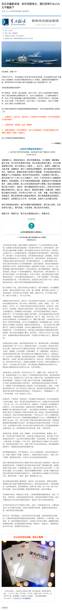
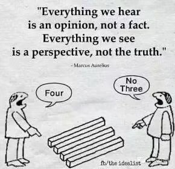

# thinking

> 思维是灵魂的自我谈话。 —— 柏拉图

> 真知灼见，首先来自多思善疑。 —— 洛克威尔

> 生活中只有一种英雄主义，那就是在认清生活真相之后依然热爱生活。-- 罗曼·罗兰

> 技术leader不是靠单兵作战能力取胜，而是靠有效地组织和利用技术资源获得最大化的产出来取胜。

> Impossible is nothing, `just do it`.

> Stick to the end.

## 2018-01-31

> 别让`视野`限制了你的想象力

## 2018-01-18

### 自我批判

* 180118 任正非最新讲话：时代空前伟大，我们还有什么小九九不能放下 <https://mp.weixin.qq.com/s/XbGtWINZio1mrQ9MQSSPvQ>

### 前端技术

* 上世纪90年代中，JS首次出现在`NetScape`中，以浏览器作为运行容器为其提供一个运行的`安全沙箱`，只能实现非常简单的界面交互功能，功能非常受限，很长一段时间以来，前端技术因其功能受限，`无法施展拳脚`，而不被重视，前端技术人员也备受偏见困扰
* `W3C`的推进下，`2010`年开始，前端技术进入飞速发展阶段，并于2015年最终落地`HTML5`；这一阶段使的Web技术发生了天翻地覆的变化，前端语言`一再突破限制`，获得更多的能力，`设备传感器参数、多线程编程、文件读取、2D/3D渲染、WebVR、甚至在浏览器运行二进制代码`等等；前端技术的飞速发展，使其在技术栈中获得了更多的表现力，能实现越来越多的以前无法实现的功能；与此同时，这种飞速发展，也对前端工程师的能力提出了更高的要求。
* 在开源社区，前端技术相关的开源软件活跃度已经多年名列首位，不乏非常优秀的开源库、开源框架和开源解决方案，这需要前端同学保持足够的技术敏锐度，及时同步
* 前端技术发展呈现`多领域、跨领域`齐头并进的态势，技术日新月异，没有做不到，只有想不到，前端同学`切忌固步自封，被已有经验和知识限制了想象力`。
* 前端技术呈现爆发式增长的伟大时代，留给前端同学施展的空间非常之大，当然，要利用好这些技术，也是存在很大挑战的，可说`机遇和挑战并存`，`抓住机遇并勇于接受挑战`才能把握技术的时代脉搏，实现技术理想
* 前端同学需要具备以下能力：
    * `扎实`的前端技术功底，包括语言、框架、工程化等能力
    * 深入思考和研究的能力，能从`深度`上拓展自身技术能力
    * 强大的`技术转化`能力，能将新技术迅速消化吸收并应用
    * 敏锐的`技术嗅觉`，能定期同步业界新技术发展趋势，以及标准组织的新动向
    * 不断`自我革新`，持续更新知识体系

## 2018-01-15

`hugeapp-apollo`项目开启: 进行`深入思考`的重要性

## 2018-01-08

> 军人的承诺：`保证完成任务！`

180104 这才叫执行力! 「 <https://mp.weixin.qq.com/s/IH-niTE681TxYtJeiXCU-A> 」关于`执行力`的一篇令人震撼的文章。

以上图片点击后看全部截图。

## 2017-12-21

> 技术`短期而言`总被高估，`长期而言`总被低估；战战兢兢，如履薄冰，经营`持续释放价值`的技术团队

### 技术配置指导原则

* 不仅要看到业务项目的`短期内`被实现的层面
* 还要看到技术实力背后所需的`长期投入`：`技术架构演进`、`性能和体验的持续优化`、`开发效率和质量的持续提升`、`持续的前瞻性技术研究`等

## 2017-12-08

### 关于递归

动态规划，`递归程序`的设计，容易进入一些误区：

* 没有明确定义`执行体`，出现某些`冗余调用`的情况。比如<ref://../arch/frame-layout-component.md.html>中`processResizeRequest()`的设计，设计过程中出现了两次调用`p = processRatioResize()`的问题

### 关于复杂代码逻辑

* `复杂代码逻辑`的实现方法，先通过`伪代码`详细`描述及论证`好算法逻辑，再`自顶向下`实现代码，过程中可使用`函数桩`代替下级方法。从程序骨架逐步完善，最终形成最终完整代码。
* `while循环`的编写容易漏掉`自变量`的变化，导致首次运行出现`死循环`，而for循环的`固有编写格式`包含自变量的变化，能更好避免初次死循环

## 2017-12-01

> 世界记录诞生记

* <ref://./video/is-he-successful.mp4>
* 他是成功的吗？

## 2017-11-25

> 需要提升`描述能力`

`描述能力`：描述一个问题、一个事件、一个解决方案等的过程，你采用何种表达思路、表达工具，描述过程的娴熟程度，体现了你的描述能力。

## 2017-11-16

`mark`：活着多好，身体是第一位的。

## 2017-11-14

`mark`: 致一起奋斗的好同事、好兄弟，一路走好！

## 2017-11-02

> 乔布斯关于苹果营销的内部演讲 <ref://./video/think-different-steve-jobs.mp4>

* 乔布斯重新执掌Apple时，在内部的一次关于营销的演讲。他将当时要启动的营销活动的主题定为：`Think different.`
* 奶制品业花了20年时间说服你牛奶好，但销量是下降的，直到它们出了`Got Milk`的广告，不提任何产品指标，情况才好转。
* 所以苹果将在五个城市张贴`爱因斯坦，甘地，拳王阿里，爱迪生，现代舞创始人Martha Graham`等人的巨幅肖像，向外传达`苹果是谁`。
* 乔布斯坦言营销最棒的是`Nike`，它是卖商品的，但当你想到Nike时，总会觉得它和普通鞋不一样。Nike的广告不提产品，只赞美伟大的运动和运动员，而不说它们的产品功能，不说它们相比锐步好在哪里。
* 乔布斯说：`那些疯狂到认为自己能改变世界的人才真正做到了改变世界`。
* 乔布斯认为苹果需要放弃谈论speeds and feeds（制造业行话），放弃谈论nips and megahertz（IT业行话），而要塑造一个品牌，因此他解雇了23家合作的广告公司，选了一家非常有创意的广告公司。
* 微信掌门人`张小龙`的办公室墙上挂的就是爱因斯坦、甘地等人的肖像，他也非常推崇Apple的Think Different

## 2017-10-12

学历代表过去，只有`学习能力代表未来`。尊重经验的人，才能少走弯路。一个好的团队，也应该是学习型的团队。

## 2017-09-27

技术leader、架构师`不能停止`代码编写，编码能力总有`上升空间`。

## 2017-09-23

* 端技术已经非常成熟，缺的是什么？大而深的`脑洞` + 做的`勇气和决心`
* 技术世界的发展，程序员们都要`感谢开源`

## 2017-09-20

> 没出息的`9大`根源 <http://www.365yg.com/group/6467414964104593934/>

    犹豫不决
    拖延
    三分钟热度
    害怕拒绝
    自我设限
        平庸的人总抱怨自己不懂的事情
    逃避现实
    总找借口
    恐惧
    拒绝学习

## 2017-09-09

> 耳听为虚，眼见不一定为实

 

更多：<ref://./insight-images.md.html>

## 2017-08-28

> 不要试图去改变一个人，那很难，最好的办法就是改变自己，从我做起。 -- 剑哥

团队管理者，不要试图改变团队成员，来达到统一的团队目标；应该首先`改变自己，从我做起`，再带动团队成员一起从改变自己，最终一起达成团队的统一目标。

## 2017-08-15

代码优化的方向之一就是`复用`，编码过程总在不断`避免重复代码`模式。一个例子：「 <ref://../graphics/canvas.md.html> 」的`Fill and Stroke style`节的`Examples`部分代码。

## 2017-07-29

代码风格一直在变，文档风格也一样。只要`持续做`一件事，`envolution`就一直在发生。

## 2017-07-14

`如何读代码？`

* 首先获得代码文件组织结构以及每个代码文件大体实现的API，形成`File list + API list`
* 了解大体`实现思路`，记录有疑问的点 
* 有选择的`细读代码`，获得的新的理解和感悟`补充`到list中
* list完善到一定程度后，可以对list进行`分拆`或`衍生`出新的章节

## 2017-06-16
> changlog: 170713, 170630

`持续学习`的过程，也是`学习方法`的`掌握`和不断`优化`的过程。

* 不厌其烦的进行`重复`和`更新`，所谓`学而时习之`，并且`持续更新`之
* `相似知识点`，及时`查阅`和`比较`，有必要的话进行更新
* `让每一次学习都有收获`，不辜负自己在学习上每一次的付出，让每一次精神之旅都`不虚此行`
* 知识体系建设，主要落实到`笔记或文档`（学生的话最适合就是笔记），知识体系要达到`随时索引和查阅`的要求
* 笔记先从`关键词`开始，先有大体框架，可在后续的review过程中逐步完善，完善的过程就是`梳理、升华`的过程，收效不小
* 每一次学习都是知识建设的一小步，都是知识大厦的一块坚实的砖头，时刻`敬畏每一小步的积累`

## 2017-06-08

技术leader必须比其他工程师更加`关注产品`，尽其所能地去理解产品的定位、发展方向，挖掘技术的潜力来更好的实现产品。要相信`事在人为`，没有不可能的事情，关键在于你持有的积极取胜的心态，将`追求卓越`进行到底。

## 2017-06-05

> 技术leader常见误区

作为技术leader，我在分配一些看似琐碎而无太多技术含量的任务时，容易犯一个错误，那就是分配给自己：
1. 不要把救火员、补漏的活儿都往自己身上揽，那不是你该做得事
2. 你觉得琐碎而无技术含量，团队的同学不一定这么看
3. 自己来做，相当于没有把tech leader的精力进行最有效的分配，这是一种资源的浪费
4. 应该做的是，将任务分配给团队的同学，同时对任务设定明确验收标准，鼓励团队同学高标准来完成

> 技术leader有所为，有所不为

* 是团队`技术规范`的主要`制定者`
* 建立一套有效的、可操作的`规范标准`，比如编码规范、git工作流规范、预览服务器使用规范、奖惩规范、调研文档规范等等，并与团队成员`达成一致`
* 任务生成、指派、认领、追踪、成果评估等`过程标准化`
* 不一定事无巨细均参与其中，但`架构设计、产品讨论、技术方案讨论、规划制定、规范标准制定等`基础性工作必须深入参与其中
* 有了标准，就可以将任务分配给团队内适合的同学来负责，需要做好任务的trace，每个同学都有其专长，需要提供机会让其充分发挥
* 业务讨论必须尽可能都参与，`定期参与`一些业务项目的架构设计和`编码`，做到笔耕不辍

## 2017-05-11

> 成功的人与不成功的人之间的区别，在于成功的人`坚持到底`。 -- 乔布斯，2001年的采访

今天和业主一起去了中介总部，胜利而归，争取到了自己的权益。`一定要坚持自己的原则，不能松口，坚定不移才能最终达到目的`。挺佩服业主的坚定的。

## 2017-04-20

> 研究技术也讲究方法和方法论（灵感来自`HugeApp-Ares`）

只做不看，不行；只看不思考消化，不行；只思考不做，不行；浮于表面的做，不行；只做不总结，也不行。

要多看，多思考，多做且做得深入，做完多总结。

## 2017-04-19 

### HugeApp 

不能脱离业务，但深刻理解技术点必须通过`持续进展`的个人项目来达成，这种个人项目不是简单的demo，应该是一个`有产品逻辑、有较高复杂度、有较深技术内涵、有用其他框架不断重新实现的价值`的项目，我称之为`HugeApp`

### 定位
提供`架构师`在技术上不脱离`业务、实践及前沿技术`进行`持续研究`的一种方式。

### 解读
* 能涉及`各个层次技术`，从前端到客户端再到服务端，各种技术都可以接入
* 这种体量的app势必耗费很大的个人精力，如何做到不脱离业务？HugeApp应该吸纳`业务相关`的`架构技术`在其中，才能保证对业务的技术把握
* HugeApp不同于个人站点，不要混为一谈
* 与`知识体系建设`的关系，是`同步建设及相互促进`的关系

## 2017-02-23

> 幸福不是奖赏，而是结果；苦难不是惩罚，而是报应。  —— 英格索尔

不道德的人，自然会在将来某个时刻得到惩罚，虽然你现在受到了不公，大可不必理会这样的人。

## 2017-02-09

> 调研一项新技术的时候，采用的方式，是`深度优先`还是`广度优先`？

调研一项新技术，可能涉及多种内含的其他新技术。这些新技术对你来说都是新事物，你需要了解它们才能更好的进行你的研究。那么这些新技术的掌握，该采用那种方式展开呢？

但有一个原则是不变的，就是做好`关键点的记录`，用于后续复盘。

### 广度优先

对碰到的新技术，只做简单记录和了解。这样能对调研的目标尽早有一个全盘的理解。但这种了解是比较浅显的，很多细节性的东西会被忽略。这时需要再使用`深度优先`来`复盘`，达到较全面的了解。

### 深度优先

对碰到的新技术，做一番较深入的了解。再继续下一个遇到的新技术的了解。花的时间较长，可能存在不必要的时间耗费。这种方式的好处是，类似超链分析，你将地毯式的学习新技术。

深度优先，需要把握好度，不至于喧宾夺主，花太多时间在内含新技术上。

## 2016-07-02

最近的一次电梯晕倒，给了我很大一记警钟，`健康`的身体真的很重要，切实体会到了。不要太疲劳，保证睡眠充足和质量一定要用心去落实。

## 2016-02-22

无谓的紧张、担心、感觉压力大。

这些紧张情绪对生活和工作状态有极大影响，影响你的正常生活方式、正常工作状态的发挥、正常的谈吐、正常能力的发挥；

却没有任何好处，只会带来各种麻烦和困扰。需要避免，在潜意识里避免，时刻保持一种认知，过度的紧张、担心，放大压力，没有任何好处。

人已经活得不容易，生活的压力，工作的压力都不小，为何还要这么折磨自己。

体质上讲，我已经属于容易紧张，容易表现紧张状态的体质。紧张源于自身的意识，如果你在自己的意识上减弱这种暗示，甚至剔除这种暗示，那么我想应该是没有那么多令人紧张的情况的。

## 2015-08-27

最近觉得好多东西要学习和实践，每天除了业务上的精力投入，都希望能投入到这些学习和实践中。

一天下来，会发现没做什么东西，要么都是在看网页，查资料；要么都做业务的事情了；要么发现总是提不起来做一件事情，总是搁置。

也有些时候发现，开始稍微花点时间做一件事情，会突然收获成就感。重点在于`开始`两个字，看来近期`万事开头难`这个不能再熟悉的现象在给我某些提示。

## 2015-08-11

有些事情可以一拍脑袋就做，短时间就完成；

有些事情一拍脑袋就做，花一段时间钻入其中，最终做出来了。却发现，调研不够，明白人一看，甩下一句`"又是一个重复造的轮子"`。

要花较大精力才能完成的事情，一定要做好调研的准备，避免方向走偏，方案不够成熟。

## 2015-05-23

技术到达一定级别以后，拼的就是视野。

架构师需要有宽广的技术视野

对技术方案的实现思路的把握，比对实现细节的把握更重要

判别一个技术方案，需要对相关技术方案集合都有一个全局了解，主要是思路、优劣等的判别

