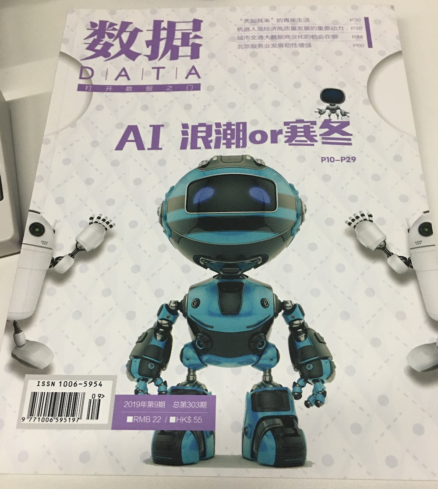
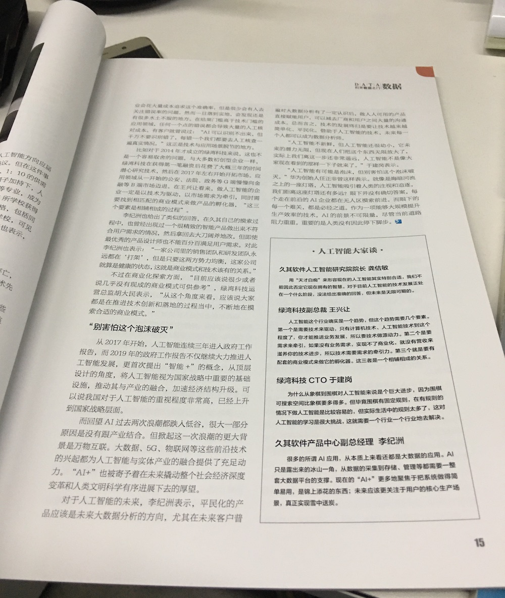

# thinking

> 思维是灵魂的自我谈话。 —— 柏拉图\
真知灼见，首先来自**多思善疑**。 —— 洛克威尔\
生活中只有一种英雄主义，那就是在认清生活真相之后依然热爱生活。—— 罗曼·罗兰\
技术leader不是靠单兵作战能力取胜，而是靠有效地组织和利用技术资源获得最大化的产出来取胜。\
Impossible is nothing, `just do it`.\
Stick to the end.\
方法总比问题多。\
你感到焦虑、缺乏信心、没有把握，原因不在你的能力，而在于你没有准备好。\
做**充分的准备**，直到你有信心为止。\
自律才有自由，自由才有自信。

## 2020-02-12
* **丰田一页纸**思考方法
    * 参考：<https://www.toutiao.com/a6793240845232374283> 
    * 明确问题 - 分解问题 - **设定目标** - 把握真因 - 制定对策 - 评价结果、巩固成果

## 2020-02-12
* 结构化思维
    * **清晰表达**的原则：
        * **结论先行**
        * 分类阐述：互相独立，完全穷尽（MECE - Mutually Exclusive Collectively Exhaustive）
        * 逻辑递进：纵向层次有**逻辑**关系，横向层次有**递进**关系
    * 参考文档：
        * 结构化思维三原则 <https://www.jianshu.com/p/4b9fcf6443dc>
        * 深度思考篇：结构化思维 <https://www.jianshu.com/p/356dad951e61>
        * 结构化思维 <https://baike.baidu.com/item/结构化思维/1482961>
        * 如何训练结构化思维——学习笔记 <https://mbd.baidu.com/newspage/data/landingshare?pageType=1&isBdboxFrom=1&context=%7B%22nid%22%3A%22news_9326223142012864469%22%7D>
* MECE分析法
    * 参考：
        * MECE <https://baike.baidu.com/item/MECE/7762637>
* 三种主要的**逻辑推理**方法：归纳、演绎、类比
* 演绎思路：
    * 现状、现状分析、解决方案
    * 问题、分析、解决方案
    * 昨天、今天、明天
    * 总结过去、把握当下、展望未来
* 分类思路： 
    * 人的方面、事的方面
    * 团队方面、个人方面
    * 外部、内部
    * 有关的方面、无关的方面
    * 重要的、不重要的
    * 紧急的、不紧急的
    * 做的好的、做的不好的
    * 有利的、不利的
    * 优势、劣势
    * 。。。
* 要素抽取

## 2020-02-10

* 承认每个个体存在的能力限制，生理极限、个体差异、思维能力等
* 坚信坚持不懈、一丝不苟、步步为营、厚积薄发的力量
* **借助并利用好工具**，人本来就是工具的创造和使用者
    * 电子笔记
    * 笔和纸

## 2020-02-01
> 「闭环思维」，让靠谱成为习惯：凡事有着落，件件有回音

## 2019-12-10

「人工智能， 第三次浪潮OR寒冬？ 」
> 记录第一次上报，以人工智能技术领域访谈的形式
* PC版北京商报网 <http://www.bbtnews.com.cn/2019/1016/321822.shtml> 2019-10-16
* 移动版 <http://mini.eastday.com/mobile/191016132242598.html>

| 数据杂志封面 | 文章内容页（左边中部） |
|  \
    |  |

## 2019-11-27

### 巴菲特89岁生日采访

> 2019年8月30日，巴菲特89岁生日，CNBC对他做了一次采访，让股神分享几条人生的建议。巴菲特给出了六条建议：

* 1、Marry the right person 婚姻是一生最重要的决定
* 2、Invest in yourself 最好的投资是投资自己
* 3、Associate yourself with “high-grade people” 和高质量（高尚）的人交往
* 4、Work for people you respect 为你尊敬的人工作
* 5、Ignore the noise 忽视投资中的噪音
* 6、Success isn’t measured by money 成功更关乎于爱，而不仅是金钱

巴菲特**99%**的财富是**50岁之后**赚来的。巴菲特不认为金钱意味着成功。他表示，**“衡量成功的标准，是有多少人爱你”**

#### Marry the right person

婚姻是一生中最重要的决定。

#### Invest in yourself

“By far the best investment you can make is in yourself,” Buffett told Yahoo Finance editor-in-chief Andy Serwer earlier this year.

First, “learn to communicate better **both in writing and in person**.” Honing that skill can increase your value by at least 50%, he said in a Facebook video posted in 2018.

Next, take care of your body and mind — especially when you’re young. “If I gave you a car, and it’d be the only car you get the rest of your life, you would take care of it like you can’t believe. Any scratch, you’d fix that moment, you’d read the owner’s manual, you’d keep a garage and do all these things,” he said. “You get exactly one mind and one body in this world, and you can’t start taking care of it when you’re 50. By that time, you’ll rust it out if you haven’t done anything.”

「 By far the best investment you can make is in yourself. 」

Warren Buffett\
BERKSHIRE HATHAWAY CEO

#### Associate yourself with ‘high-grade people’

Who you associate with matters, Buffett told author Gillian Zoe Segal in an interview for her 2015 book, “Getting There: A Book of Mentors.” “One of the best things you can do in life is to surround yourself with people who are better than you are,” he said.

If you’re around what he calls “high-grade people,” you’ll start acting more like them. Conversely, “If you hang around with people who behave worse than you, pretty soon you’ll start being pulled in that direction. That’s just the way it seems to work.”

#### Work for people you respect

“Try to work for whomever you admire most,” Buffett told Segal. “It won’t necessarily be the job that you’ll have 10 years later, but you’ll have the opportunity to pick up so much as you go along.”

While salary is an important factor when thinking about your career, “You don’t want to take a job just for the money,” said Buffett.

He once accepted a job with his mentor and hero, Benjamin Graham, without even asking about the salary. “I found that out at the end of the month when I got my paycheck,” he said.

#### Ignore the noise

Investing can get emotional, and it doesn’t help that you can see how you’re doing throughout the day by checking a stock ticker or turning on the news.

But no one can be certain which way the financial markets are going to move. The best strategy, even when the market seems to be tanking, is to keep a level head and stay the course, Buffett says.

“I don’t pay any attention to what economists say, frankly,” he said in 2016. “If you look at the whole history of [economists], they don’t make a lot of money buying and selling stocks, but people who buy and sell stocks listen to them. I have a little trouble with that.”

#### Success isn’t measured by money

Buffett is consistently one of the richest people in the world, but he doesn’t use wealth as a measure of success. For him, it all boils down to if the people you’re closest to love you.

“Being given unconditional love is the greatest benefit you can ever get,” Buffett told MBA students in a 2008 talk.

“The incredible thing about love is that you can’t get rid of it. If you try to give it away, you end up with twice as much, but if you try to hold onto it, it disappears. It is an extraordinary situation, where the people who just absolutely push it out, get it back tenfold.”

## 2019-10-11

> 摘：很多人也常问我，自己情商低，应该看什么书，我一般推荐三本书：一本是杜月笙传，一本是胡雪岩传，一本是曾国藩传。当官要读曾国藩，经商可读胡雪岩，混社会当然可以看一看杜月笙传。
* 三本书：《曾国藩传》、《胡雪岩传》、《杜月笙传》

> 《跟毛泽东学管理》摘要
6. 以和为贵，化解员工之间的矛盾
    * 各去所偏，归于一是
4. **制度不严肃**是执行力差的根本原因
    * 三大纪律八项注意
    * 中国传统文化讲究个人修为，讲究独善其身，纪律意识一向是中国人缺少的。毛泽东就曾经说：“日本敢于欺负我们，主要原因在于中国民众的无组织状态”

## 2019-10-06

> 身体是自己的，与他人无关
* 需要自己照顾自己，他人无法照顾
* 自己才能真正体会身体状况，更好地做出判断，其他人包括家人无法做到
* 身体是自己的、家庭的，但不是公司的、团队的
* 身体垮了，直接影响家庭和亲人
* 身体垮了，需要家人照顾，拖垮家庭拖累亲人，不如尽早关注身体，自己照顾好自己

## 2019-09-17

* 不打或少打无准备之仗：时间早一点，多花点时间，前紧后松，勤加练习等
* 有准备之心是一颗最强大的心

## 2019-09-06

* 还得多考虑后续的工作中，如何**延续自己的技术理想**
* 找到一个**抓手**：**文档工具为核心**的周边技术

## 2019-08-09

* 需要合作来解决的事情，尽早发起合作的沟通，让大家一起来想办法
* 一项任务需要多人实现，尽早安排任务，让大家一起承担
* **捂在手里时间越长，你的压力越大**，正所谓及时将包袱扔出去

## 2019-07-18

* 做上层设计，需要团队的成员一起协作，由团队成员提供各部分内容，再统一整合成需要输出的内容
* 这时，需要对团队成员的输出提要求，如何提要求能更准确呢？
* 可以**从最终所需输出来倒推**。同时，**越接近最终结果的细化最终输出框架**，越能明确提出各部分内容的要求 

## 2019-06-22

我们做技术的同学，好多事情往往只要再往前推一下，就是一片新的天地。这一步对我们来说往往并不困难，但往往大家都不想去做，实际上只要我们去做了，收效往往超出预期。这一步可能是花一天时间将一个组件封装一下，可能是将demo改改，可能是梳理个技术文档

## 2019-06-03

* **学会休息，认真对待休息**
* [ 190602 ] 走不出舒适区，就是另一种上瘾 <https://mp.weixin.qq.com/s/xI-k5320PqF4oTIn2VoNaQ>
    > 我平时刷知乎，都是默认选择「关注」页，看我关注的用户。但这次，我试着调成了「推荐」页，看算法给我推荐的内容。
    > 
    > 然后，我大致估算了一下自己在那几天里，刷知乎的时间。
    > 
    > 结果很有意思：尽管我有意识地控制时间，**尽管算法推荐的内容质量不如我关注的用户，但前者所消耗的时间，仍然要比后者多**。
    > 
    > 原因是什么呢？一个最重要的原因是：我关注的用户不多，所以很容易刷到末尾 —— 亦即发现：「啊，这个内容，我之前是看过的」。
    > 
    > 理论上来说，哪怕我刷到了末尾，我也可以去看看别的东西 —— 比如同一个问题下其他回答、相关问题，等等 —— 但这个进入意识的念头，就会给我一个信号：已经刷了很久了，该去做点别的事情了。
    > 
    > 作家 Adam Alter 把它叫做**「停止信号」**。你也可以理解为，它是一种**「心理边界」**，会提醒你**「该停下了」**。
    > 
    > 不要小看这个东西，很多时候，它的影响是超乎想象的。
    > 
    > 你一定有过这样的体验：本来只是想查个资料，但一发不可收拾，一个个链接点击过去，一个个页面不断跳转，醒悟过来时，已经花费了大量时间。但究竟都看了什么内容？却说不出来。
    > 
    > **这就是互联网所带来的「时间黑洞」。原因就是因为，它屏蔽了给你的「停止信号」**。
    > 
    > 再往后，Pinterest 发明了瀑布流，社交网站发明了信息流，连跳转链接也省去了：你只需要往下滑动，新的信息就会源源不断地送到你面前。
    > 
    > **信息流**的模式，进一步降低了获取信息的阻力。除非像文章最开头一样，刷到「上一次开始的地方」，否则人们很少能触碰到「边界」。
    > 
    > 
    > 而算法的崛起，又将这种模式推到了极致：通过你的行为，算法可以找到对你最具吸引力的内容，省去人工推荐的成本和时间线的不可控性，源源不断地分发内容。
    > 
    > 更有趣的是：你的每一个行为，都在为算法贡献素材，成为它的养分。它会依据你的行为壮大自己，完善自己，更好地掌握你的喜好。
    > 
    > 2015 年，剑桥大学和斯坦福大学做过一项实验。他们邀请参与者 A 的一系列亲朋好友，回答一份针对 A 的测试问卷，来测试他们对 A 的了解程度。与此同时，他们根据 A 在社交网络上的行为数据，让算法同步来回答问题。
    > 
    > 结果是什么呢？只需要 10 个「喜欢」，算法就会超过你的同事。而一旦有了 300 个「喜欢」，算法对你的了解，就可以超过你的伴侣。
    > 
    > 甚至，在一些情况下，算法比参与者更了解他们自己 —— 在一些对未来行为和决策的预测中，算法的准确性比本人更高。
    > 
    > 在这种情况下，你是在主动吸取信息，还是在被算法饲养？
    > 
    > 回答可能会令人忧虑。
    * **沉浸感**：尽可能减少其他因素对你的干扰，降低你认知负荷和注意力负担，让你无需去反复思考
    * 警惕「时间黑洞」

## 2019-05-31

* [ 190530 ] “发条朋友圈我都要犹豫1小时” | 内心敏感，是一种被严重忽略的天赋 <https://mp.weixin.qq.com/s/PuXq8L1xi8P3kGb8xLlUQg> 敏感的人，在小时候被认为是害羞，长大后被认为是内向。
    > “内心敏感的人并不软弱，我们拥有着温柔的力量。”
    1. 敏感的人更容易与他人建立深层次的关系
    2. 敏感的人可以更好地规避风险
    3. 敏感的人可以表现出非凡的创造力

* [ 190530 ] 比能力重要100倍的，是这3个底层思维 <https://www.toutiao.com/a6696700441113133572/> 
    * 当你牛到一定程度，底层能力可以迁移
    * 用更高的版本要求自己
    * **攻其一点，不及其余**
    > **越努力，越自由**；越努力，越有选择权

## 2019-04-27

> [ 190424 ] 我见过最高级的聪明，是**靠谱** <https://mp.weixin.qq.com/s/kgWVu3eiLEQfyHREdtIN3g>

靠谱而便宜的员工，是不存在的。\
靠谱这个词，本身就是身价的代表。

著名管理学家**陈春花**老师说，一个人被组织提拔，其实不只是因为能力，而是**因为信任**。\
这话怎么理解？我应该如何建立信任，让领导觉得我值得培养？

他答：

你要做个靠谱的人，\
不要耍小聪明，不要老想走捷径。 \
很多人的聪明，其实是小聪明，\
而靠谱，是能让你走得更远的品质。\
因为聪明的人太多，靠谱的人太少。

**靠谱**的态度就是：

你能把每一件事都做到能力边界内的最好，甚至超出预期；\
你能让人放心把一件事完全交给你，凡事都有反馈；\
你能给人确定性，合作界面友好，而不是处处给人挖坑。

## 2018-12-30

* 做一个`认真做事`的人
* 做一个`坚持认真做事`的人

## 2018-12-02

* 团队不应太过依赖技术能力强的个体，避免由于这些个体的离开给团队带来的巨大影响
* Leader需要对技术分极保持敏感，做好人员备份
* 新人接替老人活，老人做新事

## 2018-11-19

* [ 180909 ] 大多数人的平庸，来自于极差的`执行力` <https://www.toutiao.com/a6599123132093563395/>

## 2018-11-08

* 技术日新月异，知识体系的建设对于个人技术成长，以及在技术的不断更迭中保持与时俱进，实现个人技术生涯软着陆都非常重要，知识体系要保持活水（新技术跟进、技术交流），也要有沉淀（总结）

## 2018-10-17

* 很多时候，习惯会支配着我们的行为，我们要多让大脑支配我们的行为

## 2018-08-22

* 工作中发现问题、解决问题的过程中，需要`尽力去做到不惑`，这样才会有更大的收获。而`不是止步于猜测的结论`，通常猜测的结论都是不全面的，或者错误的，有很大迷惑性，对长期知识体系的建设来说，具有很大的破坏性

## 2018-07-11

* 工作的`延续性`，不要浪费`历史工作沉淀`的价值
* 编程过程中，熟练使用`debugger`是很重要的一项技能

## 2018-07-05

* 走向卓越的路很漫长
* 做事情到80分，似乎满足要求了，觉得也挺快就完成了；往90分进发的时候，往往没有想象中简单；如果想继续出发，不断接近100分，过程远比想象中艰难

## 2018-07-03

* 2018年是我入职以来，公司、团队最难的一年
* 需要坚持，不放弃

## 2018-06-27

### 技术团队需具备的能力

* 业务实现能力
* 快速原型能力，擅长`用Demo说话`
* 技术研究和创新能力

## 2018-06-12

> 学习方法

* 学而时习之
* 阶段性总结
* 不断重复，刻意练习

## 2018-06-12

* 团队管理，需要有`居安思危`的意识
* 定期的`一对一`交流，互相了解想法
* 定期的`team building`，增进团队感情

## 2018-06-03

具有强`Delta能量`的技术同学，一般都具备很强的`用Demo说话的能力`

## 2018-06-02

### DK效应

> `达克效应`：能力不足的人**没有能力认识到自己的不足** 

 

from @凯哥

## 2018-05-31

### 光绪年间一个真实的故事

> `“善恶报应”`是一点不假、一点不会错的，关键时刻的善恶一念，就将决定自己的未来命运

`江苏`的`贾先生`，在`上海租界`一`洋行`工作，深得老板信任。

端午节前，老板派他去城南一带收欠款，他带上皮袋子就出发了。

事情进展的还算顺利，到中午，共收得银洋`一千八百多块`。

贾先生走了半天，说了半天，早已是口干舌燥，疲惫不堪。

正好来到`“十六铺”`的茶楼，进去匆忙喝了点茶就急忙赶回去交差，以便好好休息一下。

贾先生回到商行才发现皮袋子不见了，顿时如雷轰顶、大汗淋漓、吓懵了，慌乱中更加说不清道不明。

老板看他神色慌张、张口结舌，语无伦次，认为其中有诈。

于是厉声斥责他辜负了东家的信任，并说如不赶快归还就送他见官。

一千八百多银元在当时可是一笔巨款阿，如果不乱花，足够一个人用一辈子，他贾先生又如何赔得起呢，责任重大，又有口难辨，感到这辈子完了，绝望地大哭起来。

话分两头，另有一位`浦东人`，`姓义`，也在`租界从商`，因运气不好，赔了个精光，于是买好了那天`午间的船票`准备渡江回乡。因为离上船时间还早，也来到“十六铺”茶楼，想慢慢喝着茶来消磨这段时光，也好考虑一下以后的生活怎么办。

恰好是在贾先生刚匆匆离去时义先生就到了。

义先生刚坐下，发现身边的椅子上有个小皮袋子，也没多加理会，慢慢喝起茶来。

许久仍不见有人来取，义先生疑惑起来，提了提感觉沉重，打开一看，他眼珠子差点没惊的掉出来：竟然全是光闪闪的银元！

义先生惊喜交加！这可真是一笔大财啊，它不但可以改变自己目前的穷困潦倒状态，而且后半生衣食也有余了。

但他又转念一想：不行，`钱财是各有其主的`，这钱我不能要！要是因为我把钱拿走了，失主因此而丧失名誉，甚至失掉性命，我的罪孽可就佐大了！

那个年代，一般正经人都知道`“不义之财不能取”`的道理。

义先生心想：既然今天让我拾到了这些钱财，我就应该`尽到责任、物归原主`。

到了吃午饭的时候，茶楼的客人只剩了八九个，看他们的神色，没有一个象是丢了钱的，只好饿着肚子等下去。

一直等到掌灯的时分，茶客都回家去了，只剩了义先生一人，他仍然聚精会神地注视着过往的人……

突然，他看到一个人面色惨白、锒锒跄跄的朝这里奔来。

来人正是贾先生，后面还跟着两个人。

一进茶楼，贾先生就指着这个茶桌对那两人说：“就是那里，我当时就是坐在那里的！”，三人径直向义先生桌子走来。

义先生看得出他们就是失主，笑着对贾先生说：“你们掉了钱袋吗？”贾先生不可置信的盯着他一个劲的点头。“我等你们很久了”，义先生说着拿出那个皮袋子给他们看。

贾先生感激的浑身颤抖，说：“您真是我的救命大恩人哪！没有您，我今晚就要上吊了！”

原来，贾先生发现钱丢了时，就想返回去沿途找一遍，虽然能找回的希望渺茫，但也只有这一条路了。

可是主人怕他潜逃，不准他出门，他费尽口舌说了半天，主人才叫两人陪他出来寻找，还嘱咐陪人务必把他带回去。

二人互报姓名后，贾先生要以五分之一作为酬谢，义先生坚决不要；又改为十分之一，义先生还是不要；再改为百分之一，义先生生气了，严词拒绝。

贾先生不知如何酬谢才好，于是说：“那我请您喝酒，好吗？”义先生仍然坚决推辞。

最后，贾先生说：“不谢我心怎安！明天早晨在下在某某酒楼恭候，恳请恩公大驾光临，不见不散。”说罢一揖，掉头走了。

第二天早晨，义先生居然来了。

贾先生正要施礼再谢，义先生却抢先道谢，说：“`多亏您昨天丢了钱，让我捡回了一条命`！”贾先生一头雾水，正待细问，义先生接着说：“我昨天原定渡江回乡的，已经买好了午间一点钟的船票，因为等您来取钱把船耽误了，回到住处得知，那条船行驶到半途被急浪打翻，船中23人全都淹死了。我如果上了那船，岂不也一命归西了？是您救了我的命啊！”说罢再拜。两人互相感激的一塌糊涂。

周围的客人们听了都啧啧称奇，纷纷举杯向他二人祝贺，说`义先生一桩善举挽救了两条人命`。

故事到此还没结束。

贾先生三人回去后，把事情一说，老板也十分惊奇，感慨地说：“这么好的人真是难找啊！”非要见见义先生不可。

结果两人见面后非常投缘，经过一番长谈后，老板极力挽留义先生，并`高薪聘请`他主管账目。

几个月后老板就招义先生当了`上门女婿`。

再以后干脆把生意全交给了他打理。

穷困潦倒的义先生拾金不昧的故事很快传开了，他的`诚信、仁义`赢得了人们的赞叹，大小客商都纷纷找上门来与他做生意，他家的生意越做越大，后来义先生竟`拥资数十万`，成为了当地的大富翁。

这个故事再次告诉我们，`“善恶报应”`是一点不假、一点不会错的，关键时刻的善恶一念，就将决定自己的未来命运。

## 2018-05-29

如何给下属安排任务，是管理者必修的一课。

* 说明任务背景
* 明确预期达到的目标
* 明确时间点
* 明确大体进行步骤，以及check point
* 定期check并review

## 2018-05-22

> 管理需要考虑不同人的风格，因人而异

* `自驱型`，给发挥空间，不做太多框架要求
* `执行型`，给出具体执行步骤，明确预期结果

## 2018-04-17

> 目标清晰、职责明确、赏罚分明、超越伯乐

管理的最低要求是什么？（阿里巴巴16字管理真言）<https://mp.weixin.qq.com/s/eeC67M-9LuuGUa_hJNcKvQ>

## 2018-04-16

### 重温乔布斯

<https://wenhui.whb.cn/third/jinri/201804/12/194953.html>
* 你的时间有限，所以不要为别人而活。不要被教条所限，不要活在别人的观念里。不要让别人的意见左右自己内心的声音。
* `记住你即将死去`是我一生中遇到的最重要箴言。它帮我指明了生命中重要的选择。
* 在你生命的最初30年中，你**养成习惯**；在你生命的最后30年中，你的**习惯决定了你**。
* 伟大的艺术品不必追随潮流，它本身就能引领潮流。
* 拥有初学者的心态是件了不起的事情。
* 如果你很忙，除了你真的很重要以外，更可能的原因是：**你很弱**。
* 只有那些疯狂到以为自己能够改变世界的人，才能真正改变世界。
* **自由**从何而来？从自信来，而**自信**则是从**自律**来！
* `专注和简单`一直是我的秘诀之一。简单可能比复杂更难做到：你必须努力厘清思路，从而使其变得简单。最终这是值得的，因为一旦你做到了，便可以创造奇迹。很多伟大的人，都`崇尚极简`，极简不光是一种生活方式，更是一种`人生哲学`。当极简成为实践，就成为了一种伟大的力量。

### 未来三大科技革命

<https://www.toutiao.com/i6543345937643733511/> 未来5年到10年，是全球新一轮科技革命和产业变革从`蓄势待发`到`群体迸发`的关键时期。随着全球新一轮科技革命的飞速发展，颠覆性技术革新风起云涌，其中最引人瞩目的包括`量子计算、人工智能与区块链`等

### 我们如何应对

大数据可视化、AI应用、新技术应用落地（WebVR/WebAR、WebAssembly、PWA等）

## 2018-03-10

2018印尼年会感悟：

1. `装备的力量`，防晒衣避免晒伤，是一种非常有效的装备；那么，推展开来，滑冰防护装备之于滑冰入门，游泳装备之于游泳入门，应该都是可以尝试使用的。
2. 新加坡码头安检：他人的无理言语，大可不必理会，那不是我们的问题，没有理由让我们增加负担
3.  积极主动进行`充分的准备`，自然更有自信，压力也更小

## 2018-03-01

> 两个不断，实际上是一种`坚持`

* 不断`实践`的力量
* 不断`写作`的力量

## 2018-02-28

### 过好早晨

* 「 怎样度过早晨，便怎样度过一生 」 <https://mp.weixin.qq.com/s/LF_a1TkLjRRKZUvQAqYTJQ>

### 春节感悟

* 开慢车，开稳车
* 感冒需要预防，及早吃药
* 越`积极主动`，压力越小

## 2018-02-09

> 关于技术`学习和实践`

* 只学习不实践，较难达到理想的深度
* 只有`学习加实践`，才能达到理想的`深度`
* 技术Leader的实践可以是依托自行设定的项目，通过项目的`不断迭代`来实践

## 2018-02-07

新工作习惯Get：编辑器Terminal`全屏`能减少即时消息的打扰，更容易专注编程或写文档

## 2018-01-31

> 别让`视野`限制了你的想象力

## 2018-01-18

### 自我批判

* 180118 任正非最新讲话：时代空前伟大，我们还有什么小九九不能放下 <https://mp.weixin.qq.com/s/XbGtWINZio1mrQ9MQSSPvQ>

### 前端技术

相关内容已迁移至「关于前端」- <ref://../frontend/about.md.html>

## 2018-01-15

`hugeapp-apollo`项目开启: 进行`深入思考`的重要性

## 2018-01-08

> 军人的承诺：`保证完成任务！`

180104 这才叫执行力! 「 <https://mp.weixin.qq.com/s/IH-niTE681TxYtJeiXCU-A> 」关于`执行力`的一篇令人震撼的文章。

以上图片点击后看全部截图。

## 2017-12-21

> 技术`短期而言`总被高估，`长期而言`总被低估；战战兢兢，如履薄冰，经营`持续释放价值`的技术团队

### 技术配置指导原则

* 不仅要看到业务项目的`短期内`被实现的层面
* 还要看到技术实力背后所需的`长期投入`：`技术架构演进`、`性能和体验的持续优化`、`开发效率和质量的持续提升`、`持续的前瞻性技术研究`等

## 2017-12-08

### 关于递归

动态规划，`递归程序`的设计，容易进入一些误区：

* 没有明确定义`执行体`，出现某些`冗余调用`的情况。比如<ref://../arch/frame-layout-component.md.html>中`processResizeRequest()`的设计，设计过程中出现了两次调用`p = processRatioResize()`的问题

### 关于复杂代码逻辑

* `复杂代码逻辑`的实现方法，先通过`伪代码`详细`描述及论证`好算法逻辑，再`自顶向下`实现代码，过程中可使用`函数桩`代替下级方法。从程序骨架逐步完善，最终形成最终完整代码。
* `while循环`的编写容易漏掉`自变量`的变化，导致首次运行出现`死循环`，而for循环的`固有编写格式`包含自变量的变化，能更好避免初次死循环

## 2017-12-01

> 世界记录诞生记

* <ref://./video/is-he-successful.mp4>
* 他是成功的吗？

## 2017-11-25

> 需要提升`描述能力`

`描述能力`：描述一个问题、一个事件、一个解决方案等的过程，你采用何种表达思路、表达工具，描述过程的娴熟程度，体现了你的描述能力。

## 2017-11-16

`mark`：活着多好，身体是第一位的。

## 2017-11-14

`mark`: 致一起奋斗的好同事、好兄弟，一路走好！

## 2017-11-02

> 乔布斯关于苹果营销的内部演讲 <ref://./video/think-different-steve-jobs.mp4>

* 乔布斯重新执掌Apple时，在内部的一次关于营销的演讲。他将当时要启动的营销活动的主题定为：`Think different.`
* 奶制品业花了20年时间说服你牛奶好，但销量是下降的，直到它们出了`Got Milk`的广告，不提任何产品指标，情况才好转。
* 所以苹果将在五个城市张贴`爱因斯坦，甘地，拳王阿里，爱迪生，现代舞创始人Martha Graham`等人的巨幅肖像，向外传达`苹果是谁`。
* 乔布斯坦言营销最棒的是`Nike`，它是卖商品的，但当你想到Nike时，总会觉得它和普通鞋不一样。Nike的广告不提产品，只赞美伟大的运动和运动员，而不说它们的产品功能，不说它们相比锐步好在哪里。
* 乔布斯说：`那些疯狂到认为自己能改变世界的人才真正做到了改变世界`。
* 乔布斯认为苹果需要放弃谈论speeds and feeds（制造业行话），放弃谈论nips and megahertz（IT业行话），而要塑造一个品牌，因此他解雇了23家合作的广告公司，选了一家非常有创意的广告公司。
* 微信掌门人`张小龙`的办公室墙上挂的就是爱因斯坦、甘地等人的肖像，他也非常推崇Apple的Think Different

## 2017-10-12

学历代表过去，只有`学习能力代表未来`。尊重经验的人，才能少走弯路。一个好的团队，也应该是学习型的团队。

## 2017-09-27

技术leader、架构师`不能停止`代码编写，编码能力总有`上升空间`。

## 2017-09-23

* 端技术已经非常成熟，缺的是什么？大而深的`脑洞` + 做的`勇气和决心`
* 技术世界的发展，程序员们都要`感谢开源`

## 2017-09-20

> 没出息的`9大`根源 <http://www.365yg.com/group/6467414964104593934/>

    犹豫不决
    拖延
    三分钟热度
    害怕拒绝
    自我设限
        平庸的人总抱怨自己不懂的事情
    逃避现实
    总找借口
    恐惧
    拒绝学习

## 2017-09-09

> 耳听为虚，眼见不一定为实

 

更多：<ref://./insight-images.md.html>

## 2017-08-28

> 不要试图去改变一个人，那很难，最好的办法就是改变自己，从我做起。 -- 剑哥

团队管理者，不要试图改变团队成员，来达到统一的团队目标；应该首先`改变自己，从我做起`，再带动团队成员一起从改变自己，最终一起达成团队的统一目标。

## 2017-08-15

代码优化的方向之一就是`复用`，编码过程总在不断`避免重复代码`模式。一个例子：「 <ref://../graphics/canvas.md.html> 」的`Fill and Stroke style`节的`Examples`部分代码。

## 2017-07-29

代码风格一直在变，文档风格也一样。只要`持续做`一件事，`envolution`就一直在发生。

## 2017-07-14

`如何读代码？`

* 首先获得代码文件组织结构以及每个代码文件大体实现的API，形成`File list + API list`
* 了解大体`实现思路`，记录有疑问的点 
* 有选择的`细读代码`，获得的新的理解和感悟`补充`到list中
* list完善到一定程度后，可以对list进行`分拆`或`衍生`出新的章节

## 2017-06-16
> changlog: 170713, 170630

`持续学习`的过程，也是`学习方法`的`掌握`和不断`优化`的过程。

* 不厌其烦的进行`重复`和`更新`，所谓`学而时习之`，并且`持续更新`之
* `相似知识点`，及时`查阅`和`比较`，有必要的话进行更新
* `让每一次学习都有收获`，不辜负自己在学习上每一次的付出，让每一次精神之旅都`不虚此行`
* 知识体系建设，主要落实到`笔记或文档`（学生的话最适合就是笔记），知识体系要达到`随时索引和查阅`的要求
* 笔记先从`关键词`开始，先有大体框架，可在后续的review过程中逐步完善，完善的过程就是`梳理、升华`的过程，收效不小
* 每一次学习都是知识建设的一小步，都是知识大厦的一块坚实的砖头，时刻`敬畏每一小步的积累`

## 2017-06-08

技术leader必须比其他工程师更加`关注产品`，尽其所能地去理解产品的定位、发展方向，挖掘技术的潜力来更好的实现产品。要相信`事在人为`，没有不可能的事情，关键在于你持有的积极取胜的心态，将`追求卓越`进行到底。

## 2017-06-05

> 技术leader常见误区

作为技术leader，我在分配一些看似琐碎而无太多技术含量的任务时，容易犯一个错误，那就是分配给自己：
1. 不要把救火员、补漏的活儿都往自己身上揽，那不是你该做得事
2. 你觉得琐碎而无技术含量，团队的同学不一定这么看
3. 自己来做，相当于没有把tech leader的精力进行最有效的分配，这是一种资源的浪费
4. 应该做的是，将任务分配给团队的同学，同时对任务设定明确验收标准，鼓励团队同学高标准来完成

> 技术leader有所为，有所不为

* 是团队`技术规范`的主要`制定者`
* 建立一套有效的、可操作的`规范标准`，比如编码规范、git工作流规范、预览服务器使用规范、奖惩规范、调研文档规范等等，并与团队成员`达成一致`
* 任务生成、指派、认领、追踪、成果评估等`过程标准化`
* 不一定事无巨细均参与其中，但`架构设计、产品讨论、技术方案讨论、规划制定、规范标准制定等`基础性工作必须深入参与其中
* 有了标准，就可以将任务分配给团队内适合的同学来负责，需要做好任务的trace，每个同学都有其专长，需要提供机会让其充分发挥
* 业务讨论必须尽可能都参与，`定期参与`一些业务项目的架构设计和`编码`，做到笔耕不辍

## 2017-05-11

> 成功的人与不成功的人之间的区别，在于成功的人`坚持到底`。 -- 乔布斯，2001年的采访

今天和业主一起去了中介总部，胜利而归，争取到了自己的权益。`一定要坚持自己的原则，不能松口，坚定不移才能最终达到目的`。挺佩服业主的坚定的。

## 2017-04-20

> 研究技术也讲究方法和方法论（灵感来自`HugeApp-Ares`）

只做不看，不行；只看不思考消化，不行；只思考不做，不行；浮于表面的做，不行；只做不总结，也不行。

要多看，多思考，多做且做得深入，做完多总结。

## 2017-04-19 

### HugeApp 

不能脱离业务，但深刻理解技术点必须通过`持续进展`的个人项目来达成，这种个人项目不是简单的demo，应该是一个`有产品逻辑、有较高复杂度、有较深技术内涵、有用其他框架不断重新实现的价值`的项目，我称之为`HugeApp`

### 定位
提供`架构师`在技术上不脱离`业务、实践及前沿技术`进行`持续研究`的一种方式。

### 解读
* 能涉及`各个层次技术`，从前端到客户端再到服务端，各种技术都可以接入
* 这种体量的app势必耗费很大的个人精力，如何做到不脱离业务？HugeApp应该吸纳`业务相关`的`架构技术`在其中，才能保证对业务的技术把握
* HugeApp不同于个人站点，不要混为一谈
* 与`知识体系建设`的关系，是`同步建设及相互促进`的关系

## 2017-02-23

> 幸福不是奖赏，而是结果；苦难不是惩罚，而是报应。  —— 英格索尔

不道德的人，自然会在将来某个时刻得到惩罚，虽然你现在受到了不公，大可不必理会这样的人。

## 2017-02-09

> 调研一项新技术的时候，采用的方式，是`深度优先`还是`广度优先`？

调研一项新技术，可能涉及多种内含的其他新技术。这些新技术对你来说都是新事物，你需要了解它们才能更好的进行你的研究。那么这些新技术的掌握，该采用那种方式展开呢？

但有一个原则是不变的，就是做好`关键点的记录`，用于后续复盘。

### 广度优先

对碰到的新技术，只做简单记录和了解。这样能对调研的目标尽早有一个全盘的理解。但这种了解是比较浅显的，很多细节性的东西会被忽略。这时需要再使用`深度优先`来`复盘`，达到较全面的了解。

### 深度优先

对碰到的新技术，做一番较深入的了解。再继续下一个遇到的新技术的了解。花的时间较长，可能存在不必要的时间耗费。这种方式的好处是，类似超链分析，你将地毯式的学习新技术。

深度优先，需要把握好度，不至于喧宾夺主，花太多时间在内含新技术上。

## 2016-07-02

最近的一次电梯晕倒，给了我很大一记警钟，`健康`的身体真的很重要，切实体会到了。不要太疲劳，保证睡眠充足和质量一定要用心去落实。

## 2016-02-22

无谓的紧张、担心、感觉压力大。

这些紧张情绪对生活和工作状态有极大影响，影响你的正常生活方式、正常工作状态的发挥、正常的谈吐、正常能力的发挥；

却没有任何好处，只会带来各种麻烦和困扰。需要避免，在潜意识里避免，时刻保持一种认知，过度的紧张、担心，放大压力，没有任何好处。

人已经活得不容易，生活的压力，工作的压力都不小，为何还要这么折磨自己。

体质上讲，我已经属于容易紧张，容易表现紧张状态的体质。紧张源于自身的意识，如果你在自己的意识上减弱这种暗示，甚至剔除这种暗示，那么我想应该是没有那么多令人紧张的情况的。

## 2015-08-27

最近觉得好多东西要学习和实践，每天除了业务上的精力投入，都希望能投入到这些学习和实践中。

一天下来，会发现没做什么东西，要么都是在看网页，查资料；要么都做业务的事情了；要么发现总是提不起来做一件事情，总是搁置。

也有些时候发现，开始稍微花点时间做一件事情，会突然收获成就感。重点在于`开始`两个字，看来近期`万事开头难`这个不能再熟悉的现象在给我某些提示。

## 2015-08-11

有些事情可以一拍脑袋就做，短时间就完成；

有些事情一拍脑袋就做，花一段时间钻入其中，最终做出来了。却发现，调研不够，明白人一看，甩下一句`"又是一个重复造的轮子"`。

要花较大精力才能完成的事情，一定要做好调研的准备，避免方向走偏，方案不够成熟。

## 2015-05-23

技术到达一定级别以后，拼的就是视野。

架构师需要有宽广的技术视野

对技术方案的实现思路的把握，比对实现细节的把握更重要

判别一个技术方案，需要对相关技术方案集合都有一个全局了解，主要是思路、优劣等的判别

