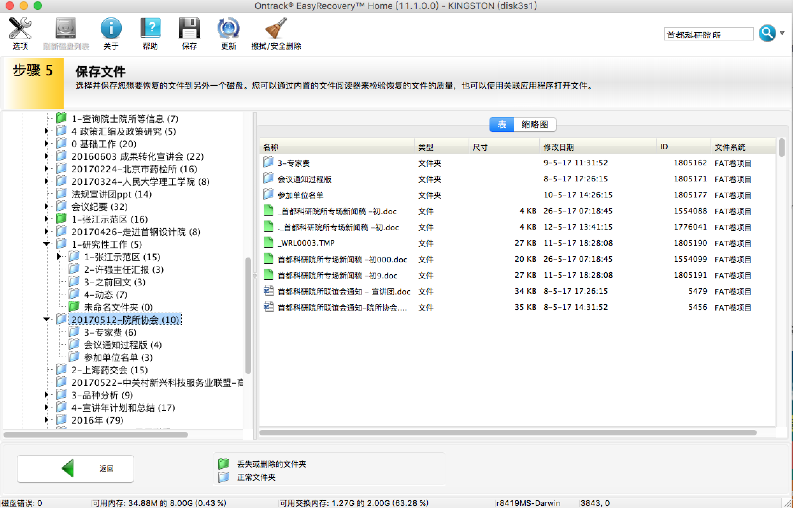

# easy-recovery

> `EasyRecovery®`是由互盾数据恢复工作室出品的一款`专业数据恢复软件`；操作简单方便

另一命令行免费恢复工具参考<ref://./testdisk.md.html>

## 简介

* site: <http://www.easyrecovery.net>
* 收费：`128RMB`
* 支持恢复`不同存储介质`数据：硬盘、光盘、U盘/移动硬盘、数码相机、手机等，能恢复包括文档、表格、图片、音视频等各种数据文件
* 本人使用该软件`成功恢复过`文件，包括`ppt、图片`等；但目前尚未成功恢复过被删除的`word文档`

## 一些截图

 

