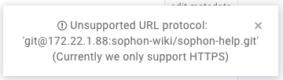

# gitbook

> Modern documentation format and toolchain using `Git` and `Markdown`

> GitBook helps your team write, collaborate and publish content online.

## Resources

* `site`: <https://www.gitbook.com>
* `gitbook-cli`: <https://github.com/GitbookIO/gitbook-cli>
* `gitbook`: <https://github.com/GitbookIO/gitbook> <iframe src="http://258i.com/gbtn.html?user=GitbookIO&repo=gitbook&type=star&count=true" frameborder="0" scrolling="0" width="105px" height="20px"></iframe>
* `markdown`语法： <https://toolchain.gitbook.com/syntax/markdown.html>
* `目录页`写法： <https://toolchain.gitbook.com/pages.html>
* `引用`子目录中`非md文档`的写法：<https://github.com/MichaelHu/gitbook-plugin-otherlink>

## Features

* 查看开源文档：<https://www.gitbook.com/explore>
* 帮助团队编写文档、协作以及`发布在线内容`
* 案例：Redux文档 <http://redux.js.org/index.html>
* 工具链：`GitBook editor` (web版及客户端版), ...
* 可以在gitbook站点编写自己的在线书籍、API文档、帮助手册等
* 也可以离线安装，用于本地撰写和发布，适合于团队协作编写文档
* 有一些免费书籍可查看
* 使用`gitbook-cli + versions`架构，**cli与engines分离**，可以使用不同版本的引擎编译不同书籍。根据书籍配置，采用适合的引擎。**versions**目录在`~/.gitbook/versions`目录下。

## Tips

* 最新的命令行版本**3.2.3**，最近一次版本发布在**2017年8月4日**，gitbook团队成员已经将关注点转向gitbook.com站点

## getting started

<https://github.com/GitbookIO/gitbook/blob/master/docs/setup.md>

    # install
    npm install -g gitbook-cli

    # create a book
    gitbook init

    # preview
    gitbook serve

    # built the static website
    gitbook build
    # build with more detail
    gitbook build ./ --log=debug --debug

    # list versions installed locally
    gitbook ls

    # install other versions of GitBook
    gitbook ls-remote
    gitbook fetch beta

    # 安装依赖的插件
    gitbook install

    hudamin@local map $ ~/tmp/gitbook/node_modules/.bin/gitbook init
    Installing GitBook 3.2.2
    [fsevents] Success: "/private/var/folders/0w/pbq6xt75493c9d73q_jljgs40000gn/T/tmp-25966adMnrh86T53g/node_modules/gitbook/node_modules/chokidar/node_modules/fsevents/lib/binding/Release/node-v46-darwin-x64/fse.node" already installed
    Pass --update-binary to reinstall or --build-from-source to recompile
    [fsevents] Success: "/private/var/folders/0w/pbq6xt75493c9d73q_jljgs40000gn/T/tmp-25966adMnrh86T53g/node_modules/gitbook/node_modules/nunjucks/node_modules/chokidar/node_modules/fsevents/lib/binding/Release/node-v46-darwin-x64/fse.node" already installed
    Pass --update-binary to reinstall or --build-from-source to recompile
    gitbook@3.2.2 ../../../../../../../var/folders/0w/pbq6xt75493c9d73q_jljgs40000gn/T/tmp-25966adMnrh86T53g/node_modules/gitbook
    ├── escape-html@1.0.3
    ├── escape-string-regexp@1.0.5
    ...

    # display detailed commands
    git help

首次执行`gitbook init`的时候，会安装某个适当版本的`GitBook`至`/private/var/folders/`目录下

## gitbook editor

* 一个所见即所得的markdown编辑器
* 与git仓库同步 

### 解决内部git服务的同步问题

在editor界面设置内部gitlab仓库地址时，git server的配置`不支持ssh协议`：

 

如图所示，`只支持https`协议，所以设置了`http`的server地址，同样`无法支持`。

实际上，editor只是一个操作界面而已，底层仍然脱离不了git本身的行为，只要在指定`本地git`仓库中设置好`remote`的配置，是`可以支持http`的。

editor本地book的目录存放在`~/GitBook/Library/Import/`目录下，假如本地书籍`test`，如下操作：

    cd test
    git remote add origin http://path/to/testbook.git
    git pull # 输入必要的用户名、密码完成验证

此时，通过`手动`配置好test仓库的`remote`，`test`已经可以支持同步操作。

另外，通常情况下，我们的本地仓库目录不是`~/GitBook/Library/Import/`，可以在该目录下建一个符号链接。

    ln -s /real/path/to/test test

## gitbook使用

### 特殊文件

* `README.md`：默认Introduction文档
* `SUMMARY.md`: 默认目录文档
* `GLOSSARY.md`: 默认词汇表文档
* `LANGS.md`: 默认语言文档
* `assets/`：资源目录
* `_book/`：生成静态书籍的目录
* `_layouts`: theme目录
* `book.json`: 配置文件
* `.bookignore`: 忽略文件列表，语法同`.gitignore`

### book.json

* `config docs`: <https://github.com/GitbookIO/gitbook/blob/master/docs/config.md>

配置文件的一个例子：

    {
        "root": "root/directory",
        "structure": {
            "readme": "README.md",
            "summary": "SUMMARY.md",
            "glossary": "GLOSSARY.md",
            "languages": "LANGS.md"
        },
        "title": "document title ( default extracted from README )",
        "description": "default from README",
        "author": "name of author",
        "isbn": "ISBN",
        "language": "en",
        "direction": "rtl|ltr",
        "gitbook": ">= 3.0.0",

        "plugins": [ "theme-api", "-sharing" ],
        "pluginsConfig": {
            "theme-api": {
                "theme": "dark"
            }
        }
    }

### plugins

#### 默认插件

* gitbook-plugin-fontsettings
* gitbook-plugin-highlight
* gitbook-plugin-livereload
* gitbook-plugin-lunr
* gitbook-plugin-search: <https://github.com/GitbookIO/plugin-search>，支持添加关键词、屏蔽索引等功能
* gitbook-plugin-sharing
* gitbook-plugin-theme-default

1. 插件相关配置项为`plugins`以及`pluginsConfig`
2. 插件名规则为去除前缀`gitbook-plugin-`后剩余部分
3. `默认插件`若要`disable`，则在插件名称前添加`-`(减号)

        "plugins": [ "theme-api", "-sharing" ],
        "pluginsConfig": {
            "theme-api": {
                "theme": "dark"
            }
        }

#### 其他插件

* `gitbook-plugin-scripts`: 支持引入脚本
* `gitbook-plugin-versions`: 支持版本选择
* `gitbook-plugin-styles-sass`: 支持sass样式
* `gitbook-plugin-theme-faq`
* `gitbook-plugin-theme-api`
* `gitbook-plugin-theme-official`
* `gitbook-plugin-comment`: 支持内联评论，`gitbook.com专用`
* `gitbook-plugin-sitemap`: 暂不知其作用。但已知问题是`node-5.10.1`版本不能安装`1.1.0+`的版本，需要更新node版本才能正常安装。
* `gitbook-plugin-search-pro`: <https://github.com/gitbook-plugins/gitbook-plugin-search-pro>

`其他插件`可在此处获得：<https://github.com/GitbookIO>

新插件安装可以通过在`book.json`中配置，并通过`gitbook install`命令安装：

    $ gitbook install

其他自行`二次开发`的插件，见后文。

### theming

> `GitBook 3.0.0`开始，支持`theming`

* `theming`: <https://github.com/GitbookIO/gitbook/blob/master/docs/themes/README.md>
* default theme: <https://github.com/GitbookIO/theme-default>
* `theme`是一个包含模板和资源的`插件`

#### theme结构

* `_layouts`: 存放所有模板的主目录
* `_layouts/website/page.html`: 常用页面模板
* `_layouts/ebook/page.html`: ebook页面模板，比如（ PDF, ePub, Mobi )

#### 单book扩展／自定义

* 根目录下新建`_layouts`目录，重写需要扩展的模板即可。
* 模板查找优先级： `book目录 > plugins目录 > themes目录`
* 由于以上优先级限制，theme的模板可能会覆盖某些plugin的设置，比如继承自`official`的模板，会覆盖`search`插件的输出。

> `Caution`: Custom theming can block some plugins from working correctly.

> 需要注意`模板查找优先级`带来的影响

#### 多book扩展

    

    
        {{ super() }}
        ... This will be added to the "body" block
    

* `templating syntax`: <https://github.com/GitbookIO/gitbook/blob/master/docs/themes/README.md>
* `theme-api`: <https://github.com/GitbookIO/theme-api>

#### 模板语法

* **Nunjucks**: <https://mozilla.github.io/nunjucks/>
* docs: <https://toolchain.gitbook.com/templating/>
* gitbook相关扩展： <https://github.com/GitbookIO/gitbook/tree/master/docs/templating>

#### 创建新theme

<https://github.com/MichaelHu/gitbook-plugin-theme-sophon>

以已有theme为代码蓝本，稍作改动，发布至npm即可。

`gitbook install`现查找`GitbookIO`下以`theme-`为前缀的主题，再查找以`gitbook-plugin-theme-`为前缀的主题。

## 插件编写

### Features

* 通过`入口文件`配置插件功能
* 可以引入资源，包括`js`，`css`文件，通常使用`assets`目录存放
* 可以扩展模板`block`， `filters`以及`hooks`
* 是一个npm package，命名规范遵循以`gitbook-plugin-`为前缀
* gitbook使用的模板引擎是`nunjunks`，可参考<http://mozilla.github.io/nunjucks/>

### 插件参考模板
1. sample: <https://github.com/GitbookIO/plugin>
2. plugin-highlight: <https://github.com/GitbookIO/plugin-highlight>

### 入口文件格式

> 主要是`3.x.x`版，4.x版本开始，变化很大，后续再研究

* `plugin`类：<https://github.com/GitbookIO/gitbook/blob/3.2.2/lib/models/plugin.js>

		module.exports = {
            // 旧版本使用book
			website: {
                assets: './book',
                js: [ 'test.js', './path/to/test2.js' ],
                css: [ 'test.css' ],
                html: {
                    'html:start': function() {
                        return '<!-- Start book ' + this.options.title + ' -->';
                    },
                    'html:end': ...,
                    'head:start': ...,
                    'head:end': ...,
                    'body:start': ...,
                    'body:end': ...
                }
            },
			ebook: {},
			filters: {},
			hooks: {},
			// 很强大的扩展 
			blocks: {
				// content
				otherlink: {
					process: function( block ) {
						return '
' + block.body + '
';
					}
				}
			},
		};

	格式可参考（可能有点笔误）：<https://github.com/GitbookIO/plugin/blob/master/index.js>

### 说明

* `gitbook.js`，来自`theme-default`，<https://github.com/GitbookIO/theme-default/blob/master/src/js/core/index.js>，gitbook对象本身是一个集合。`gitbook.push( fn )`方法可以注册ready后执行的函数，不过目前尚未验证成功。
* `otherlink`插件，用于在gitbook中引用子目录的`非md文件`: <https://github.com/MichaelHu/gitbook-plugin-otherlink/>

## 二次开发

* 自定义theme：<https://github.com/MichaelHu/gitbook-plugin-theme-sophon>
* 支持`内部链接`：<https://github.com/MichaelHu/gitbook-plugin-otherlink>
* 自定义`favicon`：<https://github.com/MichaelHu/gitbook-plugin-custom-favicon>

## books

* Front-End Developer Handbook 2017 <https://www.gitbook.com/book/frontendmasters/front-end-handbook-2017/details>
* Front-End Developer Handbook 2016 <https://www.frontendhandbook.com>

