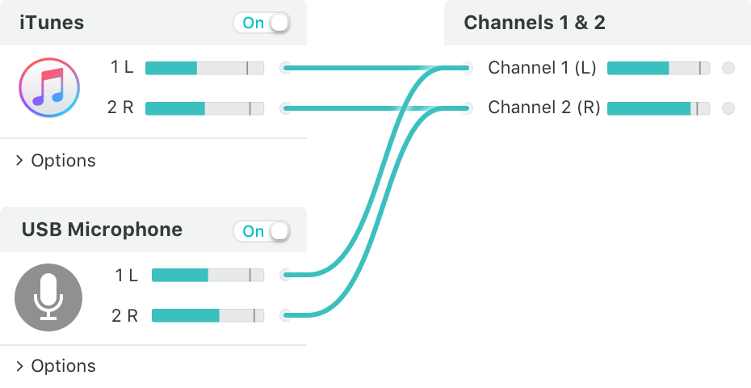

# loopback

## Features

* 来自`Rogue Amoeba`公司的产品，是一个专业的音频处理软件公司
* 支持创建`虚拟音频设备`，创建的音频设备，如同系统音频设备一样，可用于输出或者输入
* 支持多音频通道的混合 

    

* 有了虚拟音频设备，就很容易实现在电脑上录制应用程序的声音，达到`内录`的效果
* `试用版`的限制是，`20分钟以后`的音频质量会下降。如果需要冲破限制，可以购买

## Resources

* site: <https://rogueamoeba.com/status/>
* `loopback`: <https://rogueamoeba.com/loopback/>

