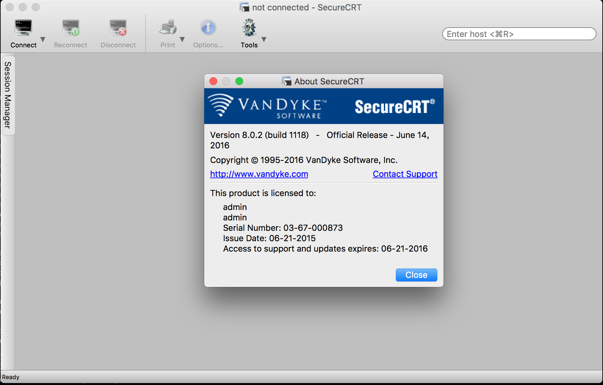

# SecureCRT

> 正式版太贵，`$99`只能买一年免费升级，平时也不是每天必用，性价比不够

## Why

* `Logon Actions`，支持登录事件自动填充命令，提高登录效率
* `rz/sz`功能是一大选择理由，和服务器进行简单的文件传输非常方便
* `session clone`功能，以及`logon action配置`功能，能够快速复制session，是另一个重要选择理由

## 安装破解版

> 以下仅针对`Mac版本`的SecureCRT

### 参考文章

<http://bbs.feng.com/read-htm-tid-6939481.html>

### 破解过程

1. 下载安装文件和破解文件：<https://pan.baidu.com/s/1mi4XHQo>，破解文件可能会有浏览器下载拦截，最好使用百度网盘桌面客户端下载，下载后包含两个文件：
    * 安装文件：`scrt-8.1.1-1319.osx_x64.dmg`
    * 破解文件：`SecureCRT`
2. 使用安装文件安装SecureCRT，只需将文件拷贝至`/Applications`目录即可
3. 用破解文件替换正式版的文件：
        chmod +x SecureCRT
        cp SecureCRT /Applications/SecureCRT.app/Contents/MacOS 
4. 输入License，先直接点击`Continue`，再点击`Enter License Manually`，依次输入以下字段内容：
        Name:           admin
        Company:        admin
        Serial Number:  03-67-000873
        License Key:    AD81E6 D9EDG1 2AKGWW TRWYC3 ADDK3Q DS7D6C 5KTEB2 8DFRGS
        Issue Date:     06-21-2015 
5. 出现`The license information shown below has been accepted.` 完成破解。

### About信息

看以下About信息，也是一年期的Update License，目前时间是`2017-3-16`。看来可以放心使用。

 

## Tips

* Mac SecureCRT无法保存密码？ 参考：<http://jingyan.baidu.com/article/915fc414fda5fb51394b20bd.html>
    
    `Preference` -> <input type="checkbox">`Use Keychain`

* 用`rz -bye`，或许能解决`上传报错`问题
* 关闭Tab标题文本自动变化，勾选`Terminal - Emulation - Advanced - Other - Innore window title change requests`
* [ 181111 ] 升级macOS `Mojave`后，SecureCRT的`Sessions`列表的中文显示为`乱码`，目前暂未找到解决办法，只能将中文改为英文。如果不记得乱码部分的原始中文，可以在以下目录中找回：`~/Library/Application Support/VanDyke/SecureCRT/Config/Sessions/`

