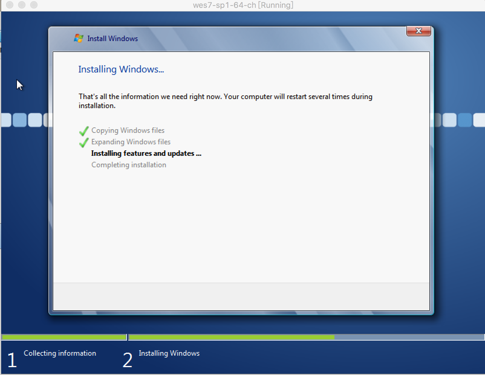
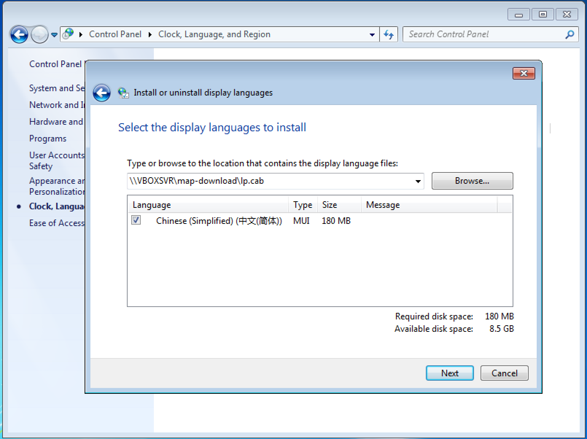
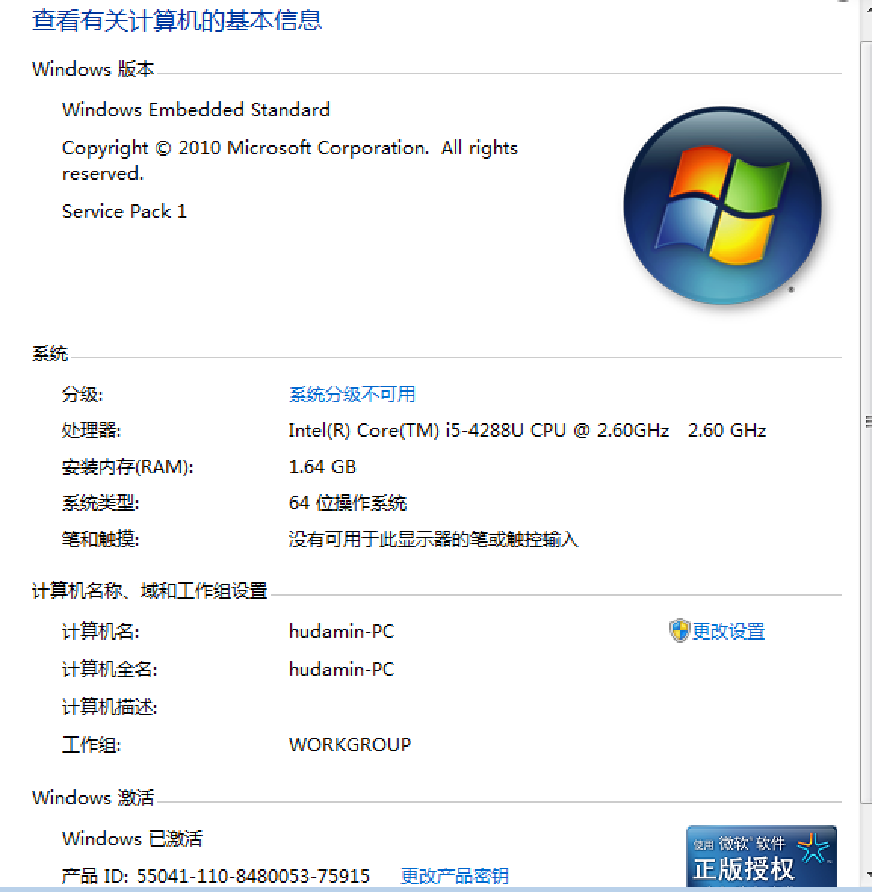

# virtualbox

>  开源的一款轻量级虚拟机软件

## 概要信息

* main site: <https://www.virtualbox.org>
* 主要套件：
    * platform packages，虚拟机app安装包
    * extension pack，包含虚拟机的USB等硬件支持等
    * developer kit
    * guest additions，宿主系统扩展程序包，提供底层虚拟硬件的支持，必须安装。一般存在以下路径：
        `/Applications/VirtualBox.app/Contents/MacOS/VBoxGuestAdditions.iso`
        
        便于挂载，可将其复制到桌面：

            cp /Applications/VirtualBox.app/Contents/MacOS/VBoxGuestAdditions.iso ~/Desktop

* 更新非常频繁，值得入手。

## VirtualBox升级

1. 升级至Mac OX El Capitan，10.11.1以后，发现原来的Virtual Box 4.3装载的Windows 7系统，无法识别USB设备。
    解决方案是，升级至Virtual Box 5.x版本，并且安装相应的Additions。并在Windows虚拟机打开后，安装相应配套的Gust Addition

2. [ `161124` ] VirtualBox升级后，原来的Window7打开后无法使用蓝牙键盘和鼠标。解决办法是移除虚拟机，重新建一次。 

3. [ `170113` ] ( 以上现象的真实原因 )升级至`MacOS Sierra 10.12.2`以后，为招行U盾USB设备添加空的USB过滤器以后，进入VM，Mac的蓝牙键盘和鼠标都断开连接，无法使用，但是自带键盘和触摸板可用，U盾可用；如果去除USB过滤器，则U盾不可用，蓝牙键盘和鼠标可用。

## 安装VBoxGuestAdditions增强功能

进入虚拟机后，在菜单栏`设备`下，选择加载该增强功能的`iso`，就可以启动安装程序。

## 安装windows 10

### 官网下载安装包

按需下载合适的安装包：<https://www.microsoft.com/en-us/software-download/windows10ISO>

### 网盘下载包安装

> 网盘下载的基本上都是比较早期的安装包，已经过期，`无法安装`

从百度网盘下载的各个版本的windows10安装镜像都出现蓝屏提示。问题包含在这个百度经验的帖子里。<http://jingyan.baidu.com/article/4853e1e5763b691909f72632.html>

相关问题都解决以后，仍然还是蓝屏：

    @[style="background-color:#00f;"]Recovery

    Your PC/Device needs to be repaired 
    A component of the operating system has expired.

    File:\windows\system32\boot\winload.exe 
    Error code:0xc0000605

    You’ll need to use recovery tools,If you don’t have any installation media(like a disc or USB device).contact your PC administrator or PC/Devic manufacturer.

在另外一篇文章里给出了两个办法：其中一个办法就是下载最新版的win10 iso安装包：<https://www.microsoft.com/en-us/software-download/windows10ISO>

## 安装wes7 standard sp1

* 安装指南: <http://www.tuicool.com/articles/UBryiu>
    * 选择模板安装：`Application Compatible`，此种安装支持语言包安装。如果选择`Internet Explorer...`那个模板，则不支持语言包安装，那个模板给人一种安装比较全的错觉，实际上出来的界面都是简版界面，连记事本都没有。
    * `Application Compatible`模板安装得到的vdi文件有`6.49G`
    * `Internet Explorer ...`模板安装得到的vdi文件仅有`2.59G`

* iso路径：<https://pan.baidu.com/s/1miNl51Y>
* iso文件名： `en_windows_embedded_standard_7_sp1_runtime_x64_dvd_651894.iso`
* `激活`：官方序列号（180天试用期）`GJVTR-C4WQ6-BKRH3-DRFFH-J83DM`
    
    激活工具： `Chew_WGA v0.9`，路径同iso，下载后`双击后重新启动`，即可激活。

* 汉化语言包安装，安装包位于同以上网盘路径下的`Ip.cab`

 

 

 安装后的系统信息：

 

