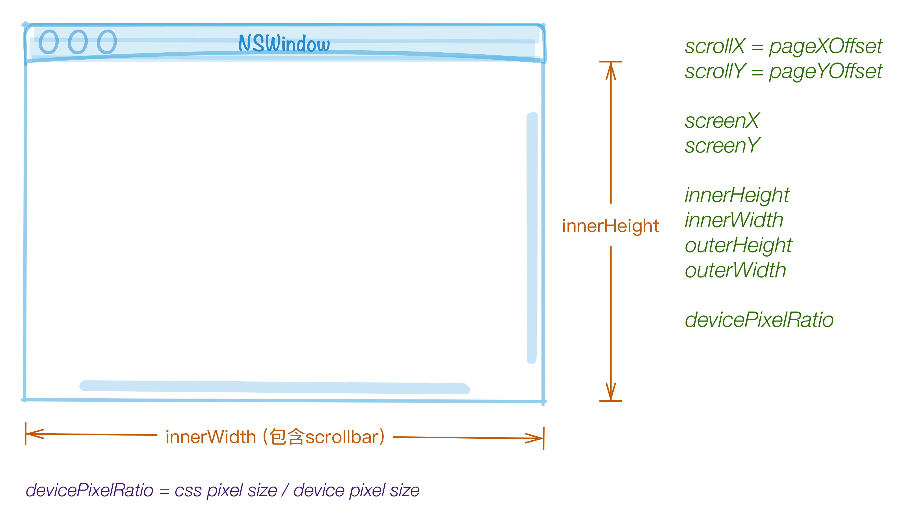

# cssom

## Resources

* `w3`: <http://www.w3.org/TR/cssom-view-1/>

## Concepts

* padding edge / padding area
* border edge / border area
* scrolling area
* css pixels / device pixels
* layout box: css layout box / svg layout box

## window扩展

 

    [非CSSOM扩展] window.getComputedStyle(element)
    [viewport] window.innerWidth
    [viewport] window.innerHeight
    [viewport scrolling] window.scrollX 
    [viewport scrolling] window.scrollY 
    [viewport scrolling] window.pageXOffset 
    [viewport scrolling] window.pageYOffset 
    [client] window.screenX
    [client] window.screenY
    [client] window.outerWidth
    [client] window.outerHeight
    [client] window.devicePixelRatio
    [viewport scrolling] window.scroll() 
    [viewport scrolling] window.scrollTo() 
    [viewport scrolling] window.scrollBy() 

## element扩展

    element.getClientRects()，返回DOMRect，包含x, y, width, height, top, right, bottom, left字段，与clientArea相关
    element.getBoundingClientRect()，与clientArea相关
    element.scrollIntoView()
    element.scrollTop
    element.scrollLeft
    [readonly] element.scrollWidth
    [readonly] element.scrollHeight，不包含border
    [readonly] element.clientTop，border-top-width加上border-top和top padding edge之间可能存在的scroll bar的height。<http://www.w3.org/TR/cssom-view-1/#dom-element-clienttop>
    [readonly] element.clientLeft
    [readonly] element.clientWidth
    [readonly] element.clientHeight，不包含border
    element.scroll()
    element.scrollTo()
    element.scrollBy()

## HTMLElement扩展

    [readonly] offsetParent
    [readonly] offsetTop，与offertParent有关
    [readonly] offsetLeft
    [readonly] offsetWidth
    [readonly] offsetHeight， border edge height，包含border

.test-panel

    @[data-script="javascript editable"](function(){

        setTimeout(function(){

            var s = fly.createShow('#test_60')
                , $element = $('#test_60 .test-panel')
                , element = $element[0]
                , st = window.getComputedStyle(element)
                , list
                , element
                ;
            s.show('getComputedStyle() with .test-panel: ');
            hr();
            list = [
                'display'
                , 'box-sizing'
                , 'width'
                , 'height'
                , 'padding-left'
                , 'margin-left'
                , 'position'
                , 'left'
                , 'color'
                , 'background'
                , 'font'
            ];
            list.forEach(function(item){
                s.append_show('st["' + item + '"]', st[item]); 
            });

            s.append_show('\n.test-panel getClientRects() & getBoundingClientRect(): ');
            hr();
            s.append_show(
                objectParse(element.getClientRects())
            );
            s.append_show(
                objectParse(element.getBoundingClientRect())
            );

            list = [
                'innerWidth'
                , 'innerHeight'
                , 'scrollX'
                , 'scrollY'
                , 'pageXOffset'
                , 'pageYOffset'
                , 'screenX'
                , 'screenY'
                , 'outerWidth'
                , 'outerHeight'
                , 'devicePixelRatio'
            ];

            s.append_show('\nwindow extensions: ');
            hr();
            list.forEach(function(item){
                s.append_show('window.' + item, window[item]); 
            });

            list = [
                'scrollTop'
                , 'scrollLeft'
                , 'scrollWidth'
                , 'scrollHeight'
                , 'clientTop'
                , 'clientLeft'
                , 'clientWidth'
                , 'clientHeight'
            ];

            s.append_show('\n.test-panel element extensions: ');
            hr();
            list.forEach(function(item){
                s.append_show('element.' + item, element[item]); 
            });

            list = [
                'offsetTop'
                , 'offsetLeft'
                , 'offsetWidth'
                , 'offsetHeight'
            ];

            s.append_show('\n.test-panel htmlelement extensions: ');
            hr();
            list.forEach(function(item){
                s.append_show('element.' + item, element[item]); 
            });

            s.append_show('\n.test-panel jQuery offset() and position()');
            hr();
            s.append_show('offset()', $element.offset());
            s.append_show('position()', $element.position());

            function objectParse(obj){
                var ret = {};
                if(typeof obj == 'object'){
                    for(var i in obj){
                        if( i != 'toJSON' ) {
                            console.log( '+' + i );
                            ret[i] = objectParse(obj[i]);
                        }
                    }
                }
                else {
                    ret = obj;
                }
                return ret;
            }

            function hr() {
                s.append_show( '=================================================================' );
            }

        }, 1000);

    })();

## Tips

### 关于ClientRect

包含`六大`属性，分别为：top, right, bottom, left, width, height，其尺寸规则与css3提供的`clip`类似。<ref://../html5/css3.md.html>

### 关于一个TypeError

> `TypeError`: Can only call `ClientRect.toJSON` on instances of ClientRect

* `Safari 10.1.2`下，ClientRect对象包含了`toJSON()`方法，在解析该对象的属性时，会将toJSON()方法也作为一个`属性`，得到以下对象：

        var plainObject = { 
            top: xxx,
            left: xxx,
            right: xxx,
            bottom: xxx,
            height: xxx,
            width: xxx,
            toJSON: function(){ ... }
        }

    此时，对以上对象调用JSON.stringify()方法时，将会报上述`TypeError`错误。实际上JSON.stringify()调用时，如果发现该对象包含toJSON()方法，则`直接调用`该对象的toJSON()方法，但是此时对于plainObject来说，它不是一个ClientRect实例，所以调用toJSON()方法（定义在ClientRect对象下）会报以上错误，其内部做了`类型检查`。
    
    但Safari`更早期版本`是不包含toJSON()方法的，解析后的plainObject不包含toJSON属性，可以直接调用JSON.stringify()。当然ClientRect对象本身可以直接调用JSON.stringify()。

* `Chrome`下，ClientRect对象直接调用`JSON.stringify()`，返回结果是`{}`；由于它`不包含`toJSON()方法，解析时，得到的plainObject对象不会包含toJSON属性，可对获得的plainObject直接调用JSON.stringify()。

* 对于两个浏览器来说，ClientRect的六个属性都不是ownProperty，也就是`ClientRect.hasOwnProperty( key )`为`false`

* 综上，要兼容两个浏览器，解析出正确的ClientRect对象，一种方法就是先获取`不包含toJSON()方法`的plainObject

