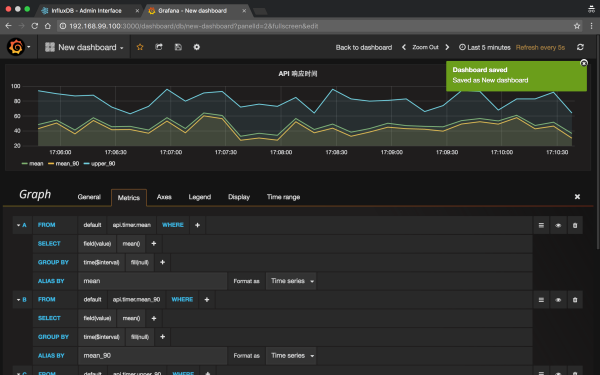
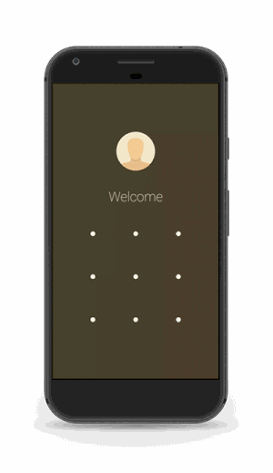
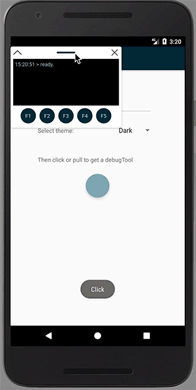
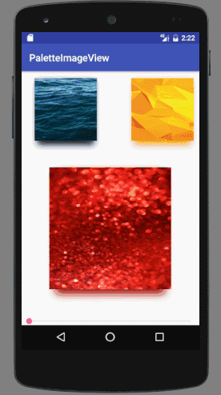
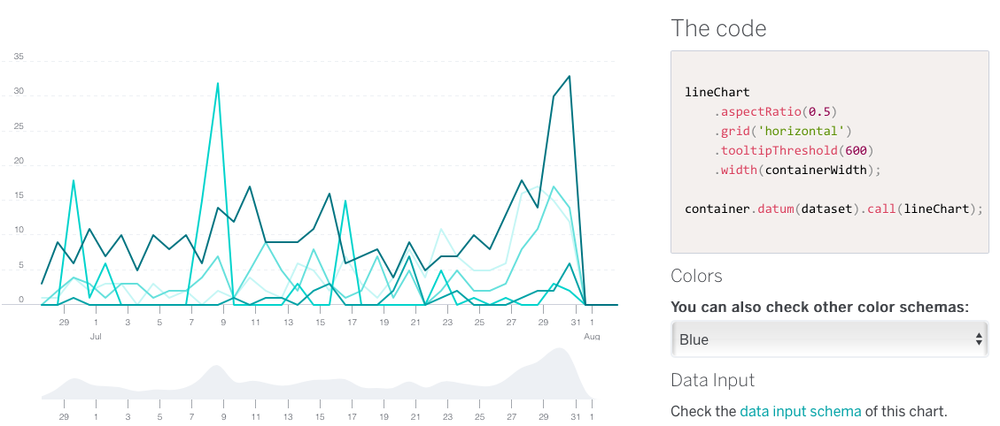

# weekly-2017

## 171016-171020

## 171009-171014

* 171014 史上最全Web端即时通讯技术原理详解：<http://blog.csdn.net/softwave/article/details/51943699>
* 170920 再见，babel-preset-2015 <https://zhuanlan.zhihu.com/p/29506685>
* 171009 webpack 应用编译优化之路 <https://mp.weixin.qq.com/s/AGUZb1am_4k-IkzgKidWyw>
* 171010 `微前端` - 将微服务理念延伸到前端开发中 <https://mp.weixin.qq.com/s/bmH2wZOwD9pWLEMIlc4X0w>
* 171010 微信“15。。。。。”背后的故事 <https://mp.weixin.qq.com/s/4DBPTN5qoVa976i8uTNAUQ> Android文字排版的问题，通过程序计算换行，以得到更好的展示效果，但微信这次计算存在bug，值得细品
* 171009 `章文嵩`：走过的地方留下无数传说 <https://mp.weixin.qq.com/s/0t8GCQyZhfAPV9ma4Yv9FQ> 章文嵩冲破传统思维的束缚，努力推行`开源`，堪称中国开源第一人。开源是一件非常有意义的事情，虽然它是免费的，但对整个社会来说是创造更大的经济效益。另外，通过开源也可以显示一个公司的技术实力。
* 171009 `董仲蠡`（lǐ） - 「教育的意义」 <https://mp.weixin.qq.com/s/zw47qRt_xSQI6N-VauYvOQ>

## 170925-170930

* 170926 `CrimeReports` - 基于地图的应用，交互体验值得参考 <https://www.crimereports.com/>
* 170922 Node.js 异步异闻录 <https://mp.weixin.qq.com/s/TgeYygFp8GDMmMU5Ze58tg> 原文地址：<http://muyunyun.cn/posts/7b9fdc87/> 阐述了异步编程模型的演进，Promise/Deferred, Generator, async/await等
* 170924 `Chrome 62` Beta版已支持网络质量评估API，`OpenType可变字体`，从DOM元素捕获媒体 <https://mp.weixin.qq.com/s/qJrcx320X3NI-Q84uD-FPw>
* 170922 `Java 9`正式发布，新特性解读 <https://mp.weixin.qq.com/s/Onj9ZJYbV5pLTAPcYBJREA>
* 170922 `cockjs-client` - WebSocket emulation - Javascript client <https://github.com/sockjs/sockjs-client>

## 170918-170923

* 170923 `JMeter` - A Java application designed to load test functional behavior and measure performance <http://jmeter.apache.org> Java应用，用于串行跑测试任务以及压力测试，提供可视化界面，以及简单脚本编程，支持客户端和命令行模式。
* 170923 `gifify` - Convert any video file to an optimized animated GIF. <https://github.com/vvo/gifify>
    视频转GIF的开源命令行工具。相关阅读：<http://www.jianshu.com/p/a86efa5147d5>
* 170921 `CESIUM` - An open-source JavaScript library for world-class 3D globes and maps：<https://cesiumjs.org/>
* 170827 交互微动效设计指南 - ISUX <https://isux.tencent.com/articles/106.html>，根据不同响应时间设计不通的交互效果，采用文本反馈、循环样式、进度条等样式
* 170922 抓本·拉登，服务FBI、CIA，这家1500人公司如何做到200亿规模？ <http://www.toutiao.com/i6468452456215872014/>
* 170918 腾讯IMweb Conf 2017大会图文笔记 - 上 <https://juejin.im/post/59bd3747f265da066875e10d>
* 170918 腾讯IMweb Conf 2017大会图文笔记 - 下 <https://juejin.im/post/59bdd93f6fb9a00a562e734c>
* 170919 W3C 发布 `EME` 标准，`EFF` 退出 W3C <https://juejin.im/post/59c0a93af265da06456d69d9>
* 170919 为什么 call 比 apply 快？ <https://juejin.im/post/59c0e13b5188257e7a428a83>
* 170920 浅谈HTML5 Web Worker <https://juejin.im/post/59c1b3645188250ea1502e46>
* 170922 TypeScript体系调研报告 <https://juejin.im/post/59c46bc86fb9a00a4636f939> 类型化脚本，能在编译时发现更多的潜在问题，编译后的代码相比babel有更好的可读性，类支持里面的权限访问控制也是亮点。针对需要多年迭代的长期项目来说，比较适合
* 170921 前端感官性能的衡量和优化实践 <https://mp.weixin.qq.com/s/BPNkOJPwRs0q9Ebv_lWw3w> 传统性能优化、感官性能优化，优化分析工具等
* 170920 EcomFE/spec - EFE出品的相关规范文档 <https://github.com/ecomfe/spec> 其他组织或开源的规范文档可参考<ref://../html5/html5-coding-style.md.html>
* 170919 San - an MVVM Component Framework for the Web. <https://ecomfe.github.io/san/>
* 170919 BetterScroll - Inspired by iScroll, but it has a better scroll performance. 黄轶出品 <https://ustbhuangyi.github.io/better-scroll/> github: <https://github.com/ustbhuangyi/better-scroll>
* 170918 你所不知的 CSS ::before 和 ::after `伪元素`用法 <http://blog.dimpurr.com/css-before-after/>
* 170808 在 React 16 中使用高阶组件来捕获异常 <http://www.jianshu.com/p/cf85a4317f36>

## 170911-170916

* 170911 京东PLUS会员移动端改版实战 <http://jdc.jd.com/archives/4430> iOS 8.0开始使用WKWebView，代替以前版本使用的UIWebView；vue模板预编译技术，babel插件vue-template-loader
* 170915 `react-pdf`: Easily display PDF files in your React application.  <https://github.com/wojtekmaj/react-pdf> demo: <http://projekty.wojtekmaj.pl/react-pdf/> 在React项目中展示pdf文件，pdf文件直接在浏览器通过Web Worker解析后展示，该项目基于mozilla的pdf.js <https://github.com/mozilla/pdf.js>
* 170915 石墨文档 - 多人实时协作的云端文档与表格 <https://shimo.im> github: <https://github.com/shimohq> 
* 1701  使用 StatsD + InfluxDB + Grafana 搭建 Node.js 监控系统 (一) <https://zhuanlan.zhihu.com/p/23924022>
    
     

* 170908 石墨表格之`Web Worker`应用实战 <https://zhuanlan.zhihu.com/p/29165800> Painting、Rendering、Scripting，如果花费在`Scripting`上面的时间较多，就可以考虑Web Worker了
* 1701 石墨文档的云端表格实时压缩策略 <https://zhuanlan.zhihu.com/p/24102444>
* 160915 `react-cookbook`：编写简洁漂亮，可维护的React应用 <https://github.com/shimohq/react-cookbook>
* 160229 High-performance Web Worker messages <https://nolanlawson.com/2016/02/29/high-performance-web-worker-messages/>
* 170819 H5玩法知多少 <https://isux.tencent.com/h5-play-ways.html>，基于传感器（陀螺仪、重力感应、地理位置、人脸识别、webRTC等）、基于触摸屏（全景交互、多屏互动、单屏滚动、手势操作）、基于画面呈现（视频／动画、图片裁剪和形变）等
* 170914 为什么依照需求输出，结果却不尽人意 <https://isux.tencent.com/insight-needs.html> 为什么会有理解偏差？关键在于理解背后的动机：竞争导向、驱动消费、体验修复、探索尝试。
* 170901 React 源码剖析系列 － 解密 setState <https://zhuanlan.zhihu.com/p/20328570>
* 170913 移动观象台 - TalkingData <http://mi.talkingdata.com> 其数字表盘组件体验不错，可以参考借鉴
* 150502 详说 Cookie, LocalStorage 与 SessionStorage <https://segmentfault.com/a/1190000002723469>
* 160627 cookie、 sessionStorage 、localStorage之间的区别和使用 <http://www.cnblogs.com/caiyezi/p/5619506.html>

## 170904-170909

* 170906 奇技淫巧学 V8 之七，字符串的扁平化 <https://zhuanlan.zhihu.com/p/28907384> ，相关阅读：
    * 奇技淫巧学 V8 之一，对象访问模式优化 <https://zhuanlan.zhihu.com/p/28777722>
    * 奇技淫巧学 V8 之二，对象在 V8 内的表达 <https://zhuanlan.zhihu.com/p/28780798>
    * 奇技淫巧学 V8 之三，多态内联缓存 PICs <https://zhuanlan.zhihu.com/p/28790195>
    * 奇技淫巧学 V8 之四，迁移对象至快速模式 <https://zhuanlan.zhihu.com/p/28858135>
    * 奇技淫巧学 V8 之五，对象属性的快速删除 <https://zhuanlan.zhihu.com/p/28872382>
    * 奇技淫巧学 V8 之六，字符串在 V8 内的表达 <https://zhuanlan.zhihu.com/p/28883711>
* 170903 Vuex 源码分析 <https://github.com/dwqs/blog/issues/58>
* 170907 代码质量管控的四个阶段 <https://zhuanlan.zhihu.com/p/29086959>
* 170905 Prepack详细介绍及微信小程序优化的新思路 <https://zhuanlan.zhihu.com/p/29089574> 浏览器环境（不认window和document）和Node.js环境尚不能完全支持，支持React Native代码包优化，对微信小程序来说，貌似也适用，但优化效果还没有明确的报告。扩展阅读：官网 <https://prepack.io> A tool for making JavaScript code run faster. 
* 170831 How can I use CSS-in-JS securely? <https://reactarmory.com/answers/how-can-i-use-css-in-js-securely> 还是XSS那套的黄金法则：Never interpolate user input into your stylesheets. Never ever. Don’t do it.
* 170908 `Backpack` - node.js应用的零配置构建系统 <https://github.com/jaredpalmer/backpack>  专门针对服务端系统
* 170831 Android热补丁原理简单分析与问题思考 <http://blog.csdn.net/w7849516230/article/details/77737374>
    ，对比几个比较知名的解决方案（阿里Sophix、腾讯Tinker以及饿了么Amigo），阿里的Sophix占优。

## 170828-170902

* 170901 Android O 让安装应用更安全 <https://mp.weixin.qq.com/s/wjFozXBGNfe6jQkEqmLibg>
* 170901 JavaScript 有个`Unicode`的天坑 <https://mp.weixin.qq.com/s/pwshI0XjIxq-0GavWdGE8A>
* 170828 Javascript 开启浏览器全屏模式 <https://mp.weixin.qq.com/s/SnaJYLBEQnasMJNfoSHwLQ>
* 170830 从 setState `promise化`的探讨体会 React 团队设计思想 <https://juejin.im/post/59a699fd6fb9a0247d4f5970> 
* 170901 DaoCloud 基于`RxJS`的前端数据层实践 <https://zhuanlan.zhihu.com/p/28958042>
* 170829 有了indexOf，为什么 ECMAScript 7 还添加了`Array.prototype.includes`？ <http://tasaid.com/blog/20170829180527.html>
* 170830 何时使用立即执行函数表达式 <https://mp.weixin.qq.com/s/whbFXhaLJvcC_oH4JUJlZw>
* 170829 使用`Paint Timing API`度量性能 <https://mp.weixin.qq.com/s/lZdvYTDzxXJjekcthD1iFA>
* 170829 软件架构图的艺术 <https://mp.weixin.qq.com/s/1Rem094s3mcu9FrMJBl8sg>
* 170830 非常实用的Linux命令行技巧 <http://www.toutiao.com/a6459592620325994765> `column`, `sort`排序技巧, `cd -`, `watch`, `xargs -i`等
* 170830 用css的clip属性制作环形进度条 <http://www.toutiao.com/a6459677884238791181>
* 170614 Android组件化 —— 路由设计最佳实践 <http://www.jianshu.com/p/8a3eeeaf01e8>

## 170821-170826

* 130114 Javascript严格模式详解 <http://www.ruanyifeng.com/blog/2013/01/javascript_strict_mode.html>
* 170822 `像VUE一样写微信小程序-深入研究wepy框架` - 来自转转前端 <http://dwz.cn/6pUV6X> 微信提供的小程序开发框架实践和研究
* 170822 `GitHub buttons` <http://ghbtns.com> github: <https://github.com/mdo/github-buttons>
    <iframe src="https://ghbtns.com/github-btn.html?user=mdo&repo=github-buttons&type=star&count=true" frameborder="0" scrolling="0" width="170px" height="20px"></iframe>

        <iframe src="https://ghbtns.com/github-btn.html?user=mdo&repo=github-buttons&type=star&count=true" frameborder="0" scrolling="0" width="170px" height="20px"></iframe>

    复制以上iframe代码，填写`user`, `repo`以及`type`三个必填字段。宽度(width)以及高度(height)需要精确控制。`size=large`可以开启大字号版本。

* 170822 饿了么前端知乎专栏 <https://zhuanlan.zhihu.com/ElemeFE> 饿了么前端在开源领域做得不错，多个项目达到几千star，element-ui达到了1.6w star
* 170821 `gtop`: Symtem monitoring dashboard for terminal. <https://github.com/aksakalli/gtop>
        $ npm install gtop
        $ ./node_modules/.bin/gtop
* 170821 `SVG can do THAT?!` - Sarah Drasner, Sr. Developer Advocate at Microsoft <http://slides.com/sdrasner/svg-can-do-that> 展示了SVG的能力，我们使用SVG技术能做什么，能做到什么程度。附送酷炫的SVG实例：
    * <https://codepen.io/sdras/full/NqYGZv>
    * <https://codepen.io/sdras/full/VpYeNj>
    * <https://codepen.io/sdras/pen/EVRJqg>
    * <https://codepen.io/sdras/full/JdJgrB>
    * <https://codepen.io/team/WAW/pen/xRoxZY>
    * <https://codepen.io/chrisgannon/pen/VjWWZO>
    * <https://codepen.io/sdras/full/zvXbGJ>
    * <https://codepen.io/sdras/pen/YZBGNp>
    * <https://codepen.io/noeldelgado/pen/ByxQjL>

## 170814-170819

* 170808 JavaScript 疲劳终极指南：我们行业的真相 <http://www.zcfy.cc/article/3914>
* 170817 再来一发Deeplearn.js相关介绍：`开源机器学习库Deeplearn.js` <http://dwz.cn/6p6tUr>
* 170817 移动 H5 首屏秒开优化方案探讨 <http://dwz.cn/6p63kV> H5缓存；客户端接管缓存；离线包
* 170518 一张漂亮的可视化图表背后 <http://insights.thoughtworkers.org/behind-a-visual-chart/>
    人的视觉认知系统，格式塔学派，使用视觉设计理论来进行视觉编码，对长度较为敏感等，以及一个视觉编码的案例。
* 170812 Angular `5.0.0-beta.3` 发布 <http://dwz.cn/6p5Slc>
* 170816 阿里开源`ng-zorro-antd`，Angular 企业级前端组件库 <http://dwz.cn/6p5CMx>
    ，是`Ant Design`的Angular实现，官方站点：<https://ng.ant.design/>，github: <https://github.com/NG-ZORRO/ng-zorro-antd>，定期与Ant Desing React版本保持更新一致。
        $ npm install ng-zorro-antd --save
* 170818 `Ant Design` - 一个UI设计语言，提供一套`设计规范`以及开发指引，组件库实现有`React`和`Angular`版本。来自蚂蚁金服体验技术部 <https://ant.design/index-cn>

## 170807-170812

* 170803 QQ会员基于 Hybrid 的高质量 H5 架构实践 <http://dwz.cn/6nmme6>
* 170810 5分钟教你打造一个秒开的 Android App <http://dwz.cn/6nmjHc> App冷启动优化点；避免冷启动；WindowBackGround优化
* 170727 Android O 新特性和行为变更总结 <http://dwz.cn/6nmlak>
* 170808 谷歌也发布了Web前端机器学习库，就叫`deeplearn.js` <http://www.toutiao.com/i6451845989606097422/> github: <https://github.com/PAIR-code/deeplearnjs> site: <https://pair-code.github.io/deeplearnjs>
* 170802 【第1014期】高性能视差滚动 <http://dwz.cn/6n3Awm> 
    * 不要使用滚动事件scroll events或者背景位置background-position来实现视差滚动动画。
    * 使用三维变形CSS 3D transforms创造更加精准的是视差效果。
    * 对于移动版Safari浏览器使用position: sticky属性确保视差效果被正确传递。

## 170731-170805

* 170804 邱俊涛的技术博客，博主为ThoughtWorks咨询师，著有《JavaScript核心概念及实践》，《轻量级Web应用开发》等技术书籍 <http://insights.thoughtworkers.org/author/qiujuntao/>
* 160822 技术的执念 <http://insights.thoughtworkers.org/obsession-og-technology/> 技术更新那么快，无法全都一一学习，技术人员要做的是建立自己的知识框架，然后在某些分支上做深度，保持专注、保持简单。
* 100528 JavaScript Semicolon Insertion - Everything you need to know <http://inimino.org/~inimino/blog/javascript_semicolons> 除了`return, break, continue, throw, postfix increment and decrement`之外，其他的分号都可以省略
* 130804 带权最短路 Dijkstra, SPFA, Bellman-Ford, ASP, Floyd-Warshall 算法分析 <http://www.renfei.org/blog/weighted-shortest-path.html>
* 130801 二分图的最大匹配、完美匹配和匈牙利算法 <http://www.renfei.org/blog/bipartite-matching.html>
* 170731 极客搜索 - 技术文章垂直搜索 <http://s.geekbang.org>

## 170724-170729

> JSConf.CN 2017
* 170715 2017 JavaScript中国开发者大会@上海 讲师讲义查看  <http://2017.jsconf.cn>
* 170715 前端工程中的编译时优化 Evan You  <ref://./doc/201707-compile-time-optimizations-evan-you.pdf> 综述各类编译时优化方案，从中看出非常多可能性
* 170715 Upgrading to Progressive Web Apps 黄玄 <https://huangxuan.me/jsconfcn2017/> PWA的前世今生
* 170715 从REST到GraphQL <ref://./doc/201707-rest-to-grahql-jonas-helfer.pdf>

> 其他
* 170728 基于Python的开源人脸识别库：离线识别率高达99.38% <http://www.toutiao.com/a6447658733434159374/> github: <https://github.com/ageitgey/face_recognition>
* 150419 ESDoc 新一代JS代码文档生成器 <https://esdoc.org> github: <https://github.com/esdoc/esdoc>
* 140626 `Visualizing Algorithms` 来自d3作者`Mike Bostock`，综述了各类可视化算法 <https://bost.ocks.org/mike/algorithms/>
* 170727 GraphQL vs REST（译） <https://juejin.im/post/59793f625188253ded721c70>
* 170727 React的新引擎—React Fiber是什么？ <http://dwz.cn/6ka3iY>
* 170707 A look inside React Fiber - how work will get done. <http://makersden.io/blog/look-inside-fiber/>
* 170720 HTML5 indexedDB前端本地存储数据库实例教程 <http://www.zhangxinxu.com/wordpress/2017/07/html5-indexeddb-js-example/>
* 170702 我接触过的前端数据结构与算法，递归、遍历、图像处理、Map/Set/Array、堆／栈等  <http://www.renfed.com/2017/07/02/algorithm/>
* 170728 iView 2.0发布，Talking Data可视化团队出品，目前7.5k star  站点：<https://www.iviewui.com> github: <https://github.com/iview/iview>
* 鑫空间，鑫生活 高质量前端技术博客 <http://www.zhangxinxu.com>
* 高质量技术博客 掘金 <https://juejin.im>
* Mesh <https://github.com/chrispsn/mesh>
* 170722 万众瞩目`Instant Apps`终于全面问世啦 <http://dwz.cn/6jNbVd> 谷歌版的小程序在今年1月份宣布小范围开放测试，半年过去，本周终于全面面世，可以在Android Studio 3里一试
* 170606 深入理解 Node Stream 内部机制 <http://www.barretlee.com/blog/2017/06/06/dive-to-nodejs-at-stream-module/>
* 2015 玩转AMD系列（1, 2, 3 ) errorrik <http://div.io/topic/909> <http://div.io/topic/910> <http://div.io/topic/911>
* 160119 移动端适配方案（上、下）<https://github.com/riskers/blog/issues/17> <https://github.com/riskers/blog/issues/18>

## 170717-170722

* 170720 百度EFE出品的vue ui - `VEUI` <https://github.com/ecomfe/veui>
* 170720 `页面结构化在 Android 上的尝试` <http://t.cn/RK1rIMP>
* 170720 `vuejs+ts+webpack2`框架的项目实践 <http://t.cn/RK3yH7m>
* 170718 吹水-`一个平庸的码农博客` <https://myst729.github.io/#/blog>
* 170717 Python实现：根据`yaml`描述，生成人物`关系图谱`，调用`digraph`，可输出成`pdf`或`jpg`格式 <https://github.com/programthink/zhao>

## 170710-170715

* 170715 zhanlijun的博客，高质量文章较多 <http://www.cnblogs.com/LBSer/>
* 170714 `GitUp`, Mac下的又一款开源可视化的Git工具 <https://github.com/git-up/GitUp> 官网需要翻墙 <http://gitup.co>
* 170714 滴滴Android热修复探索 <http://dwz.cn/6i8NX6> 比较深度的一篇文章
* 170626 移动端HTML5 video视频播放实践 <http://jdc.jd.com/archives/4032> iOS两次点击的处理等。`webkitExitFullscreen()`
* 170713 `mozilla`开源项目，在浏览器中显示pdf文稿：<https://github.com/mozilla/pdf.js>，此处是其一个在线demo：<http://mozilla.github.io/pdf.js/web/viewer.html>
* 170622 H5直播避坑指南 <http://dwz.cn/6hp3Rm>

## 170703-170708

* 170707 DDFE-blog <https://github.com/DDFE/DDFE-blog>
* 170705 百度AI开放平台 <http://ai.baidu.com>，SDK列表： <http://ai.baidu.com/sdk>
* 1704 文本数据可视化（上）——从 Wordle 谈起 <https://zhuanlan.zhihu.com/p/26306683>
* 160416 Android 关于arm64-v8a、armeabi-v7a、armeabi、x86下的so文件兼容问题  <http://blog.csdn.net/ouyang_peng/article/details/51168072>
* 170628 全面插件化：RePlugin的使命 <http://dwz.cn/6f4zhC> 360安全卫士出品
* 170702 Tamper Chrome 一款好用到飞起的HTTP请求修改插件 <https://zhuanlan.zhihu.com/p/27657281>
    <https://chrome.google.com/webstore/detail/tamper-chrome-extension/hifhgpdkfodlpnlmlnmhchnkepplebkb>
    <https://chrome.google.com/webstore/detail/tamper-chrome-application/odldmflbckacdofpepkdkmkccgdfaemb>
* 170625 给自己的Fonts教程 <https://segmentfault.com/a/1190000009920615>

## 170626-170701

* 160629 WebGL 性能问题定位和常见优化手段|WebGL地图引擎系列第六期 <http://dwz.cn/6dRQxm>
* 160628 庖丁解牛：GIF图片原理和储存结构 <http://dwz.cn/6dRLgh>
* 160630 滴滴开源业界首个耦合型全兼容Android插件化框架 <http://dwz.cn/6dRFTE> ，github: <https://github.com/didi/VirtualAPK>
* 161015 极致的 Hybrid：航旅离线包再加速！ <https://yq.aliyun.com/articles/2939>
* 170624 大前端开发者需要了解的基础编译原理和语言知识 <http://dwz.cn/6b8dXT>
* 170626 腾讯Web前端大会WebGL&Three.js（MR_LP）<https://juejin.im/post/59506c8e6fb9a06bc6040543>
* 170626 CSS shapes (形状),`clip-path`(裁剪路径)和`mask`(蒙版)使用方法总结 <http://svgtrick.com/tricks/dd749787f3c5fe258ea86e5573e4e6d4>
* 170625 开源无止境，谷歌新的移动UI框架—`Flutter`落地 <http://www.toutiao.com/a6435524528234824193/> 
* 170622 gitlab发布`9.3版`，支持代码质量、多项目pipeline charts <https://about.gitlab.com/2017/06/22/gitlab-9-3-released/>
* 170623 跨域的那些事儿 <http://dwz.cn/6aEoAI>
* 170624 ECMAScript 2018 标准导读 <https://zhuanlan.zhihu.com/p/27537439>

## 170619-170624

* 170619 WebGL Fundamentals <https://webglfundamentals.org/>
* 170620 png的故事：获取图片信息和像素内容 <http://www.alloyteam.com/2017/03/the-story-of-png-get-images-and-pixel-content/>
* 170620 webpack 3: 正式发布!! 所谓的2还没整明白，3就来了。据说性能提升不少，且向下兼容webpack2。<http://zcfy.cc/article/webpack-3-official-release-webpack-medium-3253.html>
* 170620 web弹层组件`Layer`，简单易用，专注弹层，社区比较活跃 <http://layer.layui.com>
* 2015 Sweet Alert -- 活泼风格、更好体验的对话框 <http://t4t5.github.io/sweetalert/>
* 170615 谷歌开源物体检测系统`TensorFlow Object Detection API` <http://www.toutiao.com/a6432189157330845953/>
    * github: <https://github.com/tensorflow/models>
* 170606 Web前端页面劫持和反劫持，了解原理，对于运营商流氓行为只能选择隐忍，举证难度较大；终极方案还是上HTTPS服务 <http://dwz.cn/68NYD8>
* 170615 2017年最优秀的七大开源网络监控工具，NetXMS / Pandora FMS / Cacti / GroundWork Monitor Core / Hyperic / Observium / Zabbix <http://www.toutiao.com/a6430849411438297346/>

## 170612-170617

* 170612 V8 JavaScript 引擎：高性能的 ES2015+ <https://w3ctech.com/topic/2035>
* 170615 six-speed: ES6 polyfill vs. feature performance tests ES6性能测试 <https://github.com/kpdecker/six-speed>
* 170614 `ISUX`: 腾讯社交用户体验部技术博客 <https://isux.tencent.com>
* 170614 `div.io`：高质量前端社区，百度前端资深工程师发起 <http://div.io>
* 170614 `mapbox-gl-js`: mapbox推出的开源webGL版本地图引擎 <https://github.com/mapbox/mapbox-gl-js>
* 170613 2017上半年最酷，最受欢迎的10个`Android`库 <http://dwz.cn/66UZPP>
    * <https://github.com/aritraroy/PatternLockView>
    * <https://github.com/yingLanNull/ShadowImageView> , <https://github.com/DingMouRen/PaletteImageView>
    * <https://github.com/zjw-swun/AppMethodOrder>
    * <https://github.com/hulab/debugkit>
    
    
    
* 170613 `plottable.js` - Flexible, interactive charts for the web. <http://plottablejs.org> 
    ，`github`: <https://github.com/palantir/plottable>
    ，`palantir`的开源图表组件库，基于`D3.js`

## 170605-170610

* 170602 npm 5.0增强了常规性能，据说5倍之快 <https://www.infoq.com/news/2017/05/npm-5-released>
        强化了缓存的作用，提升性能
        --no-save开关，默认会进行save
        可以通过 npm install npm@latest -g 升级到最新版
* 170609 极限前端，博主( Ouven )为前腾讯IMWEB团队成员 <http://jixianqianduan.com>
* 170609 拉风的博客，Raphael曾在BAT，IBM实习，2013年毕业后加入微信研发部门至今，其博客图文结合，具有深度，推荐收藏 <http://rapheal.sinaapp.com>
* 170608 廖雪峰的官方网站 <http://www.liaoxuefeng.com> 个人制作技术教程，蛮用心的，包括jenkins、js、git、python等
* 170607 小胡子哥 <http://www.barretlee.com/entry/> 更新比较频繁，阿里前端，90后，搞收费小密圈
* 161109 饿了么基于Vue 2.0的通用组件库开发之路 <http://dwz.cn/64m1dV> 组件库开发的借鉴意义：babel packages管理多个独立组件、webpack loader用于将markdown文件转成vue、css4风格、BEM css类名风格、使用post-css等
* 170603 `pix2code` - `深度学习`成了前端开发神器：根据UI设计图自动生成代码 <http://t.cn/RSKJ4bc> 目前还处于论文研究阶段，没有开放的可用代码和程序，但思路很好。
* 170604 Node Love Rust: 从Node 8的N-Api开始，讲解Rust绑定的2种方式，最后给出作为Node程序员，如何快速学习Rust！<http://dwz.cn/64do5F>

## 170531-170603

* 170602 关于纹理的性能|WebGL地图引擎系列第五期，<http://dwz.cn/63BSZy>
* 170531 `Node.js v8.0.0` 正式发布，Node.js 于 5 月 30 日在其官方博客上宣布发布代号为 Carbon 的 Node.js v8.0.0 版本，其带来了很多重要的特性改进和一些全新的特性。其典型改变包括了更新了`V8引擎至5.8版本`、引入 `async_hooks` 以监控异步操作、引入 `N-API` 以开发原生插件、改进了 Buffer 的安全性以及将 NPM 升级到了 5.0.0 版本等。<http://dwz.cn/62S1Oh>
* 170524 `Sharp`，高性能的 Node.js 图片处理模块，能够提供面向 JPEG、PNG、WebP 以及 TIFF 等多种格式的图片的`尺寸重置`、`图片旋转`等等常见的操作。<https://github.com/lovell/sharp>

## 170522-170527

* twemoji Twitter Emoji for Everyone <https://github.com/twitter/twemoji>
        twemoji.parse(
          'I \u2764\uFE0F emoji!',
          {
            callback: function(icon, options) {
              return '/assets/' + options.size + '/' + icon + '.gif';
            },
            size: 128
          }
        );

        // will produce
        /*
        I  emoji!
        */
* `屈光宇`的前端博客，比较有深度的技术博客，先后就职百度、奇虎360 <https://imququ.com>
* HTTPS经验文章 `关于启用HTTPS的一些经验分享系列文章` ：
    * 151204 <https://imququ.com/post/sth-about-switch-to-https.html >
    * 151222 <https://imququ.com/post/sth-about-switch-to-https-2.html>
    * 160505 <https://imququ.com/post/sth-about-switch-to-https-3.html>
* 160418 如何压缩HTTP请求正文 <https://imququ.com/post/how-to-compress-http-request-body.html>

## 170515-170520

* 170214 现代JavaScript概念纵览 <https://auth0.com/blog/glossary-of-modern-javascript-concepts/> 
* 130705 支持高达百万行数据的js表格 <http://w2ui.com/web/blog/7/JavaScript-Grid-with-One-Million-Records>
* node代码转换成二进制可执行文件 <https://github.com/pmq20/node-compiler> 支持windows/mac/linux平台，需要预装依赖软件 `nodec ./bin/cli.js`
* `britecharts` 基于`D3.js` v4的图表库 <https://github.com/eventbrite/britecharts/>
    
* `Icons for everything` <https://thenounproject.com> 搜索各种类型的icon，尚未深入试用，尚不明确如何使用搜索到的icon
* `Element REACT` 饿了么开源基于React的element-ui <https://eleme.github.io/element-react/>

## 170508-170513

* 170508 英特尔AMT芯片涉嫌后门，但可能是编码错误 <https://www.scmagazine.com/intel-amt-flaw-likely-just-coding-error/article/655449/>
* lz-string，js字符串压缩 <https://github.com/pieroxy/lz-string> `高达70%压缩率`
* 170502 探讨判断横竖屏的最佳实现 <http://jdc.jd.com/archives/3862> `window.matchMedia`
* atatus React错误和性能监控 <https://www.atatus.com/getting-started/react>
* 160908 构建可靠的前端异常监控服务-采集篇 <http://jdc.jd.com/archives/2175> 

## 170502-170506

* 新关注的一个比较文艺范的技术博客 - `晚晴幽草轩` <http://jeffjade.com>
* `webpack-bundle-analyzer` - 使用treemap展示项目模块的关系图以及文件大小，包括gzip后的大小 <https://github.com/th0r/webpack-bundle-analyzer>

## 170424-170429

* 141216 浓缩的精华！从零开始带你认识最新的图片格式WEBP <http://www.uisdc.com/image-format-webp-introduction>
* 170426 Simple, scalabel state management. 状态管理器，类同redux，支持作为react的状态管理器。 <https://github.com/mobxjs/mobx>, <https://mobx.js.org>
* 160615 实用Sketch小技巧05——Sketch插件的安装和使用及管理 <http://www.jianshu.com/p/84235319ca6a>
* 170411 GraphQL <https://medium.freecodecamp.com/so-whats-this-graphql-thing-i-keep-hearing-about-baf4d36c20cf>
    一种查询语言，一个在线IDE演示 <http://graphql.org/swapi-graphql/>
* 150916 深入浅出React（四）：虚拟DOM Diff算法解析 <http://www.infoq.com/cn/articles/react-dom-diff>
* 170426 导出html版的sketch标注信息 <https://github.com/tudou527/marketch>
* 170413 探索Redux的最佳实践 <http://mp.weixin.qq.com/s/DyUSg_J6t1C43PDJZi8GuQ>

## 170417-170422

* 170416 QCon2017 全球软件开发大会 <http://2017.qconbeijing.com/schedule>
    前端工程实践：HTML5骨骼动画，微信H5视频播放器，WebGL应用，PWA应用，nodejs服务端
* 170416 醍醐灌顶！200页PPT告诉你人工智能产品经理的新起点在哪里... <http://dwz.cn/5MGLKM>
* 170414 Android OOM案例分析 <http://tech.meituan.com/oom_analysis.html>

## 170410-170415

* 170111 Vue单元测试case写法 <http://marxjiao.com/2017/01/11/write-vue-unit-test-case/>
* 170412 Google AutoDraw: `拥有深度学习能力的绘画工具`，帮助你像艺术家一样绘画（注意：不翻墙也能打开，但需要翻墙才能正常使用其绘画推荐功能） <http://autodraw.com/>
* 170412 拥有全球轨迹追踪能力的鹰眼Web服务API v3.0发布 <http://dwz.cn/5JY1Er> 附百度地图开放API地址 <http://lbsyun.baidu.com/index.php?title=yingyan/api/v3/all>
* 160807 谈CSS的设计模式 <http://ideazhao.com/2016/08/07/css_design_method/>
* Deep dive CSS: font metrics, line-height and vertical-align <http://iamvdo.me/en/blog/css-font-metrics-line-height-and-vertical-align> 译文 深入了解CSS字体度量，行高和vertical-align <https://www.w3cplus.com/css/css-font-metrics-line-height-and-vertical-align.html>
* 170328 React Fiber将随React-v16一起发布，先了解一下它是什么 <https://zhuanlan.zhihu.com/p/26027085>
* React Fiber 核心算法概述 <https://github.com/acdlite/react-fiber-architecture>

## 170405-170408

* 谷歌推出有界负载的一致性哈希算法，解决服务器负载均衡问题: <http://www.toutiao.com/i6405439718871269890/> 原文 <https://research.googleblog.com/2017/04/consistent-hashing-with-bounded-loads.html>
* fonts.css - 跨平台中文字体解决方案 <http://zenozeng.github.io/fonts.css/>
* SVG图标颜色文字般继承与填充 <http://www.zhangxinxu.com/wordpress/2014/07/svg-sprites-fill-color-currentcolor/>
* Icon-font图标字体的四类制作方法 <http://www.jianshu.com/p/095eb298ed18>
* 170403 消灭豆腐块！谷歌联合Adobe发布全新开源汉字字体 <https://github.com/googlei18n/noto-fonts>
* 170314 CSS Grid VS Flexbox: A Practical Comparison <http://tutorialzine.com/2017/03/css-grid-vs-flexbox/>
    * CSS grids are great for building the bigger picture. They makes it really easy to manage the layout of the page, and can even handle more unorthodox and asymmetrical designs.
    * Flexbox is great at aligning the content inside elements. Use flex to position the smaller details of a design.
    * Use CSS grids for 2D layouts (rows AND columns). - CSS grids适合`2d`布局
    * Flexbox works better in one dimension only (rows OR columns). - Flexbox适合`一个方向`上的精细布局
    * There is no reason to use only CSS grids or only flexbox. Learn both and use them together.
    * CSS grid是一个新出的布局方案，`Chrome57` 开始支持

## 170320-170325

* 高效macbook工作环境配置 - 170117 <http://xialeizhou.com/2019/06/23/高效macbook工作环境配置/>
* 奇虎360开源其日志搜索引擎，可处理百万亿级的数据 - 170115 <http://q.infoqstatic.com/ppt/5809843418c8f.pdf>
* Egg.js 1.0.0 正式发布 - 企业级 Node.js 框架 <https://zhuanlan.zhihu.com/p/25860846>
* 什么是HTTP／2.0协议 <http://www.21cto.com/article/772>
* 谷歌推JPEG编辑器Guetzli：图片体积减少35% <http://www.toutiao.com/a6398403340300697858/>
* GotoBLAS: 从开源到商业，他用了七年时间做出深度学习定制库 <http://www.toutiao.com/a6398468895321702657/>
* Airbnb向Apache组织贡献Airflow： <https://airflow.incubator.apache.org> 
* Android热更新方案Robust开源，新增自动化补丁工具 <http://tech.meituan.com/android_autopatch.html>
* 谷歌发明防抖勺，利用鸡头稳定原理，帕金森综合症患者的福音 <http://www.365yg.com/group/6398227636489257218/>
* 阿里宣布Atlas开源 有效提升大规模团队移动开发效率 <https://github.com/alibaba/atlas>
* 161019 Atlas：手淘Native容器化框架和思考 <http://www.infoq.com/cn/articles/shoutao-atlas>
* Firefox52加入了对WebAssembly的支持，WebAssembly渐成主流 <http://www.toutiao.com/a6396800697521832193/>
* WKWebView 那些坑 <http://mp.weixin.qq.com/s/rhYKLIbXOsUJC_n6dt9UfA?scene=25#wechat_redirect>
