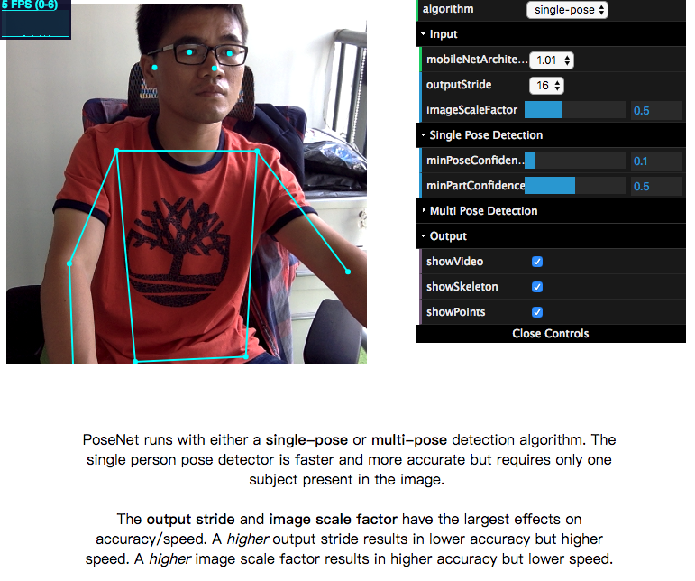
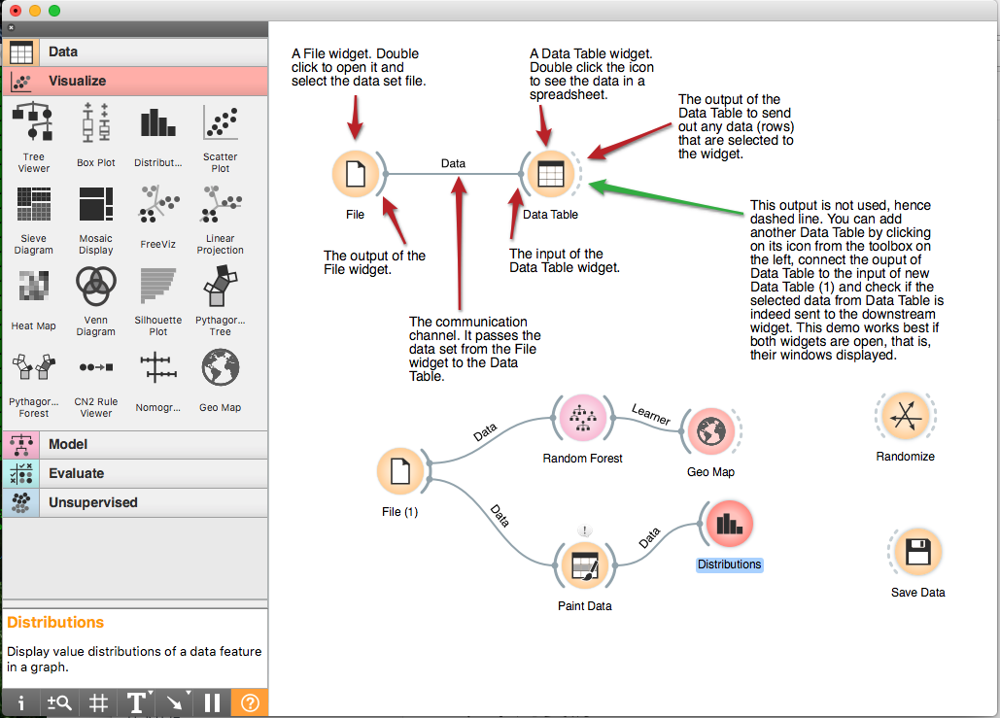
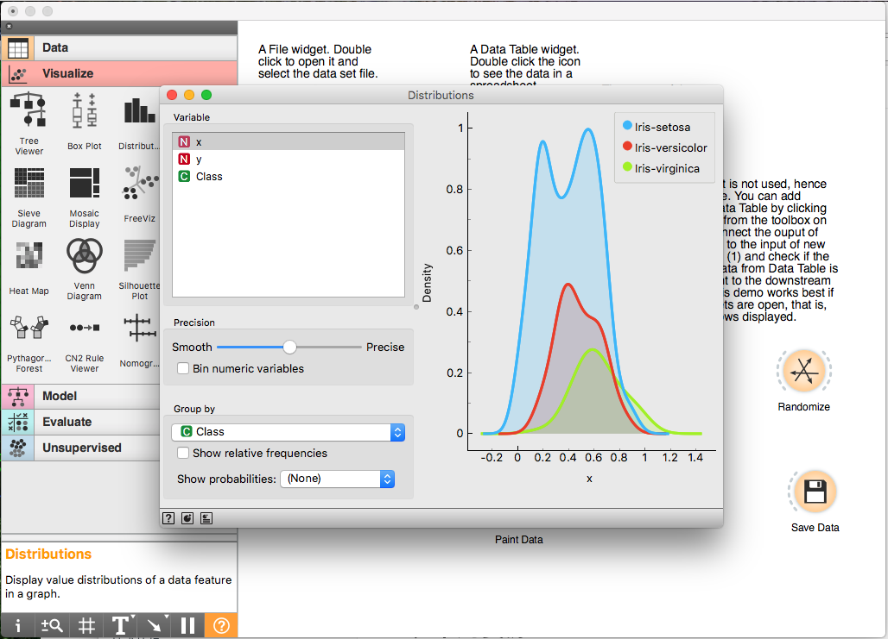

# weekly-2018

## 180611-180615

* [ 180615 ] `Paper.js` - The Swiss Army Knife of Vector Graphics Scripting，矢量图形脚本的瑞士军刀 <http://paperjs.org> github: <https://github.com/paperjs/paper.js> <iframe src="http://258i.com/gbtn.html?user=paperjs&repo=paper.js&type=star&count=true" frameborder="0" scrolling="0" width="105px" height="20px"></iframe> [ from 大民 ]
    * examples: <http://paperjs.org/examples/>
        * `路径相交`判断 <http://paperjs.org/examples/path-intersections/>
        * 图片`放射转盘`效果 <http://paperjs.org/examples/spiral-raster/>
        * `Q-bertify`效果 <http://paperjs.org/examples/q-bertify/>
        * Meta Ball`水融合`效果 <http://paperjs.org/examples/meta-balls/>
        * Tadpoles - 小蝌蚪 <http://paperjs.org/examples/tadpoles/>
* [ 180614 ] 美团外卖Android Crash治理之路 <https://mp.weixin.qq.com/s/FoimQL9XsgnM8gKtsC5jRA> [ from 张瑞 ]
* [ 180615 ] Javascript如何实现GPU加速？ <https://mp.weixin.qq.com/s/VUw1c9fv3gWlHpRuIh9PaA> [ from 大民 ]
* [ 180607 ] Android性能优化来龙去脉总结 <http://wetest.qq.com/lab/view/390.html> 以作者本人在工作中对经历过的性能优化的一些总结，依据故事的发展路线，将其分为了5个部分，分别是：常见的性能问题；产生性能问题的一些可能原因；解决性能问题的套路；代码建议及潜在性能问题排查项。
* [ 180612 ] 引擎V8推出“并发标记”，可节省60%-70%的GC时间 <https://mp.weixin.qq.com/s/pv_4YRo6KjLiVxLViZTr2Q> [ from 大民 ]
* [ 180606 ] 百度十年，我从技术走到管理 <https://mp.weixin.qq.com/s/x_DHzujXB90NevrsHPf45A> 祖明，北邮08年校招入职百度，EFE团队、ECharts产品等
* [ 180614 ] Vue技术内幕 - <http://hcysun.me/vue-design/> 逐行级别的 Vue 源码分析；实时更新 - 与dev分支同步；深度分析 - 讲解issue。 github: <https://github.com/HcySunYang/vue-design> <iframe src="http://258i.com/gbtn.html?user=HcySunYang&repo=vue-design&type=star&count=true" frameborder="0" scrolling="0" width="105px" height="20px"></iframe> [ from 大民 ]
* [ 180606 ] 阿里AntV `G6 2.0` 开源发布 -- 裂变·聚变 <https://yuque.com/antv/blog/g6-2.0-release> G6 是 蚂蚁金服-AntV 旗下的针对关系数据的可视化引擎。从 2016 年 12 月，G6 立项，半年前，我们结合真实业务需求和业内成熟框架的特点，以及自己内心的丁点不安分创新，开启了 G6 2.0 的开发工作，提供了`G6.Graph`和`G6.Tree`两类主要关系可视化API [ from 大民 ]
    * 官网： <https://antv.alipay.com/zh-cn/g6/1.x/index.html>
    * github: <https://github.com/antvis/g6> <iframe src="http://258i.com/gbtn.html?user=antvis&repo=g6&type=star&count=true" frameborder="0" scrolling="0" width="105px" height="20px"></iframe>
* [ 180607 ] 数据可视化的1996-2018 | 数据科学50人·陈为 <https://mp.weixin.qq.com/s/o7H0vpwoAXVtMnXDW2v7Cw> 1786年，苏格兰政治经济学家 `William Playfair` 第一次发明了`折线图、柱状图、面积图`等现代统计图表，1801年又发明了`饼状图`，成为了统计图形分析的开创者和奠基人，影响了未来两百多年的数据可视化的发展。这是可视化历史上第一个里程碑的事件，从此，这种辅助思考的方式同时衍生了可视化思考的新方式：用图片表达数学和证明函数、列线图辅助计算，表达数据趋势和分布等  [ from 大民 ]
* [ 180604 ] Microsoft + GitHub = Empowering Developers <https://blogs.microsoft.com/blog/2018/06/04/microsoft-github-empowering-developers/> The era of the intelligent cloud and intelligent edge is upon us. Computing is becoming embedded in the world, with every part of our daily life and work and every aspect of our society and economy being transformed by digital technology. `Developers are the builders of this new era, writing the world’s code`. And GitHub is their home. [ from 大民 ]
* [ 180608 ] WWDC - Apple Worldwide Developers Conference <https://developer.apple.com/wwdc/>  [ from 大民 ]
    * [ 180604 ] APPLE JUST MADE SAFARI THE GOOD PRIVACY BROWSER <https://www.wired.com/story/apple-safari-privacy-wwdc/> 将来的Safari将对Cookie等个人数据读取时进行显式提示，同时阻止所谓的`客户端指纹信息`的提取
* [ 180613 ] `throttle-debounce` - Throttle and debounce functions. <https://github.com/niksy/throttle-debounce> <iframe src="http://258i.com/gbtn.html?user=niksy&repo=throttle-debounce&type=star&count=true" frameborder="0" scrolling="0" width="105px" height="20px"></iframe> [ from 大民 ]

        # Install
        $ npm install throttle-debounce --save

        // Usage:
        import { throttle, debounce } from 'throttle-debounce';

        throttle( 300, function () {
            // Throttled function
        } );

        debounce( 300, function () {
            // Debounced function
        } );

* [ 160921 ] 白话debounce和throttle <https://www.cnblogs.com/wilber2013/p/5893426.html> [ from 大民 ]
    * throttle(节流)和debounce(去抖)
    * `debounce`: 当调用动作触发一段时间后，才会执行该动作，若在这段时间间隔内又调用此动作则将重新计算时间间隔
    * `throttle`: 预先设定一个执行周期，当调用动作的时刻大于等于执行周期则执行该动作，然后进入下一个新的时间周期

    常用应用场景：
    * debounce
        * 对于键盘事件，当用户输入比较频繁的时候，可以通过debounce合并键盘事件处理
        * 对于ajax请求的情况，例如当页面下拉超过一定返回就通过ajax请求新的页面内容，这时候可以通过debounce合并ajax请求事件
    * throttle
        * 对于键盘事件，当用户输入非常频繁，但是我们又必须要在一定时间内（阀值）内执行处理函数的时候，就可以使用throttle，例如，一些网页游戏的键盘事件
        * 对于鼠标移动和窗口滚动，鼠标的移动和窗口的滚动会带来大量的事件，但是在一段时间内又必须看到页面的效果，例如对于可以拖动的div，如果使用debounce，那么div会在拖动停止后一下子跳到目标位置；这时就需要使用throttle

## 180604-180608

* [ 180529 ] Why is Front-End Development So Unstable? <https://www.breck-mckye.com/blog/2018/05/why-is-front-end-development-so-unstable/> 当你在学习一个新框架的时候，类似的好几个框架正在出现，可气的是，你正学习的框架又快要过时了；前端技术是否真的变化如此之快？需要自己甄别，不要盲目跟随技术博客的潮流，总之：对Medium谨慎；对自驱谨慎；考虑non-microlib的架构等
* [ 180608 ] 重磅！阿里开源新一代自研语音识别模型`DFSMN`，准确率达`96.04%` <https://github.com/tramphero/kaldi> 近日，阿里巴巴达摩院机器智能实验室推出了新一代语音识别模型DFSMN，将全球语音识别准确率纪录提高至96.04%（这一数据测试基于世界最大的免费语音识别数据库LibriSpeech）。对比目前业界使用最为广泛的LSTM模型，DFSMN模型训练速度更快、识别准确率更高。采用全新DFSMN模型的智能音响或智能家居设备，相比前代技术深度学习训练速度提到了3倍，语音识别速度提高了2倍 
* [ 180607 ] 手机端运行卷积神经网络实现文档检测功能(二) -- 从 VGG 到 MobileNetV2 知识梳理 <https://mp.weixin.qq.com/s/Mu5dcN36Gy-uCAx3TdLYMg>
* Uber 开源地理可视化工具`Ketoper.gl`，加速数据处理 <https://uber.github.io/kepler.gl/#/> [ from 崔鹏程 ]
* [ 180606 ] `EventEmitter` - Evented JavaScript for the browser <https://github.com/Olical/EventEmitter> <iframe src="http://258i.com/gbtn.html?user=Olical&repo=EventEmitter&type=star&count=true" frameborder="0" scrolling="0" width="105px" height="20px"></iframe>

## 180528-180601

* [ 180531 ] 浅谈 2018 移动端跨平台开发方案 <https://mp.weixin.qq.com/s/4yzANNti0x3B7HOI25BRZw> [from 君毅]
* [ 180524 ] 高段位的人，都会战略性放弃 <https://mp.weixin.qq.com/s/5KPRat5HzmLt9SvjL1cTZA> 有所为有所不为，盯紧核心目标做减法，让商业思路更清晰。
* [ 180531 ] `nanoJS` - nanoJS is around `100 lines` of code (`0.6 Kb` compressed) JavaScript library for basic DOM manipulation. It has jQuery like syntax and supports chaining. <https://vladocar.github.io/nanoJS/> github: <https://github.com/vladocar/nanoJS/> <iframe src="http://258i.com/gbtn.html?user=vladocar&repo=nanoJS&type=star&count=true" frameborder="0" scrolling="0" width="105px" height="20px"></iframe>
* [ 180531 ] `filepond` - A JavaScript library that can upload anything you throw at it, optimizes images for faster uploads, and offers a great, accessible, silky smooth user experience. <https://github.com/pqina/filepond> <iframe src="http://258i.com/gbtn.html?user=USER&repo=REPO&type=star&count=true" frameborder="0" scrolling="0" width="105px" height="20px"></iframe>
* [ 180531 ] JavaScript 算法与数据结构 <https://github.com/trekhleb/javascript-algorithms/blob/master/README.zh-CN.md>
* [ 180531 ] Kotlin扩展函数与实现机制探索 <https://mp.weixin.qq.com/s/ARlkRUv6a_AARWZYX2wM6A>

        // Kotlin,没有了冗余的findViewById，我们可以直接对资源id进行操作，也不需要匿名内部类的声明，更关注函数的实现本身，抛弃了复杂的格式
        class MainKotlinActivity:Activity() {

            override fun onCreate(savedInstanceState: Bundle?) {
                super.onCreate(savedInstanceState)
                setContentView(R.layout.activity_main)

                R.id.label.setText("hello")
                R.id.label.onClick { Log.d("Glen","onClick TextView") }
                R.id.btn.onClick { Log.d("Glen","onClick Button") }
            }
        }

* [ 180524 ] 我在百度这十年 - 杨尊程 <https://mp.weixin.qq.com/s/XQC8ru3Qmf5k3-5I1jhLKw> 
* [ 180501 ] 各 IT 公司的（大）前端团队体系都是怎样的？<https://www.zhihu.com/question/278441684>
* [ 180531 ] Toolchain for WebAssembly <https://github.com/xtuc/webassemblyjs> <iframe src="http://258i.com/gbtn.html?user=xtuc&repo=webassemblyjs&type=star&count=true" frameborder="0" scrolling="0" width="105px" height="20px"></iframe>
* [ 180531 ] SuperMap iClient for JavaScript 9D - 云GIS网络客户端开发平台 <http://iclient.supermap.io>
    * iClient for Leaflet
    * iClient for OpenLayers
    * iClient for MapboxGL
    * iClient Classic
    * iClient 3D-WebGL
    SuperMap iClient for JavaScript 9D 是云GIS网络客户端开发平台。基于现代Web技术栈全新构建，是SuperMap云四驾马车和在线GIS平台系列产品的统一JS客户端。 集成了领先的开源地图库、可视化库，且核心代码以Apache2协议完全开源，连接了SuperMap与开源社区。 提供了全新的大数据可视化、实时流数据可视化功能，通过本产品可快速实现浏览器和移动端上美观、流畅的地图呈现与空间分析。
* [ 180517 ] `ReactEurope` - ( 2018.05.17 ~ 2018.05.18 ) <https://www.react-europe.org> 文章还没有放出来，也可能我们还没有找到，干货应该挺多的
* [ 180529 ] 机器学习在自动驾驶中的应用-以百度阿波罗平台为例【上】<https://mp.weixin.qq.com/s/MxYvRnIjNxnt4E0CHq7Gpg> 用浅显的文字，为你揭开`自动驾驶算法`的神秘面纱
* [ 180529 ] 从性能分析角度谈`拆分组件` <https://mp.weixin.qq.com/s/uvZroR2BozG9n4JihUOzIg>
* [ 170806 ] 拆分你的React组件 <https://blog.csdn.net/zhendong9860/article/details/76785242>，译自 Techniques for decomposing React components <https://medium.com/dailyjs/techniques-for-decomposing-react-components-e8a1081ef5da>
* [ 180530 ] face++人脸识别在线Demo <https://www.faceplusplus.com.cn/landmarks/>
* [ 170529 ] Android 新架构组件: `WorkManager` <https://mp.weixin.qq.com/s/VyBYUT34WGr5AQCFJNc9Kg>
* [ 170512 ] 大规模知识图谱数据存储实战解析 <https://zhuanlan.zhihu.com/p/26668616>

## 180521-180525

* [ 180525 ] 有哪些视频堪称有毒？ <https://www.zhihu.com/question/267782048>
* [ 180510 ] You Can't Handle the Truth About Facebook Ads, New Harvard Study Shows <https://theintercept.com/2018/05/09/facebook-ads-tracking-algorithm> [from 君毅] 当人们理解到被展示的广告是根据他们的行为有目的的投放时会感到厌恶，但人们又希望自己看到的广告是跟他的喜好相关的，一个办法是让用户自己来选择要不要广告
* [ 180524 ] Building Reusable React Components <https://blog.bitsrc.io/building-reusable-react-components-1465a2dccc13> [from 君毅]

        Avoid weak wrapper elements.
        Specify PropTypes and their defaults.
        Avoid hard coding HTML IDs.
        Declare Logical Defaults.
        Use Config objects when your components have long list of props.
        Use Server-Side Rendering.
        Make your components more accessible.
        Ensure that your component has a single responsibility.
        Sharing components via a component library and/or Bit.

* [ 180524 ] Build your own X <https://github.com/danistefanovic/build-your-own-x#build-your-own-3d-renderer>  [ from 君毅 ] 汇总了各式各样“实现自己xxx”的教程文章，包含了多种语言的实现方式
* [ 180524 ] Lynt:A Zero Config JavaScript Linter <https://github.com/saadq/lynt>  [ from 君毅 ] 零配置就可以使用，不提供样式规则的检测，可配合类似prettier的库来使用
* [ 180510 ] Cordova and React Native Comparison <https://medium.com/the-web-tub/cordova-and-react-native-comparison-3f8bf16cf036> [from 君毅] 分别从背景、构建性能、运行性能、调试能力等角度进行了对比，并给出了选择框架的建议。综合比较RN构建包大、运行速度快
* [ 180508 ] 不懂产品的研发，不是好CTO <https://mp.weixin.qq.com/s/HpVCTJAmt-TH9M8y8K75lw> [from 君毅] 从产品经理的角度介绍了产品经理工作中的关注点与技巧，帮助大家理解产品经理，更好的能够与产品经理沟通
* [ 180521 ] 使用CSS 3 制作长投影 <http://www.jackpu.com/shi-yong-css-3-zhi-zuo-chang-tou-ying-long-shadow>  介绍了如何通过text-shadow配合scss或less来实现文字的长投影效果
* [ 180517 ] 深度学习三大框架对比 <https://mp.weixin.qq.com/s/79AgYHcUehbu6MhkzUOGWw>
* [ 180524 ] 《移动端本地 H5 秒开方案探索与实现》 <https://mp.weixin.qq.com/s/0OR4HJQSDq7nEFUAaX1x5A> 通篇看下来，亮点不太多，常识性的内容较多
* [ 180520 ] 图灵大会 | 百度高级副总裁王海峰：未来搜索将无处不在（附29页演讲PPT全文） <https://mp.weixin.qq.com/s/lmWh2OH2CTJcekdjurfPeQ> 
* [ 180522 ] 一个程序员的成长之路 - 剖析别人，总结自己 - 张云龙 <https://mp.weixin.qq.com/s/zWPjfHiYxx0HH9lE99Yijw>
* [ 180524 ] 冒烟测试 - 百度百科 <https://wapbaike.baidu.com/item/冒烟测试/2166486>
* [ 180523 ] 智创未来 慧审天下 | 为业务应用赋能，华宇重磅发布法律AI平台 <https://mp.weixin.qq.com/s/pmrM_z_XXDEHl2Z7YkxpXQ>
* [ 180523 ] [nuxt 原创系列]之asyncData浅析 <https://mp.weixin.qq.com/s/b9ITN0V8W1mqJensQlhjmQ> 
* [ 180522 ] 任正非向习近平汇报发言2000字，字字珠玑！(全文) <https://mp.weixin.qq.com/s/tGJdi5NgjKKz-ANeR3Ch1Q>
* [ 180524 ] 【第1282期】页面可视化搭建工具前生今世 <https://mp.weixin.qq.com/s/pcUbnYyVHSebOelDlHA27g>
* [ 180523 ] 靠谱，是最高级的聪明 <https://mp.weixin.qq.com/s/3fQzvrs6IQe4S98ky562NQ>
* [ 180523 ] 腾讯首次公布微信数据（完整版） <https://mp.weixin.qq.com/s/ucimpDTqX3EgTjnzi9szuw>
* [ 180523 ] 小游戏爆发前夜：微信是怎么打算的？ <https://36kr.com/video/6353>

## 180514-180518

* [ 180518 ] `飞冰[ iceworks ]` - 阿里开源前端开发工具，使用海量可复用物料，配套桌面工具极速构建前端应用 <https://alibaba.github.io/ice/> github: <https://github.com/alibaba/ice/> <iframe src="http://258i.com/gbtn.html?user=alibaba&repo=ice&type=star&count=true" frameborder="0" scrolling="0" width="105px" height="20px"></iframe>
* [ 180510 ] 有了`TensorFlow.js`，浏览器中也可以`实时人体姿势估计` <https://blog.csdn.net/mogoweb/article/details/80274063>

    Demo地址：<https://storage.googleapis.com/tfjs-models/demos/posenet/camera.html>

    

* [ 180510 ] LeetCode 算法题刷题心得 <https://juejin.im/entry/5af391bc51882567203410f1/>
* [ 180518 ] React components that implement Google's Material Design. <https://material-ui.com> github： <https://github.com/mui-org/material-ui> <iframe src="http://258i.com/gbtn.html?user=mui-org&repo=material-ui&type=star&count=true" frameborder="0" scrolling="0" width="105px" height="20px"></iframe>
* [ 180507 ] Introducing `the Checks API`, a better way to connect integrations and code <https://blog.github.com/2018-05-07-introducing-checks-api/> github提供的工具，The Checks API allows you to build sophisticated tools for continuous integration (CI), linting, and acceptance testing on GitHub
* [ 180507 ] 精读《async/await 是把双刃剑》 <https://zhuanlan.zhihu.com/p/36521539>
* [ 180510 ] React Context API — A Replacement for Redux? <https://blog.bitsrc.io/react-context-api-a-replacement-for-redux-6e20790492b3> Convert a React App that uses Redux for State Management to use React’s New Context API

        // 3 main steps
        context = React.createContext( obj )
        context.Provider
        context.Consumer

* [ 180509 ] Introducing `Guess.js` - a toolkit for enabling data-driven user-experiences on the Web <https://blog.mgechev.com/2018/05/09/introducing-guess-js-data-driven-user-experiences-web/> Google Analytics, webpack plugins, lazy-load all routes, etc. 尚未完全搞清楚，大体解释一下：构建时即可使用GA的数据，判定应用中哪些模块直接打包，哪些模块按需加载，提高最高概率加载的模块的加载速度，提供了webpack plugin，自动分析和打包
* [ 180510 ] `Microsoft Build`大会 180508-180510 <https://developer.microsoft.com/en-us/events/build>
    * [ 180511 ] 微软 Build 大会回顾：两天 Keynote 发布全记录 <http://www.geekpark.net/news/229042>
    * [ 180507 ] Azure Machine Learning, JavaScript Custom Functions, and Power BI Custom Visuals Further Expand Developers Capabilities with Excel <https://dev.office.com/blogs/azure-machine-learning-javascript-custom-functions-and-power-bi-custom-visuals-further-expand-developers-capabilities-with-excel>
    * [ 180508 ] Microsoft 365 and the Future of App Development: Microsoft Build 2018 Second Day Keynote <https://www.infoq.com/news/2018/05/Microsoft-BUILD-Keynote-Day-2>
* [ 180510 ] `Google I/O`大会 180508-180510 <https://events.google.com/io/>
    * [ 180510 ] 在 Google 刚发布的黑科技背后，还有些更重要的东西 | 极客深度 <http://www.geekpark.net/news/228955>
    * [ 180510 ] Google I/O 2018有哪些亮点 <https://www.zhihu.com/question/275930989>
* [ 180515 ] 旷视发布基准数据集`CrowdHuman`，用于人群中的人类检测 <http://www.crowdhuman.org> 资讯：<https://www.toutiao.com/a6555707502237843971>
* [ 180516 ] 微信分享功能调整 <https://mp.weixin.qq.com/cgi-bin/announce?action=getannouncement&announce_id=11526372695t90Dn> 为鼓励用户自发分享喜爱的内容，减少`“强制分享至不同群”`等滥用分享能力，破坏用户体验的行为，微信公众平台分享功能即日起做出调整
* [ 180513 ] 极简以色列史（一口气读完） <https://mp.weixin.qq.com/s/wyDWGhzFmBGVSEhHEcqrzQ>
* [ 180426 ] Qt 也要拥抱 WebAssembly！将在 5.11.0 中正式支持 <https://www.oschina.net/news/95530/beta-qt-webassembly-technology-preview>
* [ 180423 ]Beta for Qt for WebAssembly Technology Preview <http://blog.qt.io/blog/2018/04/23/beta-qt-webassembly-technology-preview/>

## 180507-180511

* [ 180507 ] 字蛛+发布！支持动态渲染、远程多页面字体压缩 <http://tgideas.qq.com/webplat/info/news_version3/804/7104/7106/m5723/201805/716852.shtml> 字蛛官网 <http://font-spider.org/> [ from 崔鹏程 ]
* [ 180502 ] 如何在疲劳的JS世界中持续学习 <https://juejin.im/post/5ae97bd05188256719521ae0> 关注大牛、探索新项目、看最好的资讯、做一名贡献者、总结出自己的学习方法
* [ 180503 ] 14行JavaScript教你使用WebAssembly <https://mp.weixin.qq.com/s/bm1JPMyezHIC9ThdTvCu2g>
* [ 180507 ] 进入“泛屏幕”时代，Qt迎来风口？ <https://www.toutiao.com/a6552783305408774670>
* [ 180508 ] 深度卷积神经网络演化历史及结构改进脉络-40页长文全面解读 <https://mp.weixin.qq.com/s/-dXyuN2DUgWYyp8TRb0k3Q>
* [ 180508 ] 膜拜，第25届国际 C 语言混乱代码大赛获奖作品公布 <https://mp.weixin.qq.com/s/F60zzXAy_UucX3Te4_VKCQ>
* [ 180508 ] Visual Studio 引入新功能：根据上下文智能完成代码 <https://www.toutiao.com/a6553013620119175687> `Build 2018`开发者大会，Visual Studio IntelliCode
* [ 180508 ] 谷歌响应式框架Flutter Beta 3发布 <https://www.toutiao.com/a6553046533850268168>
* [ 180501 ] 炫酷H5中序列图片视频化播放的高性能实现 <http://www.zhangxinxu.com/wordpress/2018/05/image-sequence-html5-video-play/>
* [ 180506 ] 深度概览卷积神经网络全景图，没有比这更全的了 <https://mp.weixin.qq.com/s/5W_Q3dW5tYFkNy0gMnOwKA>
* [ 180418 ] 如何从0到1开始机器学习？<https://mp.weixin.qq.com/s/f0QaFbv2sR1EgYOhjkSIvA>
* [ 180504 ] JavaScript学习笔记：querySelectorAll 和 getElementsByTagName区别 <https://www.w3cplus.com/javascript/querySelectorAll-vs-getElementsByTagName.html> 使用getElementsByTagName方法我们得到的结果就像是一个对象的索引，而通过querySelectorAll方法我们得到的是一个对象的克隆；所以当这个对象数据量非常大的时候，显然克隆这个对象所需要花费的时间是很长的。这也就是为什么说getElementsByTagName()在所有浏览器上都比querySelectorAll()要快好多倍。
* [ 180506 ] 一个黑点表情能让所有安卓手机卡死：原理揭晓 <https://www.toutiao.com/a6552255295555371527>
* [ 180505 ] 微软释出3D渲染框架`Babylon.js`，支持多项`WebGL2.0`特效画面大跃进 <https://www.toutiao.com/a6551781450453090820> 
* [ 180509 ] `Babylon.js`: a complete JavaScript framework for building 3D games with HTML 5 and WebGL <https://github.com/BabylonJS/Babylon.js> <iframe src="http://258i.com/gbtn.html?user=BabylonJS&repo=Babylon.js&type=star&count=true" frameborder="0" scrolling="0" width="105px" height="20px"></iframe>

        # install
        npm install babylonjs --save

        // import entirely
        import * as BABYLON from 'babylonjs';
        // or import individually
        import { Scene, Engine } from 'babylonjs';

        // usage
        // Get the canvas DOM element
        var canvas = document.getElementById('renderCanvas');
        // Load the 3D engine
        var engine = new BABYLON.Engine(canvas, true, {preserveDrawingBuffer: true, stencil: true});
        // CreateScene function that creates and return the scene
        var createScene = function(){
            // Create a basic BJS Scene object
            var scene = new BABYLON.Scene(engine);
            // Create a FreeCamera, and set its position to {x: 0, y: 5, z: -10}
            var camera = new BABYLON.FreeCamera('camera1', new BABYLON.Vector3(0, 5, -10), scene);
            // Target the camera to scene origin
            camera.setTarget(BABYLON.Vector3.Zero());
            // Attach the camera to the canvas
            camera.attachControl(canvas, false);
            // Create a basic light, aiming 0, 1, 0 - meaning, to the sky
            var light = new BABYLON.HemisphericLight('light1', new BABYLON.Vector3(0, 1, 0), scene);
            // Create a built-in "sphere" shape; its constructor takes 6 params: name, segment, diameter, scene, updatable, sideOrientation
            var sphere = BABYLON.Mesh.CreateSphere('sphere1', 16, 2, scene, false, BABYLON.Mesh.FRONTSIDE);
            // Move the sphere upward 1/2 of its height
            sphere.position.y = 1;
            // Create a built-in "ground" shape; its constructor takes 6 params : name, width, height, subdivision, scene, updatable
            var ground = BABYLON.Mesh.CreateGround('ground1', 6, 6, 2, scene, false);
            // Return the created scene
            return scene;
        }
        // call the createScene function
        var scene = createScene();
        // run the render loop
        engine.runRenderLoop(function(){
            scene.render();
        });
        // the canvas/window resize event handler
        window.addEventListener('resize', function(){
            engine.resize();
        });

* [ 180430 ] Airbnb技术经理朱赟：这6点，让你从技术骨干到优秀Leader <https://mp.weixin.qq.com/s/QVlYsRYB5Qgj0x0AWkB5AQ>
* [ 180509 ] Google I/O 2018 : 这里是所有你不能错过的大新闻 <https://mp.weixin.qq.com/s/aDiJ-qtz-Z-0NlbeuDMRsw>
* [ 180507 ] `ReLaXed` - Create PDF documents using web technologies <https://github.com/RelaxedJS/ReLaXed>
* [ 180507 ] `dayjs` - Fast 2KB immutable date library alternative to Moment.js with the same modern API <https://github.com/xx45/dayjs>，类似的还有`Miment` 
* [ 180507 ] Miment - a fast,light weight,simple and non-dependencies datetime library for javascript ( mini moment ) <https://github.com/noahlam/Miment>
* [ 170416 ] moment太重? 那就试试miment -- 一个超轻量级的js时间库 <https://juejin.im/post/5ad3f8966fb9a028d1419031> [ from 张硕 ]

## 180502-180504

* [ 180502 ] 四月前端知识集锦 <https://juejin.im/post/5ae95f17f265da0b93481dec> [ from 张硕 ]
* [ 180424 ] 如何监听数组变化? <https://juejin.im/post/5ade0e3df265da0b8e7f050b> [ from 张硕 ]
* [ 180424 ] 一个小黄网的手动入侵过程? <https://juejin.im/entry/5ad1b80bf265da23793c96df> [ from 张硕 ]
* 你不曾见过的酷炫地图可视化作品
    * [ 171105 ] （一）<https://www.jianshu.com/p/8f74233b3b4e>
    * [ 171114 ] （二）<https://www.jianshu.com/p/f7fc3f748d1b>
* [ 170316 ] 理解CSS：字体度量、line-height和vertical-align line-height 和 vertical-align <https://zhuanlan.zhihu.com/p/25808995> 都是简单的 CSS 属性，以致于大多数人自以为知道这两个属性的工作原理。但实际上这两个属性非常复杂，也许算得上是 CSS 里最难的两个属性，因为这两个属性和 CSS 里一个鲜为人知的特性息息相关：内联格式化上下文(IFC) 
* [ 170921 ] 我用了两个月的时间才理解let <https://zhuanlan.zhihu.com/p/28140450> 对于ES6中的let，大家一定不陌生，但作者对于let却有一波三折的理解，让我们一起来看看吧~ 

        function() {
            console.log( x ); // Uncaught ReferenceError: x is not defined
            let x;
        }

    * let 的「创建」过程被提升了，但是初始化没有提升。
    * var 的「创建」和「初始化」都被提升了。
    * function 的「创建」「初始化」和「赋值」都被提升了。

* [ 180502 ] `isomorphic-fetch` - Isomorphic WHATWG Fetch API, for Node & Browserify <https://github.com/matthew-andrews/isomorphic-fetch> <iframe src="http://258i.com/gbtn.html?user=matthew-andrews&repo=isomorphic-fetch&type=star&count=true" frameborder="0" scrolling="0" width="105px" height="20px"></iframe>
* [ 180502 ] `fetch` - A `window.fetch` JavaScript polyfill. <http://github.github.io/fetch/> github: <https://github.com/github/fetch> <iframe src="http://258i.com/gbtn.html?user=github&repo=fetch&type=star&count=true" frameborder="0" scrolling="0" width="105px" height="20px"></iframe>
* [ 180328 ] Popmotion —— 流动你的页面：Popmotion 是一个只有12KB的运动引擎，可以用来实现动画，物理效果和输入跟踪。作为2017年崛起的十大前端开源项目，已经席卷了10k的star。 <https://zhuanlan.zhihu.com/p/33951814> 

## 180423-180428

* [ 180427 ] WebWorker实战使用 <https://www.cnblogs.com/dojo-lzz/p/7899283.html> [ from 赵君毅 ]
* [ 180427 ] s控制输入框光标位置（setSelectionRange详解) <https://blog.csdn.net/foralienzhou/article/details/52437929> [ from 赵君毅 ]
* [ 180425 ] 几道高级前端面试题解析 <https://juejin.im/post/5aa8a07cf265da238a3022a4> [ from 籍学聪 ]
* [ 180427 ] 你在淘宝上看到的图片和视频，到底怎样一步步被机器人接管？ <http://www.geekpark.net/news/228422> 阿里AI工具：`鲁班`( 将改名`鹿班` )和`Aliwood`
* [ 180427 ] A markdown editor, that allows you to edit live with hot keys support! <https://github.com/Canner/slate-md-editor> <iframe src="http://258i.com/gbtn.html?user=Canner&repo=slate-md-editor&type=star&count=true" frameborder="0" scrolling="0" width="105px" height="20px"></iframe> 

    demo: <https://camo.githubusercontent.com/e5874675d83ef4a43302d3e5f459d7054129c3fa/68747470733a2f2f692e696d6775722e636f6d2f4f71514d4d69432e676966>
* [ 180427 ] D3 in Depth aims to bridge the gap between introductory tutorials/books and the official documentation. It focuses on version 4 of D3. <http://d3indepth.com>
* [ 180419 ] Rethinking GPS: Engineering Next-Gen Location at Uber <https://eng.uber.com/rethinking-gps/> Uber开发的`particle filter service`，提升GPS定位精度

    

* [ 180418 ] Redux - v4.0.0 <https://github.com/reactjs/redux/releases/tag/v4.0.0>

        applyMiddleware
        bindActionCreators
        Throw if getState, subscribe, or unsubscribe called while dispatching
        Warn when dispatching during Middleware setup

* [ 180418 ] Underscore.js 1.9.0 Released <http://underscorejs.org/#1.9.0> Here’s a blast from the past, 3 years after its last release.

        _.restArguments
        _.chunk
        _.isSymbol, _.isMap, _.isWeakMap, _.isSet, _.isWeakSet
        _.throttle, _.debounce return functions that now have a .cancel() method
        _.property
        _.range
        supprt for: WebWorkers, browerify and ES6 imports
        _.partial.placeholder
        _.bindAll
        Three years of performance improvements

* [ 180416 ] Best Practices With `CSS Grid Layout` <https://www.smashingmagazine.com/2018/04/best-practices-grid-layout/>

        .grid {
            display: grid;
            grid-template-columns: 1fr 3fr 1fr;
            grid-template-rows: minmax(200px auto) 400px minmax(300px, auto);
            grid-auto-rows: minmax(300px, auto);
            grid-gap: 20px;
        }

* [ 180415 ] Designing very large (JavaScript) applications <https://medium.com/@cramforce/designing-very-large-javascript-applications-6e013a3291a3> React, code splitting, lazyload, avoid central configuration, ...
* [ 180426 ] JavaScript implementation of different computer science algorithms <https://mgechev.github.io/javascript-algorithms/> github: <https://github.com/mgechev/javascript-algorithms> <iframe src="http://258i.com/gbtn.html?user=mgechev&repo=javascript-algorithms&type=star&count=true" frameborder="0" scrolling="0" width="105px" height="20px"></iframe>
* [ 180421 ] Angular - All Talks from `ng-conf 2018` <https://nitayneeman.com/posts/all-talks-from-ng-conf-2018/> `Angular - v6` 有点多，看了一些：
    * Testing Best Practices for Angular Applications <https://docs.google.com/presentation/d/1mw_vIye6WoSTil9t_kuAD4yjUrrFSOil88xv8afB9Fk/edit#slide=id.g26d86d3325_0_0>
    * Make your JS app search engine friendly <http://g.co/ng/seo-talk>
    * Optimizing an Angular application <https://slidr.io/mgechev/optimizing-an-angular-application>
    * ...

* [ 180426] `vant` - A Vue.js 2.0 Mobile UI at YouZan <https://www.youzanyun.com/zanui/vant#/zh-CN/intro> github: <https://github.com/youzan/vant> <iframe src="http://258i.com/gbtn.html?user=youzan&repo=vant&type=star&count=true" frameborder="0" scrolling="0" width="105px" height="20px"></iframe>
* [ 180426 ] Android插件化、热补丁中绕不开的ProGuard的坑 <https://mp.weixin.qq.com/s/5_zzNjfYHgca7xPbwAkODg>
* [ 171229 ] `CSS工作草案`：Requirements for Chinese Text Layout 中文排版需求 <https://www.w3.org/TR/clreq/>
* [ 180410 ] `Houdini` 实战：自定义 checkbox <https://zhuanlan.zhihu.com/p/35479957> codepen: <https://codepen.io/quietcoder/project/editor/ArNydA>

        class Checkbox {
            static get inputArguments() { return ['<length>'] }
            static get inputProperties() { return ['--color'] }
            paint (ctx, size, styleMap, args) {
                // ...
            }
        }
        registerPaint( 'checkbox', Checkbox );

* [ 180424 ] amazeui - Amaze UI, a mobile-first and modular front-end framework <http://amazeui.org/>  github: <https://github.com/amazeui/amazeui> <iframe src="http://258i.com/gbtn.html?user=zmazeui&repo=amazeui&type=star&count=true" frameborder="0" scrolling="0" width="105px" height="20px"></iframe>
* [ 180424 ] `amaze-vue` - 学聪搞的基于amazeui样式封装的vue组件库  <https://sunshineji.github.io/amaze-vue-docs/#/>
* [ 180424 ] print.css - an open source print stylesheet for the environmentally-conscious web developer <https://printstylesheet.dbushell.com>

        @media only print
        {
            body * { display: none !important; }
            body:after { content: "Don't waste paper!"; }
        }

## 180416-180420

* [ 180416 ] 使用localstorage代替cookie`实现跨域共享数据` <https://zhuanlan.zhihu.com/p/35738376?group_id=969283251281616896> [ from 崔鹏]
* [ 180413 ] 前端布局推进剂 - `间距规范化` <https://juejin.im/post/5ad0a366f265da239b41dbaf> [ from 崔鹏]
* [ 180415 ] 函数式编程 <https://juejin.im/post/5ad36da76fb9a028c71ee65b> [ from 崔鹏]
* [ 180415 ] webassembly在flv编解码中的实战 <https://github.com/lanjingling0510/blog/issues/8> [ from 崔鹏]
* [ 180225 ] 安卓继任者`Fuchsia`是怎样的一种存在？ <http://mobile.51cto.com/anews-566625.htm> [ from 君毅]
* [ 171222 ] 把前端监控做到极致 <https://zhuanlan.zhihu.com/p/32262716> [ from 崔鹏]
* [ 170419 ] A re-introduction to JavaScript (JS tutorial) <https://developer.mozilla.org/en-US/docs/Web/JavaScript/A_re-introduction_to_JavaScript> [ from 文玲]
* [ 171016 ] 用 WebGL 探索动画和交互技术 <https://juejin.im/post/59f14f225188255d910cb2c4> <https://moments.epic.net> [ from 崔鹏]
* [ 180418 ] `腾讯文档`发布，正值石墨刚宣布完成来自头条的近亿元B轮融资 <https://docs.qq.com/index.html> 腾讯文档是一款可多人协作的在线文档。支持Word和Excel类型，打开网页就能查看和编辑，云端实时保存；可多人实时编辑文档，权限安全可控。还支持微信小程序版。
* [ 180409 ] DOCKER 从入门到实践 <https://imnerd.org/docker-in-action.html>
* [ 180215 ] Web 前端中的`增强现实`（AR）开发技术 <http://www.infoq.com/cn/articles/augmented-reality-development-tech-in-web-frontend> AR 的优势在于把目之所及的现实场景变成了背景，并将现实世界和数字世界无缝连接。AR 的主要实现方式有 2 种：`光学透视式` (Optical see-through) 和`视频透视式` (Video see-through)。目前（2017 年底） Web 前端要想实现 AR，都是靠的视频透视式技术。
* [ 180419 ] `Gradle User Guide` 中文版 <https://love2.io/@hakukata/doc/GradleUserGuide/README.md>
* [ 180131 ] 机器学习时代的体验设计（上、下）-对创造人类行为学习系统的设计师和数据学家的启示 <http://mux.baidu.com/779> <http://mux.baidu.com/810>
* [ 180412 ] 增长黑客 & 价值黑客：做增长应该关注价值，而不是指标 <http://36kr.com/p/5128132.html> 如何开始价值黑客？ 1、查看你的数据，并确定具有相似使用模式的不同用户群；2、查看现有用例的价值主张
* [ 180419 ] Android container in Chrome OS <https://chromium.googlesource.com/chromiumos/platform2/+/master/arc/container-bundle/>
* [ 180419 ] `react-beautiful-dnd` <https://github.com/atlassian/react-beautiful-dnd> Demo非常完善
* [ 180419 ] `VuePress`: Vue-powered Static Site Generator  <https://vuepress.vuejs.org> 要求node版本不低于8

        # install
        yarn global add vuepress # OR npm install -g vuepress
        
        # create a markdown file
        echo '# Hello VuePress' > README.md
        
        # start writing
        vuepress dev
        
        # build to static files
        vuepress build

* [ 180414 ] 各大 App 可以直接打开小程序！微信收割移动互联网的时间开始了 <http://www.ifanr.com/minapp/1012686> 这是新的时间风向标，是微信收割移动互联网下半场的开始，对大App来说，再做自己的小程序已经意义不大，而对中小心App来说，这是对其平台能力的提升
* [ 180404 ] New in `Electron 2`: In-App Purchases <https://electronjs.org/blog/in-app-purchases>
* [ 180409 ] `Bootstrap 4.1` <https://blog.getbootstrap.com/2018/04/09/bootstrap-4-1/>
* [ 180410 ] Thank you for 10 years - from Github <https://blog.github.com/2018-04-10-ten-years-of-code/> 感谢有你，github十周年
* [ 180414 ] 谷歌发布`「与书对话」`检索引擎，从字里行间邂逅心仪书籍 <https://www.leiphone.com/news/201804/mGWpse2M8Fnn5Vcs.html> 以往我们在检索书籍时，通常会从书名、作者、主题等表面标签入手。而谷歌发布的「Talk to Books」可以为用户提供一种检索书籍的全新方法。用户只需要做一段相关描述，或是提一个相关的问题，那么 Talk to Books 可以在不依赖关键词匹配的情况下，从超过 10 万本书籍中检索所有句子，并根据句子层面的语义，找到能匹配用户陈述或问题的句子。
* [ 180410 ] Creating custom URL shortener with Nodejs <https://codeburst.io/creating-custom-url-shortener-with-nodejs-de10bbbb89c7>
* [ 180411 ] Node.js can `HTTP/2 push`! <https://medium.com/the-node-js-collection/node-js-can-http-2-push-b491894e1bb1> Since introducing HTTP/2 into `Node.js 8 in July of 2017`, the implementation has undergone several rounds of improvements. Now we’re almost ready to lift the “experimental” flag. It’s best to try out HTTP/2 support with `Node.js version 9`, which has all the latest fixes and improvements.
* [ 180412 ] IEEE Pacific Visualization Symposium 2018，来自北京大学可视化与可视分析博客的参会见闻：
    * Day 0: <http://vis.pku.edu.cn/blog/ieee-pacific-visualization-symposium-2018-day-0/>
    * Day 1: <http://vis.pku.edu.cn/blog/ieee-pacific-visualization-symposium-2018-day-1/>
    * Day 2: <http://vis.pku.edu.cn/blog/ieee-pacific-visualization-symposium-2018-day-2/>
    今年的大会在日本神户大学召开，清华大学的刘世霞老师作题为《可解释的机器学习（Explainable Machine Learning）》；北大和上海交大合作的MetroWordle也做了交流，是将文本可视化的wordle方法和城市地铁线路有机结合起来，可以对城市中大量的地理位置及其语言信息进行有效的可视化；日本庆应大学的TideGrapher，是对橄榄球比赛双方优势的可视分析；来自浙大的VisComposer，提供了一种灵活构建可视化的方法；韩国首尔大学的工作针对Linux系统中的大规模审计日志进行交互式可视分析。来自于UC Davis马匡六小组延续他们去年VAST的工作，针对大规模超算网络中的通信行为和模式开展了进一步的可视分析，帮助优化并行应用程序中的通信。
* [ 180417 ] 华为区块链白皮书全文：专注4大类9小类应用场景 <http://www.sohu.com/a/228701849_115060> 白皮书下载地址：<https://pan.baidu.com/s/1mut-K0XuBilyVt3CKdwvBA>
* [ 180417 ] 区块链参考资料：<https://github.com/gymgle/blockchain-reference>
* [ 180419 ] `小程序`有50多种连接方式，你知道吗？ <https://mp.weixin.qq.com/s/8utgTqruaxFzy3KBGr7fgg>
* [ 180416 ] 遇见未来 | 对话叶毓睿：人类文明运行在软件之上 ( VMware存储架构师 )
    * 上篇：<https://mp.weixin.qq.com/s/6mXN9zp71iyy4A4cOesirg>
    * 下篇：<https://mp.weixin.qq.com/s/6wvzYKX8b1jeH9QC0pCaBQ>
* [ 180419 ] 关于Chrome的#没品知识# <http://www.dapenti.com/blog/readforwx.asp?name=xilei&id=130989>
* [ 180416 ] NUXT - Universal Vue.js Applications, <https://nuxtjs.org> github: <https://github.com/nuxt/nuxt.js>
* [ 170521 ] javascript实现多线程 Concurrent.Thread.js 【关于while(true)怎么不卡死当前线程的一种解决方案】 <https://www.cnblogs.com/l-yabiao/p/6884030.html>   <https://github.com/bringmehome/Concurrent.Thread.js> 相比webworker，它厉害的地方是可以将DOM相关操作也进行多线程模拟

## 180408-180413

* [ 180409 ] 面向前端工程师的机器学习引导课 <https://mp.weixin.qq.com/s/oUYr3fr7XLOEqQ8pEJFnhw>
* [ 180409 ] 狼叔：如何正确的学习 Node.js <https://i5ting.github.io/How-to-learn-node-correctly/>
* [ 180412 ] 2018 年了，你还是只会 npm install 吗？<https://mp.weixin.qq.com/s/e-_3DN5CzVFDmNZ1W4F9VA>
* [ 180412 ] 基于金融场景的Vuejs组件库`Mand Mobile` <https://mp.weixin.qq.com/s/tOnvsOx38xEUnxtUx1A-xQ>
* [ 180413 ] Google Style Guides: <http://google.github.io/styleguide/> Google JavaScript Style Guide <http://google.github.io/styleguide/jsguide.html>
* [ 180410 ] Replace zero-width characters with emojis <https://github.com/chpmrc/zero-width-chrome-extension> <iframe src="http://258i.com/gbtn.html?user=chpmrc&repo=zero-width-chrome-extension&type=star&count=true" frameborder="0" scrolling="0" width="105px" height="20px"></iframe> Be careful what you copy: invisibly inserting usernames into text with zero-width characters，随意复制文本也是有风险的
* [ 180412 ] 革自己的命？JPEG推出新的图像格式 <http://www.sohu.com/a/228074773_444417> Overview of JPEG XS <https://jpeg.org/jpegxs/index.html> The upcoming JPEG XS standard will offer a low-latency lightweight image coding system that is able to support increasing resolution (such as 8K) and frame rate in a cost effective manner
* [ 180411 ] 神策数据C轮落定，甲小姐对话桑文锋：5年内上市概率70% | 甲子光年 <https://mp.weixin.qq.com/s/ZMJm1t8VndadYY2jbn2b_g>
* [ 180412 ] 百度小程序悄然上线！被遗忘的「轻应用鼻祖」，能否重回高地？ <https://mp.weixin.qq.com/s/1jpHZFHRpXeR6h88pN4Hmg>
* [ 180410 ] 常用的几种大数据架构剖析 <https://insights.thoughtworks.cn/common-big-data-infrastructure/>
* [ 180412 ] 基于 Vue.js 的`小程序开发框架`，从底层支持 Vue.js 语法和构建工具体系。<https://github.com/Meituan-Dianping/mpvue>
* [ 180404 ] webpack 4.5.0 <https://github.com/webpack/webpack/releases/tag/v4.5.0>
* [ 180405 ] The Rise Of Intelligent Conversational UI <https://www.smashingmagazine.com/2018/04/rise-intelligent-conversational-ui/>
* [ 180402 ] 关于日常生活中视觉标识的探索 <https://mp.weixin.qq.com/s/5oIPoXYxzhYJdarkKN3nLA>
* [ 180328 ] 【译】使用圆锥渐变和CSS变量创建一个Range Input控制的环形图 <http://jdc.jd.com/archives/212063>
        // js
        function update() {
          let newval = +_R.value;

          if(val !== newval)
            _W.style.setProperty('--val', _O.value = val = newval)
        };

        // css
        output {
          background: conic-gradient(#e64c65 calc(var(--val)*1%), #41a8ab 0%)
        }

* 180411 你知道植物是如何生根发芽的吗？25天记录种子发芽生长全过程 <https://www.365yg.com/group/6542322985368289795/>
* 180411 你必须了解的60个管理学定律 <http://m.gmw.cn/toutiao/2018-04/11/content_120695953.htm>
        卢维斯定理：谦虚不是把自己想得很糟，而是完全不想自己
        刺猬理论： 刺猬在天冷时彼此靠拢取暖，但保持一定距离，以免互相刺伤
        氨基酸组合效应：组成人体蛋白质的八种氨基酸，只要有一种含量不足，其他其中就无法合成蛋白质
        波特定理：当遭受许多批评时，下级往往只记住开头的一些，其余就不听了，因为他们忙于思
            索论据来反驳开头的批评
* 170812 告诉孩子：几年的放纵，换来的是一生的卑微！ <http://mt.sohu.com/20170812/n506515494.shtml>
* 170105 中文输入法与React文本输入框的问题与解决方案  <https://segmentfault.com/a/1190000008023476>
* 160705 [译] Houdini：也许是你未曾听过的最振奋人心的 CSS 进化 <https://segmentfault.com/a/1190000005876983>  

## 180402-180404

* 160406 Debouncing and Throttling Explained Through Examples <https://css-tricks.com/debouncing-throttling-explained-examples/>
* 180403 地铁图JavaScript API v1.0火热来袭！ <https://mp.weixin.qq.com/s/DZQ6CpKKWqlXUVGsYmmMcQ> 
* 180404 [翻译]你点的 ES6 小技巧，请查收 <https://mp.weixin.qq.com/s/tV-L1vIXYeL8msjxoh936w> 上周的英文稿，站点会被墙，本周已出翻译稿
* 180401 2018 TensorFlow开发者峰会总结 <https://mp.weixin.qq.com/s/ww4k_SU255Y0tBgO2rJWzw> ，一些案例：
    * 天体物理学家使用 TensorFlow 分析开普勒任务中的大量数据，以发现新的行星。
    * 医学研究人员利用 TensorFlow 机器学习技术来评估一个人心脏病发作和中风的几率。
    * 空中交通管制员用它来预测飞机最有可能行经的路线，以确保飞机安全着陆。
    * 工程师使用 TensorFlow 分析热带雨林中的声音数据，以检测伐木车和其他非法活动。
    * 科学家在非洲用 TensorFlow 检测木薯植物疾病，从而提高产量并帮助更好地满足非洲大陆的粮食需求
    另外，`TensorFlow.js`和WebGL的无缝结合，前端开发人员也容易上手，是时候了。
* 180331 金丝雀发布、滚动发布、蓝绿发布到底有什么差别？关键点是什么？ <https://mp.weixin.qq.com/s/WdCM6cOmjdhAEa6PtviH9A>
* 180329 React v16.3.0: New lifecycles and context API <https://reactjs.org/blog/2018/03/29/react-v-16-3.html>

        // Official Context API
        const { Provider, Consumer } = React.createContext( value );
        // createRef API
        this.inputRef = React.createRef();
        // forwardRef API
        return React.forwardRef( ( props, ref ) => (
            <ThemedComponent {...props} forwardedRef={ref} />
        ));

* 180331 中国第四届CSS大会 <https://css.w3ctech.com>
    * Responsive COmponents - Zell Liew <https://zellwk.github.io/scalable-components/> 
    * CSS Houdini初探 - 勾三股四 <https://img.w3ctech.com/slide/CSS-Houdini-gougu.pdf>
    * Leader，我不想写CSS <https://img.w3ctech.com/dontwritecss.pdf>
    * ...
* 180403 新版发布丨确认过眼神，这是我要的火眼！- 智器云 <https://mp.weixin.qq.com/s/HRzfEbsSuAg_jLjuXD-2GQ>
* 180402 微信小程序开发框架、资源 - 干货汇总 <https://github.com/xiaobei666/weixin-xiaochengxu666-info>
* 180402 2018 前端性能检查表 <https://mp.weixin.qq.com/s/MDRfdRnhJJ53611cG_Zb6g>，实际上更早的时候，掘金已经有人发过翻译文章 <https://juejin.im/post/5a966bd16fb9a0635172a50a>
* 180402 我在谷歌大脑见习机器学习的一年：Node.js创始人的尝试笔记 <https://mp.weixin.qq.com/s/tKccNaGe5EqEEqpoItfn5Q>
* 180401 iOS + PWA 已经来了 <https://zhuanlan.zhihu.com/p/35152423>
* 121019 正向代理，反向代理，透明代理 <http://bbs.51cto.com/thread-967852-1-1.html>
	* `正向代理`，客户端需要做特别设置，比如浏览器的代理服务器设置
	* `反向代理`，客户端不需要做特别设置，对它来说，代理服务器就是服务器本身

## 180326-180330

* 180329 `D3 Graph Theory` <https://mrpandey.github.io/d3graphTheory/index.html> 图论在线教程，可视化和互动性较强的教程站点，D3来实现其中的可视化案例
* 180321 Cool Chrome DevTools tips and tricks you wish you knew already <https://medium.freecodecamp.org/cool-chrome-devtools-tips-and-tricks-you-wish-you-knew-already-f54f65df88d2> Chrome开发者工具的一些使用技巧
* 180329 `reacto` - A Sweet IDE for React.js <https://github.com/eveningkid/reacto> <iframe src="http://258i.com/gbtn.html?user=eveningkid&repo=reacto&type=star&count=true" frameborder="0" scrolling="0" width="105px" height="20px"></iframe> 目前mac平台有正式版本可以下载，了解即可
* 180329 `react-data-fetching` - Declarative data fetching for React <https://github.com/CharlesMangwa/react-data-fetching> <iframe src="http://258i.com/gbtn.html?user=CharlesMangwa&repo=react-data-fetching&type=star&count=true" frameborder="0" scrolling="0" width="105px" height="20px"></iframe>

        import React, { Component } from "react"
        import { Fetch } from "react-data-fetching"

        import { Loader } from './components'

        export default class App extends Component {
          render() {
            return (
              <Fetch
                loader={<Loader/>} // Replace this with your lovely handcrafted loader
                url="https://api.github.com/users/octocat"
                timeout={5000}
              >
                {({ data }) => (
                 

                  <h1>Username</h1>
                  
{data.name}

                 

                )}
              </Fetch>
            )
          }
        }

    将异步数据获取封装到JSX组件中，提供另一种编程视角。同`react-loadable`有些类似。

* 180329 `oclif` - The Open CLI Framework <https://oclif.io> 快速创建node CLI应用
* 180321 九大厂商联合推出「快应用」，围攻微信？ <https://zhuanlan.zhihu.com/p/34796337> 不太看好，貌似搞不过
* 180321 蚂蚁金服推出超好用的Sketch 插件「Kitchen」 <http://www.uisdc.com/sketch-plugin-kitchen>
* 180322 品牌体验趋势 2018 <https://mp.weixin.qq.com/s/KWkQn247RH_-30zydcF3QQ>
* 180321 Building a Github Client with React Apollo <https://www.graphql.college/building-a-github-client-with-react-apollo/> 使用Github提供的`GraphQL`接口构建一个Github客户端，支持基本的Star功能。其中使用了`apollo-boost`, `react-apollo`等代码库
* 180318 GPU-accelerated Neural Networks in JavaScript <https://towardsdatascience.com/gpu-accelerated-neural-networks-in-javascript-195d6f8e69ef> 使用WebGL的GPU加速( 平滑退化至CPU )的JS神经网络库，目前流行的开源库介绍：deeplearn.js, Propel, gpu.js, Brain.js

        // deeplearn.js 
        import * as dl from 'deeplearn'
        const xs = inputXs.as4D(-1, IMAGE_HEIGHT, IMAGE_WIDTH, 1)
        const conv1Weights = dl.variable(
            dl.randomNormal([FILTER_HEIGHT, FILTER_WIDTH, 1, NUMBER_FILTERS], 0, 0.1) as dl.Tensor4D)
        const layer1 = dl.tidy(() => {
            return xs.conv2d(conv1Weights, 1, 'same')
                .relu()
                .maxPool([2, 2], STRIDES, PADDING)
        })

* 180321 `Chrome 66 Beta`: CSS Typed Object Model, Async Clipboard API, AudioWorklet <https://blog.chromium.org/2018/03/chrome-66-beta-css-typed-object-model.html>

        // CSS Typed Object Model (OM) Level 1
        el.attributeStyleMap.set("opacity", CSS.number("0.3"));
        el.attributeStyleMap.get("opacity").value === 0.3

        // Asynchronous Clipboard API 
        try {
          await navigator.clipboard.writeText("Hello, clipboard.");
        } catch {
          console.error("Unable to write to clipboard.");
        }

        const data = await navigator.clipboard.readText();
        console.log("From the clipboard:", data);

        ...

* 180323 挖洞经验 | 看我如何绕过限制访问到Google内部管理系统（价值$13337） <http://www.freebuf.com/vuls/164831.html> Data Saver插件，谷歌2015年推出，通过它能从外网访问谷歌内部服务
* 170613 通天塔之石——企业级前端组件库方案 <http://www.cnblogs.com/sskyy/p/7002404.html> 上层建筑、工程工具、组件扩展等
* 180329 `reactstudio` - Lightspeed into modern web app production  <https://reactstudio.com> 基于React的界面IDE，推倒设计和开发之间那堵墙
* 180320 十倍效能提升——Web 基础研发体系的建立 <http://www.cnblogs.com/sskyy/p/8613393.html> 录制即测试用例的概念，无埋点监控( GrowingIO )， Kuker， noflo等概念，有深度的好文
* 180329 MobX - Simple, scalable state management <https://mobx.js.org> github: <https://github.com/mobxjs/mobx> <iframe src="http://258i.com/gbtn.html?user=mobxjs&repo=mobx&type=star&count=true" frameborder="0" scrolling="0" width="105px" height="20px"></iframe>

    @observable decorator:

        import { observable } from "mobx"

        class Todo {
            id = Math.random();
            @observable title = "";
            @observable finished = false;
        }

* 180329 上帝创世？- 史蒂芬-霍金 <https://open.163.com/movie/2015/11/1/1/MB8OA61TE_MB8OALN11.html>
* 180326 22张一丝不挂的人性照片 <https://mp.weixin.qq.com/s/fnMaDAf0IHgkNGxc2s0YTQ>
* 180326 售价599！百度发布国内首款智能视频音箱“小度在家” <https://mp.weixin.qq.com/s/bFaFxk0bvyhf7AGG18kx5Q>
* 180326 `facetype.js` - `typeface.js` generator <http://gero3.github.io/facetype.js/> <https://github.com/gero3/facetype.js> <iframe src="http://258i.com/gbtn.html?user=gero3&repo=facetype.js&type=star&count=true" frameborder="0" scrolling="0" width="105px" height="20px"></iframe>

## 180319-180323

* 180323 `Driver` - Light-weight, no-dependency, vanilla JavaScript engine to drive user's focus across the page, site: <http://kamranahmed.info/driver> github: <https://github.com/kamranahmedse/driver.js> <iframe src="http://258i.com/gbtn.html?user=kamranahmedse&repo=driver.js&type=star&count=true" frameborder="0" scrolling="0" width="105px" height="20px"></iframe> 适合制作页面操作引导，很有参考价值
* 180323 `coordinator` - A visual interface for turning an `SVG` into `XY coördinates`. <https://github.com/spotify/coordinator> <iframe src="http://258i.com/gbtn.html?user=spotify&repo=coordinator&type=star&count=true" frameborder="0" scrolling="0" width="105px" height="20px"></iframe>
* 180316 Check out these useful ECMAScript 2015 (ES6) tips and tricks <https://medium.freecodecamp.org/check-out-these-useful-ecmascript-2015-es6-tips-and-tricks-6db105590377> ES6新特性使用提示和技巧
* 170811 前端在人工智能时代能做些什么？ <https://yq.aliyun.com/articles/153198> `AI = 算法 + 数据 + 工程（大前端）`，工程部分包含：人机交互、数据可视化、产品Web、算法执行、模型训练。
    * 在算法执行方面，Tranck.js, regl-cnn
    * 在模型训练方面，ConvNetJS
* 180323 `clipboard.js` - Modern copy to clipboard. No Flash. Just 3kb gzipped. <https://github.com/zenorocha/clipboard.js> <iframe src="http://258i.com/gbtn.html?user=zenorocha&repo=clipboard.js&type=star&count=true" frameborder="0" scrolling="0" width="105px" height="20px"></iframe>
* 180305 Tree Shaking 与 package.json 文件中的 module 字段 <http://jdc.jd.com/archives/212055>
* 180321 关于 js 中的浮点计算 <http://eux.baidu.com/blog/fe/关于js中的浮点运算>

        0.3.toString( 2 )
        "0.010011001100110011001100110011001100110011001100110011"

    参考网站：<http://0.30000000000000004.com>

* 180322 `Nerv` – 京东高性能前端框架 <http://jdc.jd.com/archives/212126> github: <https://github.com/NervJS/nerv> <iframe src="http://258i.com/gbtn.html?user=NervJS&repo=nerv&type=star&count=true" frameborder="0" scrolling="0" width="105px" height="20px"></iframe>
    * What's the tradeoff? <https://github.com/NervJS/nerv/issues/10> 讨论区
    * 说明中可以简单替换React，目前存在的问题是，有些第三方的React组件无法正常使用
    * `context`貌似不支持，一些第三方组件无法使用，比如reactstrap
* 180322 手Q Android缓存监控与优化实践 <https://mp.weixin.qq.com/s/_6xXb9WckYKAHPMCYJ5VGA>
* 180320 Nginx宣布正式支持`gRPC`，附示例代码 <https://mp.weixin.qq.com/s/QhjChWls_RlyFzzaPCWsjA>

## 180312-180316

* 180223 Node 定时器详解 <http://www.ruanyifeng.com/blog/2018/02/node-event-loop.html>
* 170325 CSS font-family常见中文字体对应的英文名称 <http://www.zhangxinxu.com/wordpress/2017/03/css-font-family-chinese-english/>
* 180224 小tips: 使用JS检测用户是否安装某font-family字体 <http://www.zhangxinxu.com/wordpress/2018/02/js-detect-suppot-font-family/>
* 180312 各种页面常见布局+知名网站实例分析+相关阅读推荐 <https://github.com/Sweet-KK/css-layout>
* 180308 Data visualization with `react-vis` <https://medium.com/dailyjs/data-visualization-with-react-vis-bd2587fe1660> github: <https://github.com/uber/react-vis> UBer出品的React数据可视化组件

        import {XYPlot, XAxis, YAxis, HorizontalGridLines, LineSeries} from 'react-vis';

        ...
        render() {
            return (
                <XYPlot
                  width={300}
                  height={300}>
                  <HorizontalGridLines />
                  <LineSeries
                    data={[
                      {x: 1, y: 10},
                      {x: 2, y: 5},
                      {x: 3, y: 15}
                    ]}/>
                  <XAxis />
                  <YAxis />
                </XYPlot>
            );
        }

* 180301 危险的 `target="_blank"` 与 `"opener"` <https://knownsec-fed.com/2018-03-01-wei-xian-de-targetblank-yu-opener/>
* 180312 Boxy SVG <https://boxy-svg.com> SVG编辑器，Apple Store可下载，68人民币
* 180312 React.js 常见问题小结 <http://www.zcfy.cc/article/react-js-frequently-faced-problems-samer-buna-medium>
* 180315 推荐15个JavaScript和CSS库（2018年1月）<http://www.zcfy.cc/article/15-interesting-javascript-and-css-libraries-for-january-2018>
    * Uppy 文件上传组件 <https://uppy.io> github: <https://github.com/transloadit/uppy>
    * Muuri 响应式、可排序、可拖动、可筛选的网格布局 <https://github.com/haltu/muuri>
    * reactopt 基于命令行的React性能检测工具，底层使用Puppeteer，支持React 16，最低Node版本为7.6+ <https://github.com/reactopt/reactopt>
    * Luxon 强大的日期、时间处理工具 <https://github.com/moment/luxon>
            DateTime.local().setZone('America/New_York')
                .minus({ weeks: 1 }).endOf('day').toISO();
    * `Shards`: A modern UI toolkit for web makers. 基于bootstrap 4 <https://github.com/DesignRevision/shards-ui>
    * mark.js: JavaScript keyword highlighter <https://github.com/julmot/mark.js/>
    等
* 180123 场景式解读 Git 工作流 <https://blog.coding.net/blog/git-workflow-2>
* 180226 【译】Google出品 – 利用 Webpack 做 web 性能优化 <http://jdc.jd.com/archives/212022>
* 180305 `G3D` —— Hybrid 环境下的 WebGL 3D 渲染引擎 <http://taobaofed.org/blog/2018/03/05/intro-to-g3d/> 官网：<https://alibaba.github.io/G3D/> github: <https://github.com/alibaba/G3D> <iframe src="http://258i.com/gbtn.html?user=alibaba&repo=G3D&type=star&count=true" frameborder="0" scrolling="0" width="105px" height="20px"></iframe> 阿里FED今年3月份开源的小型WebGL渲染引擎，目前仅支持WebGL API的一个子集，需要在Hybrid环境下运行，无法依赖DOM API
* 180305 `GCanvas`，同G3D一起开源的Mobile Hybrid Canvas SDK <https://alibaba.github.io/GCanvas/> github: <https://github.com/alibaba/GCanvas> <iframe src="http://258i.com/gbtn.html?user=alibaba&repo=GCanvas&type=star&count=true" frameborder="0" scrolling="0" width="105px" height="20px"></iframe>
* 180312 宪法修改前后内容对照表 <https://mp.weixin.qq.com/s/Y3tNokWMsnT1q6G5qiYWAA>
* 2010 Git Commit Messages : `50/72 Formatting` <https://stackoverflow.com/questions/2290016/git-commit-messages-50-72-formatting>
* 180304 优雅的提交你的 Git Commit Message <https://zhuanlan.zhihu.com/p/34223150>
* 180313 全票通过！百度开源项目ECharts首进Apache孵化器 <https://mp.weixin.qq.com/s/kLUUBk7zDldWhE-bqlSfuA>
* 180312 数字图像处理知识库 <http://accu.cc/content/pil/channel/>
* 180312 轻量级3D物理引擎 <https://github.com/schteppe/cannon.js> <iframe src="http://258i.com/gbtn.html?user=schteppe&repo=cannon.js&type=star&count=true" frameborder="0" scrolling="0" width="105px" height="20px"></iframe>

## 180226-180230

* 170730 用Canvas + WASM画一个迷宫 <https://fed.renren.com/2017/07/30/canvas-wasm-maze/>
* 180301 用Canvas画一只会跟着鼠标走的小狗 <https://fed.renren.com/2018/03/01/canvas-walking-dog/> demo地址：<https://fed.renren.com/html/walking-dog/index.html>
* 180228 在css中什么是好的注释？ <https://mp.weixin.qq.com/s/DQyLqz_2VpxXOM4xGrg6Lw>
* 180130 揭秘前端字符的戏精之路 <https://mp.weixin.qq.com/s/jTSws4W-PDxVgDvePvMO2g> 比如： 热҈的҈字҈都҈出҈汗҈了҈。原因是unicode字符集中，某些文字，比如泰文，不仅可以戴帽子，偶尔还会穿鞋子。它们在实际使用时有限制，但在unicode中，为了节省存储空间，帽子和鞋子没有限制。
* 180222 怎样度过早晨，便怎样度过一生 <https://mp.weixin.qq.com/s/LF_a1TkLjRRKZUvQAqYTJQ>
* 180214 聊聊微软刚发布的区块链去中心化身份识别系统DID <https://mp.weixin.qq.com/s/2j6mpmsd_vb1gCHcjosODg>
* 180221 权威发布：《麻省理工科技评论》2018年“全球十大突破性技术” <https://mp.weixin.qq.com/s/_kdbSRdIwr4bIXfNtut8Fw>
* 180224 2017 年，谷歌开源了这些超酷炫的项目 <https://mp.weixin.qq.com/s/Kze5l2RtJuSsPswhVvs5rA>
* 180226 Webpack 4正式发布，实现`零配置`启动 <https://mp.weixin.qq.com/s/jNKuUyqxoI25r-J1RpT7wA>
* 180226 隆重推出 Android KTX，让 Kotlin 的开发更美妙！<https://mp.weixin.qq.com/s/2T7-FhCdnBnWxxBBV00ktQ>

## 180205-180209

* 180206 Google发布浏览器自动化工具`Puppeteer 1.0` <https://juejin.im/entry/5a77d2bcf265da4e8f0480e7?utm_source=gold_browser_extension>
* 170227 Vue 源码详解: compile，link，依赖，批处理... 一网打尽，全解析! <https://juejin.im/entry/58b3f0f98ac2475ccb5b61f5/>
* 180203 React 新的 Context API <https://juejin.im/post/5a75960b5188257a88503498/>
* 180205 WebAssembly 应用案例直击，谷歌地球都在用 <http://www.sohu.com/a/220959801_463987>
* 180109 webassembly的那些事 <https://mp.weixin.qq.com/s/lFqvdBvusCcndoBK0-U7kg>
* 180106 程序员的核心能力 - `引擎式思维` <https://www.yejianye.com/2018/01/06/engine-thinking/> 把你的解决方案从解决一个问题扩展到`解决一组问题`是一项非常重要的能力，也往往是区分新人与资深技术人员的一条分界线。`避免过度设计`，有两种情况，一种是过早地设计引擎，没有从实际的需求中去总结抽象，而是凭自己的臆测；另一种是想让引擎能满足所有的需求，这可能让你的引擎变得复杂而难用。
* 180131 Canvas 实现炫丽的粒子运动效果( 粒子生成文字 ) <https://juejin.im/post/5a707089518825732821b9dd>
* 180208 《Pluto - iOS 上一个高性能的排版渲染引擎》 <https://mp.weixin.qq.com/s/ffAZiMOZirTxYbVMwRJhdQ>
* 170205 上交大卢策吾团队开源 `AlphaPose`， 在 `MSCOCO` 上稳超 `Mask-RCNN` 8 个百分点 <https://www.toutiao.com/a6519000421854347779>
* 170326 ES7 and ES8特性 <https://www.jianshu.com/p/a138a525c287>
* 170828 聊聊ES7与ES8特性 <https://blog.fundebug.com/2017/08/28/es7-and-es8/>
* 170717 `ES8` 走马观花（ECMAScript2017 新特性） <https://segmentfault.com/a/1190000010213513>
* 170722 教程 | Kaggle初学者五步入门指南，七大诀窍助你享受竞赛 <https://mp.weixin.qq.com/s/LLKsXsA-W5uAu_SXtsv7yQ> `Kaggle`是一个流行的`数据科学竞赛平台`，已被谷歌收购。
* 180202 kaggle实战之数据可视化 <http://blog.csdn.net/sinat_29957455/article/details/79243377>
* 171004 用 Python 撸一个`区块链`，翻译自 Daniel van Flymen 的文章`Learn Blockchains by Building One`，用自己搭建一个简易区块链系统的方式来学习区块链技术 <https://www.cnblogs.com/kidney/p/7627145.html>
* 201407 `open-iconic` - An open source icon set with 223 marks in SVG, webfont and raster formats. github: <https://github.com/iconic/open-iconic> site: <https://useiconic.com/open>
* 151113 Using UI System Fonts In Web Design: A Quick Practical Guide <https://www.smashingmagazine.com/2015/11/using-system-ui-fonts-practical-guide/> 跨浏览器兼容的字体设置，bootstrap 4参考该建议

        /* from this article */
        font-family: -apple-system, BlinkMacSystemFont,
            “Segoe UI”, “Roboto”, “Oxygen”, “Ubuntu”, “Cantarell”,
            “Fira Sans”, “Droid Sans”, “Helvetica Neue”,
            sans-serif;

        /* bootstrap 4 */
        $font-family-sans-serif:
            // Safari for OS X and iOS (San Francisco)
            -apple-system,
            // Chrome < 56 for OS X (San Francisco)
            BlinkMacSystemFont,
            // Windows
            "Segoe UI",
            // Android
            "Roboto",
            // Basic web fallback
            "Helvetica Neue", Arial, sans-serif,
            // Emoji fonts
            "Apple Color Emoji", "Segoe UI Emoji", "Segoe UI Symbol" !default;

## 180129-180202

* 180201 pica：使用JS进行快速高品质图像缩放 <http://hao.jobbole.com/pica/?utm_source=web.jobbole.com&utm_medium=homepage-resources >
* 180131 高品质互动在线课堂－前端开发优化实践 <https://mp.weixin.qq.com/s/bnZ41sIc7gsrm9jxgTxQGA> webRTC 
* 180125 从2.4万篇文章中挑出的最棒的 JavaScript 学习指南（2018版）<https://zhuanlan.zhihu.com/p/33298555>
* 180201 实用！谷歌浏览器 Chrome 将内置图像延迟加载机制 <https://www.oschina.net/news/92994/google-chrome-to-feature-built-in-image-lazy-loading>
* <https://mp.weixin.qq.com/s/p_92_arJBHX6nPCY1wF5cg>
* 180123 Firefox 58: The Quantum Era Continues <https://hacks.mozilla.org/2018/01/firefox-58-the-quantum-era-continues/>
* 前端每周清单第 47 期：NPM 年度报告与 2018 展望，Airbnb React Router 实践 <https://zhuanlan.zhihu.com/p/32962454>
* 180108 极速适配 iPhone X 秘笈 <https://isux.tencent.com/articles/isux-h5-in-iphone.html>
* 180125 从零开始的异视觉设计 <https://isux.tencent.com/articles/redesign-thinking-anime.html>
* 180129 一个“/”键，封锁了整个互联网 <https://zhuanlan.zhihu.com/p/33446190>
* 170912 不要把 svg 转成 base64 <https://www.qianduan.net/dont-svg-base64/>
* 2012 [ 多年前的老东西 ] Code Tank - by AlloyTeam <http://codetank.alloyteam.com/>
* 180128 谁更快？JavaScript 框架性能评测 <https://www.w3ctech.com/topic/2095>
* 180201 webpack 4 测试版 —— 现在让我们先一睹为快吧！<https://juejin.im/post/5a72d569f265da3e3a6e2118>
* 180201 ES6时代，你真的会克隆对象吗？<https://www.jianshu.com/p/e977c1e0af52>

## 180122-180126

* 171226 教你用Python来玩微信跳一跳 <https://zhuanlan.zhihu.com/p/32452473> <https://github.com/wangshub/wechat_jump_game> <iframe src="http://258i.com/gbtn.html?user=wangshub&repo=wechat_jump_game&type=star&count=true" frameborder="0" scrolling="0" width="105px" height="20px"></iframe>
* 180118 详解JavaScript中的Event Loop（事件循环）机制 <https://zhuanlan.zhihu.com/p/33058983>
* 180125 推荐个站点，`众成翻译` - 最新外语文章推荐、翻译、发布站点，来自奇舞团，更新很快  <http://www.zcfy.cc>
* 180125 几个来自淘宝FED的开源框架：
    * `Rax` - A universal React-compatible render engine. <https://github.com/alibaba/rax> <iframe src="http://258i.com/gbtn.html?user=alibaba&repo=rax&type=star&count=true" frameborder="0" scrolling="0" width="105px" height="20px"></iframe> 相关文章：Rax 系列教程（上手） <http://taobaofed.org/blog/2018/01/18/rax-in-action/>
    * `Pandora` - A Manageable, Measurable and Traceable Node.js Application Manager represented by Alibaba powered by TypeScript <https://github.com/midwayjs/pandora> <iframe src="http://258i.com/gbtn.html?user=midwayjs&repo=pandora&type=star&count=true" frameborder="0" scrolling="0" width="105px" height="20px"></iframe> 相关文章：跨越时代的度量衡 - Pandora.js 的 Metrics 介绍 <http://taobaofed.org/blog/2018/01/05/pandora-metrics/>，构筑未来数据网 - Pandora.js 的信息通路 <http://taobaofed.org/blog/2018/01/12/pandora-information-channel/>
* 180125 几个来自奇舞团的开源项目：
    * `ChimeeJS` - 组件化H5播放器 <http://chimee.org>, <https://github.com/Chimeejs/chimee>
    * `Firekylin` - 基于ThinkJS的开源博客 <https://firekylin.org> 
    * `爆米兔` - HTML5创意平台 <https://www.baomitu.com>
    * `声享` - 在线制作有声PPT <https://ppt.baomitu.com>
* 180114 前端 WEBVIEW 指南之调试篇 <https://imnerd.org/webview-debug.html>
* 180113 前端 WEBVIEW 指南之 IOS 交互篇 <https://imnerd.org/ios-webview-and-js.html>
* 180113 前端 WEBVIEW 指南之 ANDROID 交互篇 <https://imnerd.org/android-webview-and-js.html>
* 180111 波动均分算法 <https://aotu.io/notes/2018/01/11/waveaverage/> 没看懂，留待后续研究
* 180117 Announcing `TypeScript 2.7 RC` <https://blogs.msdn.microsoft.com/typescript/2018/01/17/announcing-typescript-2-7-rc/> 新版的特性介绍
* 180116 今日头条`推荐算法原理`全文详解 <http://36kr.com/p/5114077.html> 2018年1月，今日头条资深算法架构师曹欢欢博士，首次公开今日头条的算法原理，以期推动整个行业问诊算法、建言算法。通过让算法透明，来消除各界对算法的误解。据悉，今日头条的信息推荐算法自2012年9月第一版开发运行至今，已经经过四次大调整和修改。目前服务全球亿万用户。
* 180113 两万字深度长文！从原理到趋势，解剖风口上的区块链技术 <http://www.sohu.com/a/216503652_619335> 区块链不是一项新技术，而是一个新的技术组合。其关键技术包括P2P动态组网、基于密码学的共享账本、共识机制、智能合约等技术；科技史上大部分创新都是与生产力有关的，提升效率，让人做更少工作，让机器做更多工作；区块链带来的最主要的颠覆却是生产关系上的；互联网实现了信息的传播，区块链实现了价值的转移；区块链可以看作是“价值互联网”的基础协议，类似于“信息互联网”的HTTP协议，二者都是建议在TCP/IP协议之上的应用层协议。
* 180105 《拍拍二手》微信小程序开发经验谈 <http://jdc.jd.com/archives/7409>
* 180124 吴恩达团队公布最大医学影像数据集 MURA，基于深度学习检测骨骼疾病 <https://www.toutiao.com/a6514503376166715907>
* postman - Chrome 插件
    * 180123 接口测试工具postman之批量运行多个请求并验证结果 <https://www.toutiao.com/a6514135608200266253/>
    * 161010 Postman用法简介 <http://blog.csdn.net/flowerspring/article/details/52774399> 
* 180122 2017 年崛起的 JS 项目 <https://juejin.im/post/5a633babf265da3e2a0dadcc> 2018年前端技术风向标
* 180125 苹果官方对PWA支持步伐奇快， iOS 11.3 和 macOS 10.13.4 将默认支持Service Worker <https://mp.weixin.qq.com/s/-hVnCEE0r1B6EhqtC03ijQ>
* 180125 小程序支持打开移动应用 <https://mp.weixin.qq.com/s/DkbDa2506-dJQ8HY6JFfBg>
* 180123 `tesseract.js` Pure Javascript OCR ( Optical Character Recogonition ) for 62 Languages <http://tesseract.projectnaptha.com> <https://github.com/naptha/tesseract.js> <iframe src="http://258i.com/gbtn.html?user=naptha&repo=tesseract.js&type=star&count=true" frameborder="0" scrolling="0" width="105px" height="20px"></iframe>

## 180115-180119

* 170727 比特币背后的原理 <https://mp.weixin.qq.com/s/oXWswO81curVuNXV24ahdg> 介绍视频不错
* 180119 开源项目按标签分类、排名 <http://bestof.js.org>
* 180118 《广研Android卡顿监控系统》<https://mp.weixin.qq.com/s/MthGj4AwFPL2JrZ0x1i4fw>
* 180118 境外业务性能优化实践 <https://mp.weixin.qq.com/s/Fs6Rka4PBjaRzzVvM1Wy_g>
* 180117 `cyber-dojo.org` 编程练习网站，支持多种语言实现，其编辑器实现挺不错的，目前访问需要翻墙 <http://cyber-dojo.org>
* 180117 `Pick`：一款 Linux 上的命令行模糊搜索工具，linux查找文件更快 <https://zhuanlan.zhihu.com/p/32946436>
* 180117 Android 图片编辑的原理与实现——涂鸦与马赛克 <https://mp.weixin.qq.com/s/rIGGSFua-HPmUL4citYxow>
* 180117 百度地图JavaScript API v3.0 & Lite 新鲜出炉，支持移动端海量点展示和个性化地图！<https://mp.weixin.qq.com/s/U8srbLM-GZTNmOcfdSU-xg>
* 141209 有哪些`可视化编程`的平台？分别有什么特色？<https://segmentfault.com/q/1010000002415340/> Tydlig, Scratch, Hopscotch, Blockly等
* 180116 `Flow-based programming ( FBP )` <https://en.wikipedia.org/wiki/Flow-based_programming>
    * 实现：`NoFlow 1.0` - Flow-Based Programming for JavaScript <https://noflojs.org>
    * `Flowhub`: <https://app.flowhub.io/>  开源可视化编程平台
    * `noflo-browser-app` <https://github.com/noflo/noflo-browser-app>
    * `NoFlo Modules` - NPM Packages <https://www.npmjs.com/browse/keyword/noflo>
* 180116 `ECharts` 全新大版本`4.0`正式发布！`百度数据可视化实验室`成立 <https://zhuanlan.zhihu.com/p/32984137> ECharts可说是百度开源领域最牛逼的产品了，也逐步在全球化，这次新版本有不少亮点( 支持`千万级`数据规模、`PPT插件`等 )，我们得好好学习研究了。同这次发布一起的，还有成立数据可视化实验室( <http://vis.baidu.com> )，以及重磅推进的3D引擎( `ClayGL` )，可见百度已经把数据可视化作为一个重要的技术分支来经营，未来3D也是趋势，前端技术真是日新月异，我们得时刻保持学习
* 180116 `可视化图表规范` - 百度数据可视化实验室 <http://vis.baidu.com/chartusage/line/>
* 180116 `ClayGL` - A WebGL graphic library for building scalable Web3D applications <http://claygl.xyz/> github: <https://github.com/pissang/claygl> <iframe src="http://258i.com/gbtn.html?user=pissang&repo=claygl&type=star&count=true" frameborder="0" scrolling="0" width="105px" height="20px"></iframe>

## 180108-180112

* 180112 `inMap` - 地图大数据可视化库，基于百度地图，提供三点、热力图、网格、聚合等展示方式 <http://inmap.talkingdata.com/> github: <https://github.com/TalkingData/inmap> <iframe src="http://258i.com/gbtn.html?user=TalkingData&repo=inmap&type=star&count=true" frameborder="0" scrolling="0" width="105px" height="20px"></iframe>
* 180111 你的`Tree-Shaking`并没什么卵用 <https://juejin.im/post/5a5652d8f265da3e497ff3de> 什么是代码`副作用`，属性获取也具有副作用；`rollup`具有`程序流`分析功能，比`uglify`更精准确定副作用；uglify配置项`pure_getters`等
* 180104 `Tree-shaking`性能优化实践 <https://juejin.im/post/5a4dc842518825698e7279a9>
* 180111 机器学习入门（二）：工具与框架的选择 <https://juejin.im/post/5a57305651882573514f5ac2>
* 180105 SVG `morphing动画`应用大盘点 <http://svgtrick.com/tricks/7f5bbc4a142e5a19c7d8c129d6a68d03> 顶点`顺序`、`数量`保持一致，动画实际上转换为顶点坐标的`插值`动画
* 180112 `zoomcharts` — JavaScript charts library for web applications <https://zoomcharts.com/en/> 交互设计新颖，值得参考，但不开源
* 180105 WebSocket：5分钟从入门到精通 <https://segmentfault.com/a/1190000012709475>
* 180111 《Android插件化技术——原理篇》 <https://mp.weixin.qq.com/s/Uwr6Rimc7Gpnq4wMFZSAag>
* 170712 深度 | 滴滴插件化方案 VirtualApk 源码解析 <https://mp.weixin.qq.com/s/Z-Tt6IjgQWpsqmlcDmlWmQ>
* 180111 介绍几款新发现的js图形库：
    * `gojs`，综合图形库，Sample非常丰富，天生支持编辑功能，很适合可视化设计工具的开发 <https://github.com/NorthwoodsSoftware/GoJS> <iframe src="http://258i.com/gbtn.html?user=NorthwoodsSoftware&repo=GoJS&type=star&count=true" frameborder="0" scrolling="0" width="105px" height="20px"></iframe>
    * `flowchart`，专门针对`流程图`而设计的图形库，底层依赖`Raphaeljs` <https://github.com/adrai/flowchart.js> <iframe src="http://258i.com/gbtn.html?user=adrai&repo=flowchart.js&type=star&count=true" frameborder="0" scrolling="0" width="105px" height="20px"></iframe>
    * `jsplumb`，也比较有针对性，比较适合流程图、UML图的渲染及编辑交互 <https://github.com/jsplumb/jsplumb> <iframe src="http://258i.com/gbtn.html?user=jsplumb&repo=jsplumb&type=star&count=true" frameborder="0" scrolling="0" width="105px" height="20px"></iframe>
* 150209 用HTML5构建一个流程图绘制工具 <https://www.cnblogs.com/sunjie9606/p/4281902.html> 不是新文章，但它推荐了一些优秀的开源图形库，比如gojs, jsPlumb, flowchart.js
* 180110 `san-mui`: <https://ecomfe.github.io/san-mui/> github: <https://github.com/ecomfe/san-mui> <iframe src="http://258i.com/gbtn.html?user=ecomfe&repo=san-mui&type=star&count=true" frameborder="0" scrolling="0" width="90px" height="20px"></iframe> 遵循`material design`规范的基于san的组件库
* 180110 `react-transition-group`组件 - <https://github.com/reactjs/react-transition-group> <iframe src="http://258i.com/gbtn.html?user=reactjs&repo=react-transition-group&type=star&count=true" frameborder="0" scrolling="0" width="105px" height="20px"></iframe>

## 180102-180105

* 180105 `Superset` - Apache Superset (incubating) is a modern, enterprise-ready business intelligence web application <https://github.com/apache/incubator-superset> <iframe src="http://258i.com/gbtn.html?user=apache&repo=incubator-superset&type=star&count=true" frameborder="0" scrolling="0" width="105px" height="20px"></iframe>
* 160509 [原]解密Airbnb 自助BI神器：Superset 颠覆 Tableau <https://segmentfault.com/a/1190000005083953>
* 180105 `Storybook` - Interactive development & testing environment for React, React-Native, Vue UI components, github: <https://github.com/storybooks/storybook> <iframe src="http://258i.com/gbtn.html?user=storybooks&repo=storybook&type=star&count=true" frameborder="0" scrolling="0" width="105px" height="20px"></iframe>
* 171023 利用`StoryBook`开发UI组件管理 <http://haoqiao.me/2017/10/23/storybook.html>
* 180104 `prettier` - an opinionated code formatter，star非常多的代码美化器，支持多种语言，包括`JS/CSS/GraphQL/Markdown`，同时支持`ES6/ES7/JSX`等新语法，提供各类编辑器插件，2018值得关注 <https://prettier.io> github: <https://github.com/prettier/prettier> <iframe src="http://258i.com/gbtn.html?user=prettier&repo=prettier&type=star&count=true" frameborder="0" scrolling="0" width="170px" height="20px"></iframe>
* 180104 2018 年最值得关注的 JavaScript 趋势 <https://juejin.im/entry/5a4cfecf6fb9a0450b66cabf> 
* 180103 Java 破解腾讯微信跳一跳（几乎每次命中中心点，目前最高 19844 分）<https://juejin.im/post/5a4c388451882566e4165fed>
* 170813 Android知识大贯穿 <https://www.jianshu.com/p/2f908e9fde53>
* 180104 8款惊艳的HTML5粒子动画特效 <https://www.jianshu.com/p/d5e711d67872>
* 171230 2017技术圈年度大事件盘点 <https://mp.weixin.qq.com/s/eE72LojoNKFXfwqtLwRPRw>
* 171231 2017 年值得关注的 17 款国产独立 App丨2017 年度盘点 <https://sspai.com/post/42570> AiSearch
* 170103 `Popmotion` - 设计思路新颖的js动画库，迅速获得star <https://popmotion.io> github: <https://github.com/popmotion/popmotion> <iframe src="http://258i.com/gbtn.html?user=popmotion&repo=popmotion&type=star&count=true" frameborder="0" scrolling="0" width="170px" height="20px"></iframe>
* 170103 `kute.js` - 高性能js动画引擎，支持svg/stroke drawing/2d&3d transforms/css3 transforms/colors等的动画，不支持esm是败笔 <http://thednp.github.io/kute.js/> github: <https://github.com/thednp/kute.js> <iframe src="http://258i.com/gbtn.html?user=thednp&repo=kute.js&type=star&count=true" frameborder="0" scrolling="0" width="170px" height="20px"></iframe>
* 171226 同学们，坐好，我们来讲解下这份 2017 年终全球 JavaScript 技术调查结果？ES6/ES5/TypeScript, React/Vue/Angular/Backbone, Redux/MobX/Restful/GraphQL, Express/Koa/Meteor/Hapi, Mocha/Jasmine/Jest/Enzyme等 <https://zhuanlan.zhihu.com/p/32372885>
* 170103 tlapse - Create a timelapse of your web development... or just automatically take screenshots of your hard work，基于命令行的站点快照工具 <https://github.com/typicode/tlapse> <iframe src="http://258i.com/gbtn.html?user=typicode&repo=tlapse&type=star&count=true" frameborder="0" scrolling="0" width="170px" height="20px"></iframe>
* 160103 ECMAScript compatiblity table <http://kangax.github.io/compat-table/es6/> github: <https://github.com/kangax/compat-table> <iframe src="http://258i.com/gbtn.html?user=kangax&repo=compat-table&type=star&count=true" frameborder="0" scrolling="0" width="170px" height="20px"></iframe>
* 180104 `System.js` - Dynamic ES module loaderi，支持ECMAScript Module, CommonJS, Asynchronous Module Definition, Global shim module format等module格式 <https://github.com/systemjs/systemjs> <iframe src="http://258i.com/gbtn.html?user=systemjs&repo=systemjs&type=star&count=true" frameborder="0" scrolling="0" width="170px" height="20px"></iframe>
* 160315 JavaScript Module Systems Showdown: CommonJS vs AMD vs ES2015 <https://auth0.com/blog/javascript-module-systems-showdown/>
* 180104 `Orange` - Data Mining Fruitful and Fun，可视化数据挖掘工具 <https://orange.biolab.si>，其171223还更新了一个post，`Speeding Up Network Visualization`，该post是关于提升网络布局速度的，使用的方法也比较有特点，使用`抽样10%`的办法来计算节点斥力 <https://blog.biolab.si/2017/12/23/speeding-up-network-visualization/>

    

    

* 161116 A Rundown of JavaScript 2015 features <https://auth0.com/blog/a-rundown-of-es6-features/>
* 170116 A `Brief History` of JavaScript - We take a look at the evolution of JavaScript, arguably one of the most important languages of today, and tomorrow <https://auth0.com/blog/a-brief-history-of-javascript/>

    * `Brendan Eich`, JavaScript之父，在Netscape里开发`Scheme for the browser`项目时发明
    * 1995年5月到12月间，由Netscape推出，抢了当时Mosaic的风头
    * 引擎命名：Mocha ( 1995 ) -> SpiderMonkey ( 1996 )
    * JScript和SpiderMonkey成了其后多年来的两个主要的JS引擎，SpiderMonkey的命名至今在Firefox中还一直使用
    * 从一开始设计，就已经注入强大功能：
            Java-like syntax
            Functions as first-class objects
            Prototype-based object model，prototype的灵感来自Self语言
        但也有一些quirk的地方，最大的quirk是Primitives vs Objects的混乱：
            typeof 'hello world' => string
            typeof new String( 'hello world' ) => object
    * 随后在ECMA的推动下，形成标准`ECMA-262`，负责的标准制定的组织是`TC-39`，标准启动制定是1996年秋，由于商标的问题，ECMA不能使用JavaScript，最终使用ECMAScript作为标准语言的名字。到现在，JavaScript是ECMAScript的商业化名称
    * `ECMAScript 1 & 2` ( 只是做了ECMA和ISO规范兼容，语言未变化 )，基于Netscape Navigator 4，很多功能都还不包含，比如正则表达式，JSON，异常，内建对象的一些重要方法
    * `ECMAScript 3`, 1999, 第一次带来巨大变化。发布以后，不作为标准内容的`AJAX`先从IE5诞生（ActiveX Object），并且在后来被证明巨大成功
    * `ECMAScript 3.1`
    * `ECMAScript 4`, Struggle，挣扎的阶段，耗时8年，最初的提案内容只有部分被采用，其中来自Yahoo的Doug Crockford以及Microsoft持了反对意见
    * 插曲：`E4X` - ECMAScript for XML, `ECMA-357`标准化，它是ECMAScript的一个扩展，支持本地化处理以及XML内容解析，现在的JSX就很像它
    * `ECMAScript 5`: The Rebirth Of JavaScript，`重生`，将`ECMAScript 3.1`改名成ECMAScript 5，但引入了很多新的特性，但语法不做任何改变，获得了最广泛的支持，Firefox 4 (2011), Chrome 19 (2012), Safari 6 (2012), Opera 12.10 (2012) and Internet Explorer 10 (2012)：
            Getter/setters
            Trailing commas in array and object literals
            Reserved words as property names
            New Object methods (create, defineProperty, keys, seal, freeze, getOwnPropertyNames, etc.)
            New Array methods (isArray, indexOf, every, some, map, filter, reduce, etc.)
            String.prototype.trim and property access
            New Date methods (toISOString, now, toJSON)
            Function bind
            JSON
            Immutable global objects (undefined, NaN, Infinity)
            Strict mode
            Other minor changes (parseInt ignores leading zeroes, thown functions have proper this values, etc.)
    * `ECMAScript 6 ( 2015 ) & 7 ( 2016 )`: a General Purpose Language，为ECMAScript引入了第二次巨大变化，几乎每个需要变化语法的新特性都被加入，很多ECMASript 4提出的特性在该版本中落地，同时带来了Babel、Traceur等转译器的广泛流行

        ECMAScript 2015新特性，很成功，但也耗时`6年`才完成:

            Let (lexical) and const (unrebindable) bindings
            Arrow functions (shorter anonymous functions) and lexical this (enclosing scope this)
            Classes (syntactic suger on top of prototypes)
            Object literal improvements (computed keys, shorter method definitions, etc.)
            Template strings
            Promises
            Generators, iterables, iterators and for..of
            Default arguments for functions and the rest operator
            Spread syntax
            Destructuring
            Module syntax
            New collections (Set, Map, WeakSet, WeakMap)
            Proxies and Reflection
            Symbols
            Typed arrays
            Support for subclassing built-ins
            Guaranteed tail-call optimization
            Simpler Unicode support
            Binary and octal literals

        ECMAScript 2016新特性:

            The exponentiation operator (**)
            Array.prototype.includes
            A few minor corrections (generators can't be used with new, etc.)

    * The Future and Beyond: `ECMAScript 2017 and later`

        stage-4:

            async/await
            Object.values and Object.entries
            String padding
            Object.getOwnPropertyDescriptors
            Trailing commas in function parameters

        others:

            SIMD APIs
            Asynchronous iteration (async/await + iteration)
            Generator arrow functions
            64-bit integer operations
            Realms (state separation/isolation)
            Shared memory and atomics

        WebAssembly
        

* 180102 `BOSON`中文语义开放平台 <https://bosonnlp.com> 提供在线的分词演示，比较有意思
* 180102 `Stanford CoreNLP` – Natural language software <https://stanfordnlp.github.io/CoreNLP> github: <https://github.com/stanfordnlp/CoreNLP> 斯坦福NLP的开源项目，在该项目的文档说明中，展示`依存语法树`的可视化做得很不错，但不是项目自带的
